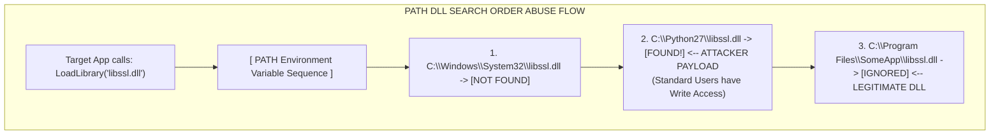

# DLL Search Order Abuse

## Introduction

While often used interchangeably with DLL Hijacking, **DLL Search Order Abuse** is a specific subset of the vulnerability that relies on manipulating the sequence of directories Windows searches when attempting to load a Dynamic Link Library (DLL) without an absolute path.

When an application calls `LoadLibrary("example.dll")`, the Windows loader steps through a highly specific, hardcoded sequence of directories to locate that file. If an attacker can identify a directory within that search order that is writable by low-privileged users, they can place a malicious `example.dll` in that directory. If this writable directory is searched *before* the directory containing the legitimate DLL, the attacker's DLL is loaded instead.

## SafeDllSearchMode and the Search Order

Historically, Windows searched the Current Working Directory (CWD) very early in the sequence. This led to massive vulnerabilities where an attacker could simply place a malicious DLL in a network share, trick a user into opening a document from that share, and the application would load the DLL from the share.

To mitigate this, Microsoft introduced `SafeDllSearchMode`. By default, starting with Windows XP SP2 and Windows Server 2003, `SafeDllSearchMode` is enabled.

### Search Order with SafeDllSearchMode Enabled (Default)

When a DLL is requested without an absolute path, Windows searches in this exact order:

1.  **The directory from which the application loaded.** (e.g., `C:\Program Files\App\`)
2.  **The System directory.** (`C:\Windows\System32\`)
3.  **The 16-bit System directory.** (`C:\Windows\System\`)
4.  **The Windows directory.** (`C:\Windows\`)
5.  **The Current Working Directory (CWD).**
6.  **The directories listed in the PATH environment variable.** (System variables first, then User variables).

### Search Order with SafeDllSearchMode Disabled

If disabled via the registry (`HKLM\System\CurrentControlSet\Control\Session Manager\SafeDllSearchMode = 0`), the Current Working Directory is moved up the list:

1.  The directory from which the application loaded.
2.  **The Current Working Directory (CWD).**
3.  The System directory.
4.  The 16-bit System directory.
5.  The Windows directory.
6.  The directories listed in the PATH environment variable.

## Exploitation Vector: The PATH Environment Variable

The most common and reliable method of DLL Search Order Abuse for privilege escalation relies on the 6th step of the search order: **The PATH environment variable.**

Many third-party software installers irresponsibly append their installation directories to the System PATH variable. Furthermore, they often configure these directories with weak permissions, allowing standard users to write to them.

### The Attack Scenario
Imagine an application `C:\Program Files\SecureApp\admin_tool.exe` (running as Administrator) needs to load `libssl.dll`.
1. It checks `C:\Program Files\SecureApp\` (Not there).
2. It checks `System32`, `System`, `Windows`, and CWD (Not there).
3. It begins checking the PATH variables.
4. The PATH is: `C:\Windows\System32;C:\Python27;C:\Program Files\SomeApp\`
5. `C:\Python27` is writable by `BUILTIN\Users`.
6. `libssl.dll` actually exists in `C:\Program Files\SomeApp\`.

Because `C:\Python27` is listed *before* `C:\Program Files\SomeApp\` in the PATH, the search order checks `C:\Python27` first. 



## Enumeration and Identification

To exploit this, you must enumerate the PATH variable and check the permissions of each directory.

### Step 1: Enumerate the PATH
```cmd
C:\> echo %PATH%
C:\Windows\system32;C:\Windows;C:\Windows\System32\Wbem;C:\Python27;C:\Program Files\PuTTY\
```

### Step 2: Check Directory Permissions
Use `icacls` or `accesschk` on non-standard Windows directories found in the PATH.

```cmd
C:\> icacls C:\Python27
C:\Python27 BUILTIN\Administrators:(I)(F)
            NT AUTHORITY\SYSTEM:(I)(F)
            BUILTIN\Users:(I)(M)  <-- BINGO!
            NT AUTHORITY\Authenticated Users:(I)(M)
```
The output confirms that `BUILTIN\Users` have `(M)` Modify permissions on `C:\Python27`. Any DLL dropped here will be picked up by any process searching the PATH for a missing DLL.

### Step 3: Finding Vulnerable Processes
Identifying which processes are searching for which DLLs requires dynamic analysis using Procmon (as described in [[06 - DLL Hijacking]]). You look for a process running as SYSTEM attempting to load a DLL and cycling through the PATH variable directories, resulting in `NAME NOT FOUND`.

## Exploitation Process

1. **Craft the Payload:** Create a malicious DLL matching the name of the requested DLL. If the DLL is expected to contain specific functions to prevent the application from crashing, you must use DLL proxying to forward the exports to the legitimate DLL (located further down the PATH).
    
    *Compilation example:*
    ```bash
    x86_64-w64-mingw32-g++ -shared -o libssl.dll dllmain.cpp
    ```

2. **Stage the Payload:** Copy the malicious DLL into the vulnerable directory found in the PATH.
    ```cmd
    C:\> copy libssl.dll C:\Python27\libssl.dll
    ```

3. **Trigger Execution:** Restart the vulnerable application or service. As it searches for the DLL, it hits `C:\Python27` first, loads your malicious DLL, and executes `DllMain` in the context of the privileged process.

## CWD Abuse (Current Working Directory)

A secondary vector involves the Current Working Directory (CWD). Even with `SafeDllSearchMode` enabled, the CWD is checked *before* the PATH variables. 

If a scheduled task or a shortcut is configured to start in a directory writable by the attacker (`Start in:` property), the attacker can drop the malicious DLL in that specific directory. When the application launches, its CWD is set to the attacker-controlled folder, and it will load the malicious DLL from there before checking the PATH or the legitimate program directory (if the DLL isn't in the application's root directory).

## Defensive Mitigation

- **Environment Hygiene:** Administrators must ensure that no directories in the system `PATH` environment variable are writable by standard users. Third-party software installers are the primary culprits and should be audited.
- **Absolute Paths:** Developers should load DLLs using absolute paths to bypass the search order entirely.
- **Application Control:** Solutions like WDAC or AppLocker can prevent the loading of unsigned DLLs or DLLs residing outside of secure directories like `C:\Windows\` and `C:\Program Files\`.

## Chaining Opportunities
- **Evasion:** DLL Search Order abuse is heavily utilized by Advanced Persistent Threats (APTs) to bypass EDR solutions by loading malicious code into trusted, signed Microsoft binaries (Living Off The Land).
- **Persistence:** Placing a malicious DLL in a writable PATH directory guarantees execution whenever any application looks for that missing DLL, acting as a highly stealthy [[Windows Persistence Mechanisms]].

## Related Notes
- [[01 - Windows PrivEsc Methodology Overview]]
- [[06 - DLL Hijacking]]
