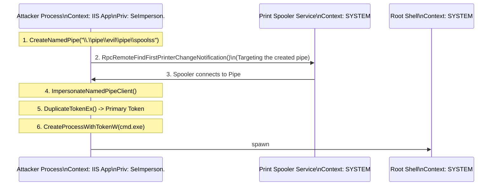

# The Potato Suite: JuicyPotato, RoguePotato, and PrintSpoofer

## Overview
The "Potato" family of privilege escalation tools represents a class of attacks designed to exploit Windows service accounts that possess the `SeImpersonatePrivilege` or `SeAssignPrimaryTokenPrivilege`. These accounts, frequently found running web servers (IIS), database servers (MSSQL), and various other middleware, are heavily restricted in many ways but possess the crucial ability to impersonate other users if they can obtain their access tokens. The Potato exploits systematically coerce a highly privileged account—typically `NT AUTHORITY\SYSTEM`—to authenticate to an attacker-controlled endpoint. During this authentication process, the attacker captures the SYSTEM token and impersonates it, effectively elevating their privileges to complete system compromise. This methodology is indispensable for post-exploitation on heavily segmented and patched Windows environments.

The evolution of Potato exploits reflects a cat-and-mouse game between security researchers and Microsoft's patching cycle. As Microsoft mitigated one vector of coercion, researchers discovered new ones, leading to an extensive lineage: Hot Potato, Rotten Potato, Juicy Potato, Rogue Potato, Sweet Potato, Ghost Potato, and conceptually related tools like PrintSpoofer.

## The Core Concept: SeImpersonatePrivilege
`SeImpersonatePrivilege` ("Impersonate a client after authentication") is a user right designed to allow a service to impersonate clients connecting to it. For example, if an IIS server is configured with Windows Authentication, it needs to access files as the user who authenticated to the web server. To do this, IIS impersonates the user. 
However, if an attacker executes code within the context of the IIS service account (which has `SeImpersonatePrivilege`), they can theoretically impersonate *any* token they can get their hands on. The challenge is acquiring a SYSTEM token. Since tokens aren't typically floating freely in memory for low-privileged processes to grab (unless `SeDebugPrivilege` is present), the attacker must force the SYSTEM account to interact with them and present its token. This forced interaction is known as "coerced authentication."

## Juicy Potato (Exploiting DCOM)
Juicy Potato, the successor to Rotten Potato, refined the technique of abusing the Distributed Component Object Model (DCOM). DCOM allows software components to communicate over a network, and it is a core mechanism in Windows for inter-process communication (IPC).

### The Mechanism
1. **DCOM Instantiation:** The attacker initiates the instantiation of a specific DCOM object on the local machine. There are hundreds of registered DCOM objects in Windows. The key is to select one that runs as SYSTEM and can be triggered by the attacker's low-privileged context.
2. **Man-in-the-Middle (MitM) via Local RPC:** Juicy Potato leverages a trick within the DCOM activation process. It specifies an attacker-controlled local RPC endpoint as the target for the DCOM object's initialization via the `IStorage` interface.
3. **Authentication Redirection:** When the DCOM object (running as SYSTEM) attempts to initialize and communicate, it connects to the attacker's RPC listener. 
4. **Token Capture:** Juicy Potato intercepts the NTLM authentication process occurring over this local connection. It relays this authentication locally to the Windows API `AcceptSecurityContext`, which generates an impersonation token for the SYSTEM account upon successful negotiation.
5. **Token Impersonation:** Because the attacker has `SeImpersonatePrivilege`, they can duplicate this captured SYSTEM token and use it to spawn a new process, such as a reverse shell or a command to add a local administrator.

### The DCOM CLSID Crux
Juicy Potato requires a specific Class Identifier (CLSID) for the target DCOM object. These CLSIDs vary wildly between Windows versions (e.g., Windows Server 2012 vs. Windows Server 2016). Attackers often must brute-force or look up known-working CLSIDs for the specific target OS architecture.

## Microsoft's Mitigation and the Birth of Rogue Potato
Microsoft eventually patched the Juicy Potato vector. The primary mitigation in Windows Server 2019 and Windows 10 (versions 1809 and later) involved changes to how DCOM interacts with local RPC. Specifically, the RPC SS (RpcSs) service was modified to prevent resolving local named pipes for DCOM authentication, effectively breaking the local MitM setup that Juicy Potato relied upon. You can no longer specify `127.0.0.1` as the target for the DCOM activation.

### Rogue Potato to the Rescue
Rogue Potato was developed to bypass this mitigation. The core concept of exploiting DCOM and coerced authentication remains, but the routing is different.
1. **Remote Redirection:** Since DCOM no longer allows connecting back to a local listener (127.0.0.1) on the required ports, Rogue Potato instructs the DCOM object to connect to a *remote* IP address controlled by the attacker.
2. **Port Forwarding Trickery:** The remote machine (the attacker's system) is set up to port-forward the incoming RPC connection (port 135) back to the target machine's local attacker-controlled pipe.
3. **OxidResolver Abuse:** Rogue Potato manipulates the `OXID` (Object Exporter Identifier) resolution process. By returning a customized `OBJREF` containing the remote IP, the target machine reaches out externally, is bounced back in, and connects to the attacker's named pipe on the target machine.
4. **Token Impersonation:** Once the connection is established over the named pipe, the same `ImpersonateNamedPipeClient` API is used to grab the SYSTEM token.

This technique is incredibly clever but requires network access to external or attacker-controlled infrastructure, making it slightly "noisier" and more dependent on network configuration than Juicy Potato.

## PrintSpoofer: The Elegant Named Pipe Abuser
While Rogue Potato is powerful, relying on external network routing can be a pain point during an engagement. Enter PrintSpoofer. While conceptually similar (coercing authentication to capture a token), PrintSpoofer abuses an entirely different Windows component: the Print Spooler service (`spoolsv.exe`).

### The Print Spooler Mechanism
The Print Spooler has historically been a massive attack surface (e.g., Stuxnet, PrintNightmare). For privilege escalation via `SeImpersonatePrivilege`, PrintSpoofer utilizes the `RpcRemoteFindFirstPrinterChangeNotification` or `RpcRemoteFindFirstPrinterChangeNotificationEx` API calls.
1. **The Named Pipe Listener:** The attacker creates a local named pipe (e.g., `\\.\pipe\test\pipe\spoolss`). Notice the backslashes; this is designed to trick the path validation.
2. **Triggering the Spooler:** The attacker invokes the Print Spooler API, requesting it to send notifications about printer changes to the attacker's maliciously crafted named pipe path.
3. **Coerced Authentication:** The Print Spooler service, operating as `NT AUTHORITY\SYSTEM`, attempts to connect to the specified named pipe to deliver the requested notification.
4. **ImpersonateNamedPipeClient:** The moment the SYSTEM-level spooler service connects to the attacker's named pipe, the attacker calls the `ImpersonateNamedPipeClient` API. 
5. **Execution:** The attacker's thread now runs as SYSTEM, and standard token duplication and process creation follow.

PrintSpoofer is widely considered more reliable and self-contained than Rogue Potato on modern systems, assuming the Print Spooler service is running. It does not require external port forwarding or guessing DCOM CLSIDs.

## ASCII Diagram: PrintSpoofer Execution Flow

## Comparative Analysis
- **Juicy Potato:** Excellent for legacy systems (Windows Server 2008, 2012, 2016). Fails on Server 2019+ due to DCOM local binding restrictions. Highly dependent on OS-specific CLSIDs.
- **Rogue Potato:** Bypasses Server 2019 restrictions by routing DCOM traffic externally and back. Complex setup requires a redirector. 
- **PrintSpoofer:** Extremely elegant, works on modern systems (Windows 10, Server 2019), and is entirely self-contained. However, it completely fails if the Print Spooler service is disabled (a common hardening practice).

## Detection and Mitigation
Detecting Potato attacks involves monitoring for specific anomalous behaviors associated with coerced authentication and token manipulation.
1. **Named Pipe Creation:** Alerting on the creation of suspiciously named pipes, especially those attempting to mimic standard system pipes or containing path traversal characters (`\..\`).
2. **API Monitoring:** EDRs heavily monitor calls to `ImpersonateNamedPipeClient`, `DuplicateTokenEx`, and `CreateProcessWithTokenW`, particularly when originating from service accounts like `w3wp.exe` (IIS) or `sqlservr.exe`.
3. **Disabling Services:** The most effective mitigation against PrintSpoofer is simply disabling the Print Spooler service on systems where it is not required (which is nearly all servers).
4. **Network Segmentation:** For Rogue Potato, restricting outbound RPC (port 135) from servers prevents the external redirection required for the exploit.
5. **Least Privilege:** Do not run services with `SeImpersonatePrivilege` unless strictly necessary. If possible, utilize Group Managed Service Accounts (gMSAs) with explicitly defined, limited rights.

## The Future of Potato Exploits
Microsoft continuously attempts to patch the specific coercion vectors (like the RPC SS patch for Juicy Potato). However, the fundamental vulnerability—`SeImpersonatePrivilege`—remains a core, unpatchable feature of the OS design. As long as attackers can find a new Windows service or API that can be tricked into authenticating over a named pipe or RPC endpoint, new "Potatoes" will continue to emerge (e.g., GodPotato, which leverages the DCOM `IStorage` interface in a novel way).

## Chaining Opportunities
- Highly effective when chained with initial access via Web Shells on IIS servers [[02 - Web Application RCE to Privesc]].
- Can be used after exploiting database vulnerabilities that yield command execution via restricted service accounts [[03 - MSSQL Exploitation]].
- Pairs well with [[09 - Token Impersonation]] techniques once the token is acquired.

## Related Notes
- [[09 - Token Impersonation]]
- [[11 - Hot Potato Sweet Potato Ghost Potato]]
- [[04 - Privileges and Rights Escalation]]
- [[05 - Windows Services Abuse]]
