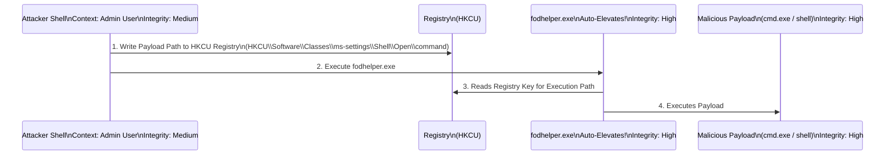

# User Account Control (UAC) Bypass Techniques

## Overview
User Account Control (UAC) is a security component of Windows introduced in Windows Vista. It is designed to prevent unauthorized changes to the operating system by prompting the user for confirmation or administrator credentials when a program attempts to perform a privileged action. While UAC is a crucial security feature, Microsoft has explicitly stated that UAC is *not* a security boundary. If an attacker has compromised a standard user account that is a member of the local Administrators group, they are operating in a "split-token" scenario. Their primary token is a medium-integrity, standard-user token, but they possess a linked, high-integrity administrator token that is stripped of administrative privileges until UAC is invoked and approved. 

UAC bypass techniques exploit this split-token architecture, allowing an attacker to execute code silently with the high-integrity token without triggering the UAC consent prompt. This is a critical step in local privilege escalation, transforming a restricted administrator shell into a fully privileged SYSTEM or High-Integrity Administrator shell.

## The Architecture of UAC and Integrity Levels
To understand UAC bypasses, one must understand Windows Integrity Levels (ILs) and the concept of Auto-Elevation.
- **Low Integrity:** Used for highly restricted applications like web browsers (sandboxes).
- **Medium Integrity:** The default for standard user processes and the un-elevated state of an administrator.
- **High Integrity:** The execution context of an elevated administrator process.
- **System Integrity:** Reserved for core OS components and services running as SYSTEM.

When an administrator logs in, explorer.exe runs at Medium Integrity. The high-integrity token is essentially dormant. To transition from Medium to High, a UAC prompt is traditionally required. 

### Auto-Elevation
To prevent user fatigue, Microsoft introduced "auto-elevation." Certain built-in Windows executables (usually located in `C:\Windows\System32`) are digitally signed by Microsoft and contain a specific application manifest specifying `autoElevate="true"`. When a medium-integrity process launches one of these auto-elevating binaries, Windows silently elevates it to High Integrity without prompting the user. Attackers abuse this auto-elevation mechanism.

## Common UAC Bypass Methodologies
UAC bypasses generally fall into a few primary categories, all leveraging auto-elevating binaries to execute malicious payloads silently.

### 1. Registry Hijacking (COM / File Extension Handlers)
Many auto-elevating programs rely on COM objects or file extension handlers defined in the Windows Registry (specifically in `HKEY_CURRENT_USER` or `HKCU`). Because `HKCU` is writable by medium-integrity processes, an attacker can modify registry keys to hijack the execution flow of an auto-elevating binary.

**Example: `fodhelper.exe` Bypass**
`fodhelper.exe` (Features on Demand Helper) is an auto-elevating binary. When executed, it looks for a specific registry key to determine how to open particular settings.
1. The attacker creates the registry structure: `HKCU\Software\Classes\ms-settings\Shell\Open\command`.
2. They set the default value of this key to their payload (e.g., `cmd.exe /c reverse_shell.exe`).
3. They configure the `DelegateExecute` value to be empty.
4. The attacker launches `fodhelper.exe`.
5. `fodhelper.exe` auto-elevates to High Integrity. It then reads the `HKCU` registry key the attacker modified and executes the payload. Since `fodhelper.exe` is High Integrity, the child process (the payload) is also High Integrity. UAC is bypassed silently.

### 2. DLL Hijacking in Auto-Elevating Processes
Some auto-elevating binaries attempt to load DLLs from predictable locations but fail to specify an absolute path, relying on the Windows DLL search order. Alternatively, they might attempt to load a DLL that does not exist. If an attacker can place a malicious DLL in a directory that the auto-elevating binary searches (and has write access to), the binary will load the malicious DLL upon execution.

**Example: `sysprep.exe` and `cryptbase.dll`**
Historically, `sysprep.exe` (System Preparation Tool) auto-elevated and attempted to load `cryptbase.dll` from its own directory. If an attacker could copy a malicious `cryptbase.dll` into that directory and execute `sysprep.exe`, the payload within the DLL would execute at High Integrity. While this specific example is largely patched or mitigated by tighter directory permissions, the concept remains a staple in finding new bypasses.

### 3. Environment Variable Manipulation
Certain auto-elevating scheduled tasks or binaries rely on environment variables (like `%windir%` or `%systemroot%`) to locate dependencies. If an attacker can manipulate these environment variables within their session, they can redirect the execution flow to a malicious location.

### 4. Advanced COM Hijacking (ICMLuaUtil)
More advanced bypasses involve instantiating elevated COM objects directly. The `ICMLuaUtil` interface is a classic example. An attacker can use an elevated COM moniker to instantiate a COM object that runs at High Integrity, bypassing the UAC prompt entirely for the instantiation. From there, the attacker can call methods on that object (like `ShellExec`) to launch an arbitrary payload with elevated privileges.

## ASCII Diagram: Registry-Based UAC Bypass (`fodhelper.exe`)



## Tooling and Automation: UACMe
The gold standard for UAC bypass research and exploitation is the open-source tool **UACMe** (created by hfiref0x). UACMe contains an extensive, constantly updated library of UAC bypass methods. Each method is assigned a number.

**Execution Example:**
```cmd
# Execute UACMe method 33 (fodhelper) to launch cmd.exe at High Integrity
akagi64.exe 33 C:\Windows\System32\cmd.exe
```
UACMe documents dozens of bypasses, categorized by the underlying mechanism (registry hijack, DLL hijack, elevated COM, etc.) and tracks which Windows builds have patched which methods.

## Detection and Mitigation
Because UAC is not a security boundary, Microsoft does not consider UAC bypasses to be security vulnerabilities warranting immediate CVEs or patches, though they do occasionally break specific methods in major OS updates. Mitigation relies on systemic hardening:

1. **Do Not Use Split-Token Accounts:** The most effective mitigation is to adhere to the principle of least privilege. Users should operate standard accounts for daily tasks. Administrative tasks should require logging into a completely separate administrative account or using tools like LAPS (Local Administrator Password Solution).
2. **Always Notify UAC Level:** Ensure UAC is set to "Always notify" in the control panel. Many bypasses rely on the default setting ("Notify me only when apps try to make changes to my computer"). "Always notify" prevents silent auto-elevation.
3. **EDR and Registry Monitoring:** EDR solutions should monitor modifications to critical `HKCU` keys known to be abused for UAC bypasses (e.g., `Software\Classes\ms-settings`, `Software\Classes\mscfile`).
4. **Behavioral Analysis:** Detect anomalous child processes spawning from known auto-elevating binaries like `fodhelper.exe`, `computerdefaults.exe`, `sdclt.exe`, or `eventvwr.exe`.

## The UAC Dilemma in Red Teaming
For a red teamer, encountering a medium-integrity administrator shell is a common scenario after phishing or initial lateral movement. Bypassing UAC is the immediate next step to deploy persistence mechanisms (like services or scheduled tasks) or dump credentials (via LSASS), which require High or SYSTEM integrity. The reliance on `HKCU` registry modifications makes these attacks relatively safe to perform, as they do not require altering system-wide configurations, reducing the likelihood of breaking the system or causing widespread alerts if EDR is not properly tuned.

## Chaining Opportunities
- Immediately precedes Credential Dumping techniques like [[17 - LSASS Dumping and Mimikatz]], which require High/SYSTEM integrity.
- Used to establish persistent, high-privileged access via [[05 - Windows Services Abuse]] or [[13 - Scheduled Task Hijacking]].
- Can be combined with [[06 - Antivirus and AMSI Evasion]] to deploy advanced rootkits or C2 beacons safely.

## Related Notes
- [[17 - LSASS Dumping and Mimikatz]]
- [[04 - Privileges and Rights Escalation]]
- [[13 - Scheduled Task Hijacking]]
- [[07 - Bypassing Windows Defender]]
