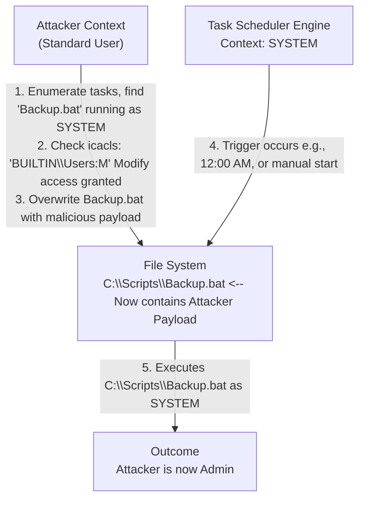

# Scheduled Task Hijacking

## Overview
Scheduled Tasks in Windows provide a mechanism to execute programs or scripts at predefined times, after specific intervals, or in response to system events. Managed primarily through the Task Scheduler (`taskschd.msc`) or the command-line utility `schtasks.exe`, this feature is heavily utilized by the operating system, third-party software, and system administrators for automated maintenance. 

For an attacker seeking privilege escalation, Scheduled Tasks represent a goldmine. Because tasks can be configured to run under the context of any user—including `NT AUTHORITY\SYSTEM`—without requiring interactive logon, a misconfigured scheduled task can easily be hijacked to execute malicious code with high privileges. This document explores the mechanics of Scheduled Tasks, the specific misconfigurations that lead to hijack opportunities, and the methodologies for exploiting them.

## The Architecture of Scheduled Tasks
A scheduled task consists of several key components:
- **Triggers:** What causes the task to run (e.g., time, system boot, user logon, specific event log entry).
- **Actions:** What the task does when triggered (e.g., execute a binary, run a script).
- **Security Context (Principal):** The user account under which the action is executed.
- **Conditions & Settings:** Additional parameters governing the task's execution (e.g., "Run only when the user is logged on," "Run with highest privileges").

Tasks are defined in XML files stored within `C:\Windows\System32\Tasks` (and subdirectories). The execution engine itself is the Task Scheduler service (`Schedule`), running within `svchost.exe` under the SYSTEM context.

## Common Vulnerabilities in Scheduled Tasks
Privilege escalation via scheduled tasks usually stems from misconfigurations rather than inherent flaws in the Task Scheduler itself. The two primary vectors are:

### 1. Insecure File Permissions on the Target Executable
This is the most common vulnerability. A scheduled task is configured to run a specific binary or script (e.g., `C:\Tasks\Cleanup.bat`) under the context of `SYSTEM` or an Administrator. However, the permissions (DACL) on `Cleanup.bat` or the directory `C:\Tasks\` are weak, allowing a standard user to modify or replace the file.

**Exploitation:**
1. The attacker discovers the task and notes it runs as SYSTEM.
2. The attacker checks the permissions of `C:\Tasks\Cleanup.bat` using `icacls`.
3. Finding write access, the attacker modifies `Cleanup.bat` to include a malicious payload (e.g., a reverse shell or a command to add a local admin).
4. The attacker waits for the trigger to occur naturally, or manually forces the task to run if they have the necessary permissions to start it.
5. The Task Scheduler executes the modified file as SYSTEM.

### 2. Unquoted Task Paths
Similar to Unquoted Service Paths, if the `Action` defined in a scheduled task points to an executable path containing spaces, but the path is *not* enclosed in quotation marks, Windows will attempt to resolve the path by systematically executing every word up to the space as an executable.

**Example:**
Action Path: `C:\Program Files\Admin Tools\Task.exe`

Windows will attempt execution in this order:
1. `C:\Program.exe`
2. `C:\Program Files\Admin.exe`
3. `C:\Program Files\Admin Tools\Task.exe`

**Exploitation:**
If a standard user has write access to the root of the `C:\` drive or `C:\Program Files\`, they can drop a malicious payload named `Program.exe` or `Admin.exe`. When the scheduled task triggers, the Task Scheduler will execute the attacker's payload instead of the intended program.

### 3. Insecure Task Definition (XML) Modification
Less common, but highly critical. If the permissions on the XML file defining the task in `C:\Windows\System32\Tasks\` are misconfigured (allowing write access to standard users), an attacker can directly modify the task's `Command` or `Arguments` node to point to their payload.

## Reconnaissance and Discovery
Identifying vulnerable scheduled tasks is a core component of local privilege escalation enumeration.

**Using native tools:**
```cmd
# List all scheduled tasks in verbose format
schtasks /query /fo LIST /v

# Search for tasks running as SYSTEM
schtasks /query /fo LIST /v | findstr /i "TaskName Run As" | findstr /i "SYSTEM"
```

**Using PowerShell:**
```powershell
# Get all tasks and filter for those not in the Microsoft folder
Get-ScheduledTask | Where-Object { $_.TaskPath -notlike "\Microsoft\*" } | Select TaskName, Principal, Actions
```

**Checking Permissions:**
Once a suspect task executable is found, `icacls` or PowerShell's `Get-Acl` is used to verify write permissions.
```cmd
icacls "C:\Path\To\Task.exe"
# Look for (F) Full Control, (M) Modify, or (W) Write for the Users group.
```

## ASCII Diagram: Task Hijacking via Weak Permissions



## Triggering the Task
After replacing the binary, the payload must be executed. If the attacker cannot wait for the natural trigger (e.g., the task runs weekly), they can attempt to manually start it.
```cmd
schtasks /run /tn "\Path\To\TaskName"
```
*Note: A standard user may not have the privileges to manually start a task configured by an administrator, meaning patience is often required.*

## Defenses and Mitigations
Securing scheduled tasks is straightforward but often overlooked in enterprise environments.
1. **Strict File Permissions:** Ensure that any executable, script, or configuration file referenced by a scheduled task is located in a secure directory (like `C:\Program Files` or `C:\Windows\System32`) and that standard users have, at most, Read access.
2. **Quote Paths:** Always enclose executable paths in quotation marks when defining task actions to prevent unquoted path vulnerabilities.
3. **Audit Task Creation:** Implement monitoring for the creation or modification of scheduled tasks using Event Logs (Event ID 4698 for creation, 4702 for modification).
4. **Least Privilege:** Avoid running tasks as SYSTEM unless absolutely necessary. Create dedicated, least-privilege service accounts for specific automated tasks.

## Operational Security for Red Teams
When hijacking a scheduled task, it is critical to restore the original functionality once the escalation is complete. Modifying a critical system backup script and failing to restore it can cause significant disruption.
- Always back up the original script/binary before overwriting.
- If possible, append the malicious payload to the end of a script rather than replacing it entirely, ensuring the original task still runs.
- If the target is a compiled binary, consider wrapping the original binary. Compile a payload that executes your malicious code and then seamlessly calls the original, renamed binary.

## Chaining Opportunities
- Often discovered after automated enumeration tools like WinPEAS or PowerUp (see [[02 - Automated Privilege Escalation Tools]]).
- Hijacking a task that executes a PowerShell script can be chained with AMSI bypasses to execute memory-resident payloads [[06 - Antivirus and AMSI Evasion]].
- Useful for establishing persistent C2 access if the task runs periodically [[14 - Startup Applications Abuse]].

## Related Notes
- [[05 - Windows Services Abuse]]
- [[14 - Startup Applications Abuse]]
- [[15 - Registry Autorun Key Abuse]]
- [[02 - Automated Privilege Escalation Tools]]
