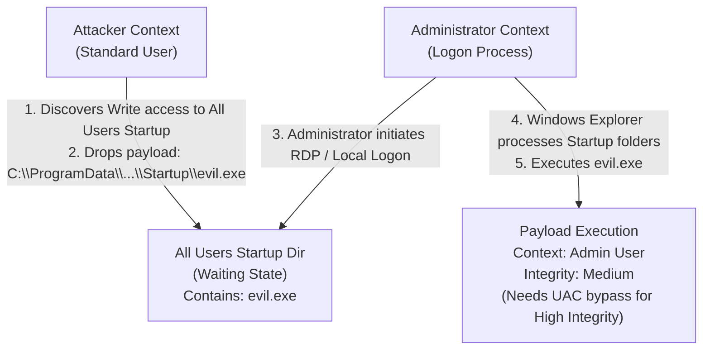

# Startup Applications Abuse

## Overview
The Windows operating system provides several mechanisms to automatically launch applications when a user logs in. The most accessible and historically abused of these mechanisms is the "Startup" folder. While primarily viewed as a persistence technique, manipulating startup applications can be a highly effective vector for local privilege escalation if the environmental configurations are flawed. 

The core concept revolves around the difference between the Current User's startup folder and the All Users (System-wide) startup folder. If a low-privileged attacker can place a malicious executable or shortcut into the All Users startup folder, that payload will be executed the next time *any* user logs in—including a high-privileged Administrator. This turns a persistence mechanism into a vertical privilege escalation vector.

## The Anatomy of Startup Folders
Windows maintains two distinct startup folder locations:

### 1. Current User Startup Folder
Path: `C:\Users\<Username>\AppData\Roaming\Microsoft\Windows\Start Menu\Programs\Startup`
This folder is user-specific. Applications placed here will only execute when the specific `<Username>` logs in. They will execute within the security context of that user. Modifying this folder is a standard persistence technique, but it does not inherently provide privilege escalation because the payload runs as the already-compromised user.

### 2. All Users (Common) Startup Folder
Path: `C:\ProgramData\Microsoft\Windows\Start Menu\Programs\Startup`
This folder is global. Any executable, batch script, or shortcut (`.lnk`) placed in this directory will be executed whenever *any* user logs into the system interactively. The crucial detail is that the payload will execute under the security context of the user logging in.

## The Privilege Escalation Vector
The privilege escalation opportunity arises if the permissions (DACLs) on the `All Users` startup directory are misconfigured. 

By default, standard users have Read and Execute permissions on `C:\ProgramData\Microsoft\Windows\Start Menu\Programs\Startup`, while only Administrators and SYSTEM have Write access. However, during software deployment, custom imaging, or poor system administration, the permissions on this folder (or the `Start Menu` parent folder) might be loosened, inadvertently granting Write access to the `BUILTIN\Users` or `Everyone` groups.

### Attack Methodology
1. **Reconnaissance:** The attacker checks the permissions of the All Users startup folder using tools like `icacls` or `accesschk.exe`.
   ```cmd
   icacls "C:\ProgramData\Microsoft\Windows\Start Menu\Programs\Startup"
   ```
2. **Payload Creation:** If Write access is confirmed, the attacker creates a malicious payload. This could be a reverse shell executable, a script that adds a new local administrator, or a batch file.
3. **Deployment:** The attacker copies the payload into the vulnerable directory.
   ```cmd
   copy C:\Temp\ReverseShell.exe "C:\ProgramData\Microsoft\Windows\Start Menu\Programs\Startup\"
   ```
4. **The Waiting Game (or Coercion):** The payload will sit dormant until another user logs in. The attacker must wait for an Administrator to log onto the machine interactively (via RDP, local console, etc.).
5. **Execution:** When the Administrator logs in, the `explorer.exe` process initializes and processes the All Users startup folder, executing the attacker's payload within the Administrator's high-integrity context (subject to UAC caveats, see below).

## The UAC Caveat
It is critical to understand how User Account Control (UAC) affects startup applications. When an Administrator logs in, explorer.exe processes the startup folder under a *Medium Integrity* context (the un-elevated state of the split-token). 

If the attacker's payload requires High Integrity (e.g., writing to `C:\Windows`, dumping LSASS), placing a standard executable in the startup folder will *not* suffice, as it will run at Medium Integrity and fail.
To overcome this, the attacker has two options:
1. **Chain with a UAC Bypass:** The payload placed in the startup folder isn't the final shell; instead, it is a script that executes a known UAC bypass (like the `fodhelper` technique). When the admin logs in, the payload runs at Medium Integrity, triggers the UAC bypass, and spawns the final High Integrity payload.
2. **Rely on Pre-Existing Elevated Startup Apps:** If there is already an application in the startup folder that auto-elevates or requires administrative privileges, the attacker might try to hijack *that* specific application (e.g., via DLL Hijacking or path interception) rather than placing a new binary.

## Shortcut (.LNK) Hijacking
Attackers do not necessarily need to drop a new executable. Often, the startup folder contains `.lnk` (shortcut) files pointing to legitimate applications (e.g., a VPN client or system tray utility).
If an attacker has write access to the `.lnk` file (even if they can't write to the folder itself), they can modify the shortcut's "Target" property.
- Original Target: `"C:\Program Files\Utility\app.exe"`
- Malicious Target: `powershell.exe -ExecutionPolicy Bypass -WindowStyle Hidden -File C:\Temp\payload.ps1`

When the admin logs in and clicks the shortcut (or if it runs automatically), the malicious PowerShell script executes instead of (or prior to) the legitimate application.

## ASCII Diagram: Startup Folder Privilege Escalation



## Advanced Vectors: Hidden Startup Locations
Beyond the well-known `Start Menu` folders, Windows utilizes numerous other obscure locations to launch applications on startup. Exploiting misconfigurations in these areas follows the same logic.
- **Active Setup:** Used to execute commands once per user during profile creation. Stored in registry keys (`HKLM\SOFTWARE\Microsoft\Active Setup\Installed Components`). If an attacker can modify the `StubPath` value here, it will execute when a new user logs in.
- **WMI Event Subscriptions:** Extremely stealthy persistence/privesc vector. A low-privilege attacker might find a WMI subscription running as SYSTEM that references a script with weak file permissions.

## Defenses and Mitigations
Securing startup locations is a fundamental aspect of endpoint hardening.
1. **Enforce Default ACLs:** Ensure that standard users cannot write to `C:\ProgramData\Microsoft\Windows\Start Menu\Programs\Startup`. This is the default setting; ensure deployment scripts or IT staff do not inadvertently change it.
2. **File Integrity Monitoring (FIM):** Monitor the All Users startup folder and critical registry Autorun keys for unauthorized additions or modifications.
3. **Application Control (AppLocker/WDAC):** Implement application whitelisting. Even if an attacker drops an executable into the startup folder, it should not execute unless it is digitally signed by a trusted publisher or resides in a whitelisted directory (which the attacker shouldn't be able to write to).

## Chaining Opportunities
- Requires a user to log in interactively; therefore, it is often chained with social engineering or patience.
- Almost always chained with [[12 - UAC Bypass Techniques]] to convert the medium-integrity administrator execution into a high-integrity SYSTEM shell.
- The underlying mechanism is identical to [[15 - Registry Autorun Key Abuse]], which utilizes registry keys instead of the file system.

## Related Notes
- [[15 - Registry Autorun Key Abuse]]
- [[13 - Scheduled Task Hijacking]]
- [[12 - UAC Bypass Techniques]]
- [[02 - Automated Privilege Escalation Tools]]
