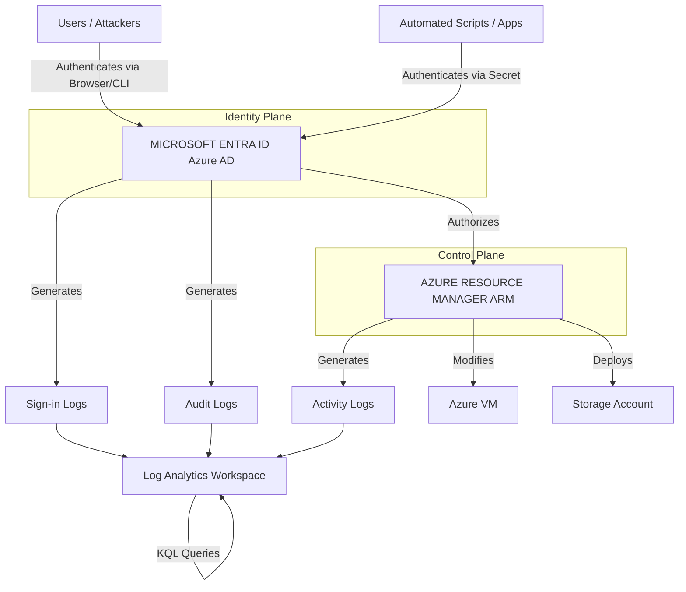

# Azure Activity Logs and Entra ID Sign-in Logs

## 1. Introduction and Executive Summary

In the Microsoft Azure ecosystem, threat hunting requires understanding the clear delineation between the **Identity Plane** (Microsoft Entra ID, formerly Azure Active Directory) and the **Resource Control Plane** (Azure Resource Manager - ARM). Unlike AWS, where IAM and resource management are tightly coupled under a single API umbrella (CloudTrail), Azure splits these responsibilities.

To conduct a comprehensive threat hunt in Azure, analysts must correlate data from two distinct, primary log sources:
1. **Entra ID (Azure AD) Logs:** These logs record who is authenticating, how they are authenticating (MFA, Conditional Access), and modifications to identity objects (users, groups, service principals, OAuth applications).
2. **Azure Activity Logs:** These logs record operations performed on resources within Azure subscriptions (e.g., starting a VM, modifying a Network Security Group, deploying an ARM template).

Mastering the synthesis of these two log sources within Microsoft Sentinel (or another SIEM using Kusto Query Language - KQL) is fundamental for Azure threat hunting.

## 2. Deep Dive: Entra ID Logs (The Identity Plane)

Entra ID logs are divided into several categories, but the two most critical for hunting are **Sign-in Logs** and **Audit Logs**.

### 2.1 Sign-in Logs
These are highly detailed records of authentication attempts. They are split into:
- **Interactive Sign-ins:** A user providing a password, MFA, or using Windows Hello.
- **Non-interactive Sign-ins:** Client apps using a refresh token to get a new access token without user interaction.
- **Service Principal Sign-ins:** Applications or automated scripts authenticating via certificates or client secrets.
- **Managed Identity Sign-ins:** Azure resources (like a VM) authenticating to other Azure services (like Key Vault) without explicitly managed credentials.

**Hunting Focus:** Hunters analyze these logs for AiTM (Adversary-in-the-Middle) phishing, impossible travel, password spray attacks, and Conditional Access bypasses.

### 2.2 Entra ID Audit Logs
These record changes to the tenant configuration.
- Creation/deletion of users.
- Adding users to highly privileged roles (e.g., Global Administrator).
- Registering new OAuth App Registrations or granting Admin Consent.

## 3. Deep Dive: Azure Activity Logs (The Control Plane)

Once an attacker has authenticated via Entra ID, they interface with the Azure Resource Manager (ARM). Every `PUT`, `POST`, and `DELETE` operation sent to ARM is recorded in the Activity Log. 

**Hunting Focus:** Hunters analyze these logs for:
- **Persistence:** Creation of new VMs, modifying Network Security Groups (NSGs) to allow RDP/SSH from the internet.
- **Exfiltration:** Exporting Azure SQL databases, downloading VM disk snapshots (SAS URI generation).
- **Defense Evasion:** Deleting resource groups, disabling Microsoft Defender for Cloud, stopping log ingestion.

## 4. Architecture Visualization: Azure Logging Flow



## 5. Real-World Attack Scenario

### The Scenario: AiTM Phishing to Illicit Consent Grant
1. **Initial Access:** An attacker sends an Adversary-in-the-Middle (AiTM) phishing email using tools like Evilginx2. The target clicks the link, enters their password, and approves the push MFA request. Evilginx captures the session cookie.
2. **Bypass:** Because the attacker has the session cookie, they bypass MFA and Conditional Access policies entirely.
3. **Persistence (Identity):** The attacker accesses the Entra ID portal. Instead of changing the password (which might alert the user), the attacker registers a new OAuth Application called "O365 Mail Sync" and grants it high privileges (`Mail.ReadWrite`).
4. **Action on Objectives:** The attacker uses the OAuth app's Service Principal credentials to programmatically access the user's inbox, exfiltrating sensitive financial documents.

### 6. The Hunting Perspective (Correlating the Logs)
A hunter investigating this would track the following:
1. **Entra ID Sign-in Logs:** Look for a successful sign-in from an anomalous IP address where the authentication requirement was satisfied by a "Previously satisfied" claim (Session Cookie), bypassing MFA.
2. **Entra ID Audit Logs:** Look for `Add service principal` or `Add OAuth2PermissionGrant` occurring shortly after the anomalous sign-in, performed by the compromised user.
3. **Service Principal Sign-in Logs:** Look for massive amounts of authentication traffic originating from the newly created Service Principal.

## 7. Operationalizing the Hunt: Advanced KQL Queries

### Hunting for AiTM Session Hijacking (KQL)
This query identifies sign-ins from unusual locations where MFA was bypassed due to an existing session token (a prime indicator of cookie theft).

```kql
SigninLogs
| where TimeGenerated > ago(7d)
| where ResultType == "0" // Success
| extend AuthMethod = tostring(parse_json(AuthenticationDetails)[0].authenticationMethod)
| where AuthMethod == "Previously satisfied"
| join kind=leftanti (
    // Exclude baseline trusted IPs
    SigninLogs
    | where TimeGenerated between(ago(30d)..ago(7d))
    | summarize by IPAddress
) on IPAddress
| project TimeGenerated, UserPrincipalName, IPAddress, Location, AppDisplayName, AuthMethod
| sort by TimeGenerated desc
```

### Hunting for Illicit Consent Grants / Malicious OAuth Apps
This query looks for a non-admin user registering an application and granting it permissions, a classic persistence technique.

```kql
AuditLogs
| where TimeGenerated > ago(14d)
| where OperationName has "Add delegated permission grant" or OperationName has "Consent to application"
| extend InitiatedBy = tostring(parse_json(tostring(InitiatedBy.user)).userPrincipalName)
| extend TargetApp = tostring(TargetResources[0].displayName)
| extend Permissions = tostring(parse_json(tostring(TargetResources[0].modifiedProperties))[0].newValue)
// Look for high-risk permissions
| where Permissions has "Mail.Read" or Permissions has "Files.Read" or Permissions has "Directory.ReadWrite.All"
| project TimeGenerated, InitiatedBy, OperationName, TargetApp, Permissions
```

### Hunting for VM Run Command Execution (Azure Activity Log)
Attackers who gain ARM access often use the `RunCommand` feature to execute code inside a VM without needing SSH/RDP open.

```kql
AzureActivity
| where TimeGenerated > ago(7d)
| where OperationNameValue =~ "Microsoft.Compute/virtualMachines/runCommand/action"
| where ActivityStatusValue =~ "Success" or ActivityStatusValue =~ "Accepted"
| extend Caller = CallerIpAddress
| extend VMName = tostring(parse_json(Properties).resource)
| project TimeGenerated, Caller, CallerIpAddress, VMName, ResourceGroup, SubscriptionId
```

## 8. Mitigation and Remediation
- **Phishing-Resistant MFA:** Migrate from SMS/Push MFA to FIDO2 security keys or Windows Hello for Business to defeat AiTM attacks.
- **Conditional Access:** Enforce strict Conditional Access policies requiring compliant devices (Intune joined) or trusted named locations for administrative actions.
- **Disable User Consent:** Restrict the ability of standard users to grant consent to third-party OAuth applications. Require admin review.
- **Continuous Access Evaluation (CAE):** Enable CAE so that access tokens are instantly revoked if critical events (like a password change or IP location shift) are detected.

## 9. Chaining Opportunities
- **[[01 - Differences in Cloud vs On-Premises Hunting]]**: Understanding how Azure Activity logs differ fundamentally from Windows Event Logs.
- **[[03 - Hunting for Compromised IAM Credentials in AWS]]**: Comparing how credential theft in AWS (Access Keys) mirrors session hijacking in Azure (Cookies/Tokens).

## 10. Related Notes
- [[Adversary in the Middle (AiTM) Phishing]]
- [[OAuth and OpenID Connect Security]]
- [[Kusto Query Language (KQL) for Threat Hunting]]
- [[Microsoft Sentinel Architecture]]
