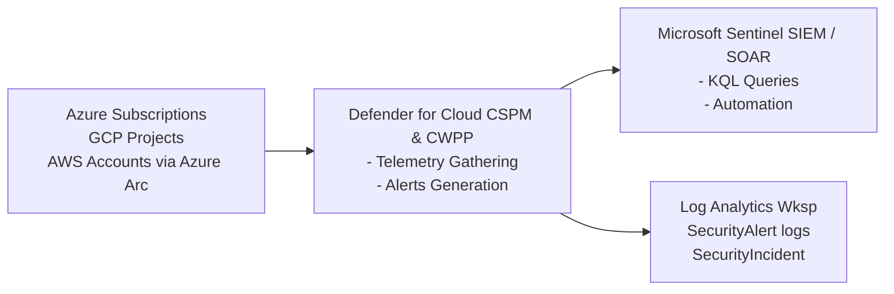

# Microsoft Defender for Cloud Telemetry

## Introduction to Cloud Security Posture and Workload Protection

Microsoft Defender for Cloud (MDC) serves a dual purpose in the Azure ecosystem: Cloud Security Posture Management (CSPM) and Cloud Workload Protection Platform (CWPP). For threat hunters, MDC is an absolute goldmine of telemetry. It provides visibility not just into Azure, but via Azure Arc, it extends this visibility into Google Cloud Platform (GCP) and Amazon Web Services (AWS) as well.

Defender for Cloud acts as the central aggregator for various underlying security services:
- Defender for Servers (Endpoint Detection and Response via MDE integration)
- Defender for Storage (Malware scanning, unusual access patterns)
- Defender for Key Vault (Suspicious access to secrets)
- Defender for Containers (Kubernetes control plane and node level logging)
- Defender for Resource Manager (Control plane activity monitoring)

Understanding how to query, extract, and baseline this telemetry is critical for advanced cloud threat hunting.

## Architectural Overview of MDC Telemetry

When an event occurs in an Azure environment, it is evaluated by Defender for Cloud's analytics engines. These engines generate two primary types of outputs:
1. **Recommendations (Postural)**: Misconfigurations, missing patches, exposed ports.
2. **Alerts (Behavioral)**: Active exploitation attempts, malware detection, suspicious access.

This telemetry is natively stored in the Azure Resource Graph (for postural data) and Log Analytics Workspaces (for behavioral data and raw logs).

## ASCII Diagram: MDC Telemetry Pipeline



## Alert vs Telemetry Logging

To hunt effectively, you must understand the distinction between hunting on Alerts versus hunting on Raw Telemetry.
- **Hunting on Alerts**: You are querying the `SecurityAlert` table. This relies on Microsoft's detection logic. It is useful for finding trends (e.g., "Which VMs have the most brute-force alerts?").
- **Hunting on Raw Telemetry**: You are querying tables like `AzureActivity`, `DeviceProcessEvents` (from MDE), or `StorageBlobLogs`. This is true threat hunting, where you use hypotheses to find things Microsoft's out-of-the-box detections missed.

## Real-World Attack Scenario

### The Compromised Managed Identity
An attacker gained Initial Access by exploiting a vulnerability in a public-facing web application hosted on an Azure Virtual Machine. Upon gaining a shell, the attacker immediately queried the Azure Instance Metadata Service (IMDS) at `169.254.169.254` to extract the JWT for the VM's System-Assigned Managed Identity.

The attacker then exported this token and used it from their own infrastructure to access a Key Vault, dumping all stored secrets.

**How MDC Saw It**:
1. Defender for Servers detected the execution of a suspicious curl command querying the IMDS endpoint and generated a low-severity alert.
2. Defender for Key Vault detected access from an anomalous IP address using a token assigned to an Azure resource, generating a high-severity alert.
3. Defender for Resource Manager logged the subsequent API calls used by the attacker to enumerate the subscription.

## KQL Hunting Queries

To effectively hunt through MDC telemetry, you will predominantly use KQL in Log Analytics or Microsoft Sentinel.

### Query 1: Hunting for Suspicious Key Vault Access
This query looks for Key Vault access that originates from an IP address not associated with Azure's IP ranges, using a Managed Identity.

```kql
AzureDiagnostics
| where ResourceProvider == "MICROSOFT.KEYVAULT"
| where OperationName in ("SecretGet", "KeyGet", "VaultGet")
| extend clientIP = tostring(CallerIpAddress)
| extend identityType = tostring(identity_claim_appid_g)
| where ipv4_is_private(clientIP) == false // Exclude internal VNet traffic
| summarize Count = count() by clientIP, Resource, OperationName, identityType
| order by Count desc
```

### Query 2: Aggregating MDC Alerts by MITRE ATT&CK Tactic
If you want to understand the active threat landscape in your environment, mapping alerts to MITRE tactics provides immediate situational awareness.

```kql
SecurityAlert
| where TimeGenerated > ago(30d)
| extend Tactics = tostring(parse_json(ExtendedProperties).["mitreAttckTactics"])
| summarize AlertCount = count() by Tactics, AlertName, ProviderName
| order by AlertCount desc
```

### Query 3: Identifying High-Risk Open Ports
Threat hunters should frequently assess postural telemetry to find "soft targets" before attackers do. This uses the Azure Resource Graph.

```kql
SecurityResources
| where type == "microsoft.security/assessments"
| extend assessmentKey = name
| extend statusCode = properties.status.code
| where statusCode == "Unhealthy"
| where properties.displayName == "Management ports should be closed on your virtual machines"
| project targetResource = properties.resourceDetails.Id, statusCode, properties.displayName
```

## Analyzing Cross-Cloud Capabilities (GCP/AWS)

With the introduction of native multi-cloud support, MDC can ingest telemetry from AWS Security Hub and GCP Security Command Center. 
- In AWS, it provisions an IAM role and uses AWS Systems Manager to deploy the Defender agent.
- In GCP, it leverages a dedicated service account and GCP Workload Identity federation.

When hunting cross-cloud via MDC, look at the `CloudProvider` field in the `SecurityAlert` table:
```kql
SecurityAlert
| summarize count() by CloudProvider, AlertName
| render barchart
```

## Deep Dive: Custom Cloud Telemetry Enrichment

A common blind spot in cloud threat hunting is the lack of context. A raw IP address accessing a storage blob isn't inherently malicious. Hunters must enrich MDC telemetry with:
1. **Threat Intelligence**: Joining `SecurityAlert` IPs against external feeds (e.g., RiskIQ, VirusTotal).
2. **Asset Criticality**: Joining the alert data with CMDB data to know if the compromised VM is a Dev box or the Domain Controller.

```kql
// Example of joining MDC Alerts with Threat Intel
SecurityAlert
| extend AttackerIP = tostring(parse_json(Entities)[0].Address)
| join kind=inner (
    ThreatIntelligenceIndicator
    | where Active == true
) on $left.AttackerIP == $right.NetworkIP
```

## Chaining Opportunities
- `[[04 - Lateral Movement in Azure via RunCommand]]`: Often detected by Defender for Resource Manager.
- `[[08 - GCP Cloud Audit Logs Analysis]]`: Integrating GCP telemetry into MDC for single-pane-of-glass hunting.
- `[[10 - Hunting for Cloud Metadata SSRF Exfiltration]]`: The exact technique that triggers Defender for Servers IMDS alerts.

## Related Notes
- `[[06 - Hunting for Illicit Consent Grants in Azure]]`
- `[[14 - Advanced KQL for Threat Hunters]]`
- `[[16 - Building Custom Detection Rules in Sentinel]]`
