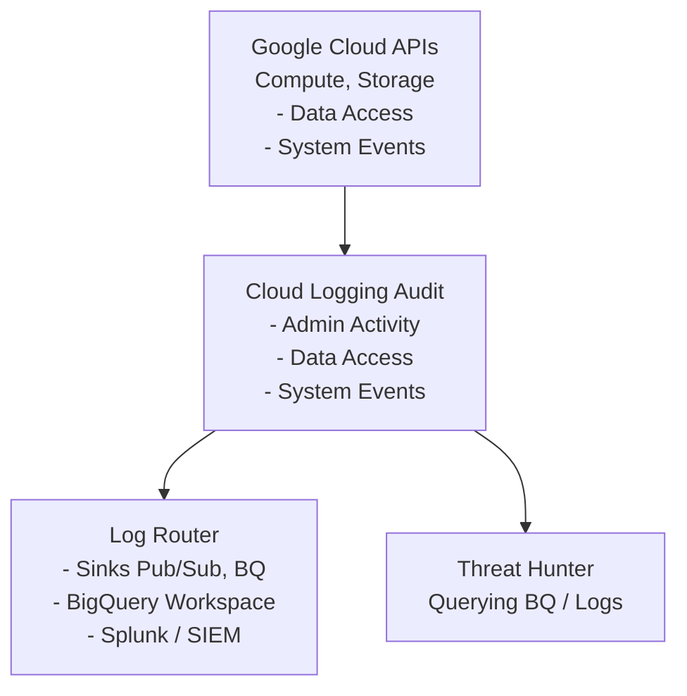

# GCP Cloud Audit Logs Analysis

## Introduction to GCP Logging

In Google Cloud Platform (GCP), visibility into control plane and data plane operations is heavily reliant on **Cloud Audit Logs**. Unlike traditional on-premises environments where you might parse Windows Event Logs or Linux syslog, cloud environments require you to analyze highly structured JSON/Protobuf data that records every API call made against the infrastructure.

For a threat hunter, Cloud Audit Logs are the definitive source of truth. They answer the critical questions: *Who* did *what*, *where*, and *when*? 

However, hunting in GCP logs requires understanding the difference between log streams, how they are routed, and how the `protoPayload` object is structured.

## Types of GCP Audit Logs

GCP categorizes audit logs into four distinct types:
1. **Admin Activity Logs**: Records operations that modify the configuration or metadata of a resource. (e.g., `compute.instances.insert`, `iam.serviceAccounts.create`). These are **always on** and cannot be disabled.
2. **Data Access Logs**: Records operations that read configuration/metadata, or read/write user-provided data. (e.g., `storage.objects.get`, `spanner.databases.read`). These are **off by default** because they generate massive volume and cost.
3. **System Event Logs**: Records Google-initiated actions that modify your resources.
4. **Policy Denied Logs**: Records API calls that were denied by VPC Service Controls.

## ASCII Diagram: GCP Audit Log Architecture



## Structure of a LogEntry

Every action in GCP generates a `LogEntry`. The most important field for security analysis is `protoPayload`, which contains the `AuditLog` object.

A typical structure looks like this:
```json
{
  "insertId": "1a2b3c4d5e",
  "logName": "projects/my-project/logs/cloudaudit.googleapis.com%2Factivity",
  "resource": {
    "type": "gce_instance",
    "labels": {
      "instance_id": "1234567890",
      "project_id": "my-project"
    }
  },
  "protoPayload": {
    "@type": "type.googleapis.com/google.cloud.audit.AuditLog",
    "authenticationInfo": {
      "principalEmail": "attacker@external-domain.com"
    },
    "requestMetadata": {
      "callerIp": "203.0.113.5",
      "callerSuppliedUserAgent": "google-api-go-client/0.5"
    },
    "serviceName": "compute.googleapis.com",
    "methodName": "v1.compute.instances.insert",
    "authorizationInfo": [
      {
        "permission": "compute.instances.create",
        "granted": true
      }
    ]
  },
  "timestamp": "2026-06-10T14:30:00Z"
}
```
**Hunter's Focus**: Pay close attention to `authenticationInfo.principalEmail` (who), `requestMetadata.callerIp` (from where), and `methodName` (what they did).

## Real-World Attack Scenario

### The Compromised Developer Key
A developer accidentally committed a long-lived GCP Service Account JSON key to a public GitHub repository. Within 3 minutes, an automated scanner scraped the key. 

The attacker loaded the key into their local `gcloud` CLI. First, they executed `gcloud compute instances list` to understand the environment. This generated a **Data Access** log (if enabled). 
Next, they queried the storage buckets using `gsutil ls`. Finally, realizing they had broad permissions, they created 50 instances across multiple regions using a custom image designed for cryptocurrency mining. This generated a flood of **Admin Activity** logs (`compute.instances.insert`).

Because the victim organization routed all their Audit Logs to a BigQuery dataset, the threat hunter was able to run a single SQL query to identify exactly which service account was compromised and what actions the attacker took.

## Hunting with BigQuery SQL

When analyzing massive log volumes, exporting logs to BigQuery via a Log Router sink is standard practice. Here are advanced SQL queries for hunting.

### Query 1: Finding High-Risk Operations
This query looks for actions commonly taken by attackers to establish persistence or escalate privileges.

```sql
SELECT
  timestamp,
  protopayload_auditlog.authenticationInfo.principalEmail,
  protopayload_auditlog.requestMetadata.callerIp,
  protopayload_auditlog.methodName,
  resource.type
FROM
  `my-project.audit_logs.cloudaudit_googleapis_com_activity`
WHERE
  protopayload_auditlog.methodName IN (
    'google.iam.admin.v1.CreateServiceAccountKey',
    'v1.compute.instances.insert',
    'SetIamPolicy'
  )
ORDER BY
  timestamp DESC
LIMIT 100;
```

### Query 2: Identifying Anomalous User Agents
Attackers often use automated scripts or custom tooling. Hunting for unusual user agents interacting with your GCP environment can reveal unauthorized access.

```sql
SELECT
  protopayload_auditlog.requestMetadata.callerSuppliedUserAgent AS user_agent,
  COUNT(*) as execution_count,
  ARRAY_AGG(DISTINCT protopayload_auditlog.authenticationInfo.principalEmail) as associated_users
FROM
  `my-project.audit_logs.cloudaudit_googleapis_com_activity`
WHERE
  protopayload_auditlog.requestMetadata.callerSuppliedUserAgent NOT LIKE '%gcloud-ruby%' 
  AND protopayload_auditlog.requestMetadata.callerSuppliedUserAgent NOT LIKE '%Mozilla%'
GROUP BY
  user_agent
ORDER BY
  execution_count DESC;
```

### Query 3: Detecting Data Exfiltration via Storage
If Data Access logs are enabled for GCS, you can hunt for massive object reads indicative of exfiltration.

```sql
SELECT
  protopayload_auditlog.authenticationInfo.principalEmail,
  protopayload_auditlog.requestMetadata.callerIp,
  COUNT(*) as read_operations
FROM
  `my-project.audit_logs.cloudaudit_googleapis_com_data_access`
WHERE
  protopayload_auditlog.serviceName = 'storage.googleapis.com'
  AND protopayload_auditlog.methodName = 'storage.objects.get'
GROUP BY
  1, 2
HAVING
  read_operations > 5000
ORDER BY
  read_operations DESC;
```

## Incident Response Steps

When anomalous activity is confirmed via Cloud Audit Logs:
1. **Identify the Principal**: Extract the `principalEmail`. Determine if it's a user account or a Service Account.
2. **Revoke Keys**: If it's a Service Account, immediately delete all associated JSON keys (`gcloud iam service-accounts keys delete`).
3. **Scope the Breach**: Use BigQuery to pull *every* action taken by that `principalEmail` and that `callerIp` across the entire GCP Organization over the last 30 days.
4. **Quarantine Resources**: If VMs were created by the attacker, snapshot them for forensics and then terminate them to stop malicious activity (e.g., cryptomining).

## Chaining Opportunities
- `[[09 - Detecting GCP Service Account Impersonation]]`: A critical follow-up. Often, the `principalEmail` in the log is an impersonated service account, and you must hunt deeper.
- `[[10 - Hunting for Cloud Metadata SSRF Exfiltration]]`: Exfiltrated credentials will generate Audit Logs from unexpected IPs.

## Related Notes
- `[[03 - BigQuery for Security Analytics]]`
- `[[11 - GCP VPC Service Controls Evasion Techniques]]`
- `[[15 - Cloud Native Incident Response Playbooks]]`
