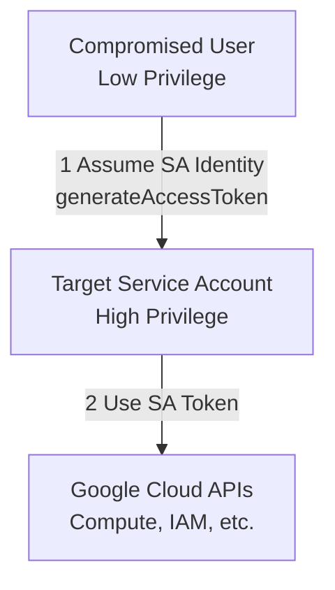

# Detecting GCP Service Account Impersonation

## Introduction to Service Account Impersonation

In Google Cloud Platform (GCP), security best practices dictate moving away from long-lived Service Account (SA) JSON keys. Instead, organizations are encouraged to use **Service Account Impersonation**. This mechanism allows a principal (a user, a group, or another service account) to request short-lived, temporary credentials for a target service account.

While excellent for security hygiene, impersonation introduces significant complexity for threat hunters. When impersonation occurs, the API calls made against the infrastructure are logged under the identity of the *impersonated* service account, not the original attacker. If not properly tracked, an attacker can use impersonation to launder their identity, evade IP restrictions, and escalate privileges seamlessly.

## Impersonation Mechanics

To impersonate a service account, a principal typically requires one of the following IAM roles on the target SA:
- `roles/iam.serviceAccountTokenCreator`: Allows creating short-lived OAuth 2.0 tokens (`generateAccessToken`), OpenID Connect ID tokens, and JWTs.
- `roles/iam.serviceAccountUser`: Allows attaching a service account to a resource (like a VM).

When an attacker with `TokenCreator` privileges wants to impersonate an SA, they call the `iamcredentials.googleapis.com` API:
```bash
# Example of generating an access token
gcloud auth print-access-token \
    --impersonate-service-account=target-sa@my-project.iam.gserviceaccount.com
```

This returns a token valid for up to 1 hour (default). The attacker then attaches this token to their API requests.

## ASCII Diagram: Impersonation Attack Flow



## The `ServiceAccountDelegationInfo` Object

The key to unraveling impersonation lies in the `serviceAccountDelegationInfo` array found within the GCP Cloud Audit Log. When an impersonated token is used to make an API call, Google automatically appends this array to the `authenticationInfo` block. 

It maps the chain of trust: indicating exactly who requested the token that the target SA is currently using.

### Example JSON Log Structure (Impersonated Call)

```json
{
  "protoPayload": {
    "@type": "type.googleapis.com/google.cloud.audit.AuditLog",
    "authenticationInfo": {
      "principalEmail": "target-sa@my-project.iam.gserviceaccount.com",
      "serviceAccountDelegationInfo": [
        {
          "firstPartyPrincipal": {
            "principalEmail": "attacker@victim-domain.com"
          }
        }
      ]
    },
    "methodName": "v1.compute.instances.insert",
    "serviceName": "compute.googleapis.com"
  }
}
```
In this snippet, the API call (`instances.insert`) was executed by `target-sa`, but the `serviceAccountDelegationInfo` proves that it was actually `attacker@victim-domain.com` pulling the strings.

## Real-World Attack Scenario

### CI/CD Pipeline Hijacking
An attacker discovered a command injection vulnerability in a Jenkins CI/CD pipeline hosted on a low-privilege GCP VM. The VM had a service account attached (`jenkins-runner@...`). The attacker enumerated IAM permissions and discovered that `jenkins-runner` had the `iam.serviceAccountTokenCreator` role over `terraform-prod@...`, a highly privileged SA used for infrastructure deployment.

The attacker executed a curl command to the metadata server to get `jenkins-runner`'s token, then used that token to call the `generateAccessToken` API for `terraform-prod`. Using the resulting token, the attacker modified the IAM policies at the organization level, granting their external Gmail account `roles/owner` access.

Because the SOC was only monitoring for direct logins, the alert for "External User Granted Owner" fired, but it looked like the trusted `terraform-prod` SA made the change legitimately. Only by analyzing the delegation chain could the hunter trace the attack back to the Jenkins server.

## Hunting Strategies (BigQuery)

When hunting for malicious impersonation, you must query your Log Router sinks (preferably BigQuery) to unpack the delegation arrays.

### Query 1: Unpacking the Impersonation Chain
This query extracts the actual human or originating service account that performed an action via impersonation.

```sql
SELECT
  timestamp,
  protopayload_auditlog.authenticationInfo.principalEmail AS impersonated_account,
  protopayload_auditlog.methodName,
  (SELECT principalEmail FROM UNNEST(protopayload_auditlog.authenticationInfo.serviceAccountDelegationInfo) WHERE firstPartyPrincipal IS NOT NULL LIMIT 1) AS true_attacker_identity,
  protopayload_auditlog.requestMetadata.callerIp
FROM
  `my-project.audit_logs.cloudaudit_googleapis_com_activity`
WHERE
  ARRAY_LENGTH(protopayload_auditlog.authenticationInfo.serviceAccountDelegationInfo) > 0
ORDER BY
  timestamp DESC
LIMIT 100;
```

### Query 2: Hunting for Nested Impersonation (Chaining)
Attackers may impersonate SA-A, which then impersonates SA-B, which then impersonates SA-C to hide their tracks.

```sql
SELECT
  timestamp,
  protopayload_auditlog.authenticationInfo.principalEmail AS final_execution_account,
  ARRAY_LENGTH(protopayload_auditlog.authenticationInfo.serviceAccountDelegationInfo) AS delegation_depth,
  protopayload_auditlog.methodName
FROM
  `my-project.audit_logs.cloudaudit_googleapis_com_activity`
WHERE
  ARRAY_LENGTH(protopayload_auditlog.authenticationInfo.serviceAccountDelegationInfo) > 1
ORDER BY
  delegation_depth DESC;
```

### Query 3: Service Account Token Generation Monitoring
Monitor the `iamcredentials.googleapis.com` API directly to see *when* the tokens are being minted, regardless of whether they are subsequently used.

```sql
SELECT
  timestamp,
  protopayload_auditlog.authenticationInfo.principalEmail AS token_requester,
  protopayload_auditlog.requestMetadata.callerIp,
  JSON_EXTRACT(protopayload_auditlog.request, '$.name') AS requested_target_sa
FROM
  `my-project.audit_logs.cloudaudit_googleapis_com_activity`
WHERE
  protopayload_auditlog.methodName = 'GenerateAccessToken'
  AND protopayload_auditlog.serviceName = 'iamcredentials.googleapis.com'
ORDER BY
  timestamp DESC;
```

## Remediation and Mitigation

1. **Audit `TokenCreator` Roles**: Use Cloud Asset Inventory to map every principal that holds `roles/iam.serviceAccountTokenCreator`. Ensure it follows the principle of least privilege.
2. **Implement VPC Service Controls**: Bind the ability to call the `iamcredentials` API to trusted network perimeters.
3. **Alerting**: Set up Log-Based Metrics in Cloud Logging to fire an alert whenever a high-privilege Service Account is impersonated by a human identity.

## Chaining Opportunities
- `[[08 - GCP Cloud Audit Logs Analysis]]`: The foundational knowledge required to parse these logs.
- `[[13 - Privilege Escalation in GCP IAM]]`: Impersonation is the most common method of vertical privilege escalation in GCP.

## Related Notes
- `[[03 - BigQuery for Security Analytics]]`
- `[[17 - GCP IAM Policy Analyzer]]`
