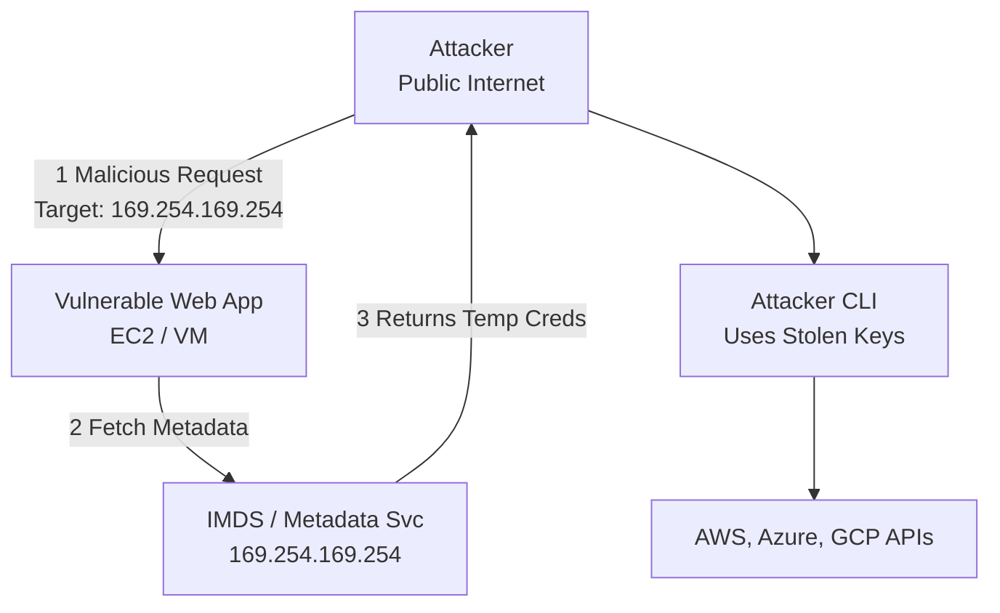

# Hunting for Cloud Metadata SSRF Exfiltration

## Introduction to Cloud Metadata Services

Every major cloud provider (AWS, Azure, GCP) provisions a local, non-routable endpoint known as the **Instance Metadata Service (IMDS)**. This service resides at the ubiquitous IP address `169.254.169.254`. 

The IMDS provides instances with data about themselves, such as their network configuration, tags, and most importantly, **temporary security credentials** associated with the IAM role or Managed Identity attached to the compute resource. 

When a web application hosted on a cloud instance contains a Server-Side Request Forgery (SSRF) vulnerability, attackers exploit it to coerce the application into making an HTTP GET request to the IMDS endpoint. The application retrieves the cloud credentials and returns them to the attacker.

## SSRF and Metadata Extraction Mechanics

The extraction technique varies slightly by cloud provider due to the protections they have implemented over time:

- **AWS (IMDSv1)**: A simple `GET http://169.254.169.254/latest/meta-data/iam/security-credentials/RoleName` is sufficient to dump the `AccessKeyId`, `SecretAccessKey`, and `Token`.
- **AWS (IMDSv2)**: Requires a `PUT` request to get a session token, followed by a `GET` request with the token in a header. It is much harder to exploit via standard SSRF.
- **GCP**: Requires a custom HTTP header: `Metadata-Flavor: Google`.
- **Azure**: Requires a custom HTTP header: `Metadata: true`.

If the attacker successfully retrieves the credentials, they will typically load them into their local CLI tools and execute APIs against the cloud provider from their own infrastructure.

## ASCII Diagram: SSRF Metadata Exfiltration



## Real-World Attack Scenario

### The Capital One Playbook
In one of the most famous cloud breaches in history, an attacker identified a web application firewall (WAF) deployed on AWS EC2 that was vulnerable to SSRF. 

The attacker sent a crafted request that forced the WAF to query the AWS IMDSv1 endpoint. The WAF returned the temporary credentials for the `WAF-Role` IAM profile. The attacker then installed the AWS CLI on their local machine, exported the stolen `AWS_ACCESS_KEY_ID`, `AWS_SECRET_ACCESS_KEY`, and `AWS_SESSION_TOKEN`, and ran `aws s3 sync s3://customer-data-bucket local-dir`. 

Because the WAF-Role was overly permissive, the attacker was able to download terabytes of sensitive data directly to their home network.

## Detecting Credential Abuse (The Threat Hunter's Approach)

Directly detecting the SSRF payload hitting the metadata service is difficult because IMDS traffic never traverses the cloud network fabric (it is intercepted by the hypervisor). 

Therefore, threat hunters must focus on the **abuse of the stolen credentials**. When a credential is generated on an EC2 instance, it is *expected* to be used by that specific instance's IP address. If the credential is used from a residential ISP or a VPN endpoint, it indicates compromise.

### AWS CloudTrail Hunting

In AWS, when temporary credentials are used, CloudTrail logs the `userIdentity` block containing the `principalId` in the format `RoleID:InstanceID`. 

#### Query 1: IP Mismatch Detection (Splunk / Athena)
This logic looks for instances where a role assigned to an EC2 instance is used from an IP address that is NOT an AWS IP address.

```sql
-- AWS Athena Query
SELECT 
    eventTime,
    eventName,
    userIdentity.arn,
    userIdentity.principalId,
    sourceIPAddress,
    userAgent
FROM 
    cloudtrail_logs
WHERE 
    userIdentity.type = 'AssumedRole'
    -- Ensure it's an EC2 role
    AND userIdentity.arn LIKE '%assumed-role/EC2-Role-Name/%'
    -- Look for anomalous IPs (exclude known VPC NAT Gateways or Elastic IPs)
    AND sourceIPAddress NOT IN ('203.0.113.1', '203.0.113.2')
    AND sourceIPAddress NOT LIKE '10.%'
```

#### Query 2: Identifying STS GetCallerIdentity Probes
Attackers often run `aws sts get-caller-identity` immediately after stealing credentials to verify what they have compromised. This API call is rarely made by legitimate automated applications running on EC2.

```sql
SELECT 
    eventTime,
    userIdentity.arn,
    sourceIPAddress,
    userAgent
FROM 
    cloudtrail_logs
WHERE 
    eventName = 'GetCallerIdentity'
    AND userAgent LIKE '%aws-cli/%'
    AND userIdentity.arn LIKE '%assumed-role/%/i-%' -- The "i-" denotes an EC2 instance ID
```

## Azure and GCP Logging Counterparts

### Azure Logging (Defender for Cloud)
In Azure, the execution of commands that query IMDS is often flagged by Microsoft Defender for Servers natively. However, to hunt for credential abuse manually, you query `AzureActivity` or `AzureDiagnostics` (for Key Vaults) and look for tokens where `identity_claim_appid_g` matches a Managed Identity, but the `CallerIpAddress` originates from outside the Azure backbone.

### GCP Logging (Cloud Audit Logs)
In GCP, the concept is identical. Service Accounts attached to Compute Engine instances generate access tokens. When these tokens are used, they appear in Cloud Audit Logs. You must query BigQuery for `authenticationInfo.principalEmail` matching your compute service accounts, where `requestMetadata.callerIp` is an external IP.

## Remediation and Mitigation

1. **Enforce IMDSv2 (AWS)**: Require the use of IMDSv2 across all EC2 instances. The requirement for a `PUT` request with a specific TTL header severely neutralizes simple SSRF vulnerabilities.
2. **Network Restrictions**: In GCP, use VPC Service Controls to ensure API requests using specific Service Accounts can only originate from the IP ranges of the instances they are attached to.
3. **Principle of Least Privilege**: Ensure the IAM roles attached to web servers only have the bare minimum permissions. A web server rarely needs `s3:ListAllMyBuckets`.

## Chaining Opportunities
- `[[07 - Microsoft Defender for Cloud Telemetry]]`: How MDC detects this natively.
- `[[08 - GCP Cloud Audit Logs Analysis]]`: Using BigQuery to detect the usage of stolen GCP metadata tokens.
- `[[18 - Web Application Firewall Bypasses]]`: Techniques attackers use to slip SSRF payloads past WAFs.

## Related Notes
- `[[02 - Bypassing MFA via Token Theft]]`
- `[[21 - Securing EC2 Instance Profiles]]`
