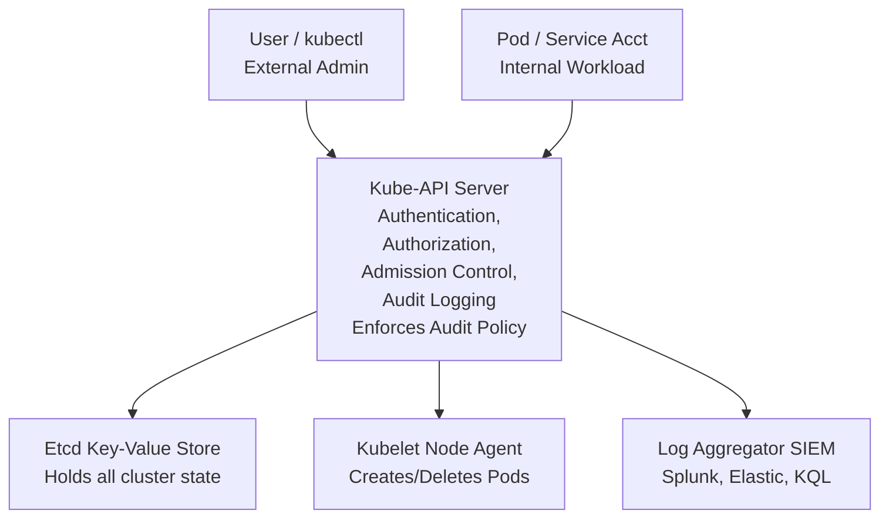

# Hunting in Kubernetes Cluster Audit Logs

Kubernetes (K8s) has effectively become the universal operating system for cloud-native infrastructure. Because it orchestrates vast fleets of compute resources, manages network routing, and stores highly sensitive configuration data (Secrets), it is heavily targeted by advanced threat actors. Hunting in Kubernetes environments requires a profound familiarity with the Kubernetes API architecture, the intricacies of Role-Based Access Control (RBAC), and the structural nuances of K8s Audit Logs.

Kubernetes audit logs provide a chronological, highly detailed record of calls made to the Kubernetes API server. They document who did what, when they did it, and how the API server responded. They are the ultimate, irrefutable source of truth for the cluster's control plane. If an attacker bypasses the application layer and interacts with the orchestrator, it will be recorded here.

## Kubernetes Architecture and Attack Surface



## Understanding Kubernetes Audit Log Stages

A single API request doesn't generate just one log entry. Audit events in K8s are recorded at different stages of the API request lifecycle, controlled by the cluster's Audit Policy:
1. `RequestReceived`: The event is generated the millisecond the audit handler receives the request. (Often dropped to save space, as it doesn't indicate success).
2. `ResponseStarted`: Generated once the response headers are sent, but before the response body is streamed (relevant for long-running actions like `watch`).
3. `ResponseComplete`: The response body has been fully sent. This is the most critical stage for threat hunting, as it contains the final `responseStatus` code.
4. `Panic`: Events generated when a panic or critical failure occurs in the API server.

A typical audit log entry is a JSON object containing: `user` (identity), `impersonatedUser` (if `kubectl --as` was used), `sourceIPs`, `verb` (get, list, create, patch, delete), `objectRef` (the specific resource targeted, like a pod or secret), and `responseStatus` (HTTP status code).

## Threat Hunting Methodologies

### 1. Hunting for Persistence via RBAC Modification

Attackers often grant themselves persistent, stealthy access by creating or modifying highly privileged `ClusterRoles` and `ClusterRoleBindings`. 

**Hunting Hypothesis:** An attacker has compromised a low-level service account or user identity and is actively escalating privileges by creating malicious RBAC bindings to gain cluster-admin rights.

**Indicators:**
- `verb: create`, `update`, or `patch` directed against `resource: clusterroles` or `resource: clusterrolebindings`.
- Look for bindings attaching to default namespace service accounts (e.g., `system:serviceaccount:default:default`) granting `cluster-admin` privileges.
- Creation of custom roles that grant the `escalate`, `bind`, or `impersonate` verbs. These verbs allow a user to bypass standard RBAC restrictions and assume the identity of a higher-privileged user.

**JSON Parsing / KQL Example for Malicious Binding:**
```kusto
KubernetesAuditLogs
| where ObjectRef_Resource == "clusterrolebindings" or ObjectRef_Resource == "rolebindings"
| where Verb in ("create", "update", "patch")
| where ResponseStatus_Code in (200, 201) // Only look at successful actions
| extend SubjectName = parse_json(RequestBody).subjects[0].name
| extend SubjectKind = parse_json(RequestBody).subjects[0].kind
| extend RoleRefName = parse_json(RequestBody).roleRef.name
| where RoleRefName == "cluster-admin" or RoleRefName == "admin"
| project TimeGenerated, User_Username, SourceIps, Verb, ObjectRef_Resource, SubjectKind, SubjectName, RoleRefName
```

### 2. Detecting Pod Exec and Attach Events

Running commands interactively within a pod (`kubectl exec`) is a powerful administrative tool for debugging, but it is heavily abused by attackers to run malware, exfiltrate data, scrape memory, or pivot out of the container to the node network.

**Hunting Hypothesis:** An attacker is interactively executing shell commands inside running containers to establish a foothold or dump application secrets.

**Indicators:**
- `verb: create` targeting `subresource: exec` or `subresource: attach` on `resource: pods`.
- Look for automated or abnormally high-frequency exec commands.
- Review the `sourceIPs`. Is the exec originating from a developer's known corporate VPN IP, a known CI/CD pipeline server, or an unknown/Tor exit node?
- If the Audit Policy is configured at the `Metadata` level, you will only see that an exec occurred. If configured at `Request` level, you can parse the actual commands executed (e.g., `sh`, `bash`, `curl`, `wget`, `cat /var/run/secrets/kubernetes.io/serviceaccount/token`).

### 3. Exploiting Secrets and ConfigMaps

Kubernetes Secrets routinely contain database passwords, API keys for external cloud services, TLS certificates, and administrative tokens.

**Hunting Hypothesis:** An attacker is performing a mass-dump of all secrets from the cluster to harvest credentials for lateral movement.

**Indicators:**
- `verb: list` or `get` against `resource: secrets` originating from an unexpected Service Account or human User.
- High volume of secret access across multiple namespaces in a very short timeframe.
- Access to secrets located in the `kube-system` namespace, which often contain critical administrative tokens and cluster-wide configuration data.

### 4. Workload Anomalies: DaemonSets and Privileged Pods

Attackers deploy cryptominers or host-level backdoors by utilizing DaemonSets (ensuring their malicious pod runs on every single node in the cluster) or by deploying heavily privileged pods designed to escape the container boundary.

**Indicators:**
- `verb: create` for pods, deployments, or daemonsets where the payload contains `securityContext.privileged: true` or `hostNetwork: true`.
- Mounting the node's underlying OS filesystem directly into the container (`hostPath: /` or `hostPath: /var/run/docker.sock`).
- Creation of generic, untrusted images (e.g., pulling directly from an unknown user repository on Docker Hub rather than a private corporate Azure Container Registry or AWS ECR).

## Real-World Attack Scenario

### Scenario: The Exposed Dashboard and Node Takeover

1. **Initial Access**: The organization accidentally exposes an unauthenticated Kubernetes dashboard to the public internet without proper ingress authentication.
2. **Execution**: The attacker uses the dashboard (which inherently operates as a high-privileged Service Account within the cluster) to deploy a malicious pod.
3. **Privilege Escalation**: The malicious pod's YAML configuration includes `hostNetwork: true`, `hostPID: true`, and a `hostPath` mount of the underlying node's root directory (`/`).
4. **Defense Evasion & Persistence**: The attacker executes a script inside the pod to `chroot` into the node's filesystem. They append a reverse shell payload to `/etc/crontab` on the underlying host VM, establishing persistence independent of the Kubernetes API.
5. **Impact**: The attacker gains full root access to the EC2/GCE instance hosting the Kubernetes node and begins pivoting through the cloud VPC to attack databases `[[14 - Correlating Cloud Identity with Network Activity]]`.

**Hunter's Response:**
- The threat hunter continuously reviews K8s Audit Logs in their SIEM and identifies a `create pod` event originating from the dashboard's service account.
- Because the cluster's Audit Policy is set to log the `RequestBody` for pod creations, the payload inspection reveals the dangerous `securityContext` settings (privileged mode).
- The hunter correlates the timestamp of the pod creation with VPC Flow Logs, spotting the anomalous reverse shell network connection traversing back out to the attacker's C2 infrastructure.
- The node is instantly cordoned, drained, and terminated, and the dashboard ingress is secured.

## Configuring K8s Audit Policies for Threat Hunting

By default, Kubernetes does not log everything; doing so would overwhelm the API server and storage. You must explicitly define an `AuditPolicy` YAML file. For effective threat hunting, ensure your policy captures:
- `Metadata` level logging for all requests by default.
- `RequestResponse` level logging for critical RBAC changes (`ClusterRoles`, `RoleBindings`).
- `Request` level logging for Pod creations/modifications to capture the pod specs (images, security contexts).
- Exceptions (drop logs) for extremely noisy, benign system components (like `kube-proxy`, `kubelet`, or monitoring agents doing routine health state checks), unless their behavior deviates from the norm.

## Tooling and Detection Pipelines

Integrate K8s Audit Logs into a centralized SIEM or a specialized Cloud Native platform `[[15 - Building a Cloud Native Threat Hunting Pipeline]]`. 

Furthermore, rely on real-time runtime security tools like **Falco**. While Audit Logs provide API-level visibility, Falco runs as a DaemonSet, hooking into the kernel via eBPF to monitor system calls. It can detect when a process inside a container suddenly spawns a shell or attempts to read sensitive files, perfectly supplementing the control plane visibility of Audit Logs.

---

## Chaining Opportunities
- Attackers pivoting out of Kubernetes will almost always target cloud object storage next to steal data `[[11 - Identifying Anomalous Cloud Storage Access Buckets]]`.
- Correlating network flow logs from the underlying K8s nodes is absolutely essential to detect outbound C2 communications `[[14 - Correlating Cloud Identity with Network Activity]]`.
- Compromised K8s pod credentials might be used to invoke or abuse serverless functions `[[12 - Serverless Function Lambda Abuse Detection]]`.

## Related Notes
- `[[18 - Kubernetes RBAC Security and Exploitation]]`
- `[[25 - Container Escape Techniques]]`
- `[[30 - Securing the Kubernetes API Server]]`
- `[[35 - Advanced eBPF for Runtime Security]]`
