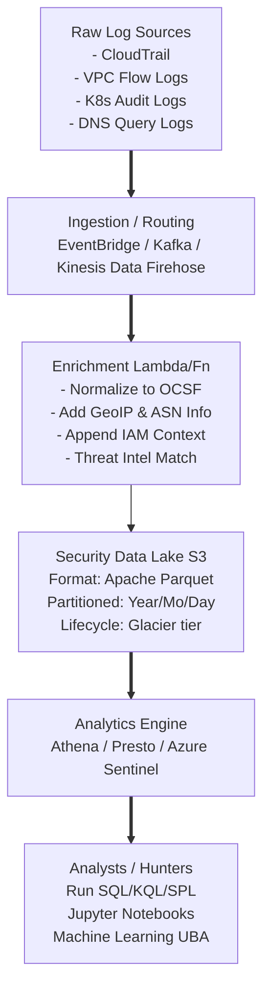

# Building a Cloud Native Threat Hunting Pipeline

To execute advanced threat hunts—such as correlating identity with network activity `[[14 - Correlating Cloud Identity with Network Activity]]`, analyzing serverless application anomalies `[[12 - Serverless Function Lambda Abuse Detection]]`, or digging through API request payloads—you must have a robust, scalable, and highly automated telemetry ingestion and processing pipeline. 

A "Cloud Native" Threat Hunting Pipeline intentionally diverges from traditional, monolithic SIEM architectures. Instead, it leverages managed cloud services (serverless computing, managed data lakes, and automated stream enrichment) to handle massive volumes of logs with infinite elasticity and significantly lower costs.

## Core Components of the Pipeline

1. **Ingestion Layer**: Collecting raw, heterogeneous telemetry from multi-cloud environments (AWS CloudTrail, VPC Flow Logs, Azure Activity Logs, K8s Audit Logs, DNS Query Logs).
2. **Processing/Enrichment Layer**: Normalizing the disparate data formats (e.g., converting to the OCSF - Open Cybersecurity Schema Framework), enriching IP addresses with Threat Intelligence, and appending critical asset metadata (e.g., dynamically tying an ephemeral IP to an IAM role).
3. **Storage/Data Lake Layer**: Storing petabytes of datasets cheaply using object storage (Amazon S3, Azure Data Lake Storage) while maintaining ultra-high query performance via columnar data formats (Apache Parquet).
4. **Query/Analytics Layer**: Using serverless SQL engines (AWS Athena, Azure Synapse) or dedicated analytical engines to run complex KQL/SQL queries on demand.
5. **Automation/Response Layer**: Triggering automated remediations (SOAR) or alerting analysts via webhooks when statistical anomalies are detected.

## Architecture Diagram: The Cloud Native Pipeline

## Designing the Pipeline

### Step 1: Telemetry Collection and Routing

**AWS Strategy:**
- Enable CloudTrail for all regions and all accounts (via AWS Organizations), routing it to a centralized, highly restricted Security S3 bucket.
- Enable VPC Flow Logs across all production VPCs, routing them directly to Amazon Kinesis Data Firehose to bypass intermediate storage costs.
- Enable EKS Control Plane Logging `[[13 - Hunting in Kubernetes Cluster Audit Logs]]` pushing to CloudWatch, then stream via subscription filters to the central pipeline.

**Azure Strategy:**
- Route Azure Activity Logs, Azure AD Sign-in Logs, and Network Security Group (NSG) Flow Logs via Azure Diagnostic Settings into Azure Event Hubs for real-time streaming to the analytics engine.

### Step 2: Normalization and Enrichment (The Magic Layer)

Raw logs are deeply inconsistent. For example, denoting the source IP address: AWS CloudTrail uses `sourceIPAddress`, Azure uses `callerIpAddress`, and GCP uses `callerIp`. 

**The OCSF Framework:**
Transforming logs into the Open Cybersecurity Schema Framework (OCSF) ensures uniform, standardized field names across all cloud providers. This means a threat hunter only needs to learn one query language schema to hunt across AWS, Azure, and GCP simultaneously.

**Enrichment in Transit:**
Use a Serverless function (e.g., AWS Lambda or Azure Function) attached to your data stream to perform real-time, sub-millisecond enrichment:
- **Asset Enrichment**: The function calls the cloud provider's API to resolve an ENI to an Instance ID and fetches the instance tags (e.g., appending `Environment: Prod` or `App: PaymentGateway` to the log).
- **Threat Intel Cache**: The function queries a fast, in-memory cache (like Redis/ElastiCache) of known malicious IPs and adds a boolean flag `is_malicious_ip: true` directly into the log payload before it hits storage.

### Step 3: Efficient Storage via Security Data Lakes

Traditional SIEMs charge prohibitively high fees based on ingestion volume (GB/day). To reduce costs for threat hunting—where you might need to query petabytes of historical, noisy VPC flow logs to find a single C2 beacon—utilize a Security Data Lake.

- **Columnar Format**: Convert bulky JSON logs to **Apache Parquet format** via AWS Glue or Kinesis. Parquet is columnar; meaning queries that only select 3 columns out of 100 will scan (and cost) drastically less compute power than reading full JSON blobs.
- **Partitioning Strategy**: Store data in S3/Blob using an intelligent partitioning scheme: `s3://corp-security-lake/logs/aws/cloudtrail/year=2026/month=06/day=09/`. This highly structured path allows Athena/Presto to utilize "Partition Pruning," skipping massive amounts of irrelevant data during a time-scoped hunt, returning results in seconds rather than hours.

### Step 4: The Threat Hunter's Interface

Advanced hunters interface with this pipeline using multiple modalities:
1. **Serverless SQL (AWS Athena / GCP BigQuery)**: Best for massive, unstructured data mining without provisioning clusters. Example: "Show me all unique User Agents that interacted with S3 over the last 18 months."
2. **Jupyter Notebooks**: Integrating with Python and Pandas for advanced data science, statistical baselining, and Machine Learning (User Behavior Analytics).
3. **Cloud Native SIEM (Azure Sentinel / Chronicle)**: Best for executing out-of-the-box KQL hunting queries, managing active incidents, and providing graphical dashboards for junior analysts.

## Real-World Attack Scenario

### Scenario: The Persistent, Low-and-Slow Stealth Threat

1. **Initial Access**: An attacker gains access via a severely misconfigured Cloud Storage Bucket `[[11 - Identifying Anomalous Cloud Storage Access Buckets]]` which accidentally hosted a developer's hardcoded infrastructure provisioning credential.
2. **Persistence**: The attacker uses the credential to create a hidden IAM role, subtly modifying trust policies to allow external access.
3. **Defense Evasion**: The attacker explicitly executes their actions at 3:00 AM on Sundays, spreading small, stealthy data extraction tasks over the course of 8 months.
4. **Impact**: Traditional SIEM alerts entirely miss the attack because standard SIEMs only retain "hot" searchable data for 14 to 30 days due to licensing costs. The slow-rolling attack evades all volume-based thresholds.

**Hunter's Response via the Cloud Native Pipeline:**
- The threat hunter hypothesizes a slow, low-and-slow IAM persistence technique might exist in the environment.
- They open a Jupyter Notebook securely connected to AWS Athena.
- Because the logs are stored cheaply in the Parquet Data Lake (costing pennies per GB to store), they can run an analytical query spanning **2 full years** of CloudTrail data in less than 30 seconds.
- Using Python data science libraries (Pandas/Scikit-learn) against the query results, they calculate the entropy of all newly created IAM roles over the past two years. 
- The model identifies a massive statistical outlier: a role named `Update-Agent-V2` created 8 months ago that has only been utilized from an unusual residential ISP. The long-term threat is neutralized.

## Automation and SOAR Integration

A pipeline isn't just for historical reading; it should drive immediate action. When a hunter identifies a novel attack pattern in the lake, they convert it into a scheduled detection rule.
If the rule triggers, it sends an event payload to a SOAR (Security Orchestration, Automation, and Response) component.
- **Example**: If the pipeline detects Lambda environment variable exfiltration patterns `[[12 - Serverless Function Lambda Abuse Detection]]`, a Step Function is instantly triggered to automatically attach an explicitly `DenyAll` IAM policy to the compromised role, completely halting the attacker's lateral movement in seconds without human intervention.

---

## Chaining Opportunities
- Use this pipeline architecture to successfully correlate massive datasets like network flows and identity API calls `[[14 - Correlating Cloud Identity with Network Activity]]`.
- Funnel high-volume, noisy Kubernetes Audit logs into this lake for long-term retention, compliance, and behavioral baselining `[[13 - Hunting in Kubernetes Cluster Audit Logs]]`.

## Related Notes
- `[[23 - Security Data Lakes vs SIEMs]]`
- `[[26 - KQL for Threat Hunters]]`
- `[[29 - Automating Incident Response with SOAR]]`
- `[[34 - Open Cybersecurity Schema Framework (OCSF)]]`
