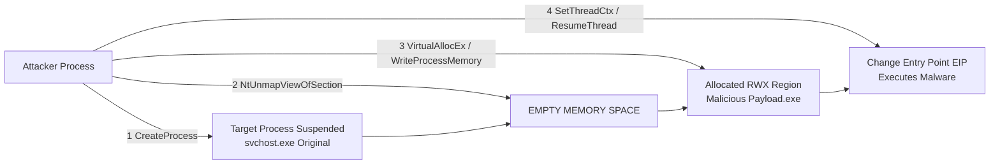

# Hunting Process Injection and Hollowing

## Virtual Address Descriptors (VAD) Tree
To detect process injection, an analyst must understand how Windows manages the virtual memory of a running process. Every time a process allocates memory (via `VirtualAlloc`), loads a DLL (via `LoadLibrary`), or maps a file into memory, the Windows kernel records this allocation in the Virtual Address Descriptor (VAD) tree.

The VAD is a self-balancing AVL (Adelson-Velsky and Landis) tree residing in kernel memory, mapped to each process via the `VadRoot` field in the `EPROCESS` structure. 
Each node in the VAD tree represents a contiguous range of virtual addresses and contains critical metadata:
- **Starting and Ending Addresses**
- **Protection Flags:** (e.g., `PAGE_READONLY`, `PAGE_EXECUTE_READWRITE`)
- **Memory Type:** Private (unique to the process) or Mapped (shared/file-backed).
- **File Backing:** If the memory range contains a loaded DLL or EXE, the VAD node points to a File Object representing the file on disk.

## Analyzing VAD Protections
Malware typically injects shellcode or malicious DLLs into remote, legitimate processes (like `explorer.exe` or `svchost.exe`) to hide its presence and bypass firewalls.

When analyzing the VAD tree, memory forensics looks for **anomalous memory protections**.
A legitimate, compiled program on disk is loaded into memory with specific permissions:
- The `.text` section (Code) is loaded as `PAGE_EXECUTE_READ` (`ER`). It does not need to be writable.
- The `.data` section is loaded as `PAGE_READWRITE` (`RW`). It does not need to be executable.

However, when an attacker injects code, they often use APIs like `VirtualAllocEx` and specify `PAGE_EXECUTE_READWRITE` (`PAGE_EXECUTE_READWRITE` or `RWX`). Memory regions marked as `RWX` are extremely suspicious, especially if they are marked as **Private** (meaning they are not backed by a file on disk).

## Process Hollowing (RunPE) Internals
Process Hollowing (often called RunPE) is a classic defense evasion technique used to execute a malicious payload masquerading as a legitimate Windows executable.

**The Process Hollowing Flow:**
1. **Creation:** Malware uses `CreateProcess` to launch a legitimate executable (e.g., `svchost.exe`) in a `CREATE_SUSPENDED` state.
2. **Unmapping:** The malware calls `NtUnmapViewOfSection` to completely hollow out (deallocate) the original code of `svchost.exe` from memory.
3. **Allocation:** It calls `VirtualAllocEx` to allocate new memory in the suspended process, usually with `RWX` permissions.
4. **Writing:** It uses `WriteProcessMemory` to copy the malicious payload's PE headers and sections into the hollowed process.
5. **Context Alteration:** It uses `SetThreadContext` to change the instruction pointer (EAX/RCX) of the primary thread to point to the Entry Point of the malicious payload.
6. **Execution:** Finally, it calls `ResumeThread`. The OS believes it is executing `svchost.exe`, but it is actually executing the malicious payload.

## Injection Techniques
### Classic DLL Injection vs Reflective DLL Injection
- **Classic DLL Injection:** Uses `CreateRemoteThread` to force a remote process to call `LoadLibrary`, pointing to a malicious DLL on disk. This is noisy as it leaves a file on disk and registers the DLL in the VAD tree as a file-backed mapping.
- **Reflective DLL Injection:** The attacker allocates memory in the target process, writes the raw DLL bytes into memory, and executes a custom "Reflective Loader" function. This avoids `LoadLibrary`, meaning the DLL is *never registered* in the PEB module list, and the memory appears as a Private, file-less `RWX` region.

### Asynchronous Procedure Calls (APC)
Instead of creating a new remote thread (which is highly monitored by EDRs), modern malware uses Thread Execution Hijacking via APC queues. By queueing an APC (via `QueueUserAPC`) to an existing, sleeping thread in the target process, the malicious code executes seamlessly when the thread wakes up.

## Volatility 3 Plugins for Detection
### `windows.malfind`
This is the ultimate plugin for finding injection. `malfind` scans the VAD tree of every process looking for memory regions that exhibit malicious characteristics:
- Marked as `PAGE_EXECUTE_READWRITE` (RWX).
- Marked as `PAGE_EXECUTE_READ` but not backed by a file.
- Contains PE headers (`MZ`) or known shellcode assembly instructions (like `JMP`, `CALL`, `POP`) at the start of the region.

`malfind` will output the VAD tag, protection state, and provide a hex/assembly dump of the first few bytes.

### `windows.vadinfo`
For deeper analysis, `vadinfo` prints the entire VAD tree for a process. Analysts use this to manually inspect memory maps, spot anomalies, and identify process hollowing by looking for processes whose base address (`ImageBase`) is missing from the VAD, or marked with unusual protections.

## Real-World Attack Scenario
**Scenario:** A Cobalt Strike Beacon is suspected to be operating entirely in memory on a compromised web server.

**Incident Response Steps:**
1. The memory dump is acquired. The analyst runs `vol -f mem.raw windows.malfind`.
2. `malfind` flags a region in `explorer.exe` (PID 2114). The region is marked `PAGE_EXECUTE_READWRITE`, is unbacked (Private allocation), and the hex dump shows `4D 5A 90 00` (the MZ header of a PE file).
3. The analyst runs `windows.pslist` and sees `explorer.exe` looks perfectly normal.
4. Checking `windows.dlllist --pid 2114`, the injected payload does not appear in the loaded modules list.
5. This confirms a Reflective DLL Injection attack. The attacker injected the Cobalt Strike Beacon directly into `explorer.exe`'s memory without registering it with the OS, allowing it to beacon out silently.

## Chaining Opportunities
- Once you locate an injected memory region with `malfind`, you must extract it. See [[05 - Extracting Malware Payloads from Memory Dumps]].
- Injection manipulates memory protections mapped by kernel structures. Review [[02 - Analyzing Windows Process Structures EPROCESS]] to understand the `VadRoot` field.

## Related Notes
- [[Windows APIs and System Calls]]
- [[Cobalt Strike and C2 Frameworks]]
- [[Process Injection and Thread Hijacking Tradecraft]]
- [[Reflective Code Loading and Shellcode Analysis]]
