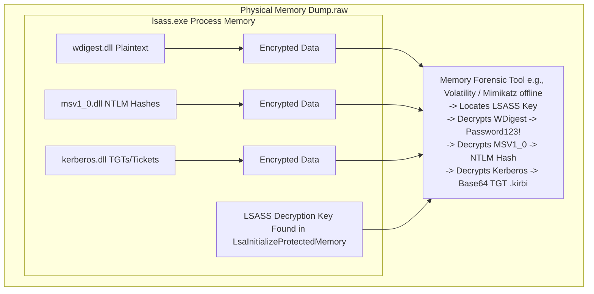

# 92.07 Recovering Passwords and Keys from LSASS Memory

## Introduction

The Local Security Authority Subsystem Service (`lsass.exe`) is one of the most critical processes in the Windows operating system architecture. It is responsible for enforcing security policies, handling user logins, password changes, and creating access tokens. Because of its pivotal role in authentication, LSASS stores extremely sensitive information in its process memory, including plaintext passwords, NTLM hashes, Kerberos tickets, and DPAPI master keys. 

For advanced threat actors, extracting this information from LSASS is often a primary objective during the post-exploitation phase, enabling lateral movement and privilege escalation across the network. Conversely, for memory forensics analysts and threat hunters, understanding how to recover and analyze these secrets from a memory dump is paramount. This note explores the deep technical mechanisms of LSASS, the methods used to extract credentials, and the strategies attackers employ to bypass modern protections like Credential Guard.

## The Architecture of LSASS and Credential Storage

When a user logs into a Windows system, their credentials are encrypted and stored in the memory of the `lsass.exe` process to facilitate Single Sign-On (SSO) and seamless access to network resources. Different authentication packages (Security Support Providers or SSPs) manage different types of credentials:

1. **WDigest:** Historically stored plaintext passwords in memory for HTTP Digest Authentication and other protocols. While disabled by default in modern Windows versions, attackers often enable it via the Registry (`UseLogonCredential`) to force plaintext storage.
2. **MSV1_0:** Manages NTLM authentication and stores NTLM hashes.
3. **Kerberos:** Manages Kerberos authentication and stores Ticket Granting Tickets (TGTs) and service tickets.
4. **Tspkg:** Used for CredSSP (e.g., RDP authentication) and can store plaintext passwords.
5. **DPAPI:** The Data Protection API manages Master Keys used to encrypt/decrypt sensitive data like Chrome passwords, EFS keys, and saved Wi-Fi passwords.

These credentials are not stored in the clear but are encrypted using a system-specific boot key (often derived from the SYSKEY, though SYSKEY is obsolete in Windows 10+) and a key known only to the LSASS process.

### Memory Forensics Extraction with Volatility and Mimikatz

In live environments, attackers use tools like Mimikatz, ProcDump, or custom LSASS dumpers to read the process memory. In offline memory forensics, analysts use Volatility plugins like `windows.hashdump`, `windows.lsadump`, or Volatility's Mimikatz integration.

These tools work by:
1. Locating the `lsass.exe` process in the physical memory image.
2. Identifying the specific memory addresses of the authentication packages (e.g., `wdigest.dll`, `msv1_0.dll`).
3. Finding the linked lists of credential structures (like `KIWI_WDIGEST_LIST_ENTRY`).
4. Extracting the encrypted credentials and the decryption key from LSASS memory.
5. Decrypting the credentials to reveal plaintext passwords, hashes, or Kerberos tickets.



## Advanced Memory Artifacts in LSASS

Beyond simple password extraction, deep analysis of LSASS can reveal more complex artifacts crucial for incident response.

### DPAPI Master Keys
The Data Protection API (DPAPI) is used extensively across Windows. When a user logs in, LSASS unlocks the user's DPAPI Master Key. By extracting this Master Key from LSASS memory, an analyst (or an attacker) can decrypt local Chrome databases, saved RDP connection passwords, and encrypted files. Extracting DPAPI keys offline via Volatility is a powerful technique for reconstructing an attacker's steps or recovering encrypted host data.

### Kerberos Tickets (Pass-the-Ticket)
Kerberos tickets (.kirbi files) stored in LSASS are vital for analyzing lateral movement. If an analyst finds a TGT belonging to a highly privileged account (e.g., Domain Admin) in the LSASS memory of a low-privileged workstation, it strongly indicates that a Pass-the-Ticket (PtT) attack or lateral movement has occurred. Memory forensics allows the precise recovery of these tickets, showing expiration times, client names, and target services.

### WMI and WinRM Traces
When administrative access is performed via WMI or WinRM, temporary authentication tokens are generated and stored in LSASS. Traces of these connections can sometimes be found in the heap space of the LSASS process, providing clues about remote execution sources.

## Defensive Mechanisms and Attacker Bypasses

Microsoft has introduced several mechanisms to protect LSASS, fundamentally changing how memory forensics must approach credential extraction.

### LSA Protection (RunAsPPL)
Protected Process Light (PPL) restricts other processes (even those running as SYSTEM) from reading or writing to the LSASS process memory.
**Attacker Bypass:** Attackers bypass PPL by using vulnerable, signed kernel drivers (Bring Your Own Vulnerable Driver - BYOVD) to disable the PPL flag in the `EPROCESS` structure of LSASS via DKOM (Direct Kernel Object Manipulation). In memory forensics, identifying a manipulated PPL flag on LSASS is a massive red flag indicating driver-based tampering.

### Windows Defender Credential Guard
Credential Guard uses virtualization-based security (VBS) to isolate secrets. Instead of storing secrets directly in `lsass.exe`, they are stored in an isolated LSA process (`LsaIso.exe`) running within a hypervisor-protected enclave. The standard `lsass.exe` only communicates with `LsaIso.exe` via secure RPC.
**Forensic Impact:** If Credential Guard is active, standard memory forensics tools will *not* find plaintext passwords or NTLM hashes in `lsass.exe`. The memory dump of the primary OS will not contain the secrets, as they are managed by the hypervisor. Threat hunters must instead look for Kerberos ticket manipulation or rely on other forensic artifacts outside of credential dumping.

## Real-World Attack Scenario

### Initial Intrusion and Execution
An advanced persistent threat (APT) compromises an edge web server via a remote code execution vulnerability. They gain an initial foothold as a low-privileged IIS service account. To move laterally, they need credentials.

### Privilege Escalation and Defense Evasion
The attackers use a local privilege escalation exploit to gain SYSTEM privileges. They attempt to run Mimikatz to dump LSASS, but LSA Protection (PPL) is enabled. To counter this, they drop a known vulnerable driver (e.g., `RTCore64.sys` from MSI Afterburner). Using an exploit against this driver, they overwrite the protection level in the LSASS `EPROCESS` block, stripping its PPL status.

### Credential Extraction
With PPL disabled, the attackers dump the LSASS process memory to a file using a custom MiniDump tool (`comsvcs.dll` technique) and exfiltrate the `.dmp` file. Offline, they extract the NTLM hash of a Domain Administrator who recently logged into the server for maintenance. They use this hash to perform a Pass-the-Hash attack and compromise the Domain Controller.

### Detection via Memory Forensics
During the incident response, analysts acquire the physical memory of the web server. They load it into Volatility.
First, they run the `windows.pslist` and `windows.malfind` plugins but find nothing immediately obvious.
Next, they inspect the PPL status of critical processes. They notice that `lsass.exe` does not have the PPL flag set, which violates the organization's baseline security policy.

```text
Process          PID   PPID  Protection
lsass.exe        708   560   None (Anomalous! Should be PPL)
```

The analyst then extracts the `lsass.exe` memory segment and runs a Mimikatz plugin against it. They successfully recover the Domain Admin's NTLM hash, confirming the credential theft. Further investigation into the loaded drivers reveals the presence of the malicious `RTCore64.sys` driver, confirming the BYOVD attack vector used to bypass PPL.

## Advanced Considerations for Analysts

When analyzing LSASS, it is crucial to understand that the memory map is highly dynamic. Overwriting or freeing memory is continuous. 
If an attacker dumped LSASS via the `MiniDumpWriteDump` API, remnants of the API call or the file handles might still exist in memory. Analysts should search for handles pointing to `.dmp` files or unusually large files written to disk shortly before the suspected breach.
Furthermore, always analyze the VAD (Virtual Address Descriptor) tree of the LSASS process. Injected DLLs or suspicious memory regions with `PAGE_EXECUTE_READWRITE` permissions within LSASS strongly indicate that an attacker has hooked authentication functions (like creating a custom SSP/AP) rather than just reading memory.

## Conclusion

LSASS is the ultimate prize for attackers and a goldmine of evidence for defenders. Mastery of LSASS memory forensics allows an analyst to determine exactly what credentials were stolen, how lateral movement was facilitated, and whether advanced protective mechanisms like PPL were bypassed. By combining credential recovery with driver analysis and memory protection auditing, threat hunters can reconstruct the most sophisticated post-exploitation chains.

## Chaining Opportunities
- Link compromised accounts found in LSASS to suspicious lateral movement identified in `[[06 - Analyzing Network Connections in Memory Netscan]]`.
- If PPL was bypassed, investigate kernel structures using `[[09 - Direct Kernel Object Manipulation DKOM Detection]]` to find the altered `EPROCESS` block.
- Look for rogue authentication packages injected into LSASS memory using techniques described in `[[01 - Process Memory Analysis and Injection Detection]]`.
- Correlate the exfiltration of the LSASS dump file with unusual file handles found via `[[12 - File Handle and Object Tracking in Memory]]`.

## Related Notes
- `[[01 - Process Memory Analysis and Injection Detection]]`
- `[[06 - Analyzing Network Connections in Memory Netscan]]`
- `[[08 - Kernel Level Rootkits SSDT Hooking Detection]]`
- `[[09 - Direct Kernel Object Manipulation DKOM Detection]]`
- `[[12 - File Handle and Object Tracking in Memory]]`
