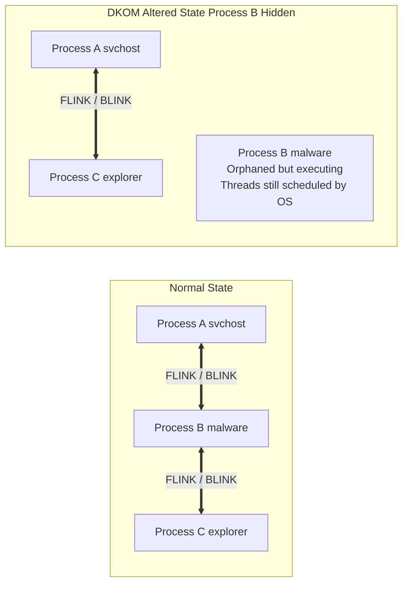

# 92.09 Direct Kernel Object Manipulation DKOM Detection

## Introduction

As operating system defenses like Kernel Patch Protection (PatchGuard) evolved to prevent static modifications to the kernel (such as SSDT hooking), advanced malware and rootkit authors shifted their focus to dynamic data structures. Direct Kernel Object Manipulation (DKOM) is a sophisticated rootkit technique where an attacker, running with kernel-level privileges (Ring 0), directly alters the internal data structures of the operating system without using standard APIs or hooking functions. 

Because DKOM modifies the raw data rather than the code that processes it, it inherently bypasses many traditional security mechanisms and live response tools. For instance, if an attacker unlinks a process from the kernel's active process list, standard tools like Task Manager or `pslist` will simply skip over it, rendering the malware invisible. Detecting DKOM is one of the most critical and challenging tasks in memory forensics, requiring a deep understanding of undocumented Windows internal structures and cross-referencing techniques.

## The Mechanics of DKOM: Hiding a Process

To understand DKOM, we must examine how Windows tracks objects. Every active process in Windows is represented in kernel memory by a massive data structure called the `_EPROCESS` block. Among hundreds of other fields, the `_EPROCESS` block contains a `LIST_ENTRY` structure named `ActiveProcessLinks`.

`ActiveProcessLinks` is a doubly linked list. The forward pointer (FLINK) points to the next `_EPROCESS` block, and the backward pointer (BLINK) points to the previous one. When a legitimate tool queries the OS for a list of running processes, the kernel traverses this linked list from beginning to end.

**The DKOM Attack:**
To hide a process, a rootkit modifies the FLINK of the previous process to point to the next process, and the BLINK of the next process to point to the previous process. The target process is effectively bypassed in the linked list. 

Critically, the hidden process continues to execute normally. The Windows thread scheduler does not rely on the `ActiveProcessLinks` list to allocate CPU time; it relies on thread scheduling lists (like `KiWaitListHead` or `KiReadySummary`). Therefore, the process is invisible to administrative tools but remains fully operational.



## Advanced DKOM Targets Beyond Processes

While hiding processes is the most famous use of DKOM, rootkits use this technique to manipulate many other kernel objects:

### 1. Token Privilege Escalation
Every `_EPROCESS` structure contains a pointer to an `_ACCESS_TOKEN` object, which defines the security context and privileges of the process. A rootkit can perform DKOM to copy the token pointer from a highly privileged process (like `lsass.exe` running as `SYSTEM`) and overwrite the token pointer of the attacker's low-privileged process. This results in instantaneous, stealthy privilege escalation without executing any exploit code.

### 2. Hiding Network Connections
As discussed in `[[06 - Analyzing Network Connections in Memory Netscan]]`, rootkits can unlink TCP/UDP endpoint structures from the lists maintained by `tcpip.sys`, hiding active C2 connections from `netstat` while allowing the network stack to process the packets normally.

### 3. Modifying PPL (Protected Process Light)
To dump credentials from LSASS or bypass EDR protections, attackers use DKOM to modify the `Protection` field within the `_EPROCESS` block, stripping the PPL status from a process and allowing arbitrary memory access.

### 4. Hiding Loaded Drivers
Similar to processes, loaded kernel drivers are tracked in a linked list (`PsLoadedModuleList`). A rootkit can unlink its own `.sys` file from this list, hiding it from tools that enumerate active drivers.

## Detecting DKOM with Memory Forensics

Because DKOM alters the standard structures relied upon by the OS, detecting it requires looking for the artifacts left behind or consulting alternative, unalterable data structures. This is known as **cross-view analysis**.

### 1. Pool Tag Scanning (`psscan` / `netscan`)
The most effective way to detect unlinked objects is to bypass the linked lists entirely and scan the raw physical memory for the specific pool tags assigned to the objects by the kernel memory manager.
- For processes: `_EPROCESS` blocks are allocated in the non-paged pool with tags like `Proc`. The Volatility plugin `psscan` searches physical memory for these tags.
- For threads: `_ETHREAD` blocks are tagged with `Thre`. 

By comparing the results of `pslist` (which follows the linked list) with `psscan` (which scans for pool tags), analysts can instantly identify hidden processes. If a process appears in `psscan` but not in `pslist`, it has almost certainly been hidden via DKOM.

### 2. Thread Scheduling Analysis
Even if a process is unlinked from `ActiveProcessLinks`, its threads must remain in the kernel's scheduling queues to execute. Tools can enumerate the active thread lists (which are much harder for rootkits to manipulate without causing a system crash) and map those threads back to their parent `_EPROCESS` blocks. If an `_EPROCESS` block is found this way but isn't in the active process list, it's a DKOM indicator.

### 3. Handle Table Analysis
Every process has a handle table that tracks open files, registry keys, and other objects. The Windows subsystem process (`csrss.exe`) maintains handles to almost all active processes. By analyzing the handle tables of `csrss.exe` or `system`, analysts can find handles pointing to `_EPROCESS` blocks that have been unlinked from the main list.

### 4. Analyzing the VAD (Virtual Address Descriptor) Tree
The memory manager uses the VAD tree to track which memory ranges are allocated to a process. If an attacker unlinks a process, the VAD tree for that process remains intact in memory. Advanced carving techniques can reconstruct a process's memory footprint purely from an orphaned VAD tree.

## Real-World Attack Scenario

### Initial Breach and Driver Loading
A ransomware operator gains access to a corporate network via a compromised RDP gateway. To disable the organization's Endpoint Detection and Response (EDR) agent without triggering alerts, they employ a "Bring Your Own Vulnerable Driver" (BYOVD) attack. They drop a legitimately signed but vulnerable driver (`gdrv.sys` - Gigabyte driver) and exploit it to gain arbitrary read/write access to kernel memory.

### Executing DKOM
Using the arbitrary read/write capability, the attacker locates the `_EPROCESS` block for the EDR's primary service (`edr_agent.exe`). 
First, they use DKOM to clear the PPL (Protected Process Light) flags in the `_EPROCESS` structure. 
Next, they locate the `_EPROCESS` blocks for their own ransomware staging binaries. They manipulate the `ActiveProcessLinks` FLINK and BLINK pointers to completely unlink their staging processes from the process list, hiding them from the now-crippled EDR and any curious system administrators.

### Detection via Volatility Cross-View Analysis
An alert is generated by network monitoring due to excessive SMB traffic (the ransomware beginning to encrypt network shares). The IR team isolates a compromised workstation and captures a memory dump.

The analyst runs a cross-view comparison using Volatility 3:
```text
volatility -f memdump.raw windows.pslist > pslist.txt
volatility -f memdump.raw windows.psscan > psscan.txt
```
By diffing the two outputs, the analyst finds a glaring anomaly:
```text
PID 4192 (encryptor.exe) appears in psscan but NOT in pslist.
```
This confirms that `encryptor.exe` is actively running but has been hidden via DKOM. 
Further analysis of the process token using `windows.privileges` reveals that the token pointer for `encryptor.exe` was also manipulated via DKOM to perfectly match the `SYSTEM` token, granting it the highest possible privileges to bypass file permissions.

The analyst then extracts the hidden process memory using `windows.memmap` to reverse-engineer the encryption keys and identifies the vulnerable `gdrv.sys` driver loaded in memory, documenting the complete attack chain.

## Limitations and Future Evasion

While pool tag scanning (`psscan`) is highly effective against standard DKOM, advanced rootkits (like Shadow Walker) employ techniques to subvert the memory manager itself. They might intercept the read requests from forensic tools and serve "clean" memory pages, or they might systematically overwrite the pool tags of their hidden objects. When pool tags are altered, `psscan` will fail to find the structure. In these extreme cases, analysts must rely on advanced thread scheduling analysis, handle table correlation, and hardware-assisted memory introspection (like Intel PT) to uncover the hidden execution.

## Conclusion

Direct Kernel Object Manipulation is a hallmark of sophisticated, kernel-level adversaries. By silently altering the underlying data structures of the operating system, attackers can bypass live security controls and achieve deep persistence. However, because DKOM inherently breaks the structural integrity of the OS, memory forensics provides the ultimate vantage point. Through cross-view analysis, pool tag scanning, and an understanding of Windows internals, threat hunters can reconstruct the broken links and illuminate the hidden threats.

## Chaining Opportunities
- When a hidden process is found via `psscan`, immediately use `[[01 - Process Memory Analysis and Injection Detection]]` to analyze its memory space for injected shellcode.
- Correlate hidden processes with rogue connections discovered in `[[06 - Analyzing Network Connections in Memory Netscan]]`.
- If a known vulnerable driver is found, check if it was used to bypass protections discussed in `[[07 - Recovering Passwords and Keys from LSASS Memory]]` (like stripping PPL).
- Use `[[12 - File Handle and Object Tracking in Memory]]` to cross-reference orphaned process blocks with open file handles.

## Related Notes
- `[[01 - Process Memory Analysis and Injection Detection]]`
- `[[06 - Analyzing Network Connections in Memory Netscan]]`
- `[[07 - Recovering Passwords and Keys from LSASS Memory]]`
- `[[08 - Kernel Level Rootkits SSDT Hooking Detection]]`
- `[[12 - File Handle and Object Tracking in Memory]]`
