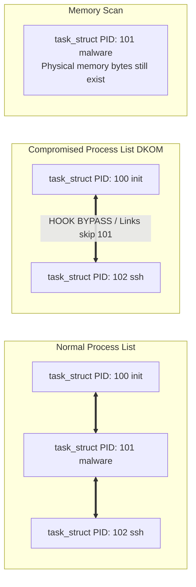

# 11 - Memory Forensics on Linux Volatility Linux Profiles

## 1. Introduction to Linux Memory Forensics

Memory forensics on Linux environments has historically been significantly more complex than on Windows. While Windows maintains a relatively stable, monolithic kernel architecture where major shifts occur predictably with new OS releases, the Linux ecosystem is characterized by an extremely rapid development cycle, infinite customizability, and thousands of distinct kernel builds in the wild at any given moment. This fragmentation directly impacts the ability of forensic investigators to parse physical memory reliably.

When analyzing a physical memory dump, raw bytes mean nothing without a structured map. In Windows, Volatility and similar frameworks rely on standardized PDB (Program Database) files or pre-built KDBG signatures. In Linux, every compilation of the kernel results in memory structures (such as `task_struct`, `mm_struct`, `vm_area_struct`) having slightly different offsets. The exact byte offset to find a process's PID, name, or memory layout shifts depending on the GCC version, kernel config flags (like `CONFIG_PREEMPT`, `CONFIG_DEBUG_INFO`), and patches applied by distribution maintainers. 

This necessitates the concept of "Profiles" in Volatility 2, or "ISF" (Intermediate Symbol Format) in Volatility 3, effectively providing the forensic engine with a Rosetta Stone for the precise kernel variant present on the compromised machine.

## 2. The Mechanics of Linux Volatility Profiles (Vol2)

In Volatility 2, a Linux profile is essentially a zipped archive containing two critical components:
1. `module.dwarf`: A DWARF-formatted file containing the exact layout, sizes, and offsets of all C structures in the kernel.
2. `System.map`: A text file containing the absolute virtual memory addresses of all exported kernel symbols (functions and global variables).

### 2.1 Building a Volatility 2 Profile

To analyze a suspect Linux machine, the investigator traditionally needs to acquire or build a matching profile. If the exact kernel version is known (e.g., `5.4.0-72-generic`), the process involves:

```bash
# 1. Obtain the exact kernel headers or source for the target system.
sudo apt-get install linux-headers-5.4.0-72-generic

# 2. Compile the dwarfdump module (provided by Volatility tools).
cd volatility/tools/linux
make -C /lib/modules/5.4.0-72-generic/build CONFIG_DEBUG_INFO=y M=$PWD modules

# 3. Combine the resulting module.dwarf with the system's System.map.
zip Ubuntu_5.4.0-72_generic.zip module.dwarf /boot/System.map-5.4.0-72-generic

# 4. Move the zip to Volatility's profile directory.
mv Ubuntu_5.4.0-72_generic.zip volatility/plugins/overlays/linux/
```

Once loaded, Volatility can parse the `task_struct` linked list. The `init_task` symbol provides the root of the process tree, and the `tasks` member (a `list_head` struct) is traversed to enumerate active processes.

## 3. Transition to Volatility 3 and ISF (Intermediate Symbol Format)

Volatility 3 revolutionized Linux memory forensics by moving away from monolithic, manually-compiled profiles to JSON-based ISF files. ISF uses the DWARF debugging information (often extracted directly from debug kernel packages, `vmlinux-dbgsym`) to generate a highly portable JSON representation of the kernel's ABI.

### 3.1 Benefits of ISF
- **Speed:** ISF files are faster to parse.
- **Portability:** No need to compile a kernel module on a potentially compromised or mismatched system.
- **Symbol Matching:** Volatility 3 uses an auto-detection mechanism (`banner` strings) in memory to automatically download or match the correct ISF file from a central repository.

```json
// Example snippet of an ISF mapping for task_struct
{
  "structures": {
    "task_struct": {
      "size": 6592,
      "fields": {
        "state": ["int", 0],
        "stack": ["pointer", 8],
        "usage": ["atomic_t", 16],
        "flags": ["unsigned int", 20],
        "ptrace": ["unsigned int", 24],
        "pid": ["pid_t", 1208],
        "tgid": ["pid_t", 1212],
        "real_parent": ["pointer", 1224],
        "parent": ["pointer", 1232],
        "tasks": ["list_head", 840],
        "comm": ["array", 1680]
      }
    }
  }
}
```

## 4. Deep Dive into Kernel Data Structures

Understanding Linux memory forensics requires deep familiarity with kernel data structures. Advanced malware, especially LKMs (Loadable Kernel Modules) or eBPF-based rootkits, manipulate these structures to hide their presence.

### 4.1 `task_struct` and Process Hiding
The fundamental unit of execution in Linux is represented by the `task_struct`. Processes are linked together in a doubly-linked list via the `tasks` member. 

**Rootkit Tactic:** Direct Kernel Object Manipulation (DKOM). An LKM rootkit can unlink a malicious process from this doubly-linked list.
```c
// LKM unlinking code
struct list_head *prev = current->tasks.prev;
struct list_head *next = current->tasks.next;
prev->next = next;
next->prev = prev;
```
Standard tools like `ps` or Volatility's `linux.pslist` rely on traversing this list. Once unlinked, the process is "hidden" from standard enumeration but remains schedulable by the CPU because the scheduler uses runqueues, not the `tasks` list.

**Forensic Countermeasure:** Volatility's `linux.psscan` circumvents this by scanning raw memory for `task_struct` signatures rather than trusting the linked list. However, because `task_struct` lacks a magic header byte in Linux (unlike `_EPROCESS` in Windows), `psscan` relies on heuristic validations of the struct's fields (e.g., verifying pointer validity, sensible PID bounds, and valid process names).

### 4.2 Network Connections: `socket` and `sock` structs
Network artifacts are found by examining open file descriptors within a `task_struct`. 
1. `task_struct` -> `files_struct`
2. `files_struct` -> `fd_array`
3. Identify file descriptors pointing to a `socket` struct.
4. `socket` -> `sock` (which contains source/destination IPs and ports, state of the TCP connection).

LKMs hiding network connections often hook `tcp4_seq_show` in the `/proc/net/tcp` sequence operations. Memory forensics ignores the `/proc` filesystem and directly queries the networking structs in kernel memory, defeating superficial user-space hiding.

## 5. Architectural Diagram: Process Hiding via DKOM



## 6. Real-World Attack Scenario

### 6.1 The Breach
An APT group compromises a web server via a zero-day in an Apache module. They escalate privileges using a local kernel exploit (e.g., DirtyPipe) and drop a custom Loadable Kernel Module (LKM) rootkit named `Diamorphine_Mod`. 

### 6.2 The Rootkit Mechanics
The rootkit modifies the `sys_call_table` to hook `sys_getdents64`, hiding its own files on disk. It also uses DKOM to unlink its reverse shell (`sh` process) from the `task_struct` list. Furthermore, it intercepts network traffic via Netfilter hooks to suppress any output of its C2 connections from `netstat`.

### 6.3 The Incident Response
The IR team notices strange network beaconing from the firewall but `netstat` and `ps` on the host show absolutely nothing. Suspecting a kernel rootkit, they capture physical memory using `LiME` (Linux Memory Extractor).

```bash
insmod lime.ko "path=/tmp/memdump.lime format=lime"
```

They pull the dump to an analysis workstation. They use Volatility 3 with the appropriate ISF profile for the Ubuntu server.

```bash
# First, they run a standard process list. The malware is hidden.
vol -f memdump.lime linux.pslist

# Next, they run a memory scan. The DKOM is exposed.
vol -f memdump.lime linux.psscan | grep "sh"

# Output reveals the hidden shell:
# 0xffff88810b4a8000   1337   100    sh

# They analyze the hidden process's memory space and network connections:
vol -f memdump.lime linux.lsof --pid 1337
vol -f memdump.lime linux.netstat | grep 1337
```
Volatility successfully parses the raw `sock` structures, revealing an ESTABLISHED connection to a Russian IP address on port 443. The IR team then uses `linux.elfs` and `linux.malfind` to dump the injected code and the rootkit LKM itself directly from memory for reverse engineering.

## 7. Extended Technical Appendix: Overcoming Limitations

### 7.1 Vtypes Customization
One major hurdle in Linux memory forensics is dealing with heavily customized or patched kernels (like those in AWS AMI instances, Grsecurity patches, or Android kernels) where standard ISF profiles are non-existent.

In these advanced scenarios, forensic analysts must engage in **Vtypes customization**:
- Extracting the `vmlinux` image directly from the memory dump using tools like `vmlinux-to-elf`.
- Reverse-engineering the offsets using IDA Pro or Ghidra.
- Manually constructing the JSON/Vtypes layout.
- Utilizing advanced plugins like `linux.yarascan` to locate specific byte patterns of structures rather than relying strictly on offsets.

### 7.2 Handling eBPF Rootkits
Traditional LKM rootkits are becoming less common due to kernel module signing requirements (Secure Boot / Lockdown mode). The modern paradigm uses eBPF (Extended Berkeley Packet Filter) to manipulate kernel behavior dynamically without loading modules. 
eBPF rootkits can intercept syscalls and alter data structures purely in memory. Volatility 3 has advanced plugins to map and extract eBPF programs.

```bash
# Extracting loaded eBPF programs from memory
vol -f memdump.lime linux.bpf
```

## 8. Comprehensive Linux Memory Forensics Cheat Sheet

For rapid incident response, the following Volatility 3 commands map out the fundamental triage steps when investigating a Linux system:

```bash
# 1. Initial process triage
vol -f dump.raw linux.pslist
vol -f dump.raw linux.pstree

# 2. Detecting DKOM (Direct Kernel Object Manipulation)
vol -f dump.raw linux.psscan

# 3. Investigating Process Environment and Command Lines
vol -f dump.raw linux.cmdline
vol -f dump.raw linux.envars

# 4. Memory Injection and Code Hollowing
vol -f dump.raw linux.malfind
vol -f dump.raw linux.elfs

# 5. Network Connections and Sockets
vol -f dump.raw linux.netstat
vol -f dump.raw linux.sockstat

# 6. Kernel Module Integrity (Hunting for LKMs)
vol -f dump.raw linux.lsmod
vol -f dump.raw linux.check_modules

# 7. Syscall Table Hooking Detection
vol -f dump.raw linux.check_syscall
```

## 9. Case Study: Detailed Analysis of the 'Bvp47' Rootkit

Bvp47 is an advanced Linux backdoor attributed to the Equation Group. In a memory forensics context, Bvp47 is notable for its sophisticated use of hidden kernel threads and encrypted memory payloads. 

When analyzing Bvp47 in memory:
1. **Thread Hijacking:** It does not merely unlink the process; it hijacks legitimate worker threads (e.g., `kworker`). Identifying this requires comparing the `Instruction Pointer (RIP)` of sleeping kernel threads against known good states.
2. **Encrypted Payloads:** The configuration block is stored in kernel heap allocations (`kmalloc`). Memory analysts must use `linux.yarascan` to find the decryption stub, dump the `kmalloc` slab, and manually execute the decryption routine in a sandbox to recover the C2 addresses.
3. **BPF Filters:** It attaches raw BPF filters to network sockets to intercept traffic without relying on Netfilter hooks, rendering `linux.check_afinfo` blind. Analysis requires manual inspection of the `sk_filter` structs attached to the raw sockets.

## 10. Chaining Opportunities
- Extracting the LKM binary from memory can lead directly into [[14 - Analyzing Hypervisor-Level Rootkits Blue Pill]] if the malware attempts lower-level persistence.
- Analyzing the dumped process memory of the web server can pivot to [[12 - Extracting Browser History and Cryptowallets from RAM]] if the compromised host was used by an administrator.
- If the memory dump fails due to rootkit interference, refer to [[13 - Defeating Anti-Forensic and Anti-Dumping Techniques]].

## 11. Related Notes
- [[15 - YARA Scanning over Memory Images]]
- [[Linux Loadable Kernel Modules (LKMs)]]
- [[Direct Kernel Object Manipulation (DKOM)]]
- [[Volatility 3 Framework Architecture]]
- [[LiME Memory Acquisition]]

## 12. Conclusion and Further Reading
Memory forensics on Linux demands a deep understanding of the kernel ABI, data structures, and the volatile nature of process state. The shift from Volatility 2 profiles to Volatility 3 ISF represents a massive leap forward, making analysis more automated and portable. However, as eBPF rootkits and hypervisor-level threats evolve, investigators must continually adapt their tools to inspect structures previously considered immune to manipulation. Analysts should remain vigilant, always cross-referencing disk artifacts with memory structures to identify discrepancies.
