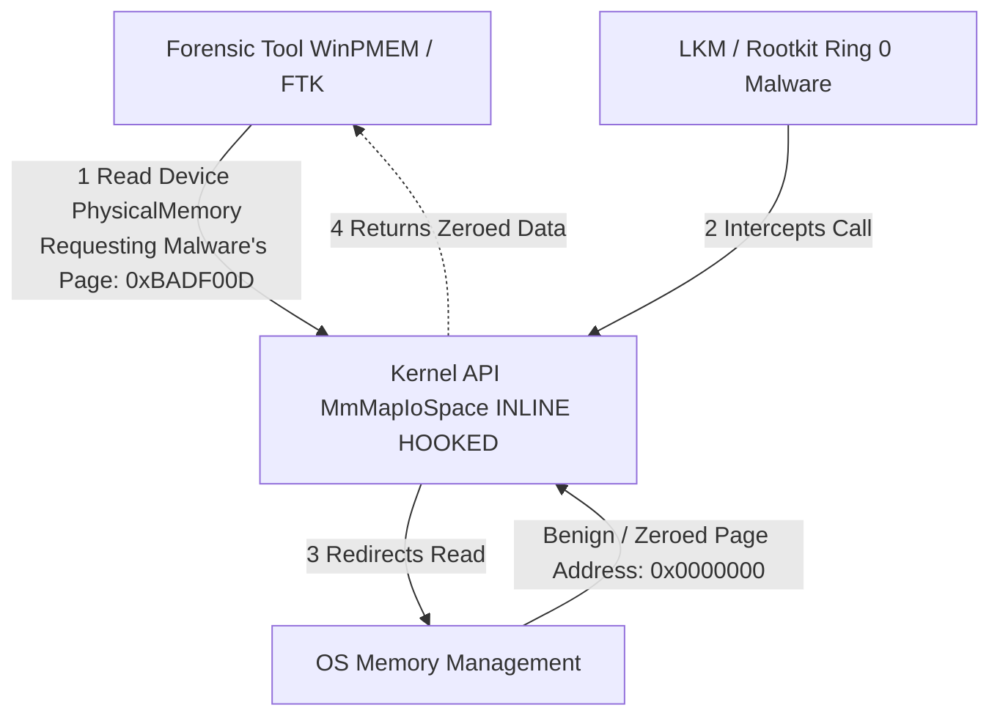

# 13 - Defeating Anti-Forensic and Anti-Dumping Techniques

## 1. Introduction to Memory Anti-Forensics

As memory forensics has matured into a standard incident response capability, malware authors and APT (Advanced Persistent Threat) groups have evolved sophisticated countermeasures. Anti-forensics in the context of memory analysis refers to techniques designed to prevent the reliable acquisition of physical memory (Anti-Dumping), or to corrupt, obfuscate, and hide critical data structures within memory so that analysis tools like Volatility or Rekall fail to parse them correctly.

A successful anti-forensic technique forces the investigator into a state of "blindness" where the integrity of the captured memory is completely compromised, leading to false negatives (missing the malware) or false positives (wasting time on decoy artifacts).

## 2. Anti-Dumping Techniques

Anti-Dumping aims to stop the forensic investigator from acquiring the `.raw` memory file in the first place. Memory acquisition tools (like DumpIt, FTK Imager, WinPMEM on Windows, or LiME on Linux) rely on loading a signed kernel driver to read physical memory directly via `\Device\PhysicalMemory` or specific kernel APIs.

### 2.1 Hooking Memory Acquisition APIs

Advanced malware operating at Ring 0 (Kernel level) can intercept the very functions that memory dumpers use. 

For instance, Windows dumpers often use `MmGetPhysicalAddress` and `MmMapIoSpace` to read memory pages. A rootkit can place an inline hook on these functions.
When the dumper requests the physical address of a memory page known to contain the malware's malicious code, the hooked function intercepts the call and instead returns the address of a benign, zeroed-out memory page. The resulting memory dump successfully completes, but the malware is "airbrushed" out of the resulting image.

### 2.2 Subverting the Physical Memory Device
Historically, user-space applications could read `\Device\PhysicalMemory`. This has been heavily restricted, requiring drivers. Malware can manipulate the Object Directory in the kernel to unlink or rename `\Device\PhysicalMemory`, causing standard tools to fail during initialization.

### 2.3 Direct Kernel Object Manipulation (DKOM) against Dumpers
Malware can actively monitor the system for the loading of known forensic drivers (e.g., `winpmem.sys`). Once detected, the malware can use DKOM to strip the privileges of the dumper process, unload the driver forcefully, or even trigger a Blue Screen of Death (BSOD) via `KeBugCheckEx` to destroy volatile evidence before it can be completely written to disk.

## 3. Anti-Forensic Techniques (Post-Acquisition)

If the memory is successfully dumped, the malware relies on confusing the analysis framework.

### 3.1 Memory Smudging and Header Wiping
Volatility relies heavily on structural signatures. In Windows, executable files in memory (PE files) start with the `MZ` and `PE` headers. 
Advanced reflective DLL injection and process hollowing techniques explicitly overwrite the `MZ` header with null bytes (`0x00`) after the payload is loaded. 
This is known as "Header Wiping." When Volatility's `malfind` or `psinject` plugins scan for injected executables, they look for `PAGE_EXECUTE_READWRITE` memory containing an `MZ` header. Without the header, the heuristic fails.

```c
// Example of Header Wiping in C
PVOID BaseAddress = ...; // Address of injected DLL
DWORD OldProtect;
VirtualProtect(BaseAddress, 4096, PAGE_EXECUTE_READWRITE, &OldProtect);
memset(BaseAddress, 0, 4096); // Wipe the entire PE header
```

### 3.2 Manipulating VAD Trees
The Virtual Address Descriptor (VAD) tree manages the memory space of a process. Volatility uses the VAD to determine if a memory region is mapped to a file on disk or is privately allocated (which is highly suspicious for executable code).
Rootkits can manipulate the VAD nodes (DKOM) to change the `Protection` flags. For example, changing a VAD node from `PAGE_EXECUTE_READWRITE` to `PAGE_READONLY` specifically to evade `malfind`, while keeping the actual Page Table Entries (PTEs) executable at the hardware level.

## 4. Defeating Anti-Forensics: Hardware-Based Acquisition

When software-based acquisition is subverted, investigators must drop to a lower level: Hardware.

### 4.1 DMA (Direct Memory Access) and PCIe
Hardware-based memory acquisition leverages DMA over interfaces like PCIe or Thunderbolt. A hardware device (like a PCIe screamer or specific Thunderbolt forensic interfaces) is plugged into the target machine.
Because DMA allows peripheral devices to read physical memory directly, bypassing the CPU and the Operating System's kernel entirely, software-based hooks and rootkits cannot intercept the read operations. The hardware pulls the raw electrical state of the RAM chips.

**Countermeasure to DMA:** Modern systems employ IOMMU (Input-Output Memory Management Unit) and VT-d to restrict DMA. An OS with Virtualization-Based Security (VBS) can block unauthorized PCIe devices from reading memory. Defeating this requires specialized boot-level attacks or exploiting flaws in IOMMU configuration.

## 5. Architectural Diagram: Anti-Dumping Hooking



## 6. Real-World Attack Scenario

### 6.1 The Breach
A state-sponsored actor deploys a sophisticated espionage platform into a critical infrastructure network. The malware runs exclusively in memory (fileless) and utilizes a custom kernel driver to establish stealth.

### 6.2 The Anti-Forensic Deployment
The malware monitors process creation via `PsSetCreateProcessNotifyRoutine`. When it detects the execution of `DumpIt.exe` or `winpmem.exe`, it immediately initiates its anti-dumping protocol. It hooks `MmGetPhysicalAddress`. Furthermore, it traverses its own VAD tree and unlinks the nodes corresponding to its injected payload, making the memory region "invisible" to standard API queries.

### 6.3 The Incident Response
The IR team attempts to use FTK Imager, but the resulting memory dump analyzes cleanly in Volatility. No suspicious processes, no hidden connections.
However, a senior analyst notices that the physical memory size in the dump doesn't match the hardware specifications (a discrepancy caused by the rootkit manipulating memory maps). 

Realizing they are dealing with an advanced rootkit, the team switches to hardware acquisition. They insert a specialized PCIe DMA tool into an available slot on the server motherboard. The DMA tool bypasses the hooked kernel APIs and pulls a pristine, unaltered copy of physical memory.

```bash
# Analyzing the DMA dump using custom plugins that ignore the VAD
vol -f dma_dump.raw windows.hollowfind
vol -f dma_dump.raw windows.pooltracker --tag "Thre"
```
By analyzing raw pool tags and scanning physical pages sequentially (ignoring the OS-level structures entirely), Volatility recovers the wiped PE files and the hidden rootkit driver, successfully defeating the anti-forensic measures.

## 7. Extended Analysis: Memory Evasion using Guard Pages
Advanced malware may also employ guard pages to detect analysis. A guard page (`PAGE_GUARD` flag) acts as a tripwire. When any tool (like an EDR memory scanner or a live forensic dumper) reads the page, an exception (`STATUS_GUARD_PAGE_VIOLATION`) is triggered. The malware's custom exception handler catches this, giving the malware immediate awareness that it is being scanned. The malware can then encrypt its sensitive payloads or terminate itself to evade capture.

## 8. Defeating Memory Smudging with Carving
When an attacker wipes the PE header (`MZ`), Volatility's `malfind` breaks. To defeat this, forensic analysts must pivot from structural parsers to raw carving and heuristics:
1. Identify executable memory regions using `windows.vadinfo`.
2. Search for common opcodes associated with compiler prologues (e.g., `55 8B EC` for `push ebp; mov ebp, esp`).
3. Dump the region and reconstruct the PE headers manually using tools like `PEbear` or `CFF Explorer` to allow disassemblers like IDA Pro or Ghidra to analyze the code correctly.

## 9. Detailed Overview of PCIe DMA Screamer Architecture
Hardware extraction using a PCIe Screamer relies on the PCIe bus architecture which, by default, trusts the devices connected to it. A "screamer" is an FPGA (Field-Programmable Gate Array) programmed to impersonate a legitimate PCIe device (like a network card or USB controller). 

Because the Memory Controller Hub (MCH) grants DMA-capable devices direct access to the RAM (to speed up I/O transfers without burdening the CPU), the screamer simply issues TLP (Transaction Layer Packet) read requests to the physical addresses of the RAM. 

The OS Kernel is entirely bypassed. Unless the hardware IOMMU (Input-Output Memory Management Unit) is explicitly configured to block this specific device ID or memory range, the screamer streams the raw electrical contents of the RAM directly over a USB or Thunderbolt cable to the forensic workstation, rendering all Ring-0 software hooks completely useless.

## 10. Advanced Threat Actor Tactics: The 'Sauron' Rootkit
Project Sauron (also known as Strider) represents the pinnacle of anti-forensic capabilities. This APT framework utilized an encrypted Virtual File System (VFS) that existed entirely within physical memory. 
To evade `malfind` and similar plugins, Sauron did not map its executable payload as standard `PAGE_EXECUTE_READWRITE`. Instead, it utilized ROP (Return-Oriented Programming) chains to execute its logic piecemeal from legitimate, unmodified system modules. Furthermore, it manipulated the `MmPfnDatabase` (the Page Frame Number database) to mark its own physical pages as "bad" or "hardware reserved", ensuring that standard memory acquisition tools would skip reading those exact physical pages, resulting in a dump that inherently lacked the malware's core components.

## 11. Chaining Opportunities
- If hardware DMA acquisition is impossible due to hypervisor protections, investigators must understand the hypervisor architecture, leading to [[14 - Analyzing Hypervisor-Level Rootkits Blue Pill]].
- Once the anti-dumping is defeated, extracting payloads often relies on [[15 - YARA Scanning over Memory Images]] to parse the heavily obfuscated raw bytes.
- Recovering data from the bypassed memory dump may lead to extracting credentials via [[12 - Extracting Browser History and Cryptowallets from RAM]].

## 12. Related Notes
- [[Direct Memory Access (DMA) Attacks]]
- [[Direct Kernel Object Manipulation (DKOM)]]
- [[Volatility Framework Advanced Plugins]]
- [[Virtualization-Based Security (VBS) bypasses]]
- [[Windows VAD (Virtual Address Descriptor) Internals]]
