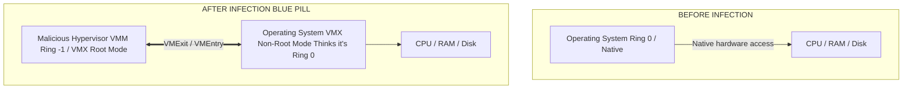

# 14 - Analyzing Hypervisor-Level Rootkits Blue Pill

## 1. Introduction to Hypervisor Rootkits

Traditional rootkits operate at Ring 0 (Kernel mode). While highly privileged, they are still subject to detection by other Ring 0 entities (like EDR drivers) or memory acquisition tools. To achieve ultimate stealth, malware must drop to an even lower architectural level: Ring -1, the Hypervisor tier.

A Hypervisor-Level Rootkit (or Hardware Virtualization Machine - HVM Rootkit) leverages CPU virtualization extensions (Intel VT-x or AMD-V) to silently slide a thin, malicious hypervisor underneath a running operating system. The targeted OS is essentially "lifted" into a virtual machine on the fly, without the user or the kernel ever knowing. Once installed, the hypervisor controls all hardware access, memory mappings, and CPU instruction executions of the guest OS.

## 2. The Blue Pill Concept

First demonstrated by Joanna Rutkowska in 2006, the "Blue Pill" attack fundamentally changed the threat landscape. The core concept is that a running OS (even a perfectly clean, secure one) can be seamlessly transitioned into a Virtual Machine. 

Once the OS is "Blue Pilled," traditional memory forensics running *inside* the OS becomes completely untrustworthy. The hypervisor can intercept reads to physical memory and return falsified data, spoofing an entirely clean system state.

### 2.1 Intel VT-x and VMX Modes
Intel VT-x introduces two new operational modes:
1. **VMX Root Mode:** Where the Hypervisor (VMM - Virtual Machine Monitor) executes. It has absolute control.
2. **VMX Non-Root Mode:** Where the Guest OS executes. It behaves exactly like normal operation, but certain privileged instructions trigger a **VMExit**, pausing the guest and handing control back to the VMM in Root Mode.

To install a Blue Pill rootkit:
1. The malware executes `VMXON` to enter VMX operation.
2. It allocates a VMCS (Virtual Machine Control Structure).
3. It initializes the VMCS with the current state of the running OS (Registers, Instruction Pointers, Segment Selectors).
4. It executes `VMLAUNCH` or `VMRESUME`.
The CPU instantly transitions the running OS into VMX Non-Root Mode. The OS continues executing its next instruction completely unaware of the transition.

## 3. Advanced Evasion: EPT Shadowing

The most potent weapon of a hypervisor rootkit is the Extended Page Table (EPT) or Second Level Address Translation (SLAT). 

The Guest OS manages its own memory via standard Page Tables (translating Guest Virtual Address to Guest Physical Address). However, the hypervisor manages the EPT (translating Guest Physical Address to Host Physical Address). 

**Subversion Tactics:**
The hypervisor can remap the Guest Physical Address. If an EDR or Memory Dumper attempts to read the physical address containing the rootkit's payload, the hypervisor modifies the EPT on-the-fly to point to a clean, zeroed-out physical frame. The EDR reads the memory, hashes it, and finds it perfectly benign. This is structurally identical to anti-dumping techniques described in [[13 - Defeating Anti-Forensic and Anti-Dumping Techniques]], but completely invisible to Ring 0.

## 4. Architectural Diagram: The Blue Pill Transition



## 5. Detecting the Undetectable: Timing and Profiling

Because a hypervisor rootkit operates outside the OS's visibility, standard memory forensics *inside* the OS will fail. Detection requires analyzing the side effects of virtualization.

### 5.1 Timing Attacks (RDTSC Profiling)
Every time a VMExit occurs (e.g., when the OS executes `CPUID` or accessing specific MSRs), the CPU switches to VMX Root Mode, executes hypervisor code, and switches back via VMEntry. This context switch takes thousands of CPU cycles.

By repeatedly calling an instruction that predictably causes a VMExit (like `CPUID`) and measuring the exact execution time using the `RDTSC` (Read Time-Stamp Counter) instruction, an investigator can detect anomalies.
- **Native execution of CPUID:** ~100-200 cycles.
- **Virtualized execution of CPUID:** ~2000-5000 cycles.

### 5.2 TLB (Translation Lookaside Buffer) Profiling
Hypervisor transitions heavily flush or alter the TLB cache. By running specialized code that measures TLB hit/miss rates, forensics tools can detect the hidden presence of a hypervisor actively manipulating memory mappings via EPT.

### 5.3 External Physical Memory Acquisition
The only guaranteed way to analyze a hypervisor rootkit is to pause the physical CPU and dump RAM directly via hardware (e.g., via JTAG or specific BMC/IPMI debugging interfaces). Once acquired, analysts look for:
- Memory structures matching VMCS layouts (which cannot be hidden from raw hardware dumps).
- Hidden regions of physical memory reserved by the hypervisor that do not map to the Guest OS's physical memory layout.

## 6. Real-World Attack Scenario

### 6.1 The Breach
A heavily defended financial institution utilizes advanced EDRs and regular memory scanning. An elite APT group compromises a domain controller. Knowing standard rootkits will trigger alarms, they deploy a custom hypervisor rootkit.

### 6.2 The Hypervisor Installation
The malware drops a kernel driver that initiates VMXON, allocates a VMCS, and seamlessly "Blue Pills" the Windows Server OS. It then manipulates the EPT to hide its own physical memory pages from the Guest OS. The EDR continues functioning perfectly, reporting the system is completely clean.

### 6.3 The Incident Response
A threat hunter notices micro-stutters and anomalous latency in specific network cryptographic operations (which are causing excessive VMExits due to the hypervisor intercepting random number generation instructions).

The hunter deploys a custom profiling tool using `RDTSC` timing analysis and confirms the presence of an unknown hypervisor. Standard software memory acquisition (`winpmem`) is deemed untrustworthy.

```bash
# Simulating the detection of virtualization overhead
./hypervisor_detect_rdtsc --instruction cpuid
Average cycles (Native expected): 150
Average cycles (Measured): 3400
WARNING: Hypervisor detected.
```

The IR team physically accesses the server and uses a PCIe DMA attack device to dump the raw physical memory, bypassing the EPT translations enforced by the malicious hypervisor. By manually carving the raw memory dump using custom YARA rules targeting VMCS structures and Intel VT-x opcodes (`VMLAUNCH`, `VMXON`), they extract the hypervisor payload, analyze its C2 mechanisms, and successfully attribute the attack.

## 7. Extended Forensic Analysis of VMCS

### 7.1 Parsing the VMCS Structure
When a raw physical memory dump is obtained via hardware extraction, forensic analysts must parse the VMCS (Virtual Machine Control Structure). The VMCS is a 4KB memory region that Intel VT-x uses to manage transitions between the host and the guest.
The VMCS contains:
- **Guest-State Area:** The exact CPU register states of the compromised OS at the moment of a VMExit.
- **Host-State Area:** The CPU register states of the malicious hypervisor (including the Instruction Pointer `RIP` pointing to the rootkit's core logic).
- **VM-Execution Control Fields:** Dictates which actions (like executing `CPUID` or writing to specific Control Registers like `CR3`) will cause a VMExit.

By identifying the VMCS in memory (often by scanning for the specific VMX revision identifier), investigators can instantly locate the rootkit's Host-State `RIP`, giving them the exact memory address to begin reverse-engineering the malware's hypervisor engine.

## 8. Intel VT-x Instruction Set Reference for Forensics

When analyzing raw memory dumps for the presence of hypervisor rootkits, analysts often use byte-carving tools to search for the specific machine code opcodes associated with hardware virtualization. Finding these opcodes outside of legitimate hypervisor binaries (like `vmware-vmx.exe` or `vmmem.exe`) is a massive red flag indicating a Blue Pill infection.

- **`VMXON` (Opcode `F3 0F C7 /6`):** Enters VMX operation. This is the very first step of infection.
- **`VMCLEAR` (Opcode `66 0F C7 /6`):** Initializes a VMCS region.
- **`VMPTRLD` (Opcode `0F C7 /6`):** Loads the current VMCS pointer.
- **`VMREAD` (Opcode `0F 78`):** Reads a specified field from the VMCS.
- **`VMWRITE` (Opcode `0F 79`):** Writes a specific field into the VMCS, configuring the VMExit conditions.
- **`VMLAUNCH` (Opcode `0F 01 C2`):** Launches the virtual machine.
- **`VMRESUME` (Opcode `0F 01 C3`):** Resumes execution of the virtual machine after a VMExit has been handled.

Forensic tools like Volatility's `volshell` can disassemble memory regions on the fly. An analyst can dump suspicious non-paged kernel pool allocations and scan the disassembly specifically for `VMLAUNCH` and `VMRESUME` stubs.

## 9. Deep Dive: IOMMU and VT-d Bypass Mechanisms

As mentioned in the detection section, hardware DMA via PCIe screamers is the preferred method for extracting memory from a Blue Pilled machine. However, modern hypervisors (including malicious ones) can configure the IOMMU (Intel VT-d or AMD-Vi) to block DMA requests from external hardware. 

If the malicious hypervisor configures the DMAR (DMA Remapping) tables to restrict all external PCIe slots, the forensic DMA tool will fail to read physical memory, returning `0xFFFFFFFF` for all read attempts.

**Forensic Bypasses to IOMMU Restrictions:**
1. **SMM (System Management Mode) Exploitation:** Dropping below Ring -1 to Ring -2. Injecting forensic payloads via UEFI bootkits that operate in SMM, which executes with higher privileges than the hypervisor and can disable VT-d.
2. **Cold Boot Attacks:** Physically freezing the RAM modules with liquid nitrogen and transferring them to an external reading device, completely bypassing the motherboard's IOMMU hardware enforcement.

## 10. Chaining Opportunities
- If timing attacks detect a hypervisor, and standard dumping fails, analysts must pivot to hardware-based extraction techniques discussed in [[13 - Defeating Anti-Forensic and Anti-Dumping Techniques]].
- Recovered hypervisor binaries must be reverse-engineered or scanned using [[15 - YARA Scanning over Memory Images]].
- To understand how the hypervisor interacts with the hardware, knowledge of low-level architecture is crucial, akin to analyzing deeply embedded Linux kernel manipulations in [[11 - Memory Forensics on Linux Volatility Linux Profiles]].

## 11. Related Notes
- [[Hardware-Assisted Virtualization (Intel VT-x / AMD-V)]]
- [[Extended Page Tables (EPT) and SLAT]]
- [[Timing Attacks in Cryptography and Forensics]]
- [[VMCS (Virtual Machine Control Structure) Forensics]]
- [[Firmware and UEFI Rootkits]]
