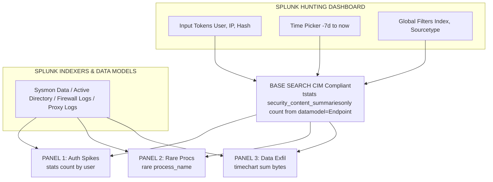

# Building a Hunting Dashboard in Splunk

## 1. Introduction to Threat Hunting Dashboards

In the modern Security Operations Center (SOC), proactive threat hunting is a critical function.
It serves to identify sophisticated adversaries who have successfully bypassed traditional, signature-based automated detection mechanisms.
A SIEM like Splunk is the core engine for this activity, but ad-hoc searching is inefficient for continuous operations.
Building a dedicated Hunting Dashboard in Splunk operationalizes hypothesis-driven hunting.
It aggregates disparate data sources into a unified, interactive visual interface.

A high-quality hunting dashboard moves analysts from reactive alert-chasing into proactive exploration.
By centralizing endpoint telemetry (EDR/Sysmon), network traffic (Zeek/firewalls), and identity logs (Active Directory/Okta), dashboards enable rapid pivoting.
Hunters can start from macroscopic statistical anomalies and drill down to granular, atomic events.

This document explores the architectural principles, Splunk Processing Language (SPL) best practices, visual structures, and performance optimizations necessary to construct an elite threat hunting dashboard.

## 2. Architecture of a Hunting Dashboard

A robust hunting dashboard is meticulously engineered for speed and clarity.
If a dashboard takes ten minutes to load, analysts will abandon it.

### 2.1 The Common Information Model (CIM)
Data normalization is the foundational layer.
Splunk’s CIM ensures that regardless of the underlying technology (e.g., Palo Alto vs. Cisco ASAv), the fields are mapped consistently.
Fields like `src_ip`, `dest_port`, `user`, and `action` must be standard.
Without CIM, queries must account for dozens of disparate field names, making dashboards fragile and complex.

### 2.2 Base Searches and Post-Processing
Elite dashboards avoid redundant I/O operations by utilizing **Base Searches**.
A base search retrieves the foundational dataset for a given time window exactly once.
Multiple downstream visualization panels then apply post-processing commands (e.g., `stats`, `timechart`) to display different facets of the same dataset.

### 2.3 Data Model Acceleration (DMA)
For queries analyzing massive datasets over extended periods (e.g., 30-day beaconing analysis), standard searches are insufficient.
Data Model Acceleration (DMA) and Summary Indexing pre-compute statistical summaries.
This reduces search execution times from minutes to mere seconds.

## 3. ASCII Architecture: Dashboard Data Flow



## 4. Essential Dashboard Panels

A comprehensive hunting dashboard should span various phases of the MITRE ATT&CK framework.

### 4.1 Panel: Authentication Anomalies (Initial Access)
**Rationale:** 
Compromised credentials remain a top attack vector. 
Monitoring for abnormal authentication patterns is critical.
Sudden spikes in failed logins followed by a success indicate Password Spraying or Brute Force.

**SPL Example:**
```splunk
| tstats `security_content_summariesonly` count min(_time) as firstTime max(_time) as lastTime 
  from datamodel=Authentication where Authentication.action=failure 
  by Authentication.user Authentication.src
| `drop_dm_object_name("Authentication")`
| eventstats sum(count) as total_failures by src
| where total_failures > 50 AND count < 3
| stats dc(user) as unique_users_targeted list(user) as users count by src
| where unique_users_targeted > 10
```
*Insight:* This query identifies a single source IP targeting multiple unique users with a low failure rate per user, a classic signature of password spraying.

### 4.2 Panel: Process Execution Anomalies (Execution/Defense Evasion)
**Rationale:** 
Adversaries must execute payloads. 
Tracking Living Off the Land Binaries (LOLBins) like `powershell.exe` or `certutil.exe` with suspicious command-line arguments reveals initial footholds.

**SPL Example:**
```splunk
index=endpoint sourcetype=XmlWinEventLog:Microsoft-Windows-Sysmon/Operational EventCode=1
| eval process_lower=lower(process_name)
| search process_lower="powershell.exe" OR process_lower="cmd.exe"
| regex CommandLine="(?i)(hidden|bypass|-enc|downloadstring|invoke-webrequest)"
| stats count min(_time) as firstTime max(_time) as lastTime 
  by Computer, User, process_name, CommandLine, ParentProcessName
| sort - count
```

### 4.3 Panel: Network Beaconing (Command & Control)
**Rationale:** 
C2 frameworks communicate using patterned, periodic HTTP/DNS requests. 
Identifying consistent interval communication to external entities highlights established backdoors.

**SPL Example:**
```splunk
index=network sourcetype=pan:traffic action=allowed dest_zone=external
| streamstats current=f last(_time) as prev_time by src_ip, dest_ip, dest_port
| eval time_diff = prev_time - _time
| stats count avg(time_diff) as avg_interval stdev(time_diff) as stdev_interval 
  by src_ip, dest_ip, dest_port
| where count > 50 AND stdev_interval < 2.0
| sort stdev_interval
```

## 5. Designing for Interactivity with Tokens

Static dashboards provide limited value. 
True investigative power comes from **Tokens**, which capture user input to drive subsequent queries dynamically.

### 5.1 Drilldown Workflows
If a hunter identifies a suspicious `src_ip` in Panel 1, clicking that IP should automatically populate a "Deep Dive" panel.
This panel will dynamically show all activity associated with that host.

**XML Implementation:**
```xml
<drilldown>
  <set token="tok_src_ip">$click.value2$</set>
</drilldown>
```
Once `tok_src_ip` is set, another panel executes:
```splunk
index=* src_ip=$tok_src_ip$ 
| timechart count by sourcetype
```
This dynamic pivot capability drastically reduces Mean Time to Investigate (MTTI).

## 6. Performance Optimization Strategies

Unoptimized dashboards will strain indexers and ruin the user experience.

1.  **Leverage `tstats`:** 
    `tstats` reads exclusively from TSIDX files (metadata) rather than raw events. 
    It is exceptionally fast and should be the default for volume over time calculations.
2.  **Filter Early, Format Late:** 
    Apply strict `index`, `sourcetype`, and time filters immediately. 
    Postpone expensive commands (`eval`, `rex`, `regex`, `lookup`) until the dataset is reduced.
3.  **Strict Time Boundaries:** 
    Never allow unbounded searches. 
    Utilize `$time.earliest$` and `$time.latest$` global tokens.
4.  **Scheduled Summary Indexing:** 
    For computationally heavy outlier detection, schedule the search to run periodically in the background.
    Write results to a summary index (`index=summary`). 
    The dashboard then quickly queries the summarized data.

## 7. Real-World Attack Scenario

### Scenario: The Stealthy Lateral Mover
An APT group compromises an external web server via a zero-day exploit, dropping a web shell.
They use `certutil.exe` to pull down a Cobalt Strike payload.
The payload beacons every 4 hours to `update.windows-sync[.]com`. 
They then pivot laterally via WMI to an internal database server and begin exfiltrating data over DNS.

### Dashboard Detection Flow
1.  **Initial Access:** 
    The "LOLBins" panel flags `certutil.exe -urlcache -split`. 
    The analyst clicks the affected hostname, setting a dashboard token (`$tok_host$`).
2.  **Execution Lineage:** 
    The "Process Tree" panel, filtering by `$tok_host$`, reveals `w3wp.exe` (IIS) spawning `cmd.exe`.
    This then spawns `certutil.exe`—a definitive indicator of a web shell.
3.  **C2 Beaconing:** 
    The analyst checks the "Network Anomalies" tab. 
    The beaconing panel shows `svchost.exe` connecting to the external domain with a standard deviation of 0.15 on the interval time.
4.  **Lateral Movement:** 
    The "Authentication Spikes" panel highlights the compromised web server.
    It is attempting NTLM authentications across the /24 subnet, successfully landing on the database server.
5.  **Exfiltration:** 
    The "DNS Volume" panel shows a massive spike in TXT queries originating from the database server.
    This confirms the exfiltration channel.

By centralizing these views, the dashboard enabled the analyst to trace the entire attack lifecycle seamlessly.

## 8. Chaining Opportunities

- The foundational elements built here directly rely on complex search commands covered in [[02 - Advanced Splunk Processing Language SPL for Hunts]].
- The network beaconing detection heavily utilizes standard deviation, which is expanded upon in [[03 - Statistical Outlier Detection in Splunk]].
- Understanding dashboard tokens and drilldowns in Splunk translates to similar dashboarding concepts in Kibana, discussed in [[04 - Introduction to Elastic Stack ELK for Threat Hunting]].

## 9. Related Notes

- [[02 - Advanced Splunk Processing Language SPL for Hunts]]
- [[03 - Statistical Outlier Detection in Splunk]]
- [[04 - Introduction to Elastic Stack ELK for Threat Hunting]]
- [[05 - Writing Elastic Query DSL and EQL for Detection]]
- [[Threat Hunting Hypothesis Generation]]
- [[Splunk Common Information Model (CIM) Best Practices]]
