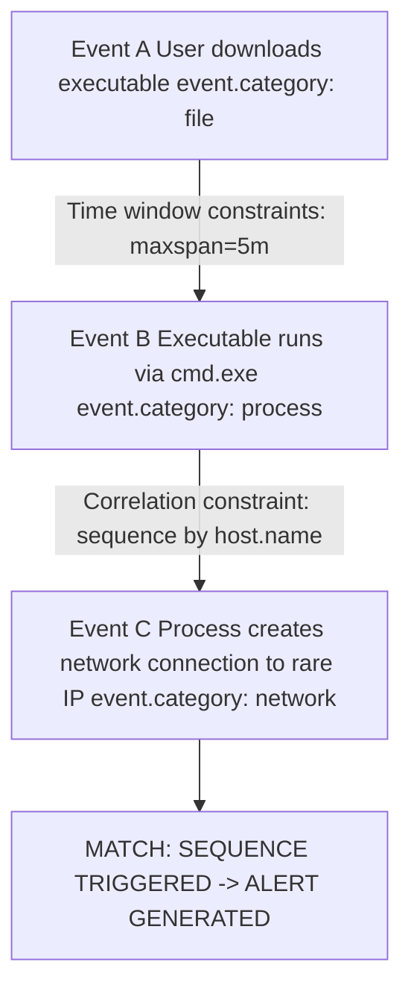

# Writing Elastic Query DSL and EQL for Detection

## 1. Moving Beyond KQL: The Need for Advanced Querying

While Kibana Query Language (KQL) is excellent for rapid, ad-hoc filtering in the Discover tab, it is inherently limited.
KQL cannot perform complex aggregations, calculate statistics, or correlate sequences of events over time.
To build robust, automated detection rules and perform deep-dive threat hunting, analysts must master **Elastic Query DSL (Domain Specific Language)** and the **Event Query Language (EQL)**.

Query DSL provides the raw JSON interface to Elasticsearch's core engine, allowing for profound data manipulation.
EQL is specifically designed for behavioral security use cases, allowing hunters to define stateful sequences of events (e.g., Event A happened, followed by Event B within 5 minutes on the same host).

## 2. Elastic Query DSL

Query DSL is written in JSON. It consists of two main components: **Queries** (filtering the data) and **Aggregations** (calculating statistics on the filtered data).

### 2.1 The `bool` Query
The foundation of almost every complex Query DSL hunt is the `bool` query. It combines multiple query clauses using boolean logic.

-   **`must`:** The clause (query) must appear in matching documents. (Logical AND).
-   **`filter`:** Same as `must`, but it does not score the relevance. It is cached and extremely fast. **Always use `filter` for threat hunting.**
-   **`should`:** At least one of these clauses must appear. (Logical OR).
-   **`must_not`:** The clause must not appear in the matching documents. (Logical NOT).

### 2.2 Term vs. Match
-   **`term`:** Looks for the exact, literal value in a `keyword` field. It does not analyze the text. Ideal for IPs, ports, and precise process names.
-   **`match`:** Analyzes the input and searches `text` fields. Useful for searching within command-line arguments.

**Example DSL Query: Filtering for PowerShell downloading content:**
```json
{
  "query": {
    "bool": {
      "filter": [
        { "term": { "process.name.keyword": "powershell.exe" } },
        { "match": { "process.command_line": "Net.WebClient DownloadString" } },
        { "range": { "@timestamp": { "gte": "now-7d", "lte": "now" } } }
      ],
      "must_not": [
        { "term": { "user.name.keyword": "SYSTEM" } }
      ]
    }
  }
}
```

### 2.3 Aggregations
Aggregations are Elasticsearch's equivalent to Splunk's `stats` command.

-   **Bucket Aggregations:** Group data into buckets (e.g., grouping by `source.ip` or by 1-hour time intervals using `date_histogram`).
-   **Metric Aggregations:** Calculate metrics within those buckets (e.g., `avg`, `sum`, `cardinality` which is distinct count).

**Example DSL Aggregation: Finding unique target ports per source IP (Port Scan Detection):**
```json
{
  "size": 0,
  "aggs": {
    "source_ips": {
      "terms": { "field": "source.ip", "size": 10 },
      "aggs": {
        "unique_ports": {
          "cardinality": { "field": "destination.port" }
        }
      }
    }
  }
}
```

## 3. Event Query Language (EQL)

EQL revolutionized threat hunting in Elasticsearch. 
While Query DSL is powerful for aggregations, it struggles to say "Find Process X spawning Process Y within 30 seconds."
EQL operates on streams of events and looks for specific sequences.

### 3.1 EQL Fundamentals
An EQL query consists of selecting an event category (e.g., `process`, `network`, `file`) and applying filtering logic.

*Basic EQL:*
```eql
process where process.name == "cmd.exe" and user.name == "Administrator"
```

### 3.2 Sequences and State
The true power of EQL is the `sequence` command.

-   **`sequence by`:** Groups the sequence by a specific field (the "tiebreaker"). Usually `host.name` or `process.entity_id`. This ensures you aren't correlating Event A from Host 1 with Event B from Host 2.
-   **`maxspan`:** Defines the maximum allowable time window for the entire sequence to complete.

## 4. ASCII Architecture: EQL State Machine



## 5. Real-World Attack Scenario

### Scenario: PrintNightmare Exploitation and Credential Dumping
An adversary exploits the PrintNightmare vulnerability (CVE-2021-34527). 
The exploitation causes the Windows Print Spooler service (`spoolsv.exe`) to drop a malicious DLL.
Shortly after, `spoolsv.exe` spawns a command shell, which then executes `procdump.exe` to dump the LSASS memory space for credential extraction.

### Detection via EQL Sequence
Detecting this requires observing a specific chain of events occurring in rapid succession on the same host.
A standard SIEM rule might alert on `procdump.exe`, but correlating it back to the Print Spooler provides high-fidelity context.

**EQL Hunt Query:**
```eql
sequence by host.name with maxspan=2m
  [ file where process.name == "spoolsv.exe" and file.extension == "dll" and 
    (file.path : "*\\System32\\spool\\drivers\\x64\\*") ]
  [ process where event.type == "start" and process.parent.name == "spoolsv.exe" and 
    process.name in ("cmd.exe", "powershell.exe") ]
  [ process where event.type == "start" and process.name == "procdump.exe" and 
    process.command_line : "*lsass*" ]
```

**Breakdown of the Sequence:**
1.  **Step 1:** The `spoolsv.exe` process creates a `.dll` file within the spool drivers directory.
2.  **Step 2:** The `spoolsv.exe` process anomalously spawns a command shell (`cmd.exe` or `powershell.exe`).
3.  **Step 3:** The newly spawned shell process executes `procdump.exe` targeting `lsass`.
4.  **Constraints:** All three events must happen on the same `host.name` within a strict `2m` (2 minute) window.

If this sequence completes, Elasticsearch immediately triggers a high-severity alert. EQL successfully mapped the attacker's behavioral state machine.

## 6. Optimization and Tuning

-   **Use `tiebreakers` correctly:** Always use `sequence by host.name` or `user.name`. Failing to do so will result in massive false positives across the environment.
-   **Keep `maxspan` tight:** Do not set a maxspan of `24h` unless absolutely necessary. Long state tracking consumes massive amounts of RAM on the Elasticsearch JVM heap.
-   **Filter aggressively in Step 1:** The first step of a sequence defines how many parallel state machines Elasticsearch must track. Make Step 1 as specific as possible.

## 7. Chaining Opportunities

- The foundational knowledge of ELK architecture and ECS mapping from [[04 - Introduction to Elastic Stack ELK for Threat Hunting]] is mandatory before writing EQL.
- The concept of behavioral sequencing in EQL can be mirrored in Splunk using the `transaction` command or `streamstats`, as discussed in [[02 - Advanced Splunk Processing Language SPL for Hunts]].
- Aggregations in Query DSL are the Elastic equivalent of the advanced mathematical models explored in [[03 - Statistical Outlier Detection in Splunk]].

## 8. Related Notes

- [[01 - Building a Hunting Dashboard in Splunk]]
- [[02 - Advanced Splunk Processing Language SPL for Hunts]]
- [[03 - Statistical Outlier Detection in Splunk]]
- [[04 - Introduction to Elastic Stack ELK for Threat Hunting]]
- [[Elasticsearch JVM Tuning]]
- [[MITRE ATT&CK Mapping with EQL]]
