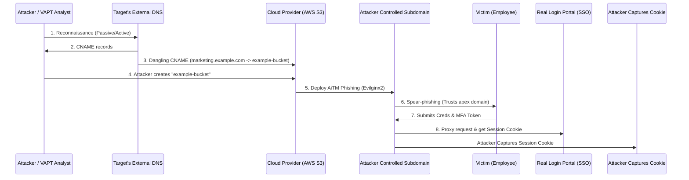

# Vulnerability Chaining: Reconnaissance to Subdomain Takeover to Phishing Campaign

## 1. Introduction and Theoretical Foundation

The combination of advanced reconnaissance, subdomain takeover, and subsequent phishing campaigns represents a sophisticated, multi-staged attack vector. This chain effectively bypasses many traditional perimeter defenses by leveraging trust. Users inherently trust a domain they recognize, making a sub-domain hosted on a trusted apex domain an incredibly potent platform for social engineering.

Subdomain takeover occurs when a DNS record (often a CNAME) points to a service or resource that has been de-provisioned, deleted, or never fully registered. The vulnerability stems from the asymmetrical lifecycle management between DNS administrators and cloud infrastructure administrators.

When an attacker successfully claims the de-provisioned resource (like an S3 bucket, GitHub Pages site, Heroku app, or Azure Traffic Manager), the existing DNS record routes traffic directly to the attacker-controlled asset. This effectively grants the attacker control over content hosted on the victim's subdomain, inheriting the trust and reputational capital of the parent domain.

## 2. Phase 1: Deep Reconnaissance (Passive & Active)

The first step in this chain is exhaustive reconnaissance. The goal is not just to find subdomains, but to map the entire external attack surface and identify the underlying infrastructure for each DNS record.

### 2.1 Passive Enumeration

Passive reconnaissance involves gathering information without interacting directly with the target's infrastructure. This avoids triggering intrusion detection systems (IDS).

*   **Certificate Transparency (CT) Logs:** Services like `crt.sh` or `certspotter` scrape CT logs for SSL/TLS certificates issued to the target domain. This often reveals internal or forgotten subdomains.
    ```bash
    curl -s "https://crt.sh/?q=%25.example.com&output=json" | jq -r '.[].name_value' | sed 's/\*\.//g' | sort -u > passive_subs.txt
    ```
*   **Public Datasets:** Utilizing tools like `Amass` which queries multiple data sources (AlienVault, Censys, Shodan, SecurityTrails).
    ```bash
    amass enum -passive -d example.com -o amass_passive.txt
    ```
*   **Search Engine Dorking:** Leveraging Google, Bing, and DuckDuckGo using operators like `site:example.com -www`.

### 2.2 Active Enumeration

Active reconnaissance involves direct interaction, such as DNS brute-forcing.

*   **DNS Brute-forcing:** Tools like `ffuf`, `gobuster`, or `puredns` use extensive wordlists to guess subdomains.
    ```bash
    puredns bruteforce best-dns-wordlist.txt example.com -r resolvers.txt -w active_subs.txt
    ```
*   **Permutation and Alteration:** Once a base set of subdomains is identified, tools like `altdns` or `gotator` generate permutations (e.g., if `dev.api.example.com` exists, try `stg.api.example.com`).

### 2.3 Infrastructure Mapping

After compiling a comprehensive list of subdomains, the next step is resolving them and identifying the underlying CNAME records and hosting providers.

*   **DNS Resolution:** Tools like `httpx` and `dnsx` are invaluable here.
    ```bash
    cat all_subs.txt | dnsx -a -cname -resp
    ```

## 3. Phase 2: Identifying Dangling DNS Records

A dangling DNS record points to a resource that is available for registration by a third party. Identifying these requires analyzing the CNAME responses and the HTTP behavior of the resolved host.

### 3.1 Signatures of Takeover Vulnerabilities

Different cloud providers exhibit distinct error messages when a resource is unclaimed.
*   **AWS S3:** `404 Not Found` with a specific XML response (`NoSuchBucket`).
*   **GitHub Pages:** `404 File not found` with the GitHub branding.
*   **Heroku:** `No such app` routing error.
*   **Azure:** `404 Web Site not found`.

Automated scanners like `subjack`, `subzy`, or `nuclei` (with takeover templates) match DNS CNAMEs against known vulnerable provider signatures.

```bash
nuclei -l all_subs.txt -t takeovers/
```

### 3.2 Manual Verification

Automated tools produce false positives. Manual verification is critical. If `marketing.example.com` has a CNAME to `example-marketing.s3.amazonaws.com`, and navigating to `http://marketing.example.com` returns the `NoSuchBucket` error, the attacker will attempt to create an S3 bucket named EXACTLY `example-marketing` in the AWS console.

## 4. Phase 3: Executing the Subdomain Takeover

Once a dangling record is verified, the attacker exploits it by provisioning the missing resource.

### 4.1 Claiming the Resource

1.  **Register with Provider:** The attacker signs up for an account with the respective cloud provider (e.g., AWS).
2.  **Provision Resource:** The attacker creates a resource with the exact name referenced in the CNAME record.
3.  **Deploy Content:** The attacker uploads malicious content (or a benign Proof of Concept for bug bounty hunters).

### 4.2 Establishing SSL/TLS

To maximize trust for the subsequent phishing phase, the attacker needs a valid SSL certificate. Since they control the content served at the subdomain, they can easily pass ACME (Let's Encrypt) HTTP-01 challenges.

```bash
certbot certonly --manual --preferred-challenges=http -d marketing.example.com
```

## 5. Phase 4: Setting up the Phishing Infrastructure

With the subdomain secured and HTTPS enabled, the attacker pivots to deploying the phishing campaign. The trust barrier is drastically lowered because the URL visibly belongs to the target organization.

### 5.1 Cloning the Authentication Portal

The attacker clones the target's legitimate login page (e.g., Okta, Microsoft 365, or a custom SSO portal) using tools like `gophish` or `Evilginx2`.

Evilginx2 is particularly dangerous as it acts as an adversary-in-the-middle (AiTM) proxy, allowing the attacker to bypass Multi-Factor Authentication (MFA) by capturing session cookies.

### 5.2 Configuring Evilginx2

1.  **Phishlet Configuration:** The attacker creates or modifies a "phishlet" (a YAML configuration file for Evilginx2) tailored to the target's specific login flow.
2.  **DNS Routing:** In Evilginx2, the attacker binds the captured subdomain (`marketing.example.com`) to the phishlet.
3.  **Proxying Traffic:** When a victim visits the compromised subdomain, Evilginx2 proxies the request to the real login portal, serving the exact same content to the victim, but intercepting credentials and cookies in transit.

## 6. Phase 5: Executing the Phishing Campaign

The final step is luring victims to the compromised subdomain.

*   **Targeted Spear-Phishing:** Sending emails appearing to be from IT or HR, directing employees to the compromised subdomain (e.g., "Please review the new marketing guidelines at `https://marketing.example.com/login`").
*   **Bypassing Email Filters:** Because the link points to a subdomain of the organization's own legitimate domain, traditional email security gateways (SEGs) and domain reputation checks often fail to flag the email as malicious. The domain has high reputation and history.

## 7. Architecture and Attack Flow Diagram



## 8. Defensive Strategies & Remediation

Preventing this exploit chain requires robust lifecycle management and proactive monitoring.

### 8.1 DNS Lifecycle Management

*   **Infrastructure as Code (IaC):** Ensure DNS records are managed alongside cloud infrastructure. When an S3 bucket or Azure app is destroyed, the corresponding DNS record MUST be deleted simultaneously.
*   **Regular Audits:** Implement continuous monitoring of DNS zones. Scripts should regularly resolve all CNAME records and alert on any that point to unregistered resources or return provider-specific error codes (like `NoSuchBucket`).

### 8.2 Defense in Depth

*   **FIDO2 / WebAuthn:** Traditional MFA (SMS, TOTP) is vulnerable to AiTM attacks like Evilginx2. Implementing FIDO2 hardware security keys (e.g., YubiKeys) or WebAuthn provides strong, origin-bound authentication. If the user is on `marketing.example.com`, the FIDO2 token will generate a cryptographic proof for that specific domain, which will fail when forwarded to the real SSO portal (e.g., `login.example.com`).
*   **Zero Trust Architecture:** Do not rely solely on the trust of a domain name. Validate the device state, user identity, and behavioral context for every access request.

## 9. Chaining Opportunities
- **[[04 - XSS CSRF Admin Account Takeover]]**: A compromised subdomain can be used to host malicious scripts, bypassing Same-Origin Policy (SOP) restrictions if CORS is misconfigured to trust all subdomains (`*.example.com`).
- **[[02 - Open Redirect OAuth Token Theft Account Takeover]]**: If the authentication system allows redirects to any subdomain, the compromised subdomain can be used as a valid `redirect_uri` to steal OAuth tokens.

## 10. Related Notes
- [[01 - DNS Enumeration Techniques]]
- [[02 - Cloud Infrastructure Vulnerabilities]]
- [[03 - Phishing Infrastructure Deployment]]
- [[04 - Adversary-in-the-Middle (AiTM) Attacks]]
