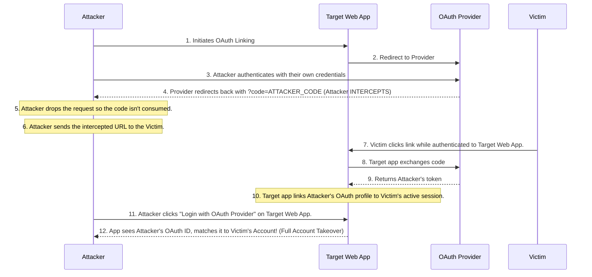

# OAuth State CSRF Account Linking to Account Takeover (ATO)

## Executive Summary
Account Takeover (ATO) via OAuth State Cross-Site Request Forgery (CSRF) is a highly critical vulnerability chain that exploits flawed implementations of the OAuth 2.0 protocol during the account linking process. When a service provider allows users to link third-party accounts (e.g., Google, Facebook, GitHub) to their existing local accounts without properly validating the `state` parameter to prevent CSRF, an attacker can coerce a victim's session into linking the attacker's third-party account. Once linked, the attacker can use their third-party credentials to log in as the victim, achieving full account takeover.

This playbook comprehensively details the mechanics, exploitation phase, detection, and remediation of this severe authorization flaw.

---

## Core Vulnerability Mechanics

### The Role of OAuth 2.0 Account Linking
Many modern web applications support social logins to improve user experience. The flow generally follows these steps:
1. The user initiates the linking process from their profile settings.
2. The application redirects the user to the OAuth provider with a `client_id`, `redirect_uri`, `response_type`, `scope`, and crucially, a `state` parameter.
3. The user authenticates with the provider and grants access.
4. The provider redirects back to the application's `redirect_uri` with an authorization `code` and the `state` parameter.
5. The application verifies the `state`, exchanges the `code` for an access token, and links the provider account to the user's active session.

### The Missing State Parameter Vulnerability
The `state` parameter is an anti-CSRF token specifically designed to bind the OAuth flow to the user's current session. If the application omits the `state` parameter, fails to validate it upon the callback, or uses a predictable value, the flow becomes vulnerable to CSRF. 

An attacker can start the OAuth flow on their own machine, pause at the point where the authorization provider returns the `code` to the `redirect_uri`, and drop the request before their own session consumes it. The attacker then crafts a malicious link containing this valid callback URL (with the attacker's `code`) and tricks the victim into clicking it. If the victim is authenticated to the target application, the application will consume the code, assuming the victim initiated the flow, and link the attacker's social account to the victim's profile.

---

## Attack Flow Architecture



---

## Step-by-Step Exploitation Playbook

### Phase 1: Reconnaissance and Flow Analysis
1. **Identify Account Linking Features**: Register two separate accounts on the target application to understand the baseline behavior. Navigate to profile settings and look for options like "Link your Google Account" or "Connect GitHub".
2. **Proxy Traffic via Burp Suite**: Enable Intercept or carefully review the HTTP history during the linking process.
3. **Analyze the Authorization Request**: Observe the redirection to the OAuth provider.
   ```http
   GET /authorize?client_id=TARGET_ID&redirect_uri=https://target.com/oauth/callback&response_type=code HTTP/1.1
   Host: provider.com
   ```
4. **Check for the `state` Parameter**: Does the request include a `state` parameter? If yes, is it cryptographically secure, unique per session, and validated on the backend? Test by modifying the `state` parameter on the callback to see if the application rejects it.

### Phase 2: Intercepting the Authorization Code
1. **Initiate Linking as Attacker**: Using the attacker's account on the target application, start the account linking process.
2. **Authenticate with Provider**: Log into the third-party OAuth provider using the attacker's credentials and authorize the application.
3. **Intercept the Callback**: Set Burp Suite to intercept responses. When the provider redirects back to the application's callback URL, intercept and **drop** the request.
   ```http
   GET /oauth/callback?code=4/P7q7W91a-oMsCeLvIaQm6bTrgtp7 HTTP/1.1
   Host: target.com
   Cookie: session=attacker_session
   ```
4. **Extract the URL**: Copy the exact URL containing the `code`. Note: Authorization codes are typically short-lived (e.g., 5-10 minutes) and single-use. The exploit must be executed within this window.

### Phase 3: Crafting the CSRF Payload
Since this is a simple GET request, the payload can be a direct link or embedded in an HTML element on an attacker-controlled site to automatically trigger when the victim visits.

**Example HTML Payload:**
```html
<!DOCTYPE html>
<html>
<head>
    <title>Surprise!</title>
</head>
<body>
    <h1>Click here for a surprise!</h1>
    <!-- Hidden iframe to trigger the request automatically -->
    <iframe src="https://target.com/oauth/callback?code=4/P7q7W91a-oMsCeLvIaQm6bTrgtp7" style="display:none;"></iframe>
</body>
</html>
```

### Phase 4: Delivering the Payload and Achieving ATO
1. **Distribute the Payload**: Send the link to the victim via phishing, in-app messaging, or host it on a watering-hole site.
2. **Execution**: The victim visits the page while holding an active, authenticated session on `target.com`. The browser makes the request to the callback URL.
3. **Backend Processing**: `target.com` consumes the attacker's `code`, exchanges it for the attacker's access token from `provider.com`, and links the attacker's OAuth ID to the victim's account.
4. **Takeover**: The attacker navigates to `target.com` and clicks "Login with Provider". The application recognizes the attacker's OAuth identity, which is now bound to the victim's account, and logs the attacker into the victim's profile.

---

## Deep Dive into OAuth and CSRF Context

### Why Does the Application Blindly Link the Account?
In a flawed implementation, the callback endpoint `GET /oauth/callback` relies solely on the user's active session cookie to determine *who* is linking the account. When the victim's browser makes the request to the callback URL, it automatically includes the victim's session cookies. The backend application logic essentially says: "I received a valid authorization code, and the session cookie belongs to Victim. Let's bind this code to Victim." It has no mechanism to verify that the victim was the one who *requested* the code in the first place.

### The Role of the State Parameter
The `state` parameter is intended to prevent this exact scenario. A secure implementation works as follows:
1. When the user clicks "Link Account", the app generates a strong, random token, stores it in the user's session, and includes it in the redirect to the provider (`&state=RANDOM_TOKEN`).
2. The provider includes the same `state` in the callback (`?code=XYZ&state=RANDOM_TOKEN`).
3. The app compares the `state` in the callback to the one stored in the user's session.
4. If an attacker tries to use their code, they cannot provide a `state` that matches the victim's session because they cannot read the victim's session data. Without the correct `state`, the app rejects the request.

---

## Remediation and Defensive Countermeasures

### 1. Implement Strict State Parameter Validation
This is the primary defense against OAuth CSRF.
- Generate a cryptographically secure pseudo-random string (CSPRNG) when initiating the OAuth flow.
- Store this string securely on the server-side, tied strictly to the user's active session.
- Append this string to the `state` parameter in the authorization request to the OAuth provider.
- Upon the callback, strictly verify that the `state` parameter returned matches the value stored in the user's session. If it is missing, mismatched, or empty, abort the process and log a potential security event.

### 2. Require Re-authentication Before Linking
For high-security applications, treat account linking as a highly sensitive action (similar to changing a password). Require the user to re-enter their password or perform multi-factor authentication (MFA) immediately before binding the new third-party identity to the account.

### 3. Implement PKCE (Proof Key for Code Exchange)
While PKCE was originally designed to protect public clients (like mobile apps) from authorization code interception attacks, implementing it universally provides an additional layer of defense by cryptographically binding the authorization code to the specific client instance that initiated the request.

### 4. Review SameSite Cookie Attributes
If the application uses cookies for session management, ensuring that session cookies are set with `SameSite=Lax` or `SameSite=Strict` can prevent the browser from sending session cookies during cross-site requests. This can mitigate the CSRF aspect if the attack is initiated from an external malicious site, though it does not protect against attacks originating from within the same origin (e.g., via an XSS vulnerability).

---

## Chaining Opportunities
- **[[12 - Cross-Site Scripting (XSS) to Session Hijacking]]**: An XSS vulnerability can be used to silently execute the OAuth CSRF payload, bypassing any need for user interaction other than viewing the injected page.
- **[[15 - Open Redirect to Token Exfiltration]]**: If the callback URL is vulnerable to an open redirect, the attacker might steal the victim's authorization code rather than forcing the victim to consume the attacker's code.
- **[[34 - SSRF via OAuth Webhooks]]**: In some setups, manipulating the OAuth flow can lead to Server-Side Request Forgery if the backend blindly requests profile images or data from the linked account URL without validation.

## Related Notes
- [[01 - Introduction to OAuth 2.0 Security]]
- [[04 - CSRF Defense Mechanisms]]
- [[22 - Race Condition Double Spend Financial Fraud]]
- [[19 - Account Takeover Strategies]]
