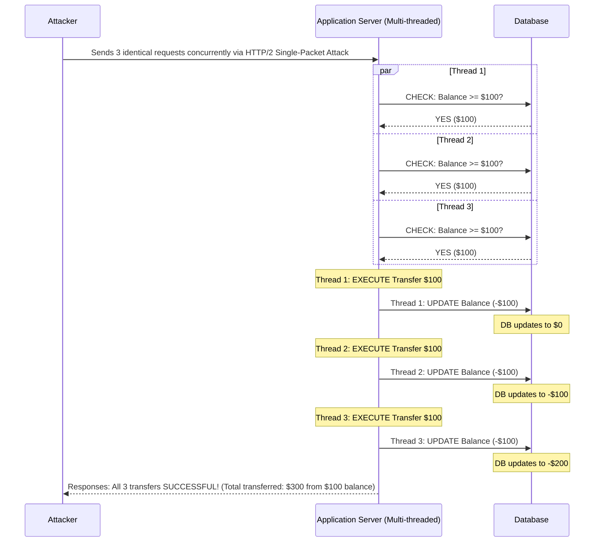

# Race Condition to Double Spend and Financial Fraud

## Executive Summary
Race conditions (specifically Time-of-Check to Time-of-Use, or TOCTOU flaws) in web applications occur when a system processes concurrent requests that access and modify shared resources without proper synchronization or locking mechanisms. In the context of financial or e-commerce applications, race conditions can lead to devastating logic flaws such as "Double Spending," where an attacker simultaneously executes multiple transactions using the same account balance before the system can deduct the funds.

This playbook provides an exhaustive technical breakdown of discovering, exploiting, and mitigating race conditions that lead to financial fraud, emphasizing high-impact multi-threading exploitation techniques.

---

## Core Vulnerability Mechanics

### The Concept of Concurrency and State
Web applications are inherently highly concurrent, designed to handle thousands of simultaneous requests. When an application performs state-modifying operations (like transferring money, redeeming a gift card, or purchasing an item), it typically follows a logical sequence:
1. **Check**: Retrieve the current state (e.g., checking if user balance >= $100).
2. **Execute**: Perform the action (e.g., initialize the transfer).
3. **Update**: Modify the state (e.g., deduct $100 from the user balance).

If an attacker sends dozens of identical requests at the exact same millisecond, the application spins up multiple threads to handle them. Without a locking mechanism (like a database mutex), all threads may execute the "Check" phase simultaneously. 

Since the "Update" phase hasn't occurred yet for any of the threads, every single thread will see that the balance is $100. They will all pass the check, execute the transfer, and subsequently update the balance. The attacker effectively spends their $100 balance multiple times, generating free funds or duplicating inventory items.

### The Attack Window (Race Window)
The vulnerability lives in the temporal gap between the "Check" and the "Update." This is the race window. The goal of the attacker is to pack as many requests as possible into this microscopic timeframe. Modern exploitation relies heavily on HTTP/2 single-packet attacks, which eliminate network jitter and ensure requests arrive precisely simultaneously at the server.

---

## Attack Flow Architecture



---

## Step-by-Step Exploitation Playbook

### Phase 1: Identifying Susceptible Endpoints
Race conditions primarily affect state-changing operations. Focus enumeration efforts on:
- Fund transfers, withdrawals, and deposits.
- Redeeming promo codes, vouchers, or gift cards.
- Purchasing items with limited inventory.
- "Liking" or voting mechanisms.
- Changing account limits or upgrading subscriptions.

### Phase 2: Preparing the Baseline Request
1. Intercept a legitimate transaction using Burp Suite.
2. Ensure you have the necessary preconditions (e.g., exactly $100 in your account, an unredeemed gift card, etc.).
3. Send the request to Burp Repeater and verify it functions correctly when sent normally.
4. Note the expected response for a successful transaction and the expected response for a failed one (e.g., "Insufficient funds").

### Phase 3: Executing the Race via HTTP/2 Single-Packet Attack
Network jitter is the enemy of race condition exploitation. If requests arrive even milliseconds apart, the database has time to lock and update the record. Burp Suite Professional features a specific method to overcome this.
1. Group requests in Burp Repeater: Add the baseline request to a new tab group. Duplicate the request 20-30 times within the same group.
2. In the Repeater interface, click the drop-down next to the "Send" button.
3. Select **"Send group in parallel (single-packet attack)"**. This leverages HTTP/2 multiplexing. The client sends the headers and the beginning of the body for all requests, pausing right before the final byte. Then, it sends the final byte for all requests in a single TCP packet.
4. The server receives the completion signal for all 30 requests at the exact same nanosecond, forcing maximum thread concurrency.

### Phase 4: Analyzing Results
Examine the responses in the group. 
- If the vulnerability does not exist, exactly one request will succeed (HTTP 200/302), and the remaining 29 will fail with a logic error (e.g., "Already redeemed", "Insufficient funds").
- If the vulnerability **does** exist, you will observe multiple requests returning the "Success" response payload.
- Verify the exploitation by checking the backend state: Does your destination account show multiple deposits? Is your account balance severely negative? Were multiple items dispatched?

---

## Deep Dive into Concurrency and Locking Context

### Why Does the Database Not Protect Itself?
Relational databases possess ACID (Atomicity, Consistency, Isolation, Durability) properties, but these do not magically protect against logic flaws. If the application executes the `SELECT` (check) and `UPDATE` (modify) as two separate, non-isolated SQL statements, the database processes them exactly as instructed. 
For example:
```sql
-- Thread A executes
SELECT balance FROM accounts WHERE user_id = 1; (Returns 100)
-- Thread B executes
SELECT balance FROM accounts WHERE user_id = 1; (Returns 100)
-- Thread A executes
UPDATE accounts SET balance = balance - 100 WHERE user_id = 1;
-- Thread B executes
UPDATE accounts SET balance = balance - 100 WHERE user_id = 1;
```
The database executes them sequentially but the logic was already bypassed at the application layer.

### Deadlocks vs. Race Conditions
Sometimes, flooding the server with concurrent requests will result in HTTP 500 Internal Server Error responses. This often indicates a database deadlock, meaning the system *does* have some form of locking, but the rapid influx caused threads to lock resources cyclically, crashing the transaction. While not an exploitable race condition for financial gain, it indicates a potential Denial of Service (DoS) vector.

---

## Remediation and Defensive Countermeasures

### 1. Pessimistic Locking (Database Level)
The most robust defense is to enforce synchronization at the database level using pessimistic locking. 
When performing the "Check", lock the row so no other thread can read or write to it until the transaction is complete.
```sql
BEGIN TRANSACTION;
-- The FOR UPDATE clause locks the row for this specific transaction.
SELECT balance FROM accounts WHERE user_id = 1 FOR UPDATE;
-- Execute logic in application...
UPDATE accounts SET balance = balance - 100 WHERE user_id = 1;
COMMIT;
```
Any concurrent thread attempting to `SELECT ... FOR UPDATE` will be blocked and forced to wait until the first transaction commits and releases the lock.

### 2. Optimistic Locking
Optimistic locking uses a version number or timestamp column in the database.
1. The application reads the row, including the `version`.
2. The application performs logic.
3. The application updates the row, explicitly stipulating that the update should only occur if the version hasn't changed.
```sql
UPDATE accounts SET balance = balance - 100, version = version + 1 WHERE user_id = 1 AND version = 5;
```
If another thread updated the row first, the version will be 6, and the second update will affect 0 rows. The application can then throw an error or retry the transaction.

### 3. Application-Level Mutexes
In scenarios where database locking isn't feasible (e.g., interacting with external third-party APIs), application-level synchronization blocks or Distributed Locks (like Redis Redlock) can ensure only one thread processes a user's request at a time.

---

## Chaining Opportunities
- **[[08 - IDOR to Mass Account Manipulation]]**: Using Insecure Direct Object References in conjunction with race conditions to rapidly drain multiple different accounts simultaneously.
- **[[17 - Rate Limit Bypasses via Concurrency]]**: Race conditions are highly effective at bypassing brute-force protections, OTP verification limits, and generic rate-limiting firewalls.
- **[[21 - OAuth State CSRF Account Linking ATO]]**: Racing the authorization code consumption phase can sometimes lead to unexpected state corruptions in identity providers.

## Related Notes
- [[02 - Database Transaction Security]]
- [[05 - Advanced HTTP Protocol Abuse]]
- [[29 - API Rate Limiting Best Practices]]
- [[33 - Bypassing WAFs with HTTP/2 Multiplexing]]
