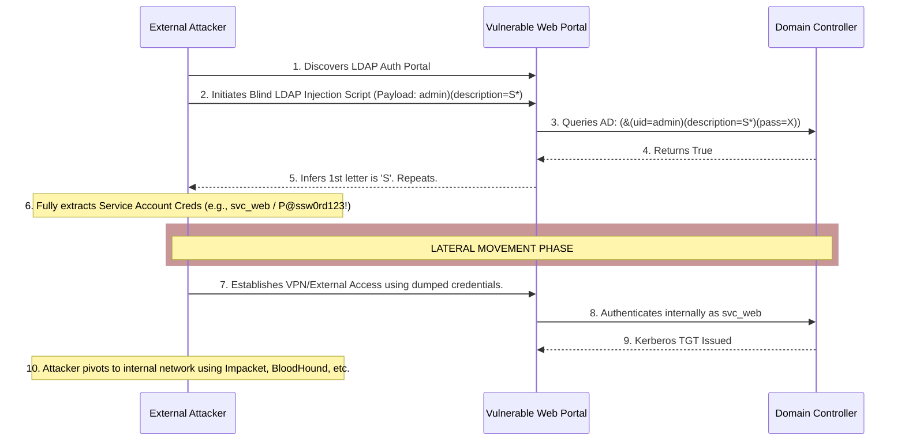

# LDAP Injection to Credential Dump and Lateral Movement

## Executive Summary
Lightweight Directory Access Protocol (LDAP) is the cornerstone of centralized authentication and directory services in enterprise environments, heavily utilized by Active Directory (AD). LDAP Injection occurs when an application unsafely embeds user input into an LDAP query. While less publicized than SQL Injection, LDAP Injection is devastatingly effective because it targets the very system that holds the organization's identities.

This playbook details how an attacker can leverage an unauthenticated external LDAP Injection vulnerability in a web portal to blindly dump directory contents, extract service account credentials or sensitive attributes, and pivot into the internal network to achieve lateral movement.

---

## Core Vulnerability Mechanics

### The Structure of LDAP Queries
LDAP queries use a specific filter syntax composed of attributes, operators, and logical groupings enclosed in parentheses. 
For example, an authentication portal might search for a user attempting to log in with the following query construct:
```ldap
(&(USER_ID=input_username)(PASSWORD=input_password))
```
If the backend application takes `input_username` directly from the web request without sanitization, an attacker can manipulate the query logic. 

### The Injection Vector
If an attacker inputs `admin)(|(objectClass=*)` as the username, the resulting backend query becomes:
```ldap
(&(USER_ID=admin)(|(objectClass=*))(PASSWORD=input_password))
```
Because of the injected closing parenthesis and the OR `|` operator, the query essentially says: "Find an entry where the USER_ID is admin OR the objectClass is anything". The password check is bypassed entirely, often resulting in an authentication bypass.

However, beyond authentication bypass, attackers can use blind injection techniques (similar to Boolean-based Blind SQLi) to ask the server true/false questions about the directory structure, enabling the exfiltration of arbitrary attributes—such as the `userPassword`, `msDS-AllowedToDelegateTo`, or `userPrincipalName`.

---

## Attack Flow Architecture



---

## Step-by-Step Exploitation Playbook

### Phase 1: Identifying the LDAP Injection
1. **Locate Input Vectors**: Identify login pages, employee lookup directories, password reset forms, or any functionality that likely queries a centralized directory.
2. **Fuzzing**: Input LDAP meta-characters: `*`, `(`, `)`, `\`, `&`, `|`.
3. **Observe Responses**:
   - Error-based: Does inserting a single `(` cause an HTTP 500 error, while `()` returns a normal 200 OK or generic failure? This indicates a syntax error in the backend query.
   - Boolean-blind: If `user=admin` results in "Invalid Password", but `user=admin)(|(objectClass=*)` results in a different message or successful login, the application is vulnerable.

### Phase 2: Blind Data Extraction (Credential Dumping)
Extracting data via Blind LDAP Injection is tedious but automatable. The attacker uses wildcards `*` to brute-force attributes character by character.
1. **Targeting Attributes**: The attacker wants to extract passwords or descriptions (which often contain legacy passwords).
   Payload logic: `(&(USER_ID=target_user)(description=a*))`
2. **Scripting the Attack**: The attacker writes a Python script using `requests`.
   ```python
   # Pseudo-code for Blind LDAP Extraction
   charset = 'abcdefghijklmnopqrstuvwxyzABCDEFGHIJKLMNOPQRSTUVWXYZ0123456789!@#$%^&*'
   extracted_data = ''
   for position in range(length):
       for char in charset:
           payload = f"admin)(description={extracted_data}{char}*"
           response = send_request(username=payload, password="Any")
           if "Invalid Password" in response.text: # True condition
               extracted_data += char
               print(f"Found: {extracted_data}")
               break
   ```
3. **Execution**: The script iteratively discovers the description or password hash of high-value targets (e.g., the service account used by the application itself to bind to LDAP).

### Phase 3: Lateral Movement
Once valid domain credentials (or hashes) are extracted, the vulnerability transitions from a web exploit to an infrastructure compromise.
1. **Gain Internal Footprint**: The attacker uses the dumped credentials to log into external-facing services (VPNs, OWA, Citrix) or utilizes an existing web shell (if chained with another vulnerability) to establish a SOCKS proxy into the internal network using tools like Chisel.
2. **Kerberos Authentication**: With internal routing established, the attacker uses tools like `Impacket` (e.g., `secretsdump.py`, `psexec.py`) or `CrackMapExec` with the compromised LDAP service account credentials.
3. **Directory Enumeration**: The attacker runs BloodHound/SharpHound to map the Active Directory environment, identifying paths from the compromised service account to Domain Admin.

---

## Deep Dive into LDAP Context and Defense

### Why are Web Apps Vulnerable?
Many developers are accustomed to parameterized queries in SQL, supported natively by libraries like JDBC, PDO, or SQLAlchemy. However, LDAP APIs in languages like Java (JNDI), C#, or Python (`ldap3`) frequently lack native, built-in parameterization or prepared statement equivalents for search filters. Developers are often forced to construct LDAP filters via string concatenation, inadvertently reintroducing injection vulnerabilities that were solved for SQL decades ago.

### The Dangers of the Bind Account
When a web application queries Active Directory, it must first authenticate itself. It does this using a "Bind Account" (a service account). If the application grants this Bind Account excessive privileges (e.g., making it an administrator to "prevent permission issues"), an LDAP injection allows the attacker to query the directory with the full rights of that high-privileged Bind Account. This exposes attributes like LAPS passwords, sensitive user properties, and group policy objects.

---

## Remediation and Defensive Countermeasures

### 1. Robust Input Validation and Escaping
Since true parameterized queries are rare in LDAP libraries, defense relies on strict escaping.
- Reject any input containing LDAP control characters: `(`, `)`, `\`, `*`, `NUL`.
- If these characters must be supported, escape them using their respective ASCII hex equivalents.
  - `*` becomes `\2a`
  - `(` becomes `\28`
  - `)` becomes `\29`
  - `\` becomes `\5c`
  - `NUL` becomes `\00`
- Implement allow-listing for input formats (e.g., ensuring a username only contains alphanumeric characters).

### 2. Principle of Least Privilege for Bind Accounts
The service account used by the web application to bind to the LDAP server must have the absolute minimum permissions required.
- It should only have `Read` access.
- It should only be able to read specific attributes necessary for authentication (e.g., `sAMAccountName`, `memberOf`).
- It must explicitly be denied access to read sensitive attributes like `userPassword`, `unixUserPassword`, or `ms-Mcs-AdmPwd` (LAPS).

### 3. Implement Strong Auditing and Monitoring
- Enable LDAP query logging on Domain Controllers.
- Monitor for excessive queries containing wildcard operators `*`, which are indicative of blind extraction attempts.
- Utilize SIEM rules to detect high volumes of failed authentications followed by anomalous directory enumeration.

---

## Chaining Opportunities
- **[[23 - Deserialization RCE Persistence via Cron]]**: After gaining a foothold via deserialization, local configuration files often reveal hardcoded LDAP bind credentials, eliminating the need for injection to achieve lateral movement.
- **[[25 - Full Red Team Simulation — Recon to Domain Admin]]**: LDAP injection represents the crucial pivot point from external reconnaissance to internal network dominance.
- **[[11 - XML External Entity (XXE) to Internal Port Scanning]]**: XXE can be used to scan the internal network to locate the LDAP/Active Directory servers before exploiting the injection flaw.

## Related Notes
- [[03 - Active Directory Attack Paths]]
- [[07 - Blind SQL Injection Methodologies]]
- [[20 - Pivoting and Port Forwarding Techniques]]
- [[35 - Impacket Toolkit Deep Dive]]
