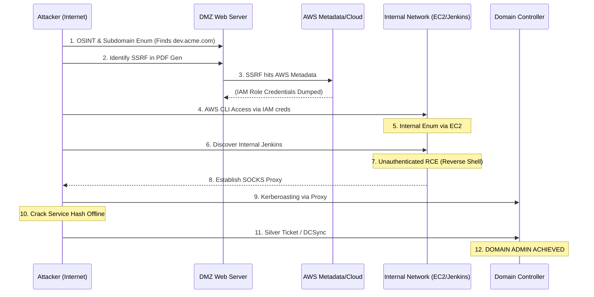

# Full Red Team Simulation — Recon to Domain Admin

## Executive Summary
A full Red Team simulation does not focus on a single vulnerability in isolation; rather, it emulates an Advanced Persistent Threat (APT) by chaining together multiple low, medium, and high-severity flaws across different layers of the technological stack. The ultimate objective is typically total compromise of the target's infrastructure, often represented by achieving "Domain Admin" privileges in an Active Directory environment.

This playbook outlines a comprehensive, multi-stage attack narrative. It demonstrates how external open-source intelligence (OSINT) leads to an initial web foothold, which is then escalated to internal network access, and finally maneuvered through Active Directory misconfigurations to achieve total domain dominance.

---

## The Simulation Scenario

**Target**: Acme Corp (Fictional Entity)
**Objective**: Obtain Domain Admin privileges starting from a zero-knowledge external perspective.
**Rules of Engagement**: Stealth is prioritized. Minimal noisy scanning. Exploit chaining is required.

---

## Attack Flow Architecture



---

## Step-by-Step Exploitation Playbook

### Phase 1: External Reconnaissance & OSINT
1. **Infrastructure Mapping**: The simulation begins with mapping the external attack surface using tools like `Amass`, `Sublist3r`, and `crt.sh` to identify subdomains. 
   - *Finding*: Discovered a forgotten subdomain: `staging-reports.acme.com`.
2. **Application Profiling**: Accessing the staging subdomain reveals a web application used for generating PDF reports from user-supplied URLs.
3. **Tech Stack Identification**: `Wappalyzer` and HTTP response headers indicate the application is running Node.js and hosted on AWS infrastructure.

### Phase 2: Initial Access via SSRF to Cloud Compromise
1. **Testing for SSRF**: The attacker inputs a Burp Collaborator payload into the URL parameter of the PDF generator. A callback is received, confirming Server-Side Request Forgery (SSRF).
2. **Exploiting Cloud Metadata**: Knowing the infrastructure is AWS, the attacker targets the EC2 metadata service (IMDSv1).
   - Payload: `http://169.254.169.254/latest/meta-data/iam/security-credentials/ec2-staging-role`
3. **Credential Extraction**: The SSRF successfully returns the `AccessKeyId`, `SecretAccessKey`, and `Token` for the IAM role attached to the EC2 instance.
4. **Cloud Authentication**: The attacker configures their local AWS CLI with these stolen credentials, gaining authenticated access to the target's AWS environment.

### Phase 3: Lateral Movement & Establishing a Pivot
1. **Internal Network Mapping**: Using the compromised AWS credentials, the attacker queries the EC2 API to describe instances and network interfaces, mapping out the internal VPC subnets.
2. **Accessing Internal Services**: The attacker realizes the compromised EC2 instance has routing access to an internal management subnet.
3. **Exploiting Internal Jenkins**: The attacker finds an internal Jenkins server (`10.0.5.50`) running an outdated, vulnerable version. Using the AWS Systems Manager (SSM) Session Manager (permitted by the compromised IAM role), the attacker drops into a shell on the staging EC2 instance. From there, they execute an exploit against the Jenkins server, achieving Remote Code Execution (RCE) as the `jenkins` user.
4. **Establishing a Proxy**: To comfortably interact with the internal network from their external machine, the attacker uploads `Chisel` to the Jenkins server and establishes a reverse SOCKS5 proxy back to their C2 infrastructure.

### Phase 4: Active Directory Escalation to Domain Admin
Now operating seamlessly inside the internal network via proxychains, the attacker shifts focus to Active Directory.
1. **BloodHound Enumeration**: The attacker executes `SharpHound` through the proxy (or via the Jenkins shell) to map AD attack paths. The analysis reveals that the `jenkins` service account is a member of a group that has generic read access to the domain.
2. **Kerberoasting**: The attacker uses `Impacket's GetUserSPNs.py` through the proxy to request Kerberos Service Ticket Granting Tickets (TGS) for accounts with Service Principal Names (SPNs).
   ```bash
   proxychains python3 GetUserSPNs.py acme.local/jenkins:password -request
   ```
3. **Offline Cracking**: A ticket for a highly privileged SQL service account (`svc_sql_admin`) is extracted. The attacker cracks the ticket offline using Hashcat and `rockyou.txt`, recovering the plaintext password.
4. **DCSync Attack**: The BloodHound data shows that `svc_sql_admin` is a member of the `Domain Admins` group. Using the cracked password, the attacker uses `Impacket's secretsdump.py` to perform a DCSync attack, simulating a Domain Controller and requesting the replication of all password hashes in the domain, including the `krbtgt` account.
   ```bash
   proxychains python3 secretsdump.py acme.local/svc_sql_admin:'CrackedPass123'@10.0.10.5
   ```
5. **Golden Ticket & Total Control**: With the `krbtgt` hash, the attacker can forge Golden Tickets, granting them persistent, undetectable Domain Admin access across the entire enterprise, concluding the simulation.

---

## Deep Dive into Chaining Mechanics

### Why Single Vulnerabilities Rarely Lead to Domain Admin
Modern networks are heavily segmented. A single SQL injection might compromise a web database, but firewalls and network access control lists (NACLs) prevent that web server from communicating directly with Domain Controllers. 
Red Teaming is the art of bypassing these boundaries. In this simulation, SSRF bridged the gap between the internet and the cloud control plane. Cloud IAM misconfigurations bridged the gap between isolated AWS accounts and the internal corporate network. Active Directory feature abuse (Kerberoasting) bridged the gap between a low-privileged service account and Domain Admin.

### The Role of OpSec (Operational Security)
Throughout this chain, a real threat actor would focus heavily on OpSec to avoid triggering Endpoint Detection and Response (EDR) or Security Information and Event Management (SIEM) alerts.
- **Living off the Land (LotL)**: Using built-in tools (like AWS SSM) instead of dropping malicious binaries.
- **Offline Cracking**: Pulling Kerberos tickets and cracking them offline generates zero network noise compared to online brute-forcing.
- **Proxying**: Routing traffic through internal, trusted hosts makes network anomalies harder for defenders to spot.

---

## Remediation and Defensive Countermeasures

### Defending Phase 1 & 2 (External & Cloud)
- **Asset Management**: Maintain strict inventory of subdomains. Decommission unused staging environments.
- **SSRF Prevention**: Enforce strict allow-lists for URL parsing. Upgrade AWS EC2 instances to use IMDSv2, which requires session tokens and neutralizes most SSRF-to-metadata attacks.
- **IAM Least Privilege**: Ensure EC2 IAM roles only possess the exact permissions required. They should not have broad `ssm:StartSession` access unless explicitly needed.

### Defending Phase 3 & 4 (Internal & Active Directory)
- **Network Segmentation**: Internal CI/CD pipelines (Jenkins) should not be reachable from DMZ or staging environments without strict firewall rules.
- **Patch Management**: Keep internal systems as rigorously patched as external ones.
- **Password Policies & Managed Service Accounts**: Protect against Kerberoasting by using Group Managed Service Accounts (gMSA) which have 120-character rotating passwords that cannot be cracked offline.
- **Tiered Administration**: Implement an Active Directory Tier Model. Domain Admins should only log into Tier 0 assets (Domain Controllers). Service accounts (Tier 1/2) should never have Domain Admin privileges.

---

## Chaining Opportunities
- **[[06 - Server-Side Request Forgery to Internal Network Exploitation]]**: The entry point for this entire campaign.
- **[[24 - LDAP Injection Credential Dump Lateral Movement]]**: An alternative method to phase 3, utilizing LDAP rather than an RCE exploit.
- **[[37 - Active Directory Persistence Mechanisms]]**: What happens *after* Phase 4 to ensure the Red Team maintains access even if passwords are reset.

## Related Notes
- [[10 - Advanced OSINT Methodologies]]
- [[20 - Pivoting and Port Forwarding Techniques]]
- [[26 - Bypassing EDR with Living off the Land Binaries]]
- [[42 - Kerberos Protocol Deep Dive]]
