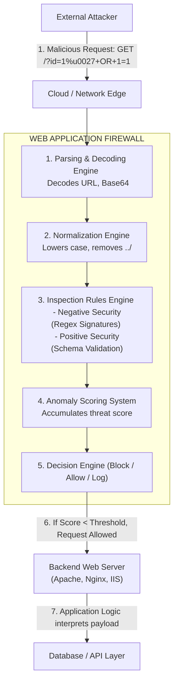

# What is a Web Application Firewall (WAF) and How It Works

## 1. Introduction to WAF Architecture
A Web Application Firewall (WAF) is a specialized security control designed to monitor, filter, and mitigate malicious HTTP/HTTPS traffic between a web application and the internet. Unlike traditional network firewalls that operate at Layer 3 (Network) and Layer 4 (Transport) of the OSI model, WAFs operate specifically at Layer 7 (Application). This positioning allows them to perform deep packet inspection of the application payloads, such as HTTP headers, cookies, query string parameters, and POST body data.

The core purpose of a WAF is to defend against the most common and devastating web application vulnerabilities, including SQL Injection (SQLi), Cross-Site Scripting (XSS), Local File Inclusion (LFI), Remote Code Execution (RCE), and other attacks listed in the OWASP Top 10. By sitting in front of the web application, the WAF acts as an active shield, providing a mechanism known as "virtual patching." This allows security teams to mitigate vulnerabilities in the underlying application code instantly without requiring immediate source code modifications or deployment cycles.

However, WAFs are not infallible silver bullets. They rely on complex logic, normalization engines, and regular expressions to differentiate between legitimate user traffic and malicious exploit attempts. This logic is inherently flawed due to the "Impedance Mismatch" problem—a scenario where the WAF and the backend application interpret the exact same HTTP request differently. Attackers actively exploit these parsing differences to bypass the WAF and deliver malicious payloads directly to the vulnerable application logic.

## 2. WAF Deployment Models
WAFs can be deployed using several distinct network architectures. The chosen deployment model significantly impacts the WAF's visibility, latency, failover capabilities, and susceptibility to certain bypass techniques.

### 2.1 Reverse Proxy (Inline)
This is the most common deployment model. The WAF sits directly inline between the client and the backend web server. All traffic must mathematically pass through the WAF. The WAF terminates the client's TCP/TLS connection, inspects the HTTP request, and if deemed safe, establishes a new connection to the backend server to forward the request.
- **Advantages:** Provides full visibility and absolute control over the traffic flow. Can easily modify requests and block malicious traffic before it reaches the backend.
- **Disadvantages:** Introduces network latency due to dual TLS termination and processing overhead. Acts as a single point of failure (SPOF) if high availability (HA) is not configured properly.
- **Bypass Context:** Attackers know the WAF sees exactly what the backend sees (in theory), but HTTP Desync (Request Smuggling) attacks can still exploit parsing differences between the proxy and the backend.

### 2.2 Transparent Proxy
Similar to a reverse proxy, but the WAF does not modify IP addresses or act as a visible network hop. It sits transparently on the network layer, often implemented via bridge mode.
- **Advantages:** Easier to deploy into existing network topologies without changing DNS records, routing configurations, or backend server logs (since the original client IP is preserved natively).
- **Disadvantages:** Complex underlying network configuration is required, often involving policy-based routing (PBR). Troubleshooting routing loops can be difficult.

### 2.3 Out-of-Band (Passive / Sniffing / TAP)
In this model, the WAF is not inline. Instead, it receives a copy of the network traffic via a SPAN port, port mirror, or network TAP. When the WAF detects an attack, it attempts to drop the connection asynchronously by injecting TCP RST (Reset) packets to both the client and the server.
- **Advantages:** Zero latency impact on production traffic. If the WAF goes offline, application traffic is completely unaffected.
- **Disadvantages:** Highly susceptible to "race condition" bypasses. If the backend web server processes the malicious payload and executes the vulnerability faster than the WAF can generate and deliver the TCP RST packet, the attack will succeed despite being detected.

### 2.4 Cloud-Based WAF (Edge Deployment)
Hosted and managed by third-party providers (e.g., Cloudflare, AWS WAF, Akamai). The domain's DNS is pointed to the provider's infrastructure, routing all global traffic through their edge network before it reaches the origin server.
- **Advantages:** Extremely easy to deploy. Highly scalable. Often bundled with DDoS protection, CDN caching, and bot management features.
- **Disadvantages:** "Origin Discovery" attacks can completely render the WAF useless. If an attacker discovers the direct IP address of the origin backend server, they can send traffic directly to it, bypassing the Cloud WAF entirely.

### 2.5 Host-Based WAF
Software installed directly on the web server itself (e.g., ModSecurity integrated as an Apache module or Nginx dynamic module).
- **Advantages:** Deep integration with the web server. Can inspect traffic after SSL termination natively without complex external certificate management. Minimal network latency.
- **Disadvantages:** Consumes local server resources (CPU/RAM). If the server is compromised or goes down, the WAF is defeated. Difficult to manage across large, distributed server fleets.

## 3. Security Models: Positive vs. Negative
WAFs typically employ a combination of two primary security philosophies to determine what traffic is allowed.

### 3.1 Negative Security Model (Blocklisting)
This model operates on the principle of "allow everything by default, block known bad." The WAF maintains a massive database of signatures, regular expressions, and heuristics matching known attack patterns (e.g., `SELECT * FROM`, ``, `/etc/passwd`).
- **How it works:** Incoming requests are compared against the signature database. If a match occurs, the request is flagged or blocked.
- **Weaknesses:** Highly susceptible to zero-day attacks and evasion techniques. Attackers constantly mutate their payloads (e.g., using `SeLeCt` instead of `SELECT`, or encoding characters like `%3Cscript%3E`) to avoid matching the static signatures.

### 3.2 Positive Security Model (Allowlisting)
This model operates on the principle of "block everything by default, allow only known good." The WAF administrator enforces a strict mathematical schema defining exactly what normal traffic should look like.
- **How it works:** Rules are defined such as: "Parameter 'user_id' must be an integer exactly 4 digits long." If an attacker submits `user_id=1234 OR 1=1`, the WAF blocks it simply because it violates the "integer only" rule, without needing to know that it is an SQLi payload.
- **Weaknesses:** Extremely difficult to maintain in dynamic, rapidly changing applications. Requires constant tuning as developers add new features. False positives are frequent and can disrupt legitimate users.

### 3.3 Hybrid Approach
Modern enterprise WAFs use a hybrid approach. They apply a positive security model for highly predictable inputs (like API schemas or login fields) and rely on a comprehensive negative security ruleset (like the OWASP Core Rule Set) to catch general attacks. Advanced WAFs also incorporate behavioral ML to detect anomalous traffic patterns like credential stuffing or scraping.

## 4. The Inspection Process and Normalization
When an HTTP request arrives, the WAF does not simply run a regex against the raw network bytes. It performs a complex pipeline of operations:

1.  **Parsing:** The WAF deconstructs the HTTP request into its logical components: URI path, Query String, Headers, Cookies, and Body (parsing JSON, XML, or Form-Data).
2.  **Decoding:** The WAF decodes encoded data. This includes URL decoding, Base64 decoding, HTML entity decoding, and sometimes custom framework decodings.
3.  **Normalization:** The WAF attempts to "clean up" the data to a standardized format to prevent obfuscation. This includes:
    *   Converting all text to lowercase.
    *   Removing null bytes (`%00`).
    *   Resolving directory traversals (`/foo/../bar` becomes `/bar`).
    *   Condensing redundant whitespace characters.
4.  **Inspection (Pattern Matching):** The fully normalized data is checked against the ruleset engine.
5.  **Action:** The WAF decides whether to Allow, Block, Log, or Challenge (e.g., serve a CAPTCHA) the request based on the evaluation.

**The Bypass Opportunity:** The normalization phase is the critical vulnerability in WAF architecture. If the WAF normalizes the data differently than the backend application does (the Impedance Mismatch), a bypass will occur.

## 5. ASCII Diagram: WAF Architecture and Request Flow

## 6. Core Rule Sets and Paranoia Levels
Many WAFs (especially ModSecurity-based ones) utilize the OWASP ModSecurity Core Rule Set (CRS). The CRS defines different "Paranoia Levels" (PL) to balance security against false positives.

*   **Paranoia Level 1 (PL1):** The default baseline. Very safe to deploy. Blocks only the most obvious and blatant attacks. Low false positives.
*   **Paranoia Level 2 (PL2):** Adds extra regex checks. Might catch some evasions but requires tuning for complex applications.
*   **Paranoia Level 3 (PL3):** Highly restrictive. Blocks many special characters. Suitable only for high-security applications where extensive tuning has been performed. High false positives.
*   **Paranoia Level 4 (PL4):** Draconian. Blocks almost all special characters. Extremely difficult to bypass, but almost impossible to use for normal web applications without a massive allowlist.

Understanding the target's Paranoia Level is crucial during an engagement. A bypass payload that works against PL1 will likely be instantly caught by PL3 due to stricter character restrictions.

## 7. Anomaly Scoring System Mechanics
Modern WAFs use Anomaly Scoring rather than blocking instantly on the very first signature match. This provides a more nuanced approach to threat detection.

Each triggered rule adds points to the request's total anomaly score. Different rules have varying severity levels:
- **CRITICAL:** 5 points (e.g., clear SQL injection payload detected)
- **ERROR:** 4 points (e.g., directory traversal attempt)
- **WARNING:** 3 points (e.g., missing User-Agent header)
- **NOTICE:** 2 points (e.g., unusual HTTP method)

The WAF administrator sets a global blocking threshold (e.g., 5). If the total anomaly score of a request equals or exceeds this threshold, the request is terminated.

**Bypass Opportunity:** Attackers meticulously craft payloads that trigger only minor rules (staying below the blocking threshold) while still delivering an effective exploit to the backend. Fragmentation of payloads across multiple parameters is a common technique to dilute anomaly scores.

## 8. The Concept of Impedance Mismatch
The most fundamental concept in advanced WAF evasion is the Impedance Mismatch. It refers to the differences in how the WAF and the backend web server or application parser interpret the exact same HTTP request.

If the WAF sees a benign request, but the backend server parses it as a malicious payload, the WAF is inherently bypassed.

**Classic Examples of Impedance Mismatch:**
*   **Encoding Discrepancies:** The backend supports a non-standard encoding (like IIS `%u` encoding) that the WAF doesn't understand. The WAF sees `%u0027` as a benign string, but the backend decodes it to a single quote `'`.
*   **Parameter Pollution (HPP):** Sending `?id=1&id=1' OR '1'='1`. The WAF might only inspect the first `id` parameter, seeing `1` (benign). The backend application (e.g., ASP.NET) might concatenate them or prioritize the second parameter, receiving the SQLi payload.
*   **JSON/XML Parsing Flaws:** The WAF's JSON parser might fail on intentionally malformed JSON, gracefully allowing the request to pass uninspected. However, the backend's more robust JSON parser successfully extracts the malicious payload and processes it.
*   **HTTP Desync (Request Smuggling):** Exploiting discrepancies in how the WAF and backend parse `Content-Length` vs. `Transfer-Encoding` headers, allowing attackers to "smuggle" hidden requests past the WAF entirely.

## 9. Summary of Evasion Methodology
When attacking a WAF-protected application during a VAPT engagement, the methodology generally follows these structured steps:
1.  **Fingerprinting:** Determine the exact WAF vendor, product, and version.
2.  **Origin Discovery:** Attempt to find the backend origin IP to bypass Cloud WAFs entirely.
3.  **Behavioral Analysis:** Send safe payloads mixed with standard test characters (`'`, `<`, `>`) to map the rule strictness and anomaly threshold.
4.  **Payload Mutation:** Apply encoding, obfuscation, and case toggling techniques.
5.  **Impedance Mismatch Exploitation:** Exploit specific parsing quirks of the backend technology stack (e.g., Double URL encoding, Unicode normalization).

## 10. Chaining Opportunities
*   A thorough understanding of WAF architecture is essential before attempting any practical bypass techniques.
*   WAF concepts heavily tie into [[02 - WAF Fingerprinting]] to identify the specific rule engine in use.
*   The normalization pipeline discussed here is the technical foundation for understanding [[03 - URL Encoding Bypass]] and [[05 - Unicode Normalization Bypass]].

## 11. Related Notes
*   [[02 - WAF Fingerprinting]]
*   [[03 - URL Encoding Bypass]]
*   [[04 - Double URL Encoding]]
*   [[05 - Unicode Normalization Bypass]]
