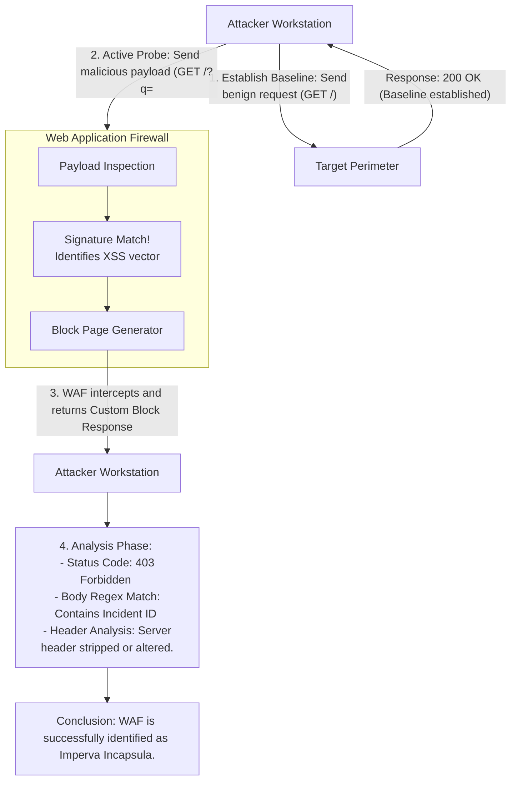

# WAF Fingerprinting

## 1. Introduction to WAF Fingerprinting
Before attempting to bypass a Web Application Firewall (WAF) during a penetration test, the assessor must first determine if a WAF is present and, more importantly, identify its specific vendor, product line, and potentially its configuration version. This systematic reconnaissance process is known as WAF Fingerprinting.

Different WAFs utilize drastically different rule sets, normalization engines, decoding mechanisms, and default architectures. By accurately identifying the specific WAF in place, an attacker can precisely tailor their evasion techniques to exploit the known architectural weaknesses or parser quirks of that specific product. For example, an encoding technique that easily bypasses an older ModSecurity deployment might be instantly flagged by the machine-learning engines of AWS WAF, and vice versa.

WAF fingerprinting relies on observing how the target perimeter responds to various types of requests—both legitimate baseline traffic and intentionally malicious probes. WAFs frequently betray their presence by injecting proprietary headers, modifying session cookies, or returning highly distinct block pages that act as cryptographic signatures of their identity.

## 2. Why Fingerprint?
*   **Tailored Payloads:** Avoid wasting time on generic, noisy payloads. If you identify the WAF as Imperva, you switch immediately to Imperva-specific evasion repositories and known parsing flaws.
*   **Identifying Cloud Edge Infrastructure:** Knowing the target uses Cloudflare, Fastly, or Akamai prompts the attacker to pause payload crafting and instead search for the Origin Server IP. Finding the origin IP allows the attacker to route traffic directly to the backend, bypassing the Cloud WAF entirely.
*   **Understanding Rule Strictness:** Observing the anomaly scoring threshold and what specific characters trigger a block gives deep insight into how aggressively the WAF is configured (e.g., determining the ModSecurity Paranoia Level).

## 3. Passive Fingerprinting Methodologies
Passive fingerprinting involves observing the target without sending explicitly malicious payloads that would trigger an alert in a SOC. This relies on analyzing how the WAF modifies normal, benign traffic.

### 3.1 HTTP Header Analysis
WAFs often append or modify specific HTTP headers in responses to track client sessions, manage load balancing, or indicate caching status.
*   **Cloudflare:** Identifiable by `Server: cloudflare`, and the presence of the `cf-ray` header.
*   **AWS WAF / CloudFront:** Identifiable by `X-Amzn-RequestId`, `X-Amz-Cf-Id`, and `Server: CloudFront`.
*   **Akamai:** Identifiable by `X-Akamai-Trans-ID`, `Server: AkamaiGHost`.
*   **F5 BIG-IP:** Often returns `Server: BigIP`, or headers starting with `X-Cnection`.
*   **Sucuri:** Identifiable by `Server: Sucuri/Cloudproxy`, and `X-Sucuri-ID`.

### 3.2 Cookie Analysis
Many WAFs inject proprietary cookies into the user's browser session for behavioral tracking, bot mitigation, or stickiness.
*   **F5 BIG-IP ASM:** Injects highly recognizable cookies starting with `TS` followed by random alphanumeric characters (e.g., `TS01a2b3c4`).
*   **Imperva Incapsula:** Injects cookies like `incap_ses_...` or `visid_incap_...`.
*   **Citrix NetScaler:** Injects cookies starting with `ns_af_` or `citrix_ns_id`.
*   **Cloudflare:** Historically used `__cfduid` and currently uses `cf_clearance` for challenged sessions.

## 4. Active Fingerprinting Methodologies
The most reliable way to identify a WAF is to intentionally trigger a block and analyze the resulting error page. Different vendors have highly recognizable default block pages, HTML DOM structures, and HTTP response codes.

**Methodology:**
Send a blatantly malicious payload that is guaranteed to be caught by almost any negative security model.
*   Example SQLi Probe: `GET /?id=1+AND+1=1+UNION+SELECT+version() HTTP/1.1`
*   Example XSS Probe: `GET /?search= HTTP/1.1`
*   Example LFI Probe: `GET /?file=../../../../etc/passwd HTTP/1.1`

**Analyzing the Response:**
*   **HTTP Status Code:** Does the WAF return `403 Forbidden`, `406 Not Acceptable`, `501 Not Implemented`, or a custom code like `499` (common in Nginx-based proxies)?
*   **HTML Content Signatures:**
    *   **Cloudflare:** Returns a distinct page mentioning "Cloudflare," showing a Ray ID, and often challenging the user with a Turnstile or CAPTCHA.
    *   **ModSecurity:** Often returns a generic Apache `403 Forbidden` or `406 Not Acceptable`, but the text might explicitly state "Not Acceptable! An appropriate representation of the requested resource could not be found."
    *   **Imperva:** Returns an HTML page containing a specific "Incident ID" string.
    *   **AWS WAF:** Often returns a simple `403 Forbidden` with a JSON response or plain text saying exactly `Request blocked.`.

### 4.1 Connection Drops (TCP RST)
Out-of-band WAFs and inline IPS appliances often do not return an HTTP response when blocking traffic. Instead, they sever the connection at the transport layer by sending a `TCP RST` (Reset) packet. If sending `<script>` causes an immediate connection reset without any HTTP headers being returned, an inline network appliance or out-of-band WAF is highly likely to be present.

## 5. Automated Fingerprinting Tools
Manual fingerprinting can be tedious. Several robust tools exist to automate the reconnaissance process by sending an array of crafted payloads and analyzing the responses against huge databases of known WAF signatures.

*   **WafW00f:** The industry standard open-source tool. It uses a combination of passive header analysis and active heuristic testing (sending payloads) to identify over 150 different WAFs.
    `wafw00f https://target.com`
*   **WhatWaf:** An advanced tool that not only fingerprints the WAF but also attempts to automatically discover working bypass techniques by testing various encodings and obfuscations.
    `whatwaf -u https://target.com`
*   **Nmap Scripts (NSE):** Nmap includes built-in scripts for basic WAF detection.
    `nmap -p 80,443 --script http-waf-detect,http-waf-fingerprint <target>`
*   **Nuclei:** Modern vulnerability scanners like Nuclei contain numerous templates specifically designed to detect technology stacks, including WAFs, by triggering known block behaviors and regex matching the responses.

## 6. ASCII Diagram: Active Fingerprinting Process Flow

## 7. Advanced Fingerprinting Techniques
When dealing with stealthy or heavily customized WAFs, standard tools might fail. Advanced techniques are required.

### 7.1 Timing Attacks
Some complex WAFs perform heavy regex processing or make backend API calls to machine learning engines before rendering a decision on suspicious traffic. By sending highly complex regex payloads (designed to cause ReDoS - Regular Expression Denial of Service against the WAF's engine), an attacker can observe significant standard deviations in response times. A massive spike in latency for specific payloads strongly indicates the presence of a deep-inspection WAF engine processing the string.

### 7.2 Rule Mapping (Character Fuzzing)
Once the vendor is known, advanced fingerprinting involves "mapping" the exact ruleset to understand the anomaly threshold. The goal is to determine exactly which characters or keywords trigger the block.

**Methodology:**
Iterate through a list of characters and SQL/XSS keywords, sending them one by one.
*   Probe 1: `/?test=SELECT` -> Response: 200 OK
*   Probe 2: `/?test=UNION` -> Response: 200 OK
*   Probe 3: `/?test=SELECT+UNION` -> Response: 403 Forbidden!

This critical analysis indicates the WAF does not block the words individually (which would cause false positives), but blocks the specific combination, revealing how the regex signature is constructed. This knowledge is crucial for crafting bypass payloads like `SELECT/*foo*/UNION`.

### 7.3 Origin IP Discovery (Cloud Edge Evasion)
If the fingerprinting reveals a Cloud WAF (Cloudflare, Akamai), the immediate next step is attempting to find the Origin IP. Techniques include:
*   Searching historical DNS records (SecurityTrails) for the IP address used before the domain was moved to Cloudflare.
*   Using Shodan or Censys to search for the domain's SSL certificate directly on raw IP addresses.
*   Triggering outbound connections (SSRF, Blind XSS) from the application to attacker-controlled infrastructure to leak the backend IP.

## 8. Evasion During Fingerprinting Operations
Extreme care must be taken during the fingerprinting phase of a stealthy engagement (Red Team). Aggressive scanning with noisy tools like WafW00f can lead to the attacker's IP being permanently banned by the WAF's dynamic behavioral analysis or rate-limiting engines before the actual exploitation phase begins.
*   **Throttle Requests:** Use significant delays between active probes.
*   **IP Rotation:** Use proxies, VPNs, or proxy networks (like AWS API Gateway IP rotation) to distribute the fingerprinting requests across multiple addresses.
*   **OpSec User-Agents:** Avoid using the default User-Agents of security tools (e.g., `python-requests`, `nmap`, `sqlmap`). Always mimic a legitimate browser string.

## 9. Chaining Opportunities
*   Once a WAF is fingerprinted (e.g., identified as AWS WAF), the attacker will research specific parsing vulnerabilities and CVEs for that exact platform.
*   Fingerprinting naturally precedes any payload mutation attempts, dictating whether to use [[03 - URL Encoding Bypass]] or [[04 - Double URL Encoding]].

## 10. Related Notes
*   [[01 - What is a WAF and How It Works]]
*   [[03 - URL Encoding Bypass]]
*   [[04 - Double URL Encoding]]
*   [[05 - Unicode Normalization Bypass]]
