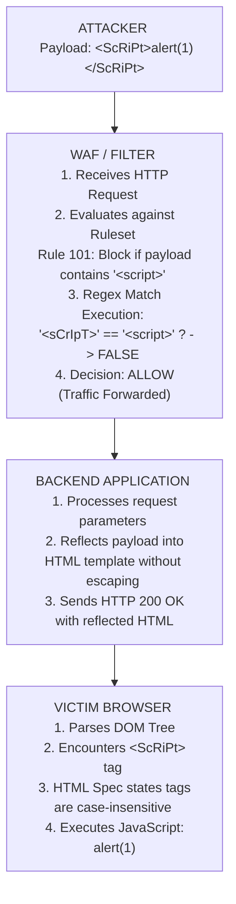

# 39.06 Case Variation WAF Bypass

## 1. Introduction to Case Variation Evasion

Case variation is one of the most fundamental yet historically significant techniques used to bypass Web Application Firewalls (WAFs) and Input Validation mechanisms. When security controls are implemented with poorly designed regular expressions or signature-matching rules that are case-sensitive, an attacker can manipulate the case of the payload characters (e.g., changing `SELECT` to `SeLeCt` or `<script>` to `<ScRiPt>`) to evade detection while ensuring the backend application or database still successfully processes the payload.

The discrepancy arises from the fact that many underlying technologies—such as SQL parsers (MySQL, MSSQL), HTML rendering engines (browsers), and some command interpreters (Windows CMD)—are naturally case-insensitive. If a WAF developer erroneously assumes case sensitivity or fails to use case-insensitive modifiers (like the `/i` flag in PCRE) when writing filter rules, an impedance mismatch is created between the security control and the backend technology.

This document explores the mechanics of case variation, the environments where it thrives, advanced vector combinations, the history of its usage, and how to effectively leverage it during a VAPT engagement. We will also dive into the architectural reasons why these mismatches exist and how modern tokenizers attempt to solve them.

---

## 2. The Mechanics of the Bypass

The underlying principle of the Case Variation bypass relies on the concept of **Parser Differential**. This occurs when two different systems (the WAF and the backend application) interpret the same data differently based on character case.

### 2.1 The Impedance Mismatch
A typical WAF operates by inspecting HTTP traffic and comparing it against a set of known malicious signatures. For instance, a basic WAF rule might look for the string `<script>` to prevent Cross-Site Scripting (XSS). 

```regex
# Poorly implemented WAF rule (Case-Sensitive)
Match: "(<script>|<object>|<iframe>)"
Action: Block
```

If an attacker sends the payload `<sCrIpT>alert(1)</ScRiPt>`, the WAF processes the string, compares it exactly to `<script>`, finds no match, and forwards the request to the web server. When the web application reflects this payload in an HTML response, the victim's browser parses the HTML. Since HTML tags are case-insensitive per the HTML specification, the browser executes the script, resulting in a successful XSS attack.

### 2.2 Execution Flow Diagram



---

## 3. Technology-Specific Vectors

Case variation techniques are highly dependent on the backend technology. Understanding which systems are case-insensitive is critical for successful exploitation. The following sections detail how different engines interpret case.

### 3.1 SQL Injection (SQLi)
The SQL language standard treats keywords as case-insensitive. Therefore, keywords like `SELECT`, `UNION`, `WHERE`, and `OR` can be submitted in any mixture of upper and lowercase.

#### MySQL and MariaDB
MySQL's lexer parses SQL statements by mapping characters to their uppercase equivalents during the tokenization phase. Thus, `select` and `SELECT` yield the same token in the Abstract Syntax Tree (AST).

**Examples:**
- `uNiOn SeLeCt 1,2,3--`
- `WhErE 1=1 aNd 'A'='A'`
- `sElEcT * fRoM uSeRs`

If a WAF filters based on the regex `/(union|select)/`, it might miss `UniOn`. Even if the rule uses `/(union|select)/i` (case-insensitive), some WAFs may decode payloads incorrectly or apply case folding (converting everything to lowercase) before matching, which can sometimes be bypassed with other encoding tricks.

#### Microsoft SQL Server (MSSQL)
MSSQL is generally case-insensitive for SQL keywords. However, the case-sensitivity of database objects (tables, columns) depends on the collation settings of the specific database (e.g., `SQL_Latin1_General_CP1_CI_AS` where `CI` means Case-Insensitive).

**Bypass implications:**
If a WAF attempts to block access to specific tables like `sysobjects` by matching the exact string, an attacker can simply query `SySoBjEcTs`.

### 3.2 Cross-Site Scripting (XSS)
HTML tags and attributes are generally case-insensitive. This applies to tags like `<script>`, ``, `<body>`, and attributes like `onerror`, `onload`, `javascript:`.

**Examples:**
- ``
- `<a HrEf="jAvAsCrIpT:alert(1)">Click</a>`
- `<sVg OnLoAd=alert(1)>`

*Note on DOM and JS Contexts:* JavaScript itself (the code inside the tags) IS case-sensitive. `ALert(1)` will result in a ReferenceError. Therefore, case variation in XSS is typically restricted to HTML tags, attributes, and URI schemes. However, certain DOM methods like `document.getElementById` are strictly case-sensitive, while attribute selectors in CSS might behave differently depending on the doctype and quirks mode.

### 3.3 Command Injection
The operating system environment dictates case sensitivity for command injection.

#### Windows
The command line interpreter (`cmd.exe`) and PowerShell are fundamentally case-insensitive. Commands like `WHOAMI`, `DiR`, `TyPe`, and `PoWeRsHeLl` execute exactly as their lowercase counterparts.
- Payload: `& wHoAmI`
- Payload: `| PoWeRsHeLl -e <base64>`
This makes Windows environments highly susceptible to case variation bypasses when WAFs look for specific command strings.

#### Linux / Unix
Unix-like systems are strictly case-sensitive. `whoami` works, but `WHOAMI` will result in a "command not found" error.
However, case variation can still be used if:
1. The backend application changes the case of user input before executing it (e.g., calling `tolower()` on input before passing it to `system()`).
2. It is combined with shell variables or path expansion tricks (e.g., `${PATH:0:1}` tricks) where the evaluation environment might interpret the structure differently.

### 3.4 Local File Inclusion (LFI)
File systems on Windows are case-insensitive by default (NTFS/FAT32). Requesting `/ETC/PASSWD` on a Linux system will fail, but requesting `/wInDoWs/SyStEm32/dRiVeRs/EtC/hOsTs` on a Windows IIS server will succeed. If a WAF blocks exact matches of `boot.ini` or `win.ini`, varying the case easily bypasses the filter.

---

## 4. Advanced Bypasses Involving Case Variation

### 4.1 Unicode Case Mapping and Normalization
A fascinating edge case involves applications or WAFs that perform Unicode normalization or uppercase/lowercase conversion (case folding) incorrectly. 

#### The Turkish 'I' Anomaly
In the Turkish alphabet, the lowercase version of 'I' is 'ı' (dotless i), and the uppercase version of 'i' is 'İ' (dotted I).
If a WAF converts the payload to uppercase to match against a blacklist of `SELECT`, an attacker might send `selıct` or `selİct`. Depending on the locale settings of the WAF and the backend, the transformation might result in a mismatch at the WAF level but normalize back to `select` at the database level.

#### The Kelvin Sign
Another example is the Kelvin sign `K` (U+212A). If passed to an application that converts input to lowercase using standard Unicode case folding, `K` becomes `k`.
- Payload: `<scriKt>alert(1)</script>`
- WAF (No normalization): Sees `scriKt`, doesn't match `script`.
- Backend (Normalizes to lower): Converts `K` to `k`, resulting in `<script>`, executing the XSS.

### 4.2 Interaction with URL Encoding
WAFs decode URL-encoded characters before inspection. Sometimes, combining case variation with URL encoding of *only* the capitalized letters can confuse the parser.
- Original: `SELECT`
- Mixed Case: `SeLeCt`
- URL Encoded Mixed: `%53e%4ce%43t`
If the WAF decodes but fails to properly apply a case-insensitive regex on the resulting string due to a decoding loop limit, buffer issue, or state machine reset, the payload slips through.

### 4.3 Double Decoding and Case Parsing
If an application performs double decoding but the WAF only performs single decoding, an attacker can encode the uppercase characters to bypass the first inspection layer.
- Target: `<script>`
- Mixed Case: `<ScRiPt>`
- Double Encoded Mixed: `%253Cc%2552i%2550t%253E`
When the WAF sees this, it decodes it to `%3Cc%52i%50t%3E`, which does not match `<script>`. The backend decodes it again to `<ScRiPt>`, and the browser executes it.

---

## 5. Identifying Case-Sensitive Filters

During Black-Box testing, a tester must accurately map the rules of the WAF to identify if case variation is a viable strategy.

**Testing Methodology:**
1. **Baseline Request:** Send a legitimate request to establish a baseline (e.g., `?id=1`). Ensure the response is HTTP 200 OK.
2. **Trigger the WAF:** Send a known malicious payload (e.g., `?id=1 AND 1=1`). Observe the block (e.g., 403 Forbidden or a custom WAF block page).
3. **Apply Case Variation:** Modify the case of the blocked keyword (e.g., `?id=1 aNd 1=1`).
4. **Analyze Response:**
   - **If blocked (403):** The WAF filter is case-insensitive or using a broader structural signature (like Libinjection). Case variation alone will not work.
   - **If allowed (200) and executes:** The WAF filter is strictly case-sensitive, and the vulnerability is confirmed. You have achieved a bypass.
   - **If allowed (200) but fails to execute (e.g., 500 error or normal page):** The WAF allowed it, but the backend is also case-sensitive, meaning the attack vector is incompatible with this technique.

---

## 6. Real-World Case Studies and Historical Context

### 6.1 Bypassing ModSecurity Core Rule Set (Older Versions)
Early versions of various WAF rule sets often relied on strict word boundary matching without appropriate `/i` flags. Why? Performance. Case-insensitive regex matching consumes more CPU cycles because the engine must check multiple character variants for each position. Attackers heavily exploited this by using payloads like `SelEcT`, which skipped the regex execution path, significantly reducing the security posture of the application while keeping WAF CPU utilization low. This forced a paradigm shift towards tokenization.

### 6.2 The 'JaVaScRiPt:' URI Scheme in Webmail
Webmail providers (like early Yahoo or Hotmail) often filtered the `javascript:` URI scheme in `href` attributes to prevent Stored XSS in emails. Over the years, many providers were bypassed simply by altering the case to `jAvAsCrIpT:alert(1)`. Modern filters now employ full HTML parsers (like DOMPurify) rather than regex to extract and sanitize attributes to combat this class of evasion.

### 6.3 Imperva / F5 Big-IP Edge Cases
Even enterprise WAFs have occasionally suffered from case variation bypasses when specific rule subsets were updated hastily without inheriting global normalization flags. Attackers have documented instances where combining case variation with specific HTTP headers (like chunked transfer encoding) bypassed inspection.

---

## 7. Mitigation Strategies

Defending against case variation requires robust parsing and normalization before inspection. Implementing filters purely based on regex is an anti-pattern in modern WAF design.

1. **Use Case-Insensitive Regex:** Ensure all signature-matching regular expressions use the case-insensitive flag (e.g., `(?i)select` or `/select/i`). While slightly more resource-intensive, it is a baseline requirement.
2. **Canonicalization / Normalization:** Before inspecting input, the WAF should normalize the data. This includes URL decoding, HTML entity decoding, and importantly, converting the entire string to lowercase. 
   - *Warning:* Ensure the backend does not process the data in a way that reverses the normalization (e.g., Unicode normalization vulnerabilities).
3. **Lexical Analysis / Tokenization (Libinjection):** Instead of relying purely on regex, modern WAFs should use parsers that tokenize the input to understand the syntactic structure. Both `SeLeCt` and `SELECT` will generate the exact same lexical token, making case variation completely ineffective against structural analysis.
4. **Context-Aware Encoding Verification:** WAFs must verify that decoded payloads do not map to executable contexts when passed to the backend, utilizing the exact same character sets and collations as the backend database.

---

## 8. Chaining Opportunities

Case Variation is rarely used in isolation against modern WAFs. It is typically chained with other techniques to break multiple layers of defense simultaneously:
- **[[07 - Comment Insertion]]:** `S/*qq*/ELeCt`
- **[[08 - Whitespace Substitution]]:** `SeLecT%0A*%0AfRoM`
- **[[09 - Keyword Splitting and Concatenation]]:** Combining case variation with string concatenation (e.g., `'sE' + 'lEcT'`).
- **[[10 - HTTP Parameter Pollution]]:** Passing mixed-case parameters across multiple inputs to bypass initial boundary checks before concatenation.

## 9. Related Notes
- [[01 - Introduction to WAF Evasion]]
- [[02 - WAF Fingerprinting]]
- [[04 - Encoding and Obfuscation]]
- [[12 - Advanced SQLi Evasion]]
- [[21 - XSS Contexts and Payloads]]
