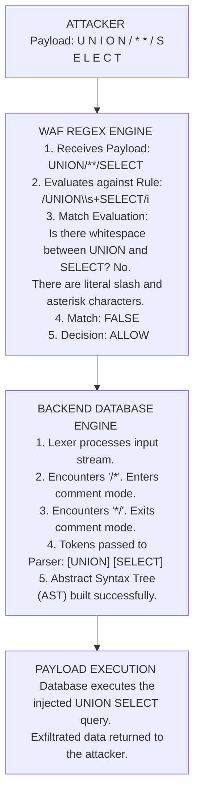

# 39.07 Comment Insertion WAF Bypass

## 1. Introduction

Comment insertion is an evasion technique that exploits the way different parsers handle inline comments. Web Application Firewalls (WAFs) typically use pattern matching (Regular Expressions) to detect malicious payloads like `UNION SELECT`. By injecting comments into the middle of these keywords or between them (e.g., `UNION/**/SELECT`), an attacker can disrupt the WAF's pattern matching algorithm. 

The core of this bypass relies on the fact that the backend interpreter (such as a SQL database engine or a JavaScript engine) will identify the comment syntax, strip it out, and seamlessly stitch the surrounding tokens back together, executing the payload as originally intended.

This note dives deep into the syntax, execution flow, database-specific anomalies, historical context, and advanced permutations of the comment insertion technique. We will also explore how modern WAFs defend against this.

---

## 2. Theoretical Foundation: The Tokenizer

To understand why comment insertion works, one must understand how a compiler or interpreter processes code via Lexical Analysis (Tokenization). 

When a SQL engine receives the string `SELECT * FROM users`, the tokenizer breaks it down into individual actionable tokens:
1. Keyword: `SELECT`
2. Operator: `*`
3. Keyword: `FROM`
4. Identifier: `users`

When a SQL engine receives `SELECT/**/*/**/FROM/**/users`, the tokenizer does the following:
1. Recognizes `SELECT` -> Keyword
2. Recognizes `/**/` -> Multi-line comment (ignores it completely)
3. Recognizes `*` -> Operator
4. Recognizes `/**/` -> Comment (ignores)
5. Recognizes `FROM` -> Keyword
6. Recognizes `/**/` -> Comment (ignores)
7. Recognizes `users` -> Identifier

The resulting stream of tokens sent to the parser is **identical** in both cases. However, a WAF looking for the contiguous string or regex pattern `SELECT \* FROM` will completely miss the commented version, as it sees literal asterisks and slashes instead of the expected sequence.

### 2.1 Execution Flow Diagram

---

## 3. Technology-Specific Syntax

Different backend technologies support different comment syntaxes. A VAPT professional must adapt the comment payload to the specific technology targeted by the injection flaw.

### 3.1 SQL Injection

SQL databases have diverse and sometimes idiosyncratic commenting formats. Understanding these dialects is paramount.

#### MySQL / MariaDB
- **Inline/Block Comments:** `/* comment */`
- **Line Comments:** `-- ` (Note the mandatory space after the dashes, or a control character like newline), or `#`
- **Special Execution Comments:** `/*! MySQL Specific Code */` (See Section 4.2).

**Bypass Example:**
Instead of `UNION SELECT 1,2,3`, use:
`UNION/*foo*/SELECT/*bar*/1,2,3`

#### Microsoft SQL Server (MSSQL)
- **Inline/Block Comments:** `/* comment */`
- **Line Comments:** `--` (No space required after the dashes, unlike MySQL).

**Bypass Example:**
`SELECT/*anything*/[password]/*!*/FROM[users]`
In MSSQL, the `/*` block comments can be heavily abused because they can be nested (see section 4.3).

#### PostgreSQL
- **Inline/Block Comments:** `/* comment */`
- **Line Comments:** `--`

#### Oracle
- **Inline/Block Comments:** `/* comment */`
- **Line Comments:** `--`
Oracle also has specific behaviors where comments can interact strangely with hints (e.g., `/*+ INDEX(table_name index_name) */`), which can be manipulated to confuse WAFs parsing Oracle traffic.

### 3.2 Cross-Site Scripting (XSS) / JavaScript

JavaScript allows block comments `/* */` and line comments `//`. HTML allows `<!-- -->`.

**Bypass Example in JS Context:**
If a WAF blocks `alert(1)`, an attacker can inject comments within the JavaScript execution context, breaking up function names if evaluated dynamically, or separating object properties.
``
``

**Bypass Example in HTML Context:**
While you cannot directly split HTML tags with `<!-- -->` (e.g., `<scr<!-- -->ipt>`), you can sometimes fool WAFs by opening an HTML comment, throwing in some garbage, and carefully closing it before the malicious payload, confusing the WAF's state machine.

---

## 4. Advanced Commenting Techniques

### 4.1 Keyword Splitting via Comments
Older or less sophisticated WAFs only look for complete keywords like `SELECT` or `UNION`. Some database engines allow splitting the keyword itself using certain syntax tricks. 
*Note:* Standard SQL does not allow `SEL/* */ECT`. The comment must occur between tokens, not within a token. To split keywords inherently, one must use string concatenation techniques (see [[09 - Keyword Splitting and Concatenation]]). However, passing comments between function names and parentheses is valid: `VERSION/**/()`.

### 4.2 Executable Comments (MySQL Specific)
This is arguably the most powerful comment-based evasion technique for MySQL databases, representing a profound parser differential. MySQL introduced a feature to ensure portability: C-style comments starting with an exclamation mark `/*!` and optionally followed by a version number are executed by MySQL but ignored by other SQL dialects.

Syntax: `/*![version] SQL_Code */`

If a WAF sees `/*!50000SELECT*/`, it often categorizes it as a comment and skips inspection, or treats the entire block as a literal string. However, MySQL executes `SELECT` if the server version is greater than or equal to 5.0.00.

**Examples:**
- `/*!UNION*/ /*!SELECT*/ 1,2,3`
- `/*!50000UNION*/ /*!50000SELECT*/ 1,2,3`

This creates a massive blind spot for WAFs. If they strip comments before inspection, they strip the payload. If they ignore comments, they let the payload through. To defend against this, WAFs must recognize MySQL executable comments and treat their contents as executable code, effectively mimicking the MySQL lexer.

### 4.3 Nested Comments
Some database engines support nested comments, whereas others do not. This creates another layer of parser differentials.
- **PostgreSQL / MSSQL:** Supports nested comments. `/* comment /* nested */ comment */`
- **MySQL / Oracle:** Does NOT support nested comments. `/* comment /* nested */` closes at the first `*/`, leaving `comment */` as dangling, likely causing a syntax error unless handled carefully.

This discrepancy can be exploited. If a WAF mimics MySQL's comment parsing but the backend is PostgreSQL, an attacker can craft a payload like:
`/* /* */ UNION SELECT 1,2,3 /* */`
The WAF (MySQL logic) might see `/* /* */` as one closed comment, and then `UNION SELECT...`, catching it. But if manipulated properly, you can hide the payload in the WAF's blind spot.

### 4.4 Non-Standard Comment Markers
Certain WAFs might only strip standard comments. Attackers can look for edge cases. 
- In SQLite, you can sometimes use obscure pragmas or token separators that act effectively as comments. 
- In Oracle, using `--` followed by a newline `%0A` can split the payload in a way that breaks WAF regex anchored with `^` and `$`.
- In MS Access, the null byte `%00` sometimes terminates string processing in WAFs but is ignored as a comment in the DB.

---

## 5. Identifying Comment-Based Filtering

During a penetration test, identifying if a WAF blocks or parses comments is critical to mapping the attack surface.

**Testing Methodology:**
1. **Send a normal request:** `?id=1` (Verify 200 OK)
2. **Send a benign comment:** `?id=1/*test*/`
   - *If blocked:* The WAF blocks all SQL comment syntax outright. This is highly restrictive and prone to false positives, but highly secure.
   - *If allowed:* The WAF permits comments. Proceed to step 3.
3. **Send a fragmented payload:** `?id=1 /*!UNION*/ /*!SELECT*/ 1`
   - *If allowed and executed:* WAF fails to inspect inside executable comments. Bypass achieved.
   - *If blocked:* WAF inspects inside comments or normalizes them out before inspection.
4. **Fuzz Comment Types:** Test `--`, `#`, `//`, `<!-- -->` to see which parsers the WAF supports and which it ignores.

---

## 6. Defensive Strategies & WAF Architecture

Modern enterprise WAFs employ advanced techniques to counter comment insertion, moving far beyond simple regular expressions.

1. **Comment Stripping / Normalization:**
   Before running regex rules, the WAF normalizes the input by completely stripping all standard comments `/* ... */` and `-- ...`. 
   - *Weakness:* If the WAF aggressively strips `/*`, a payload like `SEL/* */ECT` might become `SELECT`, which the WAF then blocks. But if the backend doesn't allow `SEL/* */ECT`, the WAF blocked a benign request, leading to potential Denial of Service (DoS) via false positives.
2. **Parsing Executable Comments:**
   WAFs must identify `/*! ... */` and strip the comment wrappers, evaluating the inner content as standard input. This requires context awareness of the backend DB type.
3. **Libinjection Tokenization:**
   Modern WAFs use tokenizers like Libinjection. Libinjection reads the input stream and assigns tokens, treating `/* anything */` as a single empty token or space. Therefore, `UNION/*foo*/SELECT` tokenizes to `U U` (Union, Union). Libinjection's signature matching detects the sequence regardless of the comments inserted, rendering basic comment insertion highly ineffective against it.

---

## 7. Chaining Opportunities

Comment insertion is highly synergistic with other techniques to further obfuscate the payload from regex engines. By layering evasions, the complexity for the WAF parser increases exponentially.

- **[[06 - Case Variation]]:** `/*!50000uNiOn*/ /*!50000SeLeCt*/`
- **[[08 - Whitespace Substitution]]:** Mixing newlines and comments `UNION/*%0A*/SELECT`
- **[[10 - HTTP Parameter Pollution]]:** Placing comments across multiple parameter values to reconstruct the payload in the backend (e.g., ASP.NET comma absorption `/*,*/`).

## 8. Related Notes
- [[01 - Introduction to WAF Evasion]]
- [[02 - WAF Fingerprinting]]
- [[12 - Advanced SQLi Evasion]]
- [[34 - Database Specific Evasions]]
