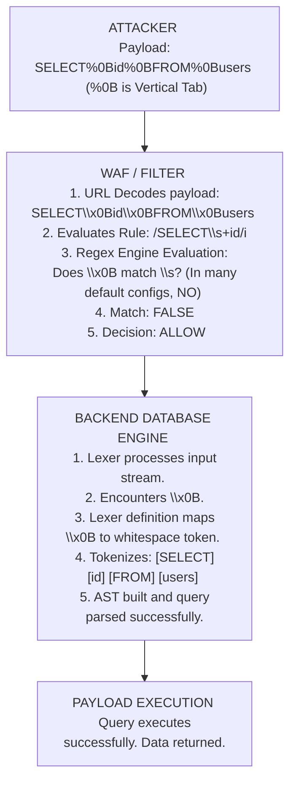

# 39.08 Whitespace Substitution WAF Bypass

## 1. Introduction to Whitespace Substitution

Web Application Firewalls (WAFs) rely heavily on regular expressions to identify malicious patterns. A common assumption made by rule developers is that tokens in a payload (such as SQL keywords or JavaScript attributes) are separated by standard spaces (ASCII `0x20`). Whitespace Substitution is an evasion technique that replaces standard spaces with alternative characters that the backend parser interprets as whitespace, but the WAF does not.

If a WAF rule is written as `UNION\s+SELECT` (where `\s` might only match `0x20`, `\t`, `\n`, `\r` depending on the regex engine configuration), an attacker can supply an obscure URL-encoded byte that the database engine treats as a separator, completely bypassing the WAF's regex.

This document delves into the intricacies of whitespace characters, backend-specific parsing behaviors, advanced obfuscation techniques, and how to effectively fuzz for whitespace substitutions during a VAPT engagement. We will also look at the architectural reasons WAFs fail to catch these edge cases.

---

## 2. The Core Mechanism

The effectiveness of this technique relies entirely on the **Parser Differential** between the WAF and the target application/database. 

When a database parses a query like `SELECT id FROM users`, it looks for delimiters to separate the keywords `SELECT`, `id`, `FROM`, and `users`. While ASCII Space (`0x20`) is the universal standard, database engines are designed with fault tolerance, legacy character set support, and internal bytecode compilers that allow them to accept various non-printing control characters as valid delimiters.

If the WAF's normalization engine does not map these obscure control characters to a standard space before running its rule set, the WAF fails to recognize the contiguous signature. The WAF might treat the control character as part of the string itself, breaking the signature match.

### 2.1 Execution Flow Diagram

---

## 3. Technology-Specific Whitespace Behaviors

The success of whitespace substitution is highly dependent on the backend technology. Different databases and interpreters accept wildly different characters as valid whitespaces. This requires a targeted approach during a penetration test.

### 3.1 MySQL / MariaDB Whitespace Characters
MySQL is famously lenient with whitespace. The following URL-encoded hex values can often be used to replace standard spaces:
- `%09` (Horizontal Tab)
- `%0A` (Line Feed / Newline)
- `%0B` (Vertical Tab)
- `%0C` (Form Feed)
- `%0D` (Carriage Return)
- `%A0` (Non-breaking space - works in certain character set configurations)

**Example Payload:**
`UNION%0BSELECT%0B1,2,3%0DFROM%0Busers`

### 3.2 Microsoft SQL Server (MSSQL) Whitespace Characters
MSSQL allows an even broader range of characters. Alongside standard tabs and newlines, it accepts various control characters, making it highly susceptible to this technique.
- `%01` to `%1F` (Many ASCII control characters act as whitespace)
- `%09`, `%0A`, `%0B`, `%0C`, `%0D`
- `%25` (In some specific legacy configurations involving encoding parsing)

**Example Payload:**
`SELECT%01password%02FROM%03users`
In MSSQL, injecting `%01` between keywords can completely break WAFs that are not specifically tuned for MSSQL edge cases.

### 3.3 Oracle Whitespace Characters
Oracle is somewhat stricter but still allows common control characters.
- `%00` (Null byte - can sometimes act as a separator or cause truncation issues in the WAF)
- `%09`, `%0A`, `%0B`, `%0C`, `%0D`

### 3.4 SQLite Whitespace Characters
SQLite also supports standard control characters.
- `%09`, `%0A`, `%0B`, `%0C`, `%0D`

### 3.5 Cross-Site Scripting (XSS) / HTML Contexts
When injecting into HTML tags, browsers are incredibly forgiving about what separates attributes. This is because HTML parsers are designed to handle poorly formatted markup gracefully.
- `%09` (Tab)
- `%0A` (Newline)
- `%0C` (Form Feed)
- `%0D` (Carriage Return)
- `/` (Forward slash - highly effective in HTML attributes)

**Example Payload:**
``
Notice the forward slash `/` and the newline `%0A` completely eliminate the need for standard spaces, bypassing rules that strictly look for ` Double Encoded `%2520`
- Tab `%09` -> Double Encoded `%2509`
The WAF inspects `%20` (literal percent two zero), finds no issue. The backend decodes `%20` into a space, executing the payload.

---

## 5. Fuzzing for Whitespace Substitutions

During a Black-Box engagement, discovering the correct whitespace character requires active fuzzing, as the exact backend topology is rarely known.

**Methodology:**
1. **Identify the Block:** Find a payload that is blocked by the WAF. e.g., `?id=1 UNION SELECT 1` -> 403 Forbidden.
2. **Set up Intruder:** Use Burp Suite Intruder. Place a payload position exactly at the space character: `?id=1 UNION§space§SELECT 1`.
3. **Payload List:** Generate a list of URL-encoded characters from `%00` to `%FF`.
4. **Analyze Results:**
   - Look for HTTP 200 OK responses.
   - Look for differences in response length or execution time indicating the query executed successfully rather than just passing the WAF and breaking the DB parser.
   - If `%0B` returns a 200 OK and data is exfiltrated, you have bypassed the WAF.

---

## 6. Defensive Strategies

To defend against Whitespace Substitution, a WAF must perform rigorous normalization before rule evaluation.

1. **Robust Normalization Engine:** The WAF must translate all recognized control characters (`0x01`-`0x20`, `0xA0`, etc.) into standard spaces (`0x20`) prior to applying regular expressions. This normalizes the data into a standard format.
2. **Context-Aware Tokenization:** WAFs utilizing tokenizers (like libinjection) are inherently immune to most whitespace substitution. This is because the lexer explicitly defines `%0B`, `%09`, etc., as whitespace delimiters, treating them exactly as it would a standard space. `SELECT%0B1` becomes `SELECT 1` internally before signature matching.
3. **Strict Parameter Validation:** Enforcing strict type checking (e.g., ensuring an `id` parameter contains *only* integers via regex `^[0-9]+$`) prevents the injection of any whitespace characters entirely, rendering the technique moot.
4. **Reject Unprintable Characters:** A strong security posture involves globally rejecting requests containing unprintable control characters (outside of standard CRLF) unless explicitly required by the application.

---

## 7. Chaining Opportunities

Whitespace Substitution is a fundamental building block for complex evasions. It is rarely used in isolation against modern targets.
- **[[06 - Case Variation]]:** `uNiOn%0BSeLeCt` (Combines parser differentials in both case and whitespace)
- **[[07 - Comment Insertion]]:** `UNION%0B/*foo*/%0ASELECT`
- **[[09 - Keyword Splitting and Concatenation]]:** Using alternative whitespace alongside string concatenation to evade regex.
- **[[04 - Encoding and Obfuscation]]:** Double encoding the whitespace character `%250B`.

## 8. Related Notes
- [[01 - Introduction to WAF Evasion]]
- [[04 - Encoding and Obfuscation]]
- [[12 - Advanced SQLi Evasion]]
- [[21 - XSS Contexts and Payloads]]
