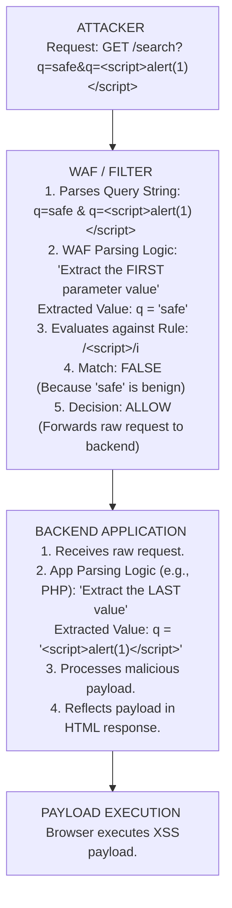

# 39.10 HTTP Parameter Pollution (HPP) WAF Bypass

## 1. Introduction to HTTP Parameter Pollution

HTTP Parameter Pollution (HPP) is a class of vulnerability and a highly potent Web Application Firewall (WAF) evasion technique. It exploits how different web technologies parse HTTP requests when multiple parameters with the same name are supplied. 

When a client sends a request like `GET /index.php?id=1&id=2`, there is no standardized, globally enforced RFC specification dictating how the web server or application framework should handle the duplicate `id` parameter. Should it accept the first one? The second one? Should it concatenate them? Should it create an array?

Because the WAF and the backend application might use entirely different parsing libraries, an attacker can create a critical **Parser Differential**. The WAF might inspect the first parameter and allow the request, while the backend application processes the second parameter containing the malicious payload.

This document explores the mechanics of HPP, environment-specific parsing behaviors, advanced exploitation strategies for both traditional and RESTful architectures, and defensive methodologies.

---

## 2. The Core Mechanism: Parser Differentials

The essence of an HPP bypass is tricking the WAF into inspecting benign data while passing malicious data to the backend application uninspected. This represents a failure in synchronization between the security perimeter and the core application logic.

### 2.1 Execution Flow Diagram



---

## 3. Technology-Specific Parsing Behaviors

The critical knowledge required for successful HPP exploitation is understanding how different web servers, application frameworks, and WAFs handle multiple parameters with the same name.

### 3.1 Known Parsing Behaviors Grid

| Technology / Framework | Behavior on Duplicate Parameters (`?param=1&param=2`) | Resulting Value |
| :--- | :--- | :--- |
| **PHP / Apache** | Uses the LAST occurrence. | `param=2` |
| **ASP.NET / IIS** | Concatenates values with a comma `,`. | `param=1,2` |
| **JSP / Tomcat** | Uses the FIRST occurrence. | `param=1` |
| **Node.js (Express)** | Creates an Array of strings. | `param=['1', '2']` |
| **Python (Flask/Werkzeug)**| Uses the FIRST occurrence (via `request.args.get()`).| `param=1` |
| **Python (Django)** | Uses the LAST occurrence (via `request.GET.get()`). | `param=2` |
| **Go (net/http)** | Uses the FIRST occurrence (via `FormValue`). | `param=1` |

*Note:* These behaviors can sometimes change based on the specific version of the middleware, the exact method used to extract the variable, or custom request parsers implemented by the developers.

### 3.2 Exploiting ASP.NET Concatenation

ASP.NET's native behavior of concatenating duplicate parameter values with a comma makes it uniquely susceptible to SQL injection bypassing.

Imagine an application executing: `SELECT * FROM products WHERE id = [INPUT]`
The WAF blocks the contiguous string `UNION SELECT`.

**Attacker Payload:**
`GET /products.aspx?id=1;UN&id=ION SELECT 1,2,3--`

**WAF Parsing:**
If the WAF looks at parameters individually, it evaluates:
- `id` = `1;UN` (Benign)
- `id` = `ION SELECT 1,2,3--` (Benign, missing the `UNION` keyword)

**Backend ASP.NET Parsing:**
ASP.NET receives the request, parses the duplicate keys, and concatenates the `id` parameters:
`id` = `1;UN,ION SELECT 1,2,3--`

*The Problem:* `1;UN,ION` is syntactically invalid SQL due to the injected comma `,`.
*The Solution:* Attackers use SQL multi-line comments to absorb the comma.

**Refined ASP.NET Payload:**
`GET /products.aspx?id=1;/*&id=*/UNION SELECT 1,2,3--`

**Backend Concatenation Result:**
`1;/*,*/UNION SELECT 1,2,3--`
The injected comma `,` falls safely inside the SQL multi-line comment `/*,*/`, resulting in the successful execution of the `UNION SELECT` statement!

---

## 4. Advanced HPP Vectors

### 4.1 Cross-Environment Parameter Pollution
Sometimes the impedance mismatch isn't just between the WAF and the Application, but between different components of the internal architecture.
For example, an API Gateway might validate a parameter, but route the request to an internal microservice that parses parameters differently. 
`GET /api/transfer?amount=10&amount=10000`
If the API Gateway validates the first amount ($10) for authorization limits, but the backend Node.js service processes the second amount or creates an array where the second value overrides logic, severe business logic flaws occur.

### 4.2 Combining HPP with URL Encoding
Some WAFs have strict, non-recursive URL decoding rules. By combining HPP with partial encoding, one can further confuse the WAF's parameter extraction phase.
`GET /page?id=1&%69%64=<script>...`
If the WAF doesn't decode `%69%64` (which translates to `id`) before extracting parameters into its internal map, it only sees one `id` parameter (`id=1`). The backend web server, however, fully decodes the query string and sees two `id` parameters, processing the malicious one.

### 4.3 JSON Parameter Pollution (HDP - HTTP Data Pollution)
Parameter pollution is not restricted to GET query strings or POST URL-encoded bodies. It also applies to JSON payloads utilized heavily in modern REST APIs.
```json
{
  "user_id": 1,
  "user_id": "1' OR '1'='1"
}
```
Depending on the JSON parsing library used (e.g., Jackson, Gson, simplejson, Python's `json` module), the parser might:
1. Keep the first key and ignore the rest.
2. Overwrite the first key with the last key.
3. Throw a strict JSON syntax error.

If the WAF uses a parser that extracts the first key, and the backend uses a parser that extracts the last key, a bypass is immediately achieved.

### 4.4 Path Parameter and Matrix Parameter Pollution
In modern REST APIs, parameters are often passed in the URL path.
`GET /api/users/1/profile`
Frameworks like Spring Boot can be vulnerable to Matrix Parameter pollution.
`GET /api/users/1;id=2/profile`
If the WAF checks the path strictly against a regex, it might fail to properly isolate the polluted matrix parameter `id=2`, leading to bypasses in authorization (BOLA/IDOR) or injection checks.

---

## 5. Identifying HPP Vulnerabilities

During VAPT, testing for HPP requires carefully observing how the application responds to duplicate parameters, often looking for subtle changes in application state.

**Testing Methodology:**
1. **Send a baseline request:** `?action=view` (Observe standard response).
2. **Send a polluted request:** `?action=view&action=edit`
3. **Analyze the response:**
   - Does it perform the `view` action? (First parameter processed).
   - Does it perform the `edit` action? (Last parameter processed).
   - Does it crash or throw a 500? (Array creation or type casting failure).
   - Does it return `view,edit`? (Concatenation).
4. **Trigger the WAF:** `?action=<script>alert(1)</script>` (Observe Block/403).
5. **Exploit HPP based on parsing behavior:** 
   - If Last Parameter Wins: `?action=safe&action=<script>alert(1)</script>`
   - If First Parameter Wins: `?action=<script>alert(1)</script>&action=safe`
   - *If the request passes the WAF and executes the payload, an HPP bypass is confirmed.*

---

## 6. Defensive Strategies

Preventing HTTP Parameter Pollution requires achieving complete consistency between all components in the security architecture.

1. **Strict Parameter Validation at the WAF:** The WAF should be configured to explicitly DENY requests containing duplicate parameters unless explicitly required by the application logic. This is the most effective defense.
2. **Parser Standardization:** Ensure the WAF uses the exact same parsing logic as the backend framework. If the backend is ASP.NET, the WAF must parse and inspect the concatenated string (`param1,param2`), not just the individual parts.
3. **Input Validation and Type Casting:** Applications should use strict type casting and validation. If `id` is expected to be an integer, validating it strictly as an integer will block payloads regardless of HPP delivery tricks. An array `['1', '2']` passed to an integer field will fail type checking.
4. **JSON Schema Validation:** For APIs, enforce strict JSON schema validation that outright rejects payloads containing duplicate keys (e.g., using `STRICT_DUPLICATE_DETECTION` in Jackson).

---

## 7. Chaining Opportunities

HPP is frequently used as a delivery mechanism for other payloads:
- **[[07 - Comment Insertion]]:** Using SQL comments to absorb the ASP.NET concatenation comma `/*,*/`.
- **[[09 - Keyword Splitting and Concatenation]]:** Delivering split payload chunks via multiple parameters, knowing the backend will concatenate them natively.
- **[[04 - Encoding and Obfuscation]]:** Encoding the parameter name to hide the duplicate key from the WAF.

## 8. Related Notes
- [[01 - Introduction to WAF Evasion]]
- [[31 - API Security]]
- [[02 - WAF Fingerprinting]]
