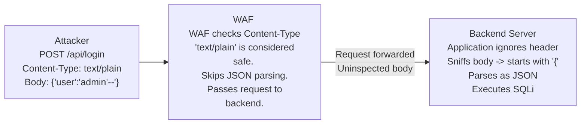

# 39.12 Content-Type Switching

## Introduction

Content-Type Switching is an advanced Web Application Firewall (WAF) bypass technique that exploits discrepancies in how WAFs and backend applications parse the `Content-Type` HTTP header. The HTTP `Content-Type` header dictates how the body of a request should be interpreted. By manipulating this header, an attacker can trick the WAF into treating a malicious payload as benign data, while the backend application parses it as an executable payload.

Many WAFs are optimized for performance and will selectively bypass deep inspection for certain content types (e.g., `image/jpeg`, `text/plain`) under the assumption that these types cannot contain complex, exploitable nested structures like JSON, XML, or URL-encoded forms. However, many modern web frameworks are extremely permissive. If an attacker submits a JSON payload but labels it as `text/plain`, the WAF may ignore it, but the backend application might use content sniffing or default fallbacks to correctly parse the JSON and execute the attack.

This note delves deeply into the mechanics of Content-Type switching, providing actionable attack scenarios, architectural explanations, and comprehensive defensive strategies to secure APIs and web applications.

## Core Concepts and Mechanics

### The WAF vs. Application Parsing Discrepancy

Web Application Firewalls apply specific parsers based on the `Content-Type` header to accurately inspect the request body:
- `application/x-www-form-urlencoded`: Parsed as key-value pairs.
- `application/json`: Parsed as a structured JSON object.
- `multipart/form-data`: Parsed as boundaries and individual parts.
- `text/plain` or `application/octet-stream`: Often treated as raw unstructured data, bypassing deep structural inspection to save CPU cycles.

If an attacker sends a malicious SQL injection payload inside a JSON object:
```json
{"username": "admin' OR 1=1--"}
```
If the `Content-Type` is set to `application/json`, the WAF's JSON parser extracts the value of the `username` key and flags the SQLi signature. 

However, if the `Content-Type` is set to `text/plain` or omitted entirely, the WAF might skip the JSON parser and treat the body as a flat string. It might miss the signature entirely if its rules rely on structural context (e.g., only looking for SQLi within JSON values), or it might skip inspection of `text/plain` altogether to optimize performance.

The vulnerability arises because backend frameworks (like Spring Boot, Express.js, Flask, or Django) often implement "Content Negotiation" or "Content Sniffing". If they receive a request without a Content-Type, or with an unrecognized one, they may look at the actual data. If the data begins with `{`, the framework might transparently attempt to parse it as JSON regardless of the header.

## ASCII Diagram: Content-Type Switching Architecture



## Exploitation Scenarios

### 1. Bypassing JSON/XML WAF Rules

Many WAFs strictly enforce rules on `application/json` endpoints because modern APIs are highly targeted. 

**Blocked Request:**
```http
POST /api/v1/users HTTP/1.1
Host: target.com
Content-Type: application/json

{"email": "test@test.com", "role": "admin' OR '1'='1"}
```

**Bypass Request (Missing Header):**
```http
POST /api/v1/users HTTP/1.1
Host: target.com
Content-Length: 53

{"email": "test@test.com", "role": "admin' OR '1'='1"}
```
By simply dropping the `Content-Type` header, the WAF falls back to a default parser that might not detect the SQL injection inside the JSON structure, while a Spring Boot backend equipped with Jackson might default to mapping the body to a JSON object automatically.

### 2. Form-Data to JSON Conversion

Some PHP or Node.js applications are programmed to accept data either as form-urlencoded or JSON to support various client integrations. 
If the WAF's JSON parsing is weak but its form-data parsing is robust, an attacker can switch the Content-Type from `application/x-www-form-urlencoded` to `application/json` and reformat the payload.

Conversely, if the application endpoint expects JSON and the WAF strictly monitors JSON, changing the Content-Type to `application/x-www-form-urlencoded` (and formatting the body accordingly) might bypass the WAF if the application automatically maps form fields to the same backend Data Transfer Objects (DTOs).

### 3. Charset Obfuscation

The `Content-Type` header also specifies the character set. Attackers can leverage obscure charsets that the WAF doesn't understand, but the backend application does. This creates a severe blind spot for the security appliance.

**Standard:**
`Content-Type: application/json; charset=utf-8`

**Bypass:**
`Content-Type: application/json; charset=ibm037` (EBCDIC encoding)

If the WAF doesn't support EBCDIC, it cannot read the payload and will likely pass it through uninspected. The backend application (e.g., an IBM WebSphere server or a Java application with robust charset support) decodes the EBCDIC payload natively, revealing the malicious input and executing the attack.

**EBCDIC Example Generation (Python):**
```python
import urllib.request

payload = '{"user": "admin\' OR 1=1--"}'
encoded_payload = payload.encode('cp037')
print(f"Encoded bytes: {encoded_payload}")

# The output will be raw bytes that look like gibberish to a standard UTF-8 WAF parser
# The WAF sees binary noise, while the Java backend sees a clean JSON object.
```

### 4. MIME Type Sniffing (X-Content-Type-Options)

If the application lacks the `X-Content-Type-Options: nosniff` header, browsers and sometimes intermediate proxies or frameworks will try to guess the content type based on the first few bytes of the file (magic bytes). An attacker might upload a file containing PHP code but name it `image.jpg` and set the `Content-Type` to `image/jpeg`. The WAF sees an image upload, verifies the Content-Type, and allows it. The backend application, lacking strict validation, might execute the file if requested directly, sniffing the `<?php ... ?>` tags.

### 5. Vendor-Specific Content Types

Applications often use custom content types to version APIs or support specific integrations:
- `application/vnd.api+json`
- `application/hal+json`
- `application/x-amz-json-1.1`

If a WAF is strictly programmed to invoke its JSON parser *only* when it sees exactly `application/json`, it will completely fail to parse payloads sent with vendor-specific headers, leading to a trivial bypass. The backend application recognizes the vendor type and processes it as JSON.

## Defensive Strategies & Mitigation

### 1. Strict Content-Type Enforcement

The WAF and the application must strictly enforce expected `Content-Type` headers.
- If an endpoint expects JSON, reject requests with `text/plain`, missing headers, or unrecognized vendor types with a `415 Unsupported Media Type` or `400 Bad Request`.
- Implementing an API Gateway that enforces strict schema and header validation provides an excellent primary layer of defense.

### 2. Disable Content Sniffing

Backend applications should never guess the content type of an incoming request. Frameworks must be configured to strictly map the `Content-Type` to the specific parser and reject mismatches.
- Always implement the response header `X-Content-Type-Options: nosniff` to protect the client side and ensure consistent interpretation of MIME types.

### 3. Comprehensive WAF Parsers

Modern WAFs should be configured to parse JSON and XML regardless of the `Content-Type` header if the body physically resembles JSON or XML (e.g., starts with `{`, `[`, or `<`). This requires advanced deep packet inspection capabilities.
Example ModSecurity directive to force JSON parsing for any request body resembling JSON:
```apache
SecRule REQUEST_BODY "^\{.*\}$" "id:2000,phase:2,t:none,nolog,pass,ctl:requestBodyProcessor=JSON"
```
*(Note: Applying this blindly to all traffic can cause performance issues and false positives, so it must be carefully tuned to specific API endpoints).*

### 4. Normalization of Charsets

WAFs must normalize all incoming payloads to a standard encoding (like UTF-8) before applying signature checks. Requests with unsupported or unusual charsets (like `ibm037` or `utf-16le`) should be blocked outright if they are not explicitly required by the business logic.

### 5. Fallback Deny Policies
Adopt a default-deny stance for unexpected headers. If an API is documented to only accept `application/json`, any request deviating from this norm should be instantly dropped at the edge, reducing the attack surface significantly.

## Chaining Opportunities
- **JSON/XML Wrapping:** Combining Content-Type switching with deeply nested JSON to further confuse parsers.
- **File Upload Vulnerabilities:** Bypassing WAFs during malicious shell uploads by spoofing MIME types.
- **Cross-Site Scripting (XSS):** Delivering XSS payloads disguised as harmless content types, tricking the browser into executing them.

## Related Notes
- [[11 - Chunked Transfer Encoding Bypass]]
- [[13 - JSON XML Wrapping]]
- [[08 - API Security Misconfigurations]]
- [[24 - Insecure Deserialization]]
- [[05 - WAF Evasion Basics]]
