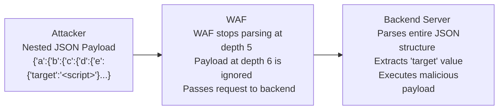

# 39.13 JSON XML Wrapping

## Introduction

JSON and XML Wrapping (also known as Data Structure Nesting or Payload Encapsulation) is a highly effective technique used to bypass Web Application Firewalls (WAFs) and Input Validation mechanisms. As modern APIs heavily rely on structured data formats like JSON (JavaScript Object Notation) and XML (eXtensible Markup Language), attackers exploit the complexity and resource-intensive nature of these parsers.

The core principle involves wrapping a malicious payload within deep, complex, or unexpected layers of JSON/XML structures. Many WAFs are configured with strict limits on parsing depth, array lengths, or total keys to prevent Denial of Service (DoS) attacks against the WAF appliance itself. By intentionally exceeding these limits, or by leveraging structural ambiguities inherent in the parsers, an attacker can effectively "hide" the payload from the WAF's signature engine. The robust backend API parser, which often possesses deeper limits, eventually extracts and executes the payload.

This note provides an extensive technical breakdown of JSON and XML wrapping bypasses, showcasing how structural complexity defeats pattern matching.

## Core Concepts

### WAF Parsing Limits

WAFs must inspect traffic in real-time without introducing significant latency. Deeply nested JSON or XML requires recursive parsing, which consumes extensive CPU and memory. To achieve low latency, WAF vendors implement hard limits:
- **Max JSON Depth:** WAFs might stop parsing JSON objects nested more than 5 or 10 levels deep.
- **Max Array Length:** WAFs might only inspect the first 100 or 500 elements of an array.
- **Max Key Size / Object Size:** Limits on the total size of a single JSON object or XML node.

If a payload exceeds these limits, the WAF has two choices:
1. **Block the request:** (Secure, but risks false positives and breaking legitimate large API requests).
2. **Pass the request without further inspection:** (Insecure, fails open, allowing bypasses).

Many commercial WAFs default to the second option (fail-open) to avoid blocking legitimate enterprise traffic, inadvertently creating a massive evasion vector.

## ASCII Diagram: JSON Wrapping Bypass



## Exploitation Mechanics

### 1. Deep Nesting (JSON & XML)

By wrapping the payload in multiple layers of arrays or objects, an attacker bypasses the depth inspection limit.

**JSON Example:**
```json
{
  "level1": {
    "level2": {
      "level3": {
        "level4": {
          "level5": {
            "level6": {
              "username": "admin' OR 1=1--"
            }
          }
        }
      }
    }
  }
}
```
If the backend application relies on a custom deserialization routine that flattens this object or blindly searches for the `username` key recursively across the entire document, the SQL injection will execute, cleanly bypassing a WAF with a parsing depth limit of 5.

**XML Example:**
```xml
<root>
  <data>
    <data>
      <data>
        <data>
          <!-- Repeated 100 times -->
          <username>admin' OR 1=1--</username>
        </data>
      </data>
    </data>
  </data>
</root>
```
Similar to JSON, an XML parser that evaluates the document via XPath (`//username`) will find the payload regardless of depth, circumventing WAF node limits.

### 2. Array Padding

If a WAF only inspects the first N elements of a JSON array to preserve performance, an attacker can pad the array with benign data and place the payload at the very end.

```json
{
  "users": [
    "benign1",
    "benign2",
    "benign3",
    "... (997 more benign elements) ...",
    "admin' UNION SELECT password FROM users--"
  ]
}
```
If the WAF stops inspecting at element 1000, the 1001st element slips through to the backend, which iterates over the entire array, executing the SQL injection.

### 3. Key/Value Obfuscation and Duplication

The JSON RFC strictly allows for duplicate keys, but different parsers handle them inconsistently. 
- Some parsers take the *first* occurrence.
- Some parsers take the *last* occurrence.
- Some throw an error.

**Duplicate Key Bypass:**
```json
{
  "username": "safe_user",
  "username": "admin' OR 1=1--"
}
```
If the WAF parses the *first* key and inspects "safe_user", it approves the request as benign. If the backend Java (Jackson) or Node.js application parses the *last* key, it extracts the SQLi payload and executes it.

### 4. Unicode and Hex Encoding inside JSON/XML

JSON parsers automatically decode Unicode escape sequences (`\uXXXX`). If the WAF inspects the raw string without decoding it first (a common flaw in regex-based WAFs), it will miss the signature entirely.

**Payload:** `<script>alert(1)</script>`
**Encoded in JSON:**
```json
{
  "comment": "\u003Cscript\u003Ealert(1)\u003C/script\u003E"
}
```
The WAF searches for the literal string `<script>` and finds nothing. The backend API parses the JSON, unescapes the Unicode sequences to actual tags, and stores the XSS payload.

### 5. XML CDATA and Entity Wrapping

In XML, `CDATA` (Character Data) sections are used to include text that should not be parsed by the XML parser as markup. However, WAFs often fail to properly extract and inspect data nested within CDATA blocks.

```xml
<user>
  <name><![CDATA[<script>alert(1)</script>]]></name>
</user>
```
Similarly, using XML Entities can obfuscate payloads from the WAF while the backend XML parser automatically expands them, hiding malicious inputs in plain sight (closely related to XXE attacks).

## Attack Scenarios in the Wild

**GraphQL API Bypasses:**
GraphQL queries are inherently nested JSON structures. They are prime targets for JSON wrapping bypasses. Attackers can create deeply nested GraphQL aliases or fragments to bury malicious introspection queries or SQL injections deep within the request body. Because GraphQL naturally encourages deep structures, WAFs struggle to set realistic limits without breaking functionality.

**Automated Tooling:**
Tools like `WAF-Bypass-Tool` and custom Burp Suite Intruder scripts can automatically generate thousands of nested JSON payloads, incrementally increasing the depth until the WAF fails open.

## Mitigation and Defense Strategies

### 1. Fail-Close Configuration
WAFs must be configured to **fail-close** (block) if a parsing limit is reached. If the maximum JSON depth is set to 10, any request with a depth of 11 must result in a 403 Forbidden or 400 Bad Request, rather than being passed to the backend uninspected.

### 2. Strict API Schemas
Backend applications must implement strict Schema Validation (e.g., JSON Schema or XML XSD). 
If an endpoint expects a flat JSON object:
```json
{
  "username": "string",
  "password": "string"
}
```
The API gateway or backend framework should immediately reject any request containing arrays, unexpected keys, or nested objects. This entirely neutralizes deep nesting and array padding attacks by validating structural integrity before processing data.

### 3. Parse and Normalize Before Inspection
The WAF must fully parse the JSON/XML, unescape all Unicode/Hex sequences, and resolve duplicate keys (preferably rejecting requests with ambiguous duplicate keys outright) *before* applying signature detection rules.

### 4. Tuning WAF Limits
Administrators should profile normal application traffic to determine the legitimate maximum depth and array length. WAF limits should be tightly bound to these profiled maximums. If an application never uses an array larger than 50 elements, the WAF should block any request containing an array with 51 elements.

## Chaining Opportunities
- **GraphQL Introspection / Injections:** Hiding malicious GraphQL payloads inside complex nested JSON variables.
- **XXE (XML External Entity):** Wrapping XXE payloads in multiple layers to evade basic XML signature checks.
- **Content-Type Switching:** Sending nested JSON wrapped in a `text/plain` content type to bypass WAF parsers entirely.

## Related Notes
- [[12 - Content-Type Switching]]
- [[04 - GraphQL Security]]
- [[21 - XML External Entity (XXE)]]
- [[05 - WAF Evasion Basics]]
- [[16 - API Schema Validation]]
